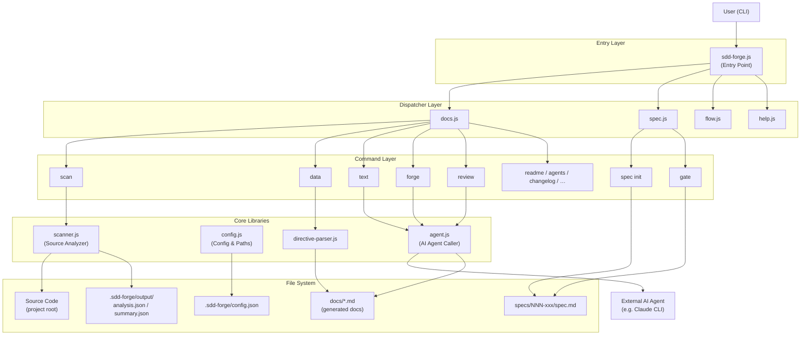

# 01. System Overview

## Description

<!-- {{text: Write a 1-2 sentence overview of this chapter. Include the project's architecture and whether it integrates with external systems.}} -->
This chapter provides a structural overview of sdd-forge, a Node.js CLI tool that automates documentation generation through source code analysis and drives feature development via a Spec-Driven Development (SDD) workflow. The tool follows a three-layer command dispatch architecture and integrates with external AI agents (such as Claude CLI) to generate and refine documentation text.
<!-- {{/text}} -->

## Content

### Architecture Diagram

<!-- {{text: Generate a mermaid flowchart showing the project architecture. Include data flows between major components. Output only the mermaid code block.}} -->

<!-- {{/text}} -->

### Component Responsibilities

<!-- {{text: Describe the major components with their location, responsibilities, and I/O in table format.}} -->
| Component | Location | Responsibility | Input | Output |
|---|---|---|---|---|
| CLI Entry Point | `src/sdd-forge.js` | Resolves project context; routes subcommands to the appropriate dispatcher | CLI arguments, env vars (`SDD_SOURCE_ROOT`, `SDD_WORK_ROOT`) | Dispatched command execution |
| Docs Dispatcher | `src/docs.js` | Routes `build`, `scan`, `init`, `data`, `text`, `forge`, `review`, and related subcommands | Subcommand name + flags | Delegates to `docs/commands/*.js` |
| Spec Dispatcher | `src/spec.js` | Routes `spec` and `gate` subcommands | Subcommand name + flags | Delegates to `specs/commands/*.js` |
| SDD Flow Runner | `src/flow.js` | Automates the full SDD cycle end-to-end | `--request` prompt string | Orchestrated spec → gate → implement → forge → review sequence |
| Source Scanner | `src/docs/lib/scanner.js` | Parses project source files; extracts modules, routes, and structure | Source root directory | `.sdd-forge/output/analysis.json`, `summary.json` |
| Directive Parser | `src/docs/lib/directive-parser.js` | Parses `{{data}}` and `{{text}}` directives in Markdown templates | `.md` template files | Directive AST for resolvers |
| Data Resolver | `src/docs/lib/resolver-factory.js` | Injects structured analysis data into `{{data}}` directives | `analysis.json`, directive AST | Resolved Markdown sections |
| AI Agent Caller | `src/lib/agent.js` | Invokes external AI agent processes synchronously or asynchronously | Prompt string, agent config | AI-generated text (stdout) |
| Config Manager | `src/lib/config.js` | Loads and validates `.sdd-forge/config.json`; resolves standard paths | `.sdd-forge/` directory | Typed config object, file paths |
| Spec Gate | `src/specs/commands/gate.js` | Validates a spec against pre/post implementation checklists | `spec.md` path, `--phase` flag | PASS / FAIL report |
| Forge Engine | `src/docs/commands/forge.js` | Iteratively improves `docs/` by prompting the AI agent | Change summary prompt, `spec.md` path | Updated `docs/*.md` files |
<!-- {{/text}} -->

### External Integrations

<!-- {{text: If there are external system integrations, describe their purpose and connection method in table format.}} -->
| System | Purpose | Connection Method | Configuration |
|---|---|---|---|
| AI Agent (e.g. Claude CLI) | Generates and refines documentation text for `{{text}}` directives; drives `forge`, `review`, `agents`, and `text` commands | Spawned as a child process via `execFileSync` (sync) or `spawn` (async streaming) in `src/lib/agent.js` | Defined under `providers` in `.sdd-forge/config.json`; selected by `defaultAgent` key |

The AI agent is the only external integration. All other operations — file scanning, directive parsing, template merging, spec management — rely exclusively on Node.js built-in modules (`fs`, `path`, `child_process`, `os`). The agent command, arguments, timeout, and system-prompt delivery method (`--system-prompt` or `--system-prompt-file`) are all configurable per project.
<!-- {{/text}} -->

### Environment Differences

<!-- {{text: Describe the configuration differences across environments (local/staging/production).}} -->
As a local CLI tool, sdd-forge does not have distinct deployment environments in the traditional sense. Configuration differences are instead expressed through per-project `.sdd-forge/config.json` settings and environment variables.

| Aspect | Local Development | CI / Automated Pipeline | Multi-Project Setup |
|---|---|---|---|
| Project resolution | Interactive; `--project` flag or `.sdd-forge/projects.json` `default` key | `SDD_SOURCE_ROOT` and `SDD_WORK_ROOT` env vars set explicitly per job | `.sdd-forge/projects.json` registers named projects; `--project <name>` selects the target |
| AI agent | Configured via `providers` + `defaultAgent` in `config.json`; runs interactively | Same config; `stdin: "ignore"` prevents CLI hang in non-TTY environments (`callAgentAsync`) | Each project carries its own `config.json` with independent agent settings |
| Language / output | `lang` and `output.languages` control CLI language and doc output locale | Same config values apply; no separate override mechanism | Per-project `config.json` allows different languages per project |
| Concurrency | `limits.concurrency` (default: 5) controls parallel file processing | Can be raised for faster execution on high-core machines | Independently tunable per project |
| Timeouts | `limits.designTimeoutMs` / per-provider `timeoutMs` | Should be increased for slow CI agents; default constants: 120 s / 180 s / 300 s | Configurable per project |
```
<!-- {{/text}} -->
