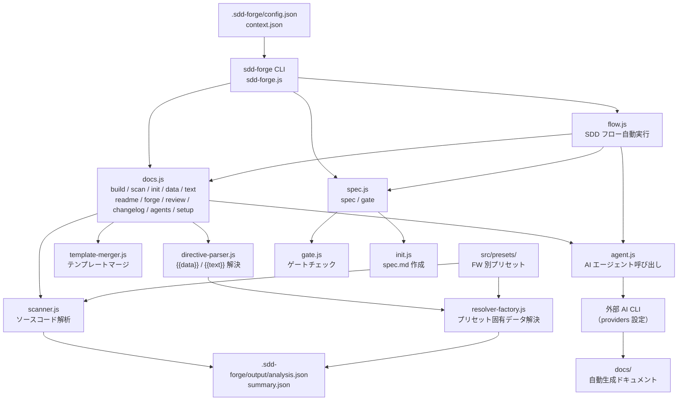

# 01. ツール概要とアーキテクチャ

## 説明

<!-- {{text: この章の概要を1〜2文で記述してください。ツールの目的・解決する課題・主要なユースケースを踏まえること。}} -->

sdd-forge は、ソースコードを解析してプロジェクトドキュメントを自動生成する Node.js CLI ツールです。また、機能追加・改修時に Spec-Driven Development（SDD）ワークフローに沿って仕様策定から実装・レビューまでを一貫してサポートします。

## 内容

### ツールの目的

<!-- {{text: このCLIツールが解決する課題と、ターゲットユーザーを説明してください。}} -->

ソフトウェア開発において「ドキュメントが陳腐化する」「仕様と実装が乖離する」という課題を解決するために作られたツールです。ソースコードを静的解析して docs/ 配下のドキュメントを自動生成・更新することで、常にコードと同期されたドキュメントを維持できます。また、機能追加・改修の際には SDD フローに従って spec（仕様書）を作成し、ゲートチェックをパスしてから実装に進む規律ある開発プロセスを提供します。

主なターゲットユーザーは、レガシーコードベースを抱えるチームや、ドキュメント管理コストを削減したい開発チームです。CakePHP 2.x・Laravel・Symfony・Node.js CLI などのプリセットが用意されており、対象フレームワークにあわせてすぐに利用を開始できます。

### アーキテクチャ概要

<!-- {{text: ツール全体のアーキテクチャを mermaid flowchart で生成してください。入力・処理・出力の流れ、主要モジュールの関係を含めること。出力は mermaid コードブロックのみ。}} -->



### 主要コンセプト

<!-- {{text: このツールを理解するうえで重要なコンセプト・用語を表形式で説明してください。}} -->

| コンセプト・用語 | 説明 |
|---|---|
| SDD（Spec-Driven Development） | 仕様書（spec.md）を先に作成し、ゲートチェックをパスしてから実装に進む開発手法。仕様と実装の乖離を防ぐ |
| spec | 機能追加・改修ごとに作成される仕様書ファイル（`specs/NNN-xxx/spec.md`）。`sdd-forge spec` コマンドで生成される |
| gate | spec の品質チェック。未解決事項がある場合は FAIL となり、実装に進めない |
| docs/ | プロジェクトの設計・構造・ビジネスロジックをまとめた知識ベース。sdd-forge により自動生成・維持される |
| `{{data}}` ディレクティブ | docs テンプレート内に記述する、ソースコード解析結果を埋め込む指示子 |
| `{{text}}` ディレクティブ | docs テンプレート内に記述する、AI が説明文を生成する指示子 |
| MANUAL ブロック | `<!-- MANUAL:START -->〜<!-- MANUAL:END -->` で囲まれた手動記述領域。自動生成では上書きされない |
| プリセット | フレームワーク別の解析設定・テンプレートセット（`src/presets/` 配下）。`type` 値で指定する |
| forge | docs を反復改善するコマンド（`sdd-forge forge`）。AI がソース解析結果をもとにドキュメントを更新する |
| analysis.json / summary.json | `sdd-forge scan` が出力するソースコード解析結果。summary.json は AI 入力用の軽量版 |
| provider | AI エージェントの設定。使用する CLI コマンド・引数・systemPromptFlag などを `config.json` で定義する |

### 典型的な利用フロー

<!-- {{text: ユーザーがインストールしてから最初の成果物を得るまでの典型的な手順をステップ形式で説明してください。}} -->

**1. インストール**

```bash
npm install -g sdd-forge
```

**2. プロジェクトのセットアップ**

ドキュメント化したいプロジェクトのルートディレクトリで `setup` コマンドを実行します。プロジェクト種別（`type`）・言語（`lang`）・使用する AI エージェントなどの設定が対話形式で生成されます。

```bash
cd /path/to/your-project
sdd-forge setup
```

**3. ソースコード解析**

ソースコードを解析し、`.sdd-forge/output/analysis.json` と `summary.json` を生成します。

```bash
sdd-forge scan
```

**4. docs の一括生成**

テンプレート初期化・データ解決・AI によるテキスト生成・README 更新までを一括で実行します。

```bash
sdd-forge build
```

**5. 生成されたドキュメントを確認**

`docs/` ディレクトリに `01_overview.md` などのドキュメントファイルが生成されています。内容を確認し、MANUAL ブロックに補足情報を追記することで、自動生成と手動記述を組み合わせた知識ベースを構築できます。
