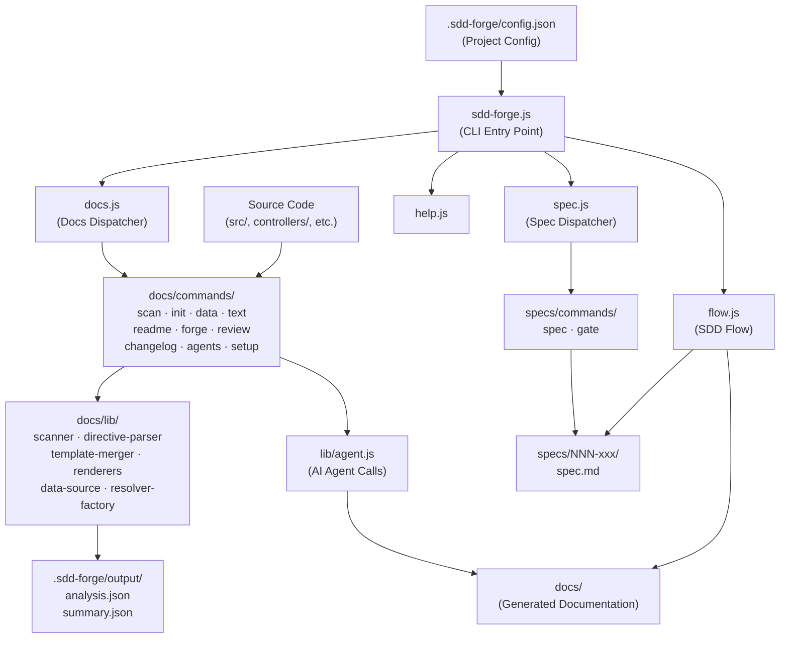

# 01. Tool Overview and Architecture

## Description

<!-- {{text: Write a 1-2 sentence overview of this chapter. Cover the tool's purpose, the problems it solves, and its primary use cases.}} -->

This chapter provides an overview of sdd-forge — a CLI tool that automates documentation generation from source code analysis and enforces a Spec-Driven Development (SDD) workflow for feature additions and changes. It covers the tool's core purpose, the problems it addresses, its architectural design, and the typical steps for getting started.

## Contents

### Purpose of the Tool

<!-- {{text: Explain the problems this CLI tool solves and the target users it is designed for.}} -->

Development teams frequently face two compounding problems: documentation that quickly falls out of sync with source code, and feature development that proceeds without a clearly reviewed specification. sdd-forge addresses both by automating the extraction of structural information from source code and generating living documentation from it, while also providing a gate-based workflow that requires a written, approved spec before any implementation begins.

The primary target users are software developers and technical leads who maintain codebases where documentation accuracy matters — particularly projects with multiple contributors or frequent iterative changes. The tool is especially valuable when onboarding new team members, conducting architecture reviews, or managing ongoing feature work where traceability between a spec and the resulting implementation is required.

### Architecture Overview

<!-- {{text: Generate a mermaid flowchart of the overall tool architecture. Include the flow of input, processing, and output, as well as the relationships between major modules. Output only the mermaid code block.}} -->



### Key Concepts

<!-- {{text: Explain the important concepts and terminology needed to understand this tool in table format.}} -->

| Concept | Description |
|---|---|
| **SDD (Spec-Driven Development)** | A development workflow where a spec document is authored, reviewed, and approved via a gate check before any implementation begins. |
| **Spec** | A structured markdown document (`spec.md`) that defines the intent, scope, and acceptance criteria for a single feature or fix. Stored under `specs/NNN-xxx/`. |
| **Gate Check** | A validation step run by `sdd-forge gate` that confirms a spec is sufficiently complete before allowing implementation to proceed. |
| **Directive** | A placeholder marker in documentation templates. `{{data}}` is resolved from source analysis; `{{text}}` is resolved by an AI agent. |
| **Preset** | A project-type profile (e.g., `webapp/cakephp2`, `cli/node-cli`) that determines which files are scanned and which doc templates are applied. |
| **`analysis.json`** | The full structured output of `sdd-forge scan`, containing extracted information about controllers, models, routes, and other source constructs. |
| **`summary.json`** | A compact, AI-optimised subset of `analysis.json` used as the primary input for text-generation commands. |
| **Forge** | The iterative doc improvement process (`sdd-forge forge`) in which AI refines documentation based on current source analysis and context. |
| **Provider / Agent** | An AI backend configuration (e.g., Claude CLI) defined in `config.json` under `providers`, used for text generation and review. |
| **`.sdd-forge/`** | The project-local working directory that holds configuration, scan output, flow state, and project registration data. |

### Typical Usage Flow

<!-- {{text: Explain the typical steps a user takes from installation to obtaining their first output, in a step-by-step format.}} -->

**Step 1 — Install**
Install sdd-forge globally via npm:
```
npm install -g sdd-forge
```

**Step 2 — Set up your project**
Run `sdd-forge setup` in your project root. This registers the project and generates `.sdd-forge/config.json`, where you configure the project type, output language, and AI provider.

**Step 3 — Scan your source code**
Run `sdd-forge scan` to analyze your source files. This produces `.sdd-forge/output/analysis.json` and `summary.json`, which serve as the data foundation for all documentation.

**Step 4 — Build the documentation**
Run `sdd-forge build` to initialize doc templates from the appropriate preset, populate `{{data}}` directives with analysis results, and invoke the AI agent to resolve `{{text}}` directives. The output is written to `docs/`.

**Step 5 — Review the output**
Run `sdd-forge review` to quality-check the generated documentation. Address any flagged issues and re-run until the review passes.

**Step 6 — Develop features with SDD**
When adding a new feature, run `sdd-forge spec --title "Feature Name"` to create a spec. Follow the SDD flow: refine the spec, pass the gate check, implement, then run `sdd-forge forge` and `sdd-forge review` to keep documentation current.
