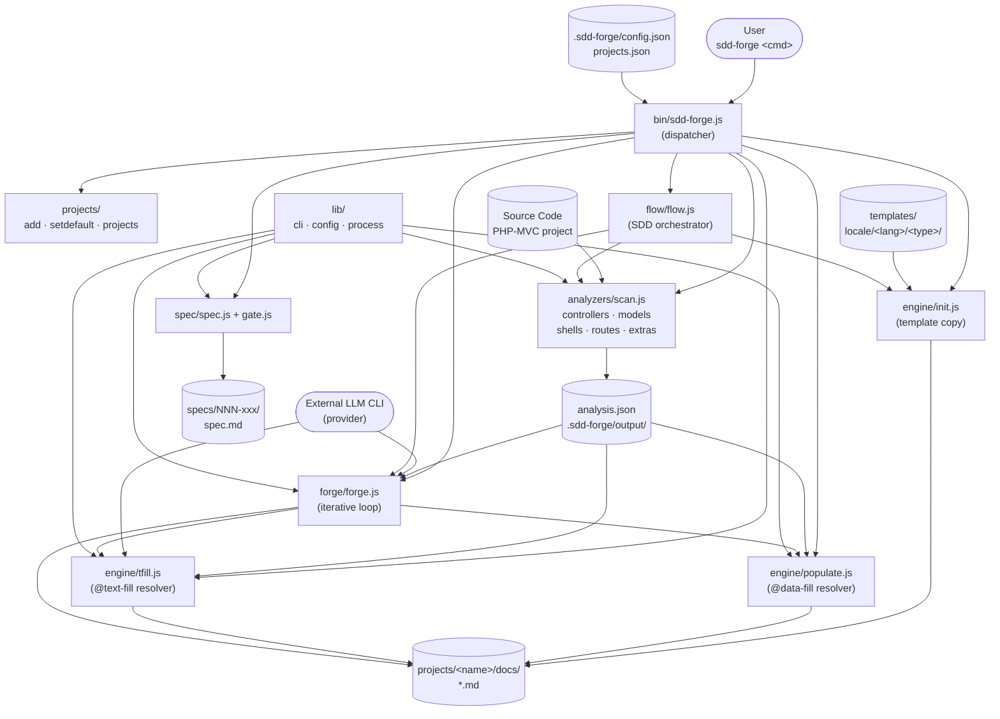

# 01. ツール概要とアーキテクチャ

## 説明

<!-- @text-fill: この章の概要を1〜2文で記述してください。ツールの目的・解決する課題・主要なユースケースを踏まえること。 -->

`sdd-forge` は、PHP-MVC プロジェクト（CakePHP 等）における「仕様と実装の乖離」および「技術ドキュメントの作成・維持コスト」という課題を解決するための Node.js CLI ツールである。ソースコード静的解析（`scan`）・テンプレート駆動のドキュメント生成（`init` / `populate` / `tfill`）・仕様ゲート管理（`spec` / `gate`）・反復改善ループ（`forge`）を単一パッケージに統合し、Spec-Driven Development（SDD）ワークフローをコマンドラインから一貫して実行できる。


## 内容

### ツールの目的

<!-- @text-fill: このCLIツールが解決する課題と、ターゲットユーザーを説明してください。 -->

PHP-MVC プロジェクト（CakePHP 等）では、コントローラ・モデル・ルートが大規模になるほど技術ドキュメントの作成・維持コストが増大し、実装と仕様の乖離が起きやすい。`sdd-forge` はこの課題を、ソースコード静的解析とテンプレート駆動のドキュメント自動生成によって解決する。

解決する主な課題は次の 3 点である。

- **仕様と実装の乖離**: `spec` / `gate` コマンドにより、実装前に仕様を文書化・承認フローを通過させる SDD ワークフローを強制する。
- **ドキュメントの初期作成コスト**: `scan` → `init` → `populate` → `tfill` のパイプラインで、ソースコード解析結果を LLM エージェントと組み合わせてマークダウンドキュメントに自動変換する。
- **ドキュメントの継続的陳腐化**: `forge` コマンドがレビュー結果をフィードバックとして次ラウンドに渡す反復改善ループを提供し、ドキュメントをコードベースに追従させる。

**ターゲットユーザー**は、PHP-MVC プロジェクトを保守する開発チームおよびテックリードである。特に、既存の大規模コードベースに対してドキュメントを整備したい、あるいは SDD フローを開発プロセスに導入したいチームに適している。`node-cli` テンプレートを使用すれば、Node.js CLI ツール自身のドキュメント化にも応用できる。


### アーキテクチャ概要

<!-- @text-fill: ツール全体のアーキテクチャを mermaid flowchart で生成してください。入力・処理・出力の流れ、主要モジュールの関係を含めること。出力は mermaid コードブロックのみ。 -->




### 主要コンセプト

<!-- @text-fill: このツールを理解するうえで重要なコンセプト・用語を表形式で説明してください。 -->

| コンセプト | 説明 |
|---|---|
| **SDD（Spec-Driven Development）** | 実装前に仕様（spec）を定義・承認してから開発を進める手法。このツールが支援するワークフローの中心的な考え方。 |
| **spec** | `specs/NNN-<name>/spec.md` に保存される機能仕様ファイル。Clarifications・Open Questions・User Confirmation・Acceptance Criteria の各セクションを持つ。 |
| **gate** | spec の未解決項目（TBD・チェック未済タスク・ユーザー未承認など）を検出する事前チェック。PASS しない限り実装を開始しない。 |
| **`@data-fill` ディレクティブ** | テンプレート内の HTML コメント構文。`populate` コマンドが `analysis.json` の静的解析結果を使ってテーブルや ER 図などに置換する。 |
| **`@text-fill` ディレクティブ** | テンプレート内の HTML コメント構文。`tfill` コマンドが LLM エージェントを呼び出してプロンプトに対応するテキストを生成・挿入する。 |
| **analysis.json** | `sdd-forge scan` が生成するソースコード解析結果ファイル。`projects/<name>/.sdd-forge/output/` に保存され、`populate` と `tfill` のコンテキストデータとして使用される。 |
| **provider（agent）** | `@text-fill` 解決に使用する外部 LLM CLI ツールの設定。`.sdd-forge/config.json` の `providers` キーに `command` と `args` を定義する。 |
| **MANUAL ブロック** | `<!-- MANUAL:START -->〜<!-- MANUAL:END -->` で囲まれた範囲。`init` や `forge` の実行時に上書きされず、手動記述の内容を保持する。 |
| **forge** | `populate` → `tfill` → レビューを繰り返すドキュメント反復改善エンジン。レビュー失敗時はフィードバックを次ラウンドに渡して再実行する。 |
| **project workspace** | `projects/<name>/` 配下に作成される解析対象プロジェクトごとの作業領域。`docs/`・`specs/`・`.sdd-forge/` を含む。 |


### 典型的な利用フロー

<!-- @text-fill: ユーザーがインストールしてから最初の成果物を得るまでの典型的な手順をステップ形式で説明してください。 -->

ソースコードから確認できた実際のワークフローに基づいて、以下のテキストを生成します。

1. **インストール**: npm でグローバルインストールする。

   ```
   npm install -g sdd-forge
   ```

2. **プロジェクト登録**: 解析対象プロジェクトをワークスペースに登録する。初回登録時は自動的にデフォルトプロジェクトに設定される。

   ```
   sdd-forge add <name> /path/to/project
   ```

3. **ソースコード解析**: 対象プロジェクトを静的解析し、`projects/<name>/.sdd-forge/output/analysis.json` を生成する。

   ```
   sdd-forge scan
   ```

4. **ドキュメント初期化**: `.sdd-forge/config.json` の `type` と `lang` 設定に基づき、バンドルされたテンプレートを `projects/<name>/docs/` にコピーする。

   ```
   sdd-forge init
   ```

5. **データ埋め込み**: `docs/` 内の `@data-fill` ディレクティブを `analysis.json` の解析結果で置換する。

   ```
   sdd-forge populate
   ```

6. **テキスト生成**: `@text-fill` ディレクティブを AI エージェントで生成したテキストに置換し、ドキュメントを完成させる。

   ```
   sdd-forge tfill
   ```

手順 3〜5 は `sdd-forge scan:all` で一括実行できる。最初の成果物は手順 6 完了後に `projects/<name>/docs/` に生成される一連のマークダウンファイルである。
