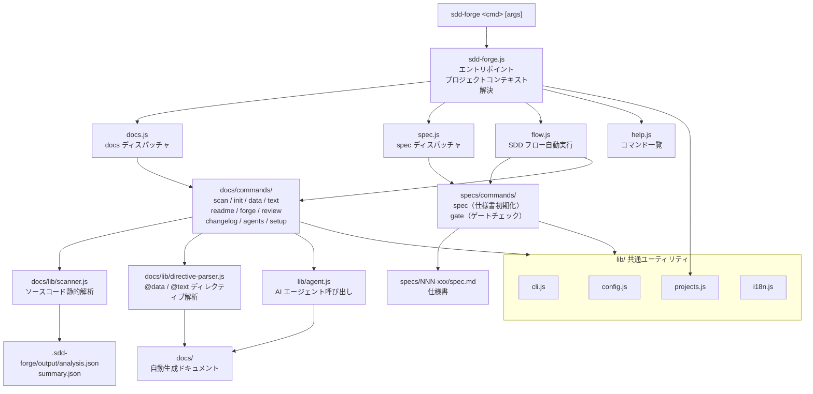

# 01. ツール概要とアーキテクチャ

## 説明

<!-- @text: この章の概要を1〜2文で記述してください。ツールの目的・解決する課題・主要なユースケースを踏まえること。 -->

本章では、sdd-forge がどのような課題を解決する CLI ツールであるか、およびその内部アーキテクチャの全体像を説明します。ソースコード解析によるドキュメント自動生成の仕組みと、Spec-Driven Development（SDD）ワークフローの構成要素を理解できます。

## 内容

### ツールの目的

<!-- @text: このCLIツールが解決する課題と、ターゲットユーザーを説明してください。 -->

sdd-forge は、ソフトウェアプロジェクトのドキュメントを「書く」コストを削減するために設計された CLI ツールです。ソースコードを静的解析して構造情報を抽出し、テンプレートと AI テキスト生成を組み合わせて `docs/` 以下のドキュメントを自動生成します。

また、機能追加・修正時には Spec-Driven Development（SDD）のワークフローを提供します。仕様書（spec）の作成からゲートチェック・実装・ドキュメント更新まで、一連の開発サイクルをコマンド一本で進行できます。

主なターゲットユーザーは、コードベースに対して継続的なドキュメント整備や仕様管理を行いたい開発者・チームです。Node.js >= 18 が動作する環境であれば、外部依存なしで利用できます。

### アーキテクチャ概要

<!-- @text: ツール全体のアーキテクチャを mermaid flowchart で生成してください。入力・処理・出力の流れ、主要モジュールの関係を含めること。出力は mermaid コードブロックのみ。 -->



### 主要コンセプト

<!-- @text: このツールを理解するうえで重要なコンセプト・用語を表形式で説明してください。 -->

| 用語 | 説明 |
|---|---|
| **SDD（Spec-Driven Development）** | 仕様書（spec）を起点に開発を進める手法。実装前に spec を作成・承認し、ゲートチェックを通過してから実装へ進む |
| **spec** | 機能追加・修正ごとに作成する仕様書ファイル（`specs/NNN-xxx/spec.md`）。要件・設計・承認状態を記録する |
| **gate チェック** | 仕様の曖昧さや未解決事項がないかを確認するバリデーション。PASS するまで実装を開始しない |
| **`@data` ディレクティブ** | ドキュメントテンプレート内に記述するマーカー。`sdd-forge data` 実行時にソースコード解析結果（analysis.json）の値で自動置換される |
| **`@text` ディレクティブ** | ドキュメントテンプレート内に記述するマーカー。`sdd-forge text` 実行時に AI が生成したテキストで自動置換される |
| **analysis.json / summary.json** | `sdd-forge scan` が生成するソースコード解析結果ファイル。`.sdd-forge/output/` に格納される |
| **プリセット** | フレームワーク固有の解析ロジック・テンプレートオーバーライドをまとめたモジュール（例: `presets/webapp/cakephp2/`） |
| **テンプレート継承** | `base → type → framework` の順にテンプレートを解決し、より具体的なパスが優先される仕組み |
| **SDD_SOURCE_ROOT** | 解析対象プロジェクトのソースコードルートを示す環境変数。`sdd-forge.js` が起動時に設定する |
| **SDD_WORK_ROOT** | `docs/` や `.sdd-forge/` が置かれる作業ディレクトリを示す環境変数。`sdd-forge.js` が起動時に設定する |
| **forge** | `sdd-forge forge` コマンド。docs/ を反復的に改善する AI 駆動のドキュメント更新処理 |
| **build パイプライン** | `scan → init → data → text → readme → agents` を順に実行してドキュメントを一括生成するコマンド |

### 典型的な利用フロー

<!-- @text: ユーザーがインストールしてから最初の成果物を得るまでの典型的な手順をステップ形式で説明してください。 -->

**Step 1: インストール**
```bash
npm install -g sdd-forge
```

**Step 2: プロジェクトのセットアップ**

ドキュメント化したいプロジェクトのルートディレクトリで `setup` を実行します。プロジェクトの登録と `.sdd-forge/config.json` の生成が行われます。
```bash
cd /path/to/your-project
sdd-forge setup
```

**Step 3: AI エージェントの設定**

`.sdd-forge/config.json` を開き、使用する AI エージェント名（例: `claude`）を `defaultAgent` に設定します。

**Step 4: ドキュメントの一括生成**

`build` コマンドでソースコード解析からドキュメント生成までのパイプライン全体を実行します。
```bash
sdd-forge build
```

実行後、`docs/` ディレクトリにプロジェクト構造を反映したマークダウンドキュメントが生成されます。

**Step 5: 機能追加・修正時の SDD フロー**

新しい機能を追加する際は `spec` コマンドで仕様書を作成し、`gate` でチェックを通過してから実装を進めます。実装後は `forge` と `review` でドキュメントを更新・品質チェックします。
```bash
sdd-forge spec --title "新機能名"
sdd-forge gate --spec specs/001-xxx/spec.md
# ... 実装 ...
sdd-forge forge --prompt "変更内容の要約" --spec specs/001-xxx/spec.md
sdd-forge review
```
