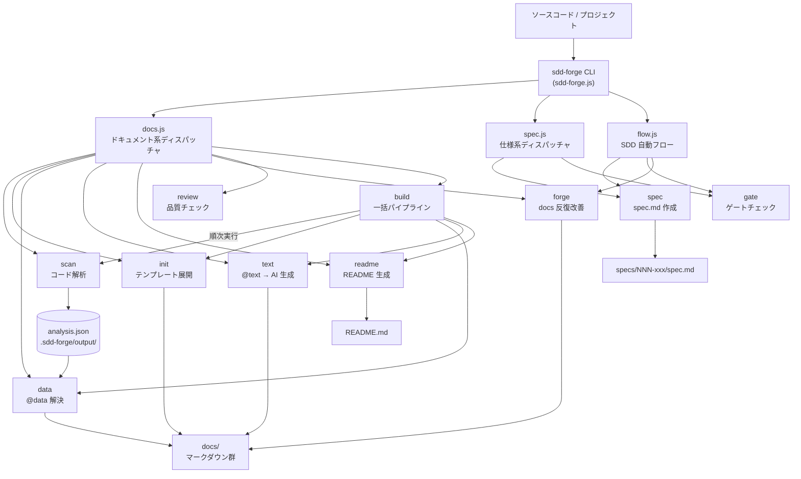

# 01. ツール概要とアーキテクチャ

## 説明

<!-- @text: この章の概要を1〜2文で記述してください。ツールの目的・解決する課題・主要なユースケースを踏まえること。 -->

本章では、sdd-forge の目的・解決する課題・全体アーキテクチャ・主要コンセプトを説明します。ソースコードの自動解析によるドキュメント生成から、仕様駆動開発（SDD）ワークフローまでの全体像を把握するための入門となります。

## 内容

### ツールの目的

<!-- @text: このCLIツールが解決する課題と、ターゲットユーザーを説明してください。 -->

sdd-forge は、ソフトウェアプロジェクトのドキュメントがコードと乖離・陳腐化する問題を解決する CLI ツールです。
ソースコードを自動解析して構造情報を抽出し、AI によるテキスト生成と組み合わせることで、最新のドキュメントを継続的に維持できます。

また、機能追加・改修時には Spec-Driven Development（SDD）ワークフローをサポートします。
spec の作成・承認・ゲートチェックから実装後のドキュメント反映まで一貫して管理することで、「実装したが仕様書がない」「ドキュメントが古い」という状況を防ぎます。

主なターゲットユーザーは以下の通りです。

- ドキュメントが整備されていない既存プロジェクトを抱える開発者
- コードの変化に追従するドキュメント管理の仕組みを必要とするチーム
- 仕様ベースの開発フローを取り入れたいプロジェクトリーダーやアーキテクト

### アーキテクチャ概要

<!-- @text: ツール全体のアーキテクチャを mermaid flowchart で生成してください。入力・処理・出力の流れ、主要モジュールの関係を含めること。出力は mermaid コードブロックのみ。 -->



### 主要コンセプト

<!-- @text: このツールを理解するうえで重要なコンセプト・用語を表形式で説明してください。 -->

| コンセプト / 用語 | 説明 |
|---|---|
| **SDD（Spec-Driven Development）** | 仕様（spec）の作成・承認・ゲートチェックを経てから実装を行う開発手法。実装とドキュメントの乖離を防ぎます。 |
| **spec** | 機能追加・改修ごとに作成する仕様書（`specs/NNN-xxx/spec.md`）。目的・変更内容・ユーザー確認状態を記録します。 |
| **gate** | spec が実装開始可能な状態かを検証するチェック処理。未解決事項や未承認状態があると FAIL となります。 |
| **@data ディレクティブ** | ドキュメントテンプレート内に記述する特殊タグ。`sdd-forge data` 実行時に `analysis.json` の解析データで自動置換されます。 |
| **@text ディレクティブ** | ドキュメントテンプレート内に記述する特殊タグ。`sdd-forge text` 実行時に AI がソースと文脈をもとにテキストを生成・挿入します。 |
| **MANUAL ブロック** | `<!-- MANUAL:START -->〜<!-- MANUAL:END -->` で囲んだ手動記述領域。自動生成コマンドを実行しても上書きされません。 |
| **analysis.json** | `sdd-forge scan` がソースコードを解析して生成する構造情報ファイル。コントローラー・モデル・ルートなどのメタデータを含みます。 |
| **forge** | docs を反復的に改善するコマンド。プロンプトと spec を入力として AI がドキュメントを加筆・修正します。 |
| **build** | scan → init → data → text → readme を一括実行するパイプラインコマンドです。初回セットアップや大規模更新時に利用します。 |
| **flow** | spec 作成・ゲートチェック・forge を自動でシーケンス実行する SDD フロー自動化コマンドです。 |

### 典型的な利用フロー

<!-- @text: ユーザーがインストールしてから最初の成果物を得るまでの典型的な手順をステップ形式で説明してください。 -->

**ステップ 1: インストール**

sdd-forge をグローバルインストールします。

```bash
npm install -g sdd-forge
```

**ステップ 2: プロジェクト登録（setup）**

ドキュメント化したいプロジェクトのルートディレクトリで `sdd-forge setup` を実行します。
対話式ウィザードに従ってプロジェクト名・種別・AI エージェントを設定すると、`.sdd-forge/config.json` が生成されます。

```bash
cd /path/to/your-project
sdd-forge setup
```

**ステップ 3: ドキュメント一括生成（build）**

`sdd-forge build` を実行すると、scan → init → data → text → readme の各ステップが順に実行され、`docs/` 以下にドキュメントが生成されます。

```bash
sdd-forge build
```

**ステップ 4: 生成物の確認**

`docs/` 配下にマークダウン形式のドキュメントが、プロジェクトルートに `README.md` が生成されていることを確認します。
内容に誤りがある場合は、`MANUAL` ブロックを使って手動で補足情報を追記できます。

**ステップ 5: 以降の運用**

ソースコードを変更した際は再度 `sdd-forge build` を実行してドキュメントを最新化します。
機能追加・改修時は `sdd-forge spec` → `sdd-forge gate` → 実装 → `sdd-forge forge` → `sdd-forge review` の SDD フローに従って進めます。
```

---

書き込みを許可していただければ、上記内容を `docs/01_overview.md` に保存します。
