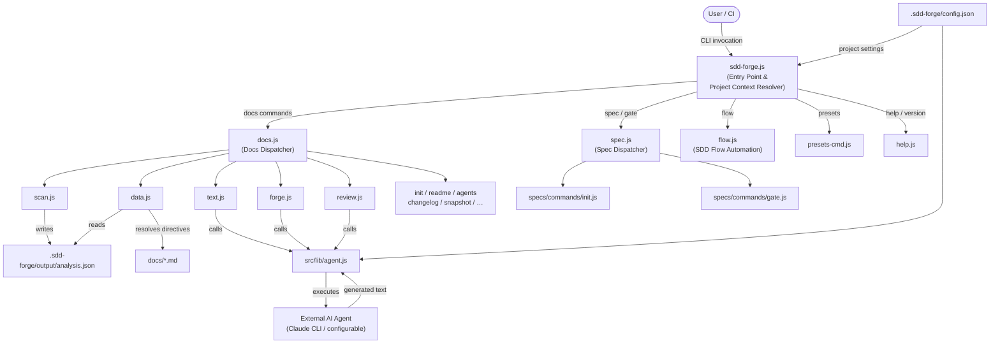

# 01. System Overview

## Description

<!-- {{text: Write a 1-2 sentence overview of this chapter. Include the project's architecture and whether it integrates with external systems.}} -->

This chapter provides a structural overview of sdd-forge, a Node.js CLI tool that automates documentation generation and enforces Spec-Driven Development workflows. The tool operates entirely on Node.js built-in modules and integrates with external AI agents — such as the Claude CLI — through a configurable provider interface to generate and refine documentation text.
<!-- {{/text}} -->

## Content

### Architecture Diagram

<!-- {{text: Generate a mermaid flowchart showing the project architecture. Include data flows between major components. Output only the mermaid code block.}} -->

<!-- {{/text}} -->

### Component Responsibilities

<!-- {{text: Describe the major components with their location, responsibilities, and I/O in table format.}} -->

| Component | Location | Responsibility | Input | Output |
|---|---|---|---|---|
| CLI Entry Point | `src/sdd-forge.js` | Resolves project context from `--project` flag or `projects.json`; routes subcommands to dispatchers | CLI args, `.sdd-forge/projects.json` | `SDD_SOURCE_ROOT` / `SDD_WORK_ROOT` env vars; delegates to dispatcher |
| Docs Dispatcher | `src/docs.js` | Routes all docs-related subcommands (`build`, `scan`, `data`, `text`, etc.) to their respective command modules | Subcommand name + args | Invokes target command module |
| Spec Dispatcher | `src/spec.js` | Routes `spec` and `gate` subcommands | Subcommand name + args | Invokes target command module |
| SDD Flow | `src/flow.js` | Automates the full SDD workflow (`spec → gate → implement → forge → review`) as a single command | `--request` string, flow state | Creates branches, spec files, flow state in `.sdd-forge/current-spec` |
| Scan Command | `src/docs/commands/scan.js` | Statically analyzes source files (JS, PHP, YAML) to extract structural metadata | Source files under configured root | `.sdd-forge/output/analysis.json` |
| Data Command | `src/docs/commands/data.js` | Resolves `{{data}}` directives in `docs/*.md` using `analysis.json` | `docs/*.md` templates, `analysis.json` | Updated `docs/*.md` with injected tables |
| Text Command | `src/docs/commands/text.js` | Resolves `{{text}}` directives by invoking an AI agent with source-aware prompts | `docs/*.md` templates, source files, `analysis.json` | Updated `docs/*.md` with AI-generated prose |
| Forge Command | `src/docs/commands/forge.js` | Iteratively improves docs based on a change summary prompt | Change summary string, existing `docs/*.md` | Refined `docs/*.md` |
| Review Command | `src/docs/commands/review.js` | Checks docs quality against a review checklist via an AI agent | `docs/*.md`, review checklist | PASS / FAIL report with fix suggestions |
| Gate Command | `src/specs/commands/gate.js` | Validates a spec file for completeness before (pre) or after (post) implementation | `spec.md` path, `--phase` flag | PASS / FAIL gate report |
| Agent Library | `src/lib/agent.js` | Executes external AI agent commands synchronously or asynchronously with prompt injection | Prompt string, agent config from `config.json` | AI-generated text output |
| Config Library | `src/lib/config.js` | Loads and validates `.sdd-forge/config.json`; resolves file paths under `.sdd-forge/` | `.sdd-forge/config.json` | Typed config object, resolved paths |
| Preset System | `src/presets/` | Provides project-type-specific doc templates and data source definitions | Preset key (e.g., `node-cli`, `webapp/cakephp2`) | Template files, `DataSource` classes |
| Directive Parser | `src/docs/lib/directive-parser.js` | Parses `{{data}}`, `{{text}}`, `@block`, and `@extends` directives from markdown templates | Raw markdown template strings | Parsed directive AST |
<!-- {{/text}} -->

### External Integrations

<!-- {{text: If there are external system integrations, describe their purpose and connection method in table format.}} -->

| System | Purpose | Connection Method | Configuration |
|---|---|---|---|
| AI Agent (e.g., Claude CLI) | Generates and refines documentation text by reading source code and analysis data; used by `text`, `forge`, `review`, and `agents` commands | Spawned as a child process via `execFileSync` (sync) or `spawn` (async) with prompt injected into args via `{{PROMPT}}` placeholder | Defined in `.sdd-forge/config.json` under `providers` and `defaultAgent`; supports custom `command`, `args`, `timeoutMs`, and `systemPromptFlag` |
| Git | Branch creation, worktree isolation, and commit operations during the SDD flow | Invoked via `child_process` (`execFileSync`) with standard `git` CLI commands | Determined by repository state; branch strategy configured via `config.flow.merge` (`squash` / `ff-only` / `merge`) |
| npm Registry | Package publishing for distribution | `npm publish` CLI command (manual step, never automated) | Requires explicit user intent; uses `--tag alpha` for pre-release |

sdd-forge has **no runtime network dependencies**. All external communication is limited to child-process invocations of locally installed tools (AI agent CLI, git). The AI agent integration is fully configurable, allowing any command-line model interface to be substituted.
<!-- {{/text}} -->

### Environment Differences

<!-- {{text: Describe the configuration differences across environments (local/staging/production).}} -->

sdd-forge is a developer CLI tool and does not have a traditional multi-environment deployment model. Configuration differences arise at the **per-project** and **per-developer** level rather than across infrastructure environments.

| Aspect | Local Development | CI / Automated Pipeline | Team / Shared Setup |
|---|---|---|---|
| AI Agent | Interactive CLI tool (e.g., `claude`) launched in the developer's terminal | Headless agent command; `CLAUDECODE` env var removed to prevent stdin hang; `stdin: "ignore"` used in async mode | Same headless configuration; provider defined in shared `config.json` |
| Project Context | Resolved via `.sdd-forge/projects.json` `default` or `--project` flag | Typically set via `SDD_SOURCE_ROOT` / `SDD_WORK_ROOT` environment variables | `projects.json` committed to the sdd-forge work root |
| `config.json` | Developer-specific settings (agent, paths, concurrency) | Minimal config sufficient for `scan` and `data` steps; `text` / `forge` require agent access | Shared config with agreed `type`, `lang`, `output.languages` values |
| Concurrency | Default 5 (`limits.concurrency`); adjustable for local hardware | May be reduced to avoid resource contention | Configured per project |
| Output Language | Single or dual language as needed | Typically matches `output.default` only | Matches team's `output.languages` configuration |
| Snapshot Tests | Run manually with `sdd-forge snapshot check` | Integrated as a CI step to detect doc regressions | Snapshots committed to `.sdd-forge/snapshots/` |
<!-- {{/text}} -->
