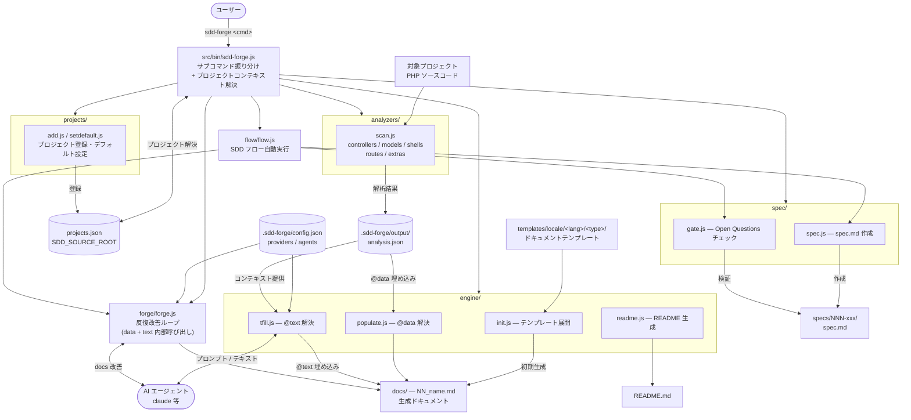

# 01. ツール概要とアーキテクチャ

## 説明

<!-- @text: この章の概要を1〜2文で記述してください。ツールの目的・解決する課題・主要なユースケースを踏まえること。 -->

sdd-forge は、PHP-MVC プロジェクトおよび Node.js ツールのドキュメント陳腐化を防ぐために設計された CLI パッケージである。ソースコード静的解析（`scan` 系）・ディレクティブ解決（`data` / `text`）・仕様管理（`spec` / `gate`）・AI 駆動の反復改善（`forge` / `flow`）の機能群を単一の `sdd-forge` コマンドに統合し、Spec-Driven Development ワークフローを継続的に支援する。


## 内容

### ツールの目的

<!-- @text: このCLIツールが解決する課題と、ターゲットユーザーを説明してください。 -->

ソースコードが変更されても docs/ は手動更新に頼るほかなく、ドキュメントはやがて実態と乖離する。sdd-forge はこの問題に対し、解析・仕様・テキスト生成の3つのアプローチで対処する。

`scan` コマンドはコントローラ・モデル・シェル・ルートを静的解析して `analysis.json` を生成し、`data` が `@data` ディレクティブをその結果で自動置換する。静的解析で表現できないテキスト説明は `text` が AI エージェントを呼び出して `@text` ディレクティブを補完する。実装前の仕様品質は `spec` / `gate` コマンドが未解決事項（Open Questions）の有無をチェックし、解消されるまで実装開始を阻止する。`forge` と `flow` はこれらを組み合わせた反復改善ループを自動化する。

**ターゲットユーザー**:
- PHP-MVC プロジェクト（CakePHP 等）を保守し、ドキュメントの陳腐化に悩む開発チーム
- SDD ワークフローを導入して仕様と実装のズレを防ぎたいチームリーダー・テックリード
- node-cli テンプレートを利用して Node.js ツール自身のドキュメントを自動化したい開発者

Node.js 組み込みモジュールのみで実装されており、外部依存パッケージが存在しないため、既存プロジェクトへの追加が容易である。


### アーキテクチャ概要

<!-- @text: ツール全体のアーキテクチャを mermaid flowchart で生成してください。入力・処理・出力の流れ、主要モジュールの関係を含めること。出力は mermaid コードブロックのみ。 -->




### 主要コンセプト

<!-- @text: このツールを理解するうえで重要なコンセプト・用語を表形式で説明してください。 -->

| 用語 | 説明 |
|------|------|
| SDD (Spec-Driven Development) | 仕様書（spec.md）を先に作成し、`gate` チェックを通過してから実装に進む開発フロー |
| `@data` ディレクティブ | `<!-- @data: renderer(category, labels=l1|l2) -->` 形式のマーカー。`data` コマンドが `analysis.json` の該当データを `table` / `kv` / `mermaid-er` / `bool-matrix` いずれかのレンダラーでマークダウンに変換して置換する |
| `@text` ディレクティブ | `<!-- @text: prompt text -->` 形式のマーカー。`text` コマンドが LLM エージェント（`claude` / `codex`）を呼び出し、ディレクティブ直後に説明文を挿入する |
| `analysis.json` | `scan` コマンドが `.sdd-forge/output/` に生成するソースコード解析結果。`controllers` / `models` / `shells` / `routes` / `extras` の各セクションを含む |
| `docs/` | `init` コマンドで初期化されるドキュメントディレクトリ。`NN_name.md` 形式（例: `01_overview.md`）の連番ファイルで構成される |
| テンプレート | `templates/locale/<lang>/<type>/` に格納されるドキュメント雛形。`@data` / `@text` ディレクティブを含み、`init` 実行時に `docs/` へコピーされる |
| `projects.json` | `sdd-forge add` で登録した解析対象プロジェクトの一覧（名前 → パスのマップ）と `default` キーを保持するファイル |
| エージェントプロバイダー | `.sdd-forge/config.json` の `providers.<name>` に定義する LLM 呼び出し設定。`command` と `args` を持ち、`args` 内の `{{PROMPT}}` トークンが実際のプロンプトに置換される |
| `gate` チェック | `TBD` / `TODO` / `FIXME` / `NEEDS CLARIFICATION` トークン、未チェックの `- [ ]` 項目、必須セクション（`## Clarifications` / `## Open Questions` / `## User Confirmation` / `## Acceptance Criteria`）、およびユーザー承認（`- [x] User approved this spec`）の有無を検証する |
| `forge` | `docs/` の内容を AI エージェントで反復改善するコマンド。`--review-cmd` で設定したレビューコマンドと組み合わせてドキュメント品質ループを形成する |
| `flow` | spec 作成・gate・scan・text・forge・review を順次自動実行するコマンド。SDD フロー全体を1コマンドで補助する |


### 典型的な利用フロー

<!-- @text: ユーザーがインストールしてから最初の成果物を得るまでの典型的な手順をステップ形式で説明してください。 -->

**ステップ 1: インストールとプロジェクト登録**

```bash
npm install -g sdd-forge
sdd-forge add myapp /path/to/project   # 解析対象プロジェクトを登録
```

初回登録したプロジェクトは自動的にデフォルトになる。複数プロジェクトを管理する場合は `sdd-forge default <name>` で切り替える。

**ステップ 2: ドキュメントの初期化**

```bash
sdd-forge init --type php-mvc
```

`.sdd-forge/config.json` に `"type"` を設定済みの場合は `--type` を省略できる。テンプレートが `docs/` にコピーされ、`@data` / `@text` ディレクティブを含むドキュメント骨格が生成される。

**ステップ 3: ソースコード解析と @data 解決**

```bash
sdd-forge scan:all
```

`.sdd-forge/output/analysis.json` が生成され、`@data` ディレクティブが解析データで自動置換される。

**ステップ 4: @text の解決（AI による説明文生成）**

```bash
sdd-forge text --agent claude
```

`docs/` 内の `@text` ディレクティブに対して LLM が説明文を生成し挿入する。以上でドキュメントの最初の成果物が完成する。

---

修正点の説明:
1. **「説明」セクション**: 「ソースを確認しました。`bin/sdd-forge.js` の SCRIPTS マップと...」という前置きメタコメントを削除
2. **「典型的な利用フロー」セクション**: 末尾の装飾的な `---` とそれに続く重複コンテンツ（169〜202行目）を削除
3. **アーキテクチャ図**: `bin/sdd-forge.js` → `src/bin/sdd-forge.js` に修正（実際のソースパスに合わせる）

ファイルへの書き込み許可が得られれば、上記内容で `docs/01_overview.md` を更新します。
