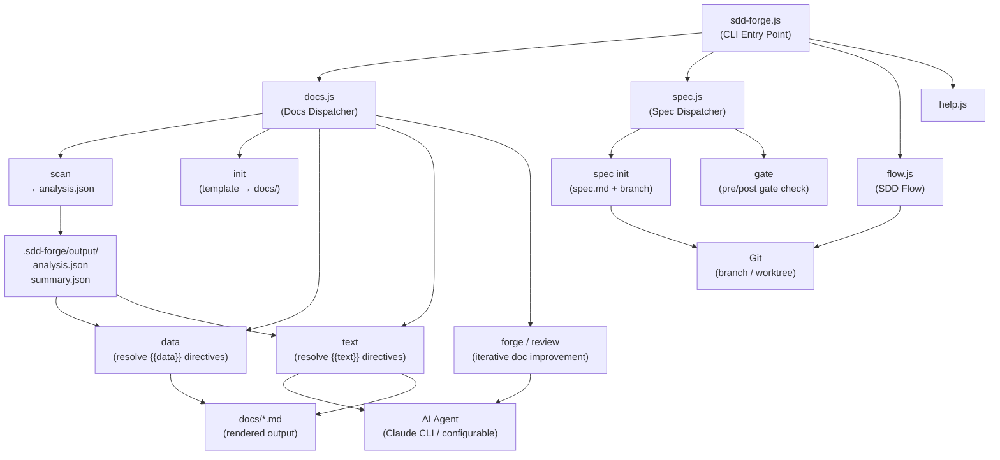

# 01. System Overview

## Description

<!-- {{text: Write a 1-2 sentence overview of this chapter. Include the project's architecture and whether it integrates with external systems.}} -->

This chapter provides a high-level view of `sdd-forge`, a Node.js CLI tool built on a three-layer dispatch architecture that automates documentation generation and Spec-Driven Development workflows. The tool integrates with external AI agents (such as Claude CLI) to resolve natural-language directives, and interacts with Git for branch and worktree management during the SDD flow.

<!-- {{/text}} -->

## Content

### Architecture Diagram

<!-- {{text: Generate a mermaid flowchart showing the project architecture. Include data flows between major components. Output only the mermaid code block.}} -->

<!-- {{/text}} -->

### Component Responsibilities

<!-- {{text: Describe the major components with their location, responsibilities, and I/O in table format.}} -->

| Component | Location | Responsibility | Input | Output |
|---|---|---|---|---|
| CLI Entry Point | `src/sdd-forge.js` | Parses top-level subcommands, resolves project context via env vars, routes to dispatchers | CLI args, `.sdd-forge/projects.json` | Dispatched command execution |
| Docs Dispatcher | `src/docs.js` | Routes docs-related subcommands (`build`, `scan`, `init`, `data`, `text`, `forge`, `review`, etc.) | Subcommand + flags | Delegates to `docs/commands/*.js` |
| Spec Dispatcher | `src/spec.js` | Routes spec-related subcommands (`spec`, `gate`) | Subcommand + flags | Delegates to `specs/commands/*.js` |
| SDD Flow | `src/flow.js` | Automates the full SDD workflow (spec → gate → implement → forge → review) | `--request` string | Orchestrated workflow execution |
| Scanner | `src/docs/lib/scanner.js` | Crawls source files, parses PHP/JS/YAML, extracts module structure | Source root path, preset scan config | `analysis.json`, `summary.json` |
| Directive Parser | `src/docs/lib/directive-parser.js` | Parses `{{data}}`, `{{text}}`, `@block`, `@extends` directives from Markdown files | Markdown file content | Parsed directive AST |
| Resolver Factory | `src/docs/lib/resolver-factory.js` | Creates data resolvers per preset for resolving `{{data}}` directives | `analysis.json`, preset type | Resolved Markdown tables/values |
| AI Agent Caller | `src/lib/agent.js` | Calls external AI agents synchronously or asynchronously with prompt injection | Prompt string, agent config | AI-generated text |
| Config Loader | `src/lib/config.js` | Reads and validates `.sdd-forge/config.json`, manages context and path utilities | `.sdd-forge/` directory | Validated config object, resolved paths |
| Preset System | `src/presets/` | Provides architecture- and framework-specific scan rules and doc templates | Preset key or type string | Scan config, template files, DataSource classes |
| Flow State Manager | `src/lib/flow-state.js` | Persists and retrieves SDD flow progress (branch, spec path, worktree info) | `.sdd-forge/current-spec` JSON | Flow state object |

<!-- {{/text}} -->

### External Integrations

<!-- {{text: If there are external system integrations, describe their purpose and connection method in table format.}} -->

| External System | Purpose | Connection Method | Configuration |
|---|---|---|---|
| AI Agent (e.g., Claude CLI) | Resolves `{{text}}` directives and iteratively improves docs via `forge` and `review` commands | Spawned as a child process via `execFileSync` (sync) or `spawn` (async) with `stdin: "ignore"` | Defined under `providers` in `.sdd-forge/config.json`; selected via `defaultAgent` |
| Git | Creates feature branches and worktrees during the SDD flow; used for branch strategy selection | Invoked via `child_process` (`execFileSync`) | Automatic; branch strategy chosen interactively during `sdd-forge spec` or `sdd-forge flow` |
| npm Registry | Distributes the `sdd-forge` package to end users | `npm publish` CLI (manual, operator-initiated only) | `package.json` `files` field controls published artifacts |

<!-- {{/text}} -->

### Environment Differences

<!-- {{text: Describe the configuration differences across environments (local/staging/production).}} -->

`sdd-forge` is a developer CLI tool and does not have traditional application deployment environments (local/staging/production). Instead, configuration differences arise from how the tool is installed and how each project's `.sdd-forge/config.json` is set up.

| Aspect | Development (source checkout) | Published Package (npm install) |
|---|---|---|
| Binary entry | `node src/sdd-forge.js` or `npm link` | `sdd-forge` via PATH (npm global or npx) |
| Package version | `0.1.0-alpha.x` (alpha tag on npm) | `latest` tag after explicit `npm dist-tag` promotion |
| `PKG_DIR` resolution | Points to local `src/` directory | Points to installed package `src/` directory |
| Test execution | `npm run test` against local `tests/` | Not applicable (tests are not published) |
| AI agent config | Defined per-project in `.sdd-forge/config.json` | Same — no environment-level override |
| Concurrency / timeout | Configurable via `limits.concurrency` and `limits.designTimeoutMs` in `config.json` | Same |

Projects analyzed by `sdd-forge` may themselves have environment-specific concerns, but the tool treats the source directory uniformly regardless of the target project's deployment environment.

<!-- {{/text}} -->
