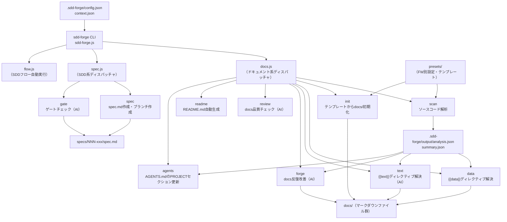

# 01. ツール概要とアーキテクチャ

## 説明

<!-- {{text: この章の概要を1〜2文で記述してください。ツールの目的・解決する課題・主要なユースケースを踏まえること。}} -->

本章では、`sdd-forge` が何を解決するツールであるか、その全体アーキテクチャ、および利用者が最初の成果物を得るまでの典型的なフローを説明します。ソースコード解析による自動ドキュメント生成と、Spec-Driven Development（SDD）ワークフローという2つの主要ユースケースを中心に解説します。

## 内容

### ツールの目的

<!-- {{text: このCLIツールが解決する課題と、ターゲットユーザーを説明してください。}} -->

`sdd-forge` は、既存ソースコードに対して「ドキュメントが存在しない・古い・属人的になっている」という課題を解消するために設計されたCLIツールです。ソースコードを解析して構造情報を自動抽出し、テンプレートとAIを組み合わせてプロジェクトドキュメントを自動生成します。

また、機能追加・改修の際には Spec-Driven Development（SDD）ワークフローを提供します。仕様書（spec）を先に作成し、AIによるゲートチェックを通過してから実装に進む開発フローを強制することで、曖昧な仕様による手戻りを防ぎます。

**ターゲットユーザー:**

- 既存プロジェクトのドキュメント整備を効率化したいエンジニア・テックリード
- AIを活用した仕様駆動開発フローを導入したいチーム
- CakePHP 2.x・Laravel・Symfony・Node.js CLI などのプロジェクトを保守・開発している開発者

### アーキテクチャ概要

<!-- {{text: ツール全体のアーキテクチャを mermaid flowchart で生成してください。入力・処理・出力の流れ、主要モジュールの関係を含めること。出力は mermaid コードブロックのみ。}} -->



### 主要コンセプト

<!-- {{text: このツールを理解するうえで重要なコンセプト・用語を表形式で説明してください。}} -->

| 用語 | 説明 |
|---|---|
| **SDD（Spec-Driven Development）** | 実装前に仕様書（spec）を作成し、AIゲートチェックを通過してから実装を進める開発手法。`sdd-forge` が採用するワークフローの中心概念。 |
| **spec** | 機能追加・改修ごとに `specs/NNN-xxx/spec.md` として作成される仕様書ファイル。SDD フローの起点となる。 |
| **gate** | spec の内容が実装可能な水準に達しているかをAIが評価するチェック機構。PASS しない限り実装に進めない。 |
| **プリセット** | フレームワーク・プロジェクト種別ごとのスキャン設定・テンプレートのセット（例: `webapp/cakephp2`、`cli/node-cli`）。 |
| **{{data}} ディレクティブ** | docs/ 内のマークダウンに記述するプレースホルダー。`sdd-forge data` 実行時に `analysis.json` の解析データで自動置換される。 |
| **{{text}} ディレクティブ** | docs/ 内のマークダウンに記述するプレースホルダー。`sdd-forge text` 実行時にAIが文章を生成して埋め込む。 |
| **MANUAL ブロック** | `<!-- MANUAL:START -->〜<!-- MANUAL:END -->` で囲まれた手動記述エリア。自動生成による上書きから保護される。 |
| **forge** | `sdd-forge forge` によるdocs反復改善コマンド。AIがソースコードと現在のdocsを参照し、内容を更新・補完する。 |
| **analysis.json / summary.json** | `sdd-forge scan` が生成するソースコード解析結果。`summary.json` はAIへの入力に最適化した軽量版。 |
| **プロジェクトコンテキスト** | `.sdd-forge/context.json` に保存されるプロジェクト固有の背景情報。AIへのプロンプトに自動付与される。 |

### 典型的な利用フロー

<!-- {{text: ユーザーがインストールしてから最初の成果物を得るまでの典型的な手順をステップ形式で説明してください。}} -->

**ステップ 1: インストール**

```bash
npm install -g sdd-forge
```

グローバルインストールにより、任意のプロジェクトディレクトリで `sdd-forge` コマンドが使用できるようになります。

**ステップ 2: プロジェクト登録と設定生成**

```bash
cd /path/to/your-project
sdd-forge setup
```

対話形式でプロジェクト種別（`type`）・言語（`lang`）・AIエージェント設定などを入力します。`.sdd-forge/config.json` と `.sdd-forge/context.json` が生成されます。

**ステップ 3: ソースコード解析**

```bash
sdd-forge scan
```

プロジェクトのソースコードを解析し、`.sdd-forge/output/analysis.json` および `summary.json` を生成します。

**ステップ 4: ドキュメント一括生成**

```bash
sdd-forge build
```

`scan → init → data → text → readme` のパイプラインを順次実行し、`docs/` 配下にマークダウンドキュメント群を生成します。これが最初の成果物となります。

**ステップ 5: 内容確認と手動補完**

生成された `docs/` のファイルを確認し、業務背景・外部仕様など自動生成では補えない情報を `<!-- MANUAL:START -->〜<!-- MANUAL:END -->` ブロック内に追記します。

**ステップ 6: 反復改善（任意）**

```bash
sdd-forge forge --prompt "追加したい観点や修正指示"
sdd-forge review
```

`forge` でAIによる追記・改善を行い、`review` で品質チェックを実施します。`review` が PASS するまで繰り返します。
