# 01. System Overview

## Description

<!-- {{text: Write a 1-2 sentence overview of this chapter. Include the project's architecture and whether it integrates with external systems.}} -->

This chapter describes the overall architecture of sdd-forge — a Node.js CLI tool that automates documentation generation and enforces a Spec-Driven Development (SDD) workflow through a three-level command dispatch system. The tool has no third-party runtime dependencies, relying solely on Node.js built-ins, but integrates with externally configured AI agents (such as Claude CLI) for text generation, quality review, and spec-gating tasks.
<!-- {{/text}} -->

## Content

### Architecture Diagram

```mermaid
flowchart TD
    CLI["sdd-forge\n(CLI entry)"]

    CLI --> DOCS["docs.js\ndispatcher"]
    CLI --> SPEC["spec.js\ndispatcher"]
    CLI --> FLOW["flow.js\n(SDD flow)"]
    CLI --> HELP["help.js"]

    DOCS --> SCAN["scan\nsource analysis"]
    DOCS --> INIT["init\ntemplate init"]
    DOCS --> DATA["data\n{{data}} resolution"]
    DOCS --> TEXT["text\n{{text}} AI generation"]
    DOCS --> FORGE["forge\niterative improvement"]
    DOCS --> REVIEW["review\nquality check"]
    DOCS --> README["readme\nREADME generation"]
    DOCS --> AGENTS["agents\nAGENTS.md update"]

    SPEC --> SINIT["spec init\ncreate spec"]
    SPEC --> GATE["gate\ngate check"]

    SCAN --> ANALYSIS[".sdd-forge/output/\nanalysis.json"]
    SCAN --> SUMMARY[".sdd-forge/output/\nsummary.json"]

    ANALYSIS --> DATA
    SUMMARY --> TEXT
    SUMMARY --> FORGE
    SUMMARY --> AGENTS

    TEXT --> AGENT["External AI Agent\n(e.g., Claude CLI)"]
    FORGE --> AGENT
    REVIEW --> AGENT
    GATE --> AGENT
```

<!-- {{text: Generate a mermaid flowchart showing the project architecture. Include data flows between major components. Output only the mermaid code block.}} -->

<!-- {{/text}} -->

### Component Responsibilities

<!-- {{text: Describe the major components with their location, responsibilities, and I/O in table format.}} -->

| Component | Location | Responsibilities | Input | Output |
|---|---|---|---|---|
| CLI Entry | `src/sdd-forge.js` | Top-level command routing; resolves project context via `SDD_SOURCE_ROOT` / `SDD_WORK_ROOT` env vars and `--project` flag | CLI arguments, `.sdd-forge/projects.json` | Dispatches to sub-dispatchers |
| docs Dispatcher | `src/docs.js` | Routes all documentation subcommands (scan, init, data, text, readme, forge, review, agents, changelog, setup, etc.) | CLI args | Delegates to `src/docs/commands/*.js` |
| spec Dispatcher | `src/spec.js` | Routes spec lifecycle subcommands (spec, gate) | CLI args | Delegates to `src/specs/commands/*.js` |
| SDD Flow | `src/flow.js` | Automates the full SDD workflow end-to-end (spec → gate → implement → forge → review) | `--request` string | Orchestrates all SDD steps sequentially |
| Scanner | `src/docs/lib/scanner.js` | Traverses source directories; parses PHP, JS, and YAML source files into structured data | Source root directory | `.sdd-forge/output/analysis.json`, `summary.json` |
| Directive Parser | `src/docs/lib/directive-parser.js` | Parses `{{data}}`, `{{text}}`, `@block`, and `@extends` directives inside Markdown templates | Markdown template files | Parsed directive AST |
| Template Merger | `src/docs/lib/template-merger.js` | Resolves `@extends` / `@block` template inheritance chains | Template files with inheritance directives | Merged Markdown template |
| AI Agent | `src/lib/agent.js` | Invokes the configured external AI agent synchronously (`execFileSync`) or asynchronously (`spawn`) | Prompt string, agent config from `config.json` | AI-generated or reviewed text |
| Config | `src/lib/config.js` | Loads and validates `.sdd-forge/config.json`; resolves `.sdd-forge/` file paths; manages `context.json` | `.sdd-forge/` directory | Validated config object, resolved paths |
| Preset System | `src/lib/presets.js` | Auto-discovers `src/presets/*/preset.json` entries; builds type alias map for project type resolution | `src/presets/` directory | `PRESETS` constant used across all commands |
| Flow State | `src/lib/flow-state.js` | Persists SDD workflow progress (current spec path, base/feature branch names, worktree info) | `.sdd-forge/current-spec` JSON file | Loaded or saved flow state object |
<!-- {{/text}} -->

### External Integrations

<!-- {{text: If there are external system integrations, describe their purpose and connection method in table format.}} -->

sdd-forge itself has no external runtime dependencies and communicates with the outside world only through the AI agent interface defined in `.sdd-forge/config.json`. All other processing is performed with Node.js built-in modules.

| Integration | Purpose | Connection Method |
|---|---|---|
| AI Agent (e.g., Claude CLI) | Drives `{{text}}` directive resolution, iterative docs improvement (`forge`), quality review (`review`), and spec gate evaluation (`gate`) | Configured via `config.json` → `providers` map + `defaultAgent`; invoked as a child process using `execFileSync` (sync) or `spawn` + `stdin: "ignore"` (async with streaming callback) |
| Git | Determines repository root (`git rev-parse`), manages feature branches and worktrees during the SDD flow | Invoked as a child process via Node.js `child_process`; resolved through `repoRoot()` in `src/lib/cli.js` |
<!-- {{/text}} -->

### Environment Differences

<!-- {{text: Describe the configuration differences across environments (local/staging/production).}} -->

sdd-forge is a developer-facing CLI tool and does not have predefined deployment tiers such as staging or production. All runtime behavior is controlled through environment variables and the per-project `.sdd-forge/config.json` file. The following settings are the primary points of variation between different execution contexts.

| Configuration Point | Mechanism | Description |
|---|---|---|
| Source root | `SDD_SOURCE_ROOT` env var | Overrides the source directory resolved by `git rev-parse` or `cwd`; useful when the analyzed project is separate from the working directory |
| Work root | `SDD_WORK_ROOT` env var | Overrides the working root where `.sdd-forge/` is located; enables tool and target project to reside in different directories |
| Multi-project selection | `--project <name>` flag | Selects a named project entry from `.sdd-forge/projects.json`; allows a single sdd-forge installation to manage multiple codebases |
| AI agent | `config.json` → `providers` + `defaultAgent` | Specifies the command, arguments, and timeout for the external AI agent; can be swapped per environment (e.g., a faster model in CI) |
| File processing concurrency | `config.json` → `limits.concurrency` | Controls parallel file processing (default: 5); increase for high-core CI runners, reduce for memory-constrained environments |
| AI agent timeout | `config.json` → `limits.designTimeoutMs` | Sets the maximum wait time for AI agent calls; may need tuning in slow network or CI environments where agent startup latency is higher |
| Output languages | `config.json` → `output.languages` + `output.default` | Determines whether documentation is generated in a single language or translated into multiple languages during the build pipeline |
<!-- {{/text}} -->
