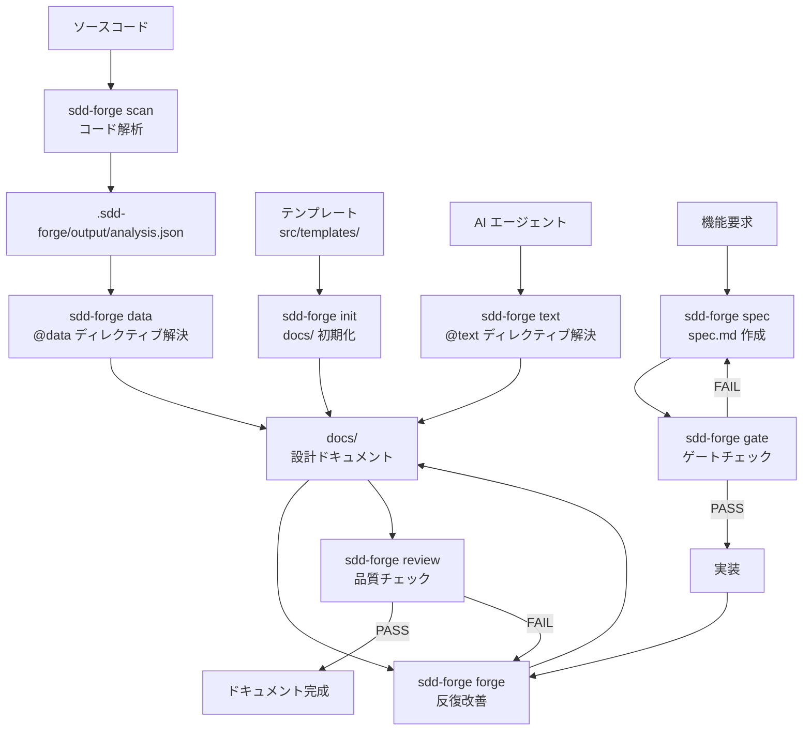

# 01. ツール概要とアーキテクチャ

## 説明

<!-- @text: この章の概要を1〜2文で記述してください。ツールの目的・解決する課題・主要なユースケースを踏まえること。 -->

本章では、sdd-forge がどのような課題を解決するツールであるか、その全体的なアーキテクチャ、および利用を開始するまでの典型的なフローを説明します。ソースコードの自動解析によるドキュメント生成と、Spec-Driven Development ワークフローの両面からツールの役割を理解できます。

## 内容

### ツールの目的

<!-- @text: このCLIツールが解決する課題と、ターゲットユーザーを説明してください。 -->

sdd-forge は、ソースコードとドキュメントの乖離という慢性的な課題を解決するための CLI ツールです。開発が進むにつれて仕様書や設計ドキュメントが実装と食い違うことは多くのチームで発生していますが、sdd-forge はソースコードを直接解析して構造情報を抽出し、ドキュメントを自動生成・更新することでこの問題に対処します。

また、機能追加や改修の際には Spec-Driven Development（SDD）フローに従って spec の作成・ゲートチェック・実装・ドキュメント更新を一貫して管理できます。

**ターゲットユーザー:**
- ドキュメントの陳腐化に悩む中〜大規模プロジェクトの開発チーム
- 設計ドキュメントと実装の整合性を継続的に保ちたいエンジニア・テックリード
- 機能追加・改修時の仕様管理を体系化したい開発組織

### アーキテクチャ概要

<!-- @text: ツール全体のアーキテクチャを mermaid flowchart で生成してください。入力・処理・出力の流れ、主要モジュールの関係を含めること。出力は mermaid コードブロックのみ。 -->



### 主要コンセプト

<!-- @text: このツールを理解するうえで重要なコンセプト・用語を表形式で説明してください。 -->

| コンセプト / 用語 | 説明 |
|---|---|
| **SDD（Spec-Driven Development）** | 仕様（spec）を先に作成・承認してから実装を行う開発手法。ドキュメントと実装の整合性を保つことを目的とします。 |
| **spec** | 機能追加・改修ごとに作成される仕様書ファイル（`specs/NNN-xxx/spec.md`）。ゲートチェックを経て実装の起点となります。 |
| **gate** | spec の内容が実装を開始するのに十分な品質かをチェックする関門。PASS するまで実装は禁止されます。 |
| **analysis.json** | `sdd-forge scan` がソースコードを解析して生成する構造データ。docs 生成の基礎となります。 |
| **@data ディレクティブ** | docs テンプレート内に記述するマーカー。`sdd-forge data` 実行時に analysis.json の内容で自動展開されます。 |
| **@text ディレクティブ** | docs テンプレート内に記述するマーカー。`sdd-forge text` 実行時に AI が文章を生成して埋め込みます。 |
| **MANUAL ブロック** | `<!-- MANUAL:START -->〜<!-- MANUAL:END -->` で囲まれた手動記述領域。自動上書きされません。 |
| **forge** | AI を使って docs を反復的に改善するコマンド。変更内容のプロンプトを渡すことで docs を最新状態に保ちます。 |
| **review** | docs の品質を自動チェックするコマンド。PASS になるまで forge との繰り返しが推奨されます。 |
| **preset** | フレームワーク（CakePHP2、Laravel、Symfony 等）ごとの解析ロジック設定。プロジェクトの技術スタックに応じて選択します。 |

### 典型的な利用フロー

<!-- @text: ユーザーがインストールしてから最初の成果物を得るまでの典型的な手順をステップ形式で説明してください。 -->

**1. インストール**

```bash
npm install -g sdd-forge
```

グローバルインストールにより、任意のプロジェクトディレクトリから `sdd-forge` コマンドが使用できるようになります。

**2. プロジェクト登録と初期設定**

```bash
cd /path/to/your/project
sdd-forge setup
```

対話形式でプロジェクト情報（ソースルート・言語・フレームワーク等）を入力します。`.sdd-forge/` ディレクトリと設定ファイルが生成されます。

**3. ソースコード解析**

```bash
sdd-forge scan
```

プロジェクトのソースコードを解析し、`.sdd-forge/output/analysis.json` を生成します。

**4. ドキュメント一括生成**

```bash
sdd-forge build
```

`scan → init → data → text → readme` を順に実行し、`docs/` 配下に設計ドキュメントを生成します。初回はこのコマンド一つで最初のドキュメントセットが揃います。

**5. 品質チェックと改善**

```bash
sdd-forge review
sdd-forge forge --prompt "初回ドキュメント生成後の調整"
```

review の結果に応じて forge を繰り返し、PASS になればドキュメントが完成です。

**6. 機能追加時（SDD フロー）**

新機能を追加する際は `sdd-forge spec --title "<機能名>"` で spec を作成し、`sdd-forge gate` でチェックを通過してから実装を開始します。実装完了後は `sdd-forge forge` と `sdd-forge review` で docs を更新します。
```
