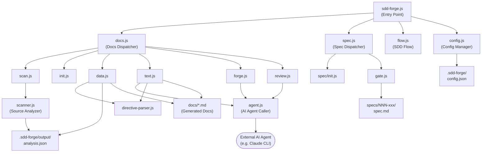

# 01. System Overview

## Description

<!-- {{text: Write a 1-2 sentence overview of this chapter. Include the project's architecture and whether it integrates with external systems.}} -->

This chapter describes the overall architecture of `sdd-forge`, a Node.js CLI tool that automates documentation generation through Spec-Driven Development by analyzing source code and resolving template directives with AI-generated content. The tool operates entirely on the local filesystem using Node.js built-in modules, with optional integration to a configurable external AI agent (such as Claude CLI) for text generation and review tasks.

<!-- {{/text}} -->

## Content

### Architecture Diagram

<!-- {{text: Generate a mermaid flowchart showing the project architecture. Include data flows between major components. Output only the mermaid code block.}} -->

<!-- {{/text}} -->

### Component Responsibilities

<!-- {{text: Describe the major components with their location, responsibilities, and I/O in table format.}} -->

| Component | Location | Responsibility | Input | Output |
|---|---|---|---|---|
| CLI Entry Point | `src/sdd-forge.js` | Routes subcommands and resolves project context via environment variables | CLI arguments, `SDD_SOURCE_ROOT` / `SDD_WORK_ROOT` env vars | Delegates to dispatchers |
| Docs Dispatcher | `src/docs.js` | Routes all documentation-related subcommands (`scan`, `init`, `data`, `text`, `forge`, `review`, etc.) | Subcommand name and arguments | Delegates to `src/docs/commands/*.js` |
| Spec Dispatcher | `src/spec.js` | Routes `spec` and `gate` subcommands for SDD workflow management | Subcommand name and arguments | Delegates to `src/specs/commands/*.js` |
| SDD Flow | `src/flow.js` | Automates the full SDD workflow end-to-end | `--request` argument and flow state from `.sdd-forge/current-spec` | Orchestrates spec creation, gate checks, and implementation |
| Scanner | `src/docs/lib/scanner.js` | Analyzes source files and extracts structural metadata (files, modules, methods) | Source files under configured paths | `.sdd-forge/output/analysis.json` |
| Directive Parser | `src/docs/lib/directive-parser.js` | Parses `{{data}}` and `{{text}}` directives in template files | `.md` template files | Directive AST for downstream resolvers |
| Agent Caller | `src/lib/agent.js` | Invokes the configured external AI agent synchronously or asynchronously | Prompt string, agent config from `config.json` | AI-generated text response |
| Config Manager | `src/lib/config.js` | Loads, validates, and provides access to project configuration and path utilities | `.sdd-forge/config.json`, `.sdd-forge/context.json` | Validated config object, resolved file paths |
| Resolver Factory | `src/docs/lib/resolver-factory.js` | Creates the appropriate `DataSource` resolver for a given project type/preset | Project type, analysis data | Instantiated `DataSource` for `data.js` |
| Template Merger | `src/docs/lib/template-merger.js` | Resolves `@extends` / `@block` template inheritance across preset layers | Base and child template files | Merged template content |

<!-- {{/text}} -->

### External Integrations

<!-- {{text: If there are external system integrations, describe their purpose and connection method in table format.}} -->

| Integration | Purpose | Connection Method | Configuration |
|---|---|---|---|
| AI Agent (e.g. Claude CLI) | Generates documentation text for `{{text}}` directives, performs `forge` improvements, and executes `review` quality checks | CLI subprocess invocation via `execFileSync` (sync) or `spawn` with `stdin: "ignore"` (async) | Defined in `.sdd-forge/config.json` under `providers` and `defaultAgent`; supports custom `command`, `args`, `timeoutMs`, and `systemPromptFlag` |

`sdd-forge` has no other external service dependencies. All file I/O uses Node.js built-in modules (`fs`, `path`, `child_process`, `os`), and no network calls are made directly by the tool itself. The AI agent binary must be installed and accessible in the system `PATH` on the machine where `sdd-forge` runs.

<!-- {{/text}} -->

### Environment Differences

<!-- {{text: Describe the configuration differences across environments (local/staging/production).}} -->

As a local CLI tool, `sdd-forge` does not follow a traditional multi-environment deployment model. Configuration is entirely file-driven via `.sdd-forge/config.json` in each project's working directory, and behavior is consistent regardless of where the tool runs. The following distinctions apply across typical usage contexts:

| Context | Characteristics | Notes |
|---|---|---|
| Local Development | Interactive use; AI agent invocations are real-time; `--dry-run` flags available for safe inspection | Developer can run `sdd-forge text`, `sdd-forge forge`, and `sdd-forge review` interactively |
| CI / Automated Pipeline | Non-interactive; `sdd-forge build` runs the full scan → data → text → readme pipeline unattended | Requires the AI agent binary to be present in the CI environment and `config.json` to be committed or injected |
| Multi-project Setup | Multiple source projects registered in `.sdd-forge/projects.json`; the `--project <name>` flag selects context | `SDD_SOURCE_ROOT` and `SDD_WORK_ROOT` environment variables override project-specific paths |

The `lang` and `output.languages` fields in `config.json` control output language behavior across all contexts. No secrets or credentials are stored by `sdd-forge` itself; authentication for the AI agent (if required) is managed by the agent's own configuration outside the tool.

<!-- {{/text}} -->
