# 04. 内部設計

## 説明

<!-- @text: この章の概要を1〜2文で記述してください。プロジェクト構成・モジュール依存の方向・主要な処理フローを踏まえること。 -->

本章では sdd-forge の内部構造を説明します。エントリーポイントから各ディスパッチャーを経てコマンドモジュールへと向かう一方向の依存関係と、`build` パイプラインや `flow` コマンドなど主要な処理フローの全体像を整理します。

## 内容

### プロジェクト構成

<!-- @text: このプロジェクトのディレクトリ構成を tree 形式のコードブロックで記述してください。主要ディレクトリ・ファイルの役割コメントを含めること。 -->

```
src/
├── sdd-forge.js            # CLI エントリーポイント・トップレベルディスパッチャー
├── docs.js                 # docs 系サブコマンドのディスパッチャー
├── spec.js                 # spec 系サブコマンドのディスパッチャー
├── flow.js                 # SDD フロー自動実行（spec→gate→forge）
├── help.js                 # ヘルプ表示
├── docs/
│   ├── commands/           # docs 系コマンド実装
│   │   ├── scan.js         # ソースコード解析 → analysis.json / summary.json
│   │   ├── init.js         # テンプレートから docs/ を初期化
│   │   ├── data.js         # @data ディレクティブを解析データで解決
│   │   ├── text.js         # @text ディレクティブを AI で解決
│   │   ├── readme.js       # README.md 自動生成
│   │   ├── forge.js        # docs 反復改善
│   │   ├── review.js       # docs 品質チェック
│   │   ├── changelog.js    # specs/ から change_log.md 生成
│   │   ├── agents.js       # AGENTS.md の PROJECT セクション更新
│   │   ├── setup.js        # プロジェクト登録 + 設定生成
│   │   ├── upgrade.js      # docs テンプレートのアップグレード
│   │   └── default-project.js  # デフォルトプロジェクト切り替え
│   └── lib/                # docs 処理の共通ライブラリ
│       ├── scanner.js          # ファイル探索・言語別パーサ
│       ├── directive-parser.js # @data / @text ディレクティブ解析
│       ├── template-merger.js  # テンプレートマージ処理
│       ├── resolver-factory.js # DataSource リゾルバのファクトリ
│       ├── data-source.js      # DataSource 基底クラス
│       ├── renderers.js        # Markdown レンダラー
│       ├── forge-prompts.js    # forge 用プロンプト構築ユーティリティ
│       ├── review-parser.js    # review 結果パーサー
│       ├── scan-source.js      # スキャン結果ソース管理
│       └── php-array-parser.js # PHP 配列パーサー
├── specs/
│   └── commands/
│       ├── init.js         # spec 初期化（feature ブランチ + spec.md 生成）
│       └── gate.js         # spec ゲートチェック
├── lib/                    # 全コマンド共通の共有ライブラリ
│   ├── agent.js            # AI エージェント呼び出しユーティリティ
│   ├── cli.js              # CLI 引数パーサー・リポジトリルート解決
│   ├── config.js           # .sdd-forge/config.json 読み込み・設定管理
│   ├── types.js            # 型定義・バリデーション
│   ├── projects.js         # projects.json の CRUD ユーティリティ
│   ├── process.js          # 子プロセス実行ユーティリティ
│   ├── i18n.js             # 国際化（ja/en）
│   ├── flow-state.js       # フロー状態の保存・読み込み
│   ├── progress.js         # プログレスバー・ロガー
│   ├── presets.js          # プリセット自動検出
│   └── agents-md.js        # AGENTS.md セクション管理
├── presets/                # フレームワーク別アナライザー
│   ├── cakephp2/           # CakePHP 2.x 用 scan/ + data/ モジュール
│   ├── laravel/            # Laravel 用 scan/ + data/ モジュール
│   ├── symfony/            # Symfony 用 scan/ + data/ モジュール
│   ├── webapp/             # 汎用 webapp 用 data/ モジュール
│   └── cli/                # CLI/Node.js 用 data/ モジュール
└── templates/              # バンドル済みドキュメントテンプレート
    └── locale/
        ├── ja/             # 日本語テンプレート
        └── en/             # 英語テンプレート
```

### モジュール構成

<!-- @text: 全モジュールの一覧を表形式で記述してください。モジュール名・ファイルパス・責務を含めること。 -->

| モジュール名 | ファイルパス | 責務 |
|---|---|---|
| sdd-forge | `src/sdd-forge.js` | CLI エントリーポイント。`--project` フラグの解決、プロジェクトコンテキストの env 変数への注入、サブコマンドを各ディスパッチャーへルーティング |
| docs | `src/docs.js` | docs 系サブコマンド（scan/init/data/text/readme/forge/review 等）のルーティング。`build` コマンドのパイプライン実行も担当 |
| spec | `src/spec.js` | spec/gate サブコマンドを `specs/commands/` 配下のスクリプトへルーティング |
| flow | `src/flow.js` | SDD フローの自動実行（spec 作成 → gate チェック → forge 実行）を一連で処理 |
| help | `src/help.js` | コマンド一覧の表示 |
| scan | `src/docs/commands/scan.js` | ソースコードを解析して `analysis.json` / `summary.json` を生成 |
| init | `src/docs/commands/init.js` | テンプレートを元に `docs/` ディレクトリを初期化 |
| data | `src/docs/commands/data.js` | `@data` ディレクティブを解析データで解決してドキュメントを更新 |
| text | `src/docs/commands/text.js` | `@text` ディレクティブを AI エージェントで解決してドキュメントを更新 |
| readme | `src/docs/commands/readme.js` | `docs/` の内容を元に `README.md` を自動生成 |
| forge | `src/docs/commands/forge.js` | AI エージェントを用いて `docs/` の内容を反復改善 |
| review | `src/docs/commands/review.js` | `docs/` のドキュメント品質をチェックして PASS/FAIL を判定 |
| changelog | `src/docs/commands/changelog.js` | `specs/` ディレクトリの spec.md 群から `change_log.md` を生成 |
| agents | `src/docs/commands/agents.js` | `AGENTS.md` の PROJECT セクションを `analysis.json` から更新 |
| setup | `src/docs/commands/setup.js` | プロジェクト登録と `.sdd-forge/config.json` の初期生成 |
| upgrade | `src/docs/commands/upgrade.js` | docs テンプレートのバージョンアップグレード |
| default-project | `src/docs/commands/default-project.js` | デフォルトプロジェクトの切り替え |
| spec-init | `src/specs/commands/init.js` | feature ブランチ作成と `spec.md` の雛形生成 |
| gate | `src/specs/commands/gate.js` | `spec.md` の記載内容が実装開始条件を満たすかチェック |
| agent | `src/lib/agent.js` | AI エージェント（callAgent / callAgentAsync）の呼び出しインターフェース |
| cli | `src/lib/cli.js` | CLI 引数パーサー、リポジトリルート解決、worktree 検出 |
| config | `src/lib/config.js` | `.sdd-forge/config.json` / `context.json` の読み書き・バリデーション |
| types | `src/lib/types.js` | SddConfig / SddContext の型定義とバリデーション |
| projects | `src/lib/projects.js` | `projects.json` の CRUD と、プロジェクト・作業ルートの解決 |
| process | `src/lib/process.js` | 子プロセスの同期実行ユーティリティ |
| i18n | `src/lib/i18n.js` | ja/en ロケールによる文言管理 |
| flow-state | `src/lib/flow-state.js` | `.sdd-forge/flow-state.json` への状態の保存・読み込み |
| progress | `src/lib/progress.js` | ビルドパイプライン用プログレスバーとロガー |
| presets | `src/lib/presets.js` | `src/presets/` 配下の `preset.json` を読み込み、利用可能なプリセット一覧を提供 |
| agents-md | `src/lib/agents-md.js` | `AGENTS.md` の SDD/PROJECT 各セクションの読み書き |
| scanner | `src/docs/lib/scanner.js` | glob 風パターンによるファイル探索・言語別クラス/関数抽出 |
| directive-parser | `src/docs/lib/directive-parser.js` | Markdown 中の `@data` / `@text` ディレクティブの解析 |
| template-merger | `src/docs/lib/template-merger.js` | テンプレートと既存ドキュメントのマージ処理 |
| resolver-factory | `src/docs/lib/resolver-factory.js` | preset の `data/` モジュールをロードして DataSource リゾルバを生成 |
| data-source | `src/docs/lib/data-source.js` | DataSource の基底クラス定義 |
| renderers | `src/docs/lib/renderers.js` | テーブル・リストなどの Markdown レンダリング関数 |
| forge-prompts | `src/docs/lib/forge-prompts.js` | `forge` コマンド用プロンプトの構築と `summary.json` のテキスト変換 |
| review-parser | `src/docs/lib/review-parser.js` | AI の review 出力から PASS/FAIL と指摘事項を抽出 |
| scan-source | `src/docs/lib/scan-source.js` | `analysis.json` / `summary.json` の読み込みと管理 |
| php-array-parser | `src/docs/lib/php-array-parser.js` | PHP 配列形式の設定ファイル解析 |

### モジュール依存関係

```mermaid
graph TD
    CLI["sdd-forge.js<br/>(entry point)"]

    CLI -->|docs cmds| DOCS["docs.js"]
    CLI -->|spec/gate| SPEC["spec.js"]
    CLI -->|flow| FLOW["flow.js"]
    CLI -->|help| HELP["help.js"]
    CLI --> LIB_PROJECTS["lib/projects.js"]

    DOCS -->|build pipeline| SCAN_CMD["docs/commands/scan.js"]
    DOCS --> INIT_CMD["docs/commands/init.js"]
    DOCS --> DATA_CMD["docs/commands/data.js"]
    DOCS --> TEXT_CMD["docs/commands/text.js"]
    DOCS --> README_CMD["docs/commands/readme.js"]
    DOCS --> FORGE_CMD["docs/commands/forge.js"]
    DOCS --> REVIEW_CMD["docs/commands/review.js"]
    DOCS --> AGENTS_CMD["docs/commands/agents.js"]
    DOCS --> CHANGELOG_CMD["docs/commands/changelog.js"]
    DOCS --> SETUP_CMD["docs/commands/setup.js"]

    SPEC --> SPEC_INIT["specs/commands/init.js"]
    SPEC --> GATE_CMD["specs/commands/gate.js"]

    FLOW --> SPEC_INIT
    FLOW --> GATE_CMD
    FLOW --> FORGE_CMD
    FLOW --> LIB_CLI["lib/cli.js"]
    FLOW --> LIB_PROCESS["lib/process.js"]
    FLOW --> LIB_FLOWSTATE["lib/flow-state.js"]
    FLOW --> LIB_I18N["lib/i18n.js"]

    SCAN_CMD --> LIB_CONFIG["lib/config.js"]
    SCAN_CMD --> SCANNER["docs/lib/scanner.js"]
    SCAN_CMD --> LIB_PRESETS["lib/presets.js"]

    DATA_CMD --> DIRECTIVE_PARSER["docs/lib/directive-parser.js"]
    DATA_CMD --> RESOLVER_FACTORY["docs/lib/resolver-factory.js"]
    DATA_CMD --> LIB_CONFIG

    TEXT_CMD --> DIRECTIVE_PARSER
    TEXT_CMD --> LIB_AGENT["lib/agent.js"]
    TEXT_CMD --> LIB_CONFIG

    FORGE_CMD --> LIB_AGENT
    FORGE_CMD --> FORGE_PROMPTS["docs/lib/forge-prompts.js"]
    FORGE_CMD --> LIB_CONFIG

    REVIEW_CMD --> LIB_AGENT
    REVIEW_CMD --> REVIEW_PARSER["docs/lib/review-parser.js"]

    INIT_CMD --> TEMPLATE_MERGER["docs/lib/template-merger.js"]
    INIT_CMD --> LIB_CONFIG

    RESOLVER_FACTORY --> LIB_PRESETS
    RESOLVER_FACTORY --> DATA_SOURCE["docs/lib/data-source.js"]

    LIB_CONFIG --> LIB_TYPES["lib/types.js"]
    LIB_PRESETS --> PRESETS_DIR["presets/{fw}/preset.json"]
    AGENTS_CMD --> LIB_AGENTSMD["lib/agents-md.js"]
    AGENTS_CMD --> LIB_AGENT
    SETUP_CMD --> LIB_PROJECTS
```

<!-- @text: モジュール間の依存関係を mermaid graph で生成してください。出力は mermaid コードブロックのみ。 -->



### 主要な処理フロー

<!-- @text: 代表的なコマンドを実行した際のモジュール間のデータ・制御フローを説明してください。 -->

**`sdd-forge build` — ドキュメント一括生成パイプライン**

`sdd-forge.js` がサブコマンドを `docs.js` へ転送し、`docs.js` 内の `build` 分岐が 6 ステップのパイプラインを順次実行します。

1. **scan** — `docs/commands/scan.js` がソースコードを走査し、`lib/presets.js` でフレームワークを判定したうえで `presets/{fw}/scan/` 配下のアナライザーを呼び出します。結果は `.sdd-forge/output/analysis.json` および `summary.json` に保存されます。
2. **init** — `docs/commands/init.js` が `src/templates/` のテンプレートを読み込み、`docs/lib/template-merger.js` を使って既存の `docs/` ファイルとマージします。手動記述の `MANUAL` ブロックは保持されます。
3. **data** — `docs/commands/data.js` が `docs/lib/directive-parser.js` で `@data` ディレクティブを抽出し、`docs/lib/resolver-factory.js` が `presets/{fw}/data/` の DataSource をロードして各ディレクティブを Markdown テーブルなどに解決します。
4. **text** — `docs/commands/text.js` が未解決の `@text` ディレクティブを抽出し、`lib/agent.js` 経由で AI エージェントに逐次問い合わせてプロンプト指示に対応する本文を生成・挿入します。
5. **readme** — `docs/commands/readme.js` が完成した `docs/` の内容を元に `README.md` を生成します。
6. **agents** — `docs/commands/agents.js` がテンプレートベースで `AGENTS.md`（`CLAUDE.md`）の PROJECT セクションを更新します。

**`sdd-forge flow` — SDD フロー自動実行**

`flow.js` が以下を順次処理します。まず `specs/commands/init.js` を呼び出して feature ブランチと `spec.md` を作成し、次に `specs/commands/gate.js` でゲートチェックを実行します。gate が FAIL の場合は未解決事項を出力して終了コード 2 で停止します。gate が PASS した場合はフロー状態を `.sdd-forge/flow-state.json` に保存し、最後に `docs/commands/forge.js` を呼び出して docs の反復改善を実行します。

### 拡張ポイント

<!-- @text: 新しいコマンドや機能を追加する際に変更が必要な箇所と、拡張パターンを説明してください。 -->

**新しい docs コマンドを追加する場合**

`src/docs/commands/` 配下に新しいスクリプトを作成し、`src/docs.js` の `SCRIPTS` マップにエントリーを追加します。さらに `src/sdd-forge.js` の `DISPATCHERS` マップに `{ コマンド名: "docs" }` を追加することでトップレベルから呼び出せるようになります。`src/help.js` にもコマンド説明を追記します。

**新しいプリセット（フレームワーク対応）を追加する場合**

`src/presets/{fw}/` ディレクトリを作成し、`preset.json`（arch / label / aliases / scan を定義）を配置します。ソースコード解析ロジックは `scan/` サブディレクトリに、`@data` ディレクティブ用のデータソースは `data/` サブディレクトリにそれぞれ配置します。`src/lib/presets.js` は `preset.json` を自動検出するため、追加ファイルを置くだけでプリセットとして認識されます。

**新しい `@data` DataSource を追加する場合**

対象プリセットの `data/` ディレクトリに DataSource クラスを実装したファイルを追加します。`docs/lib/resolver-factory.js` が `data/` 配下のファイルを自動ロードするため、クラスをエクスポートするだけで `@data` ディレクティブから参照可能になります。

**`build` パイプラインにステップを追加する場合**

`src/docs.js` の `pipelineSteps` 配列と実行ブロックに新ステップを追加します。各ステップは `process.argv` を書き換えてスクリプトを `import` する形式で実装されており、既存パターンに倣うことで一貫した進捗表示と `--dry-run` 対応が得られます。
