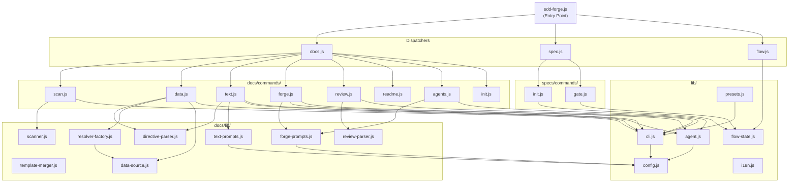

# 04. Internal Design

## Overview

<!-- {{text: Describe the purpose of this chapter in 1–2 sentences. Cover the project structure, direction of module dependencies, and key processing flows.}} -->
This chapter describes the internal architecture of sdd-forge, including its directory layout, module responsibilities, and the direction of dependencies across the three-layer dispatch structure. It also covers the key processing flows that connect the CLI entry point through to AI invocation and file output.
<!-- {{/text}} -->

## Contents

### Project Structure

<!-- {{text: Describe the directory structure of this project in a tree-format code block. Include role comments for major directories and files. Cover the top-level dispatchers under src/ (sdd-forge.js, docs.js, spec.js, flow.js), docs/commands/ (subcommand implementations), docs/lib/ (document generation libraries), lib/ (shared utilities), presets/ (preset definitions), and templates/ (bundled templates).}} -->
```
sdd-forge/
├── package.json                      ← Package manifest; bin entry: ./src/sdd-forge.js
└── src/
    ├── sdd-forge.js                  ← Top-level CLI entry point; routes to dispatchers
    ├── docs.js                       ← Dispatcher for all docs subcommands
    ├── spec.js                       ← Dispatcher for spec/gate subcommands
    ├── flow.js                       ← SDD flow automation (DIRECT_COMMAND)
    ├── presets-cmd.js                ← Presets listing command (DIRECT_COMMAND)
    ├── help.js                       ← Help text output
    ├── docs/
    │   ├── commands/                 ← Subcommand implementations
    │   │   ├── scan.js               ← Source analysis → analysis.json / summary.json
    │   │   ├── init.js               ← Initialize docs/ from templates
    │   │   ├── data.js               ← Resolve {{data}} directives
    │   │   ├── text.js               ← Resolve {{text}} directives via AI
    │   │   ├── readme.js             ← Auto-generate README.md
    │   │   ├── forge.js              ← Iterative docs improvement via AI
    │   │   ├── review.js             ← Docs quality check via AI
    │   │   ├── agents.js             ← Regenerate AGENTS.md sections
    │   │   ├── changelog.js          ← Generate change_log.md from specs/
    │   │   ├── setup.js              ← Project registration + config generation
    │   │   └── ...                   ← upgrade, translate, default-project, etc.
    │   └── lib/                      ← Document generation library modules
    │       ├── scanner.js            ← File discovery and PHP/JS/YAML parsing
    │       ├── directive-parser.js   ← Parse {{data}} / {{text}} / @block / @extends
    │       ├── template-merger.js    ← Resolve template inheritance (@extends / @block)
    │       ├── data-source.js        ← DataSource base class
    │       ├── data-source-loader.js ← Dynamic DataSource loader per preset
    │       ├── resolver-factory.js   ← createResolver() factory for data command
    │       ├── forge-prompts.js      ← Prompt builders for forge/agents; summaryToText()
    │       ├── text-prompts.js       ← Prompt builders for text command
    │       ├── review-parser.js      ← Parse AI review output
    │       ├── renderers.js          ← Markdown rendering utilities
    │       ├── scan-source.js        ← Scan configuration loader
    │       ├── concurrency.js        ← Parallel file processing utilities
    │       └── ...                   ← composer-utils.js, php-array-parser.js
    ├── specs/
    │   └── commands/
    │       ├── init.js               ← spec.md creation + feature branch setup
    │       └── gate.js               ← Spec gate check (pre/post phase)
    ├── lib/                          ← Shared utilities used across all layers
    │   ├── agent.js                  ← AI agent invocation (sync/async)
    │   ├── cli.js                    ← Argument parsing, path resolution utilities
    │   ├── config.js                 ← Config loading, path utilities (.sdd-forge/)
    │   ├── flow-state.js             ← SDD flow state management (current-spec)
    │   ├── presets.js                ← Preset auto-discovery and lookup
    │   ├── i18n.js                   ← Internationalization utilities
    │   ├── types.js                  ← Type aliases and project type definitions
    │   └── ...                       ← agents-md.js, process.js, projects.js, entrypoint.js
    ├── presets/                      ← Preset definitions per project type
    │   ├── base/                     ← Base preset (arch layer)
    │   │   ├── preset.json
    │   │   └── templates/            ← Doc templates (ja/ and en/)
    │   ├── webapp/, cli/, library/   ← Architecture-layer presets
    │   ├── cakephp2/, laravel/, symfony/ ← Framework-specific presets
    │   └── node-cli/                 ← Node.js CLI preset
    └── templates/                    ← Bundled templates (config.example.json, review-checklist.md, skills/)
```
<!-- {{/text}} -->

### Module Overview

<!-- {{text: List the major modules in a table format. Include module name, file path, and responsibility. Cover the dispatcher layer (sdd-forge.js, docs.js, spec.js), command layer (docs/commands/*.js, specs/commands/*.js), library layer (lib/agent.js, lib/cli.js, lib/config.js, lib/flow-state.js, lib/presets.js, lib/i18n.js), and document generation layer (docs/lib/scanner.js, directive-parser.js, template-merger.js, forge-prompts.js, text-prompts.js, review-parser.js, data-source.js, resolver-factory.js).}} -->
| Layer | Module | File Path | Responsibility |
|---|---|---|---|
| **Dispatcher** | CLI Entry Point | `src/sdd-forge.js` | Parses top-level subcommand; resolves project context via env vars; routes to dispatcher or direct command |
| **Dispatcher** | Docs Dispatcher | `src/docs.js` | Routes all docs-related subcommands (`build`, `scan`, `init`, `data`, `text`, `readme`, `forge`, `review`, `agents`, `changelog`, `setup`, etc.) |
| **Dispatcher** | Spec Dispatcher | `src/spec.js` | Routes `spec` and `gate` subcommands |
| **Command** | scan | `src/docs/commands/scan.js` | Analyzes source files; writes `analysis.json` and `summary.json` |
| **Command** | data | `src/docs/commands/data.js` | Resolves `{{data}}` directives in docs using analysis data |
| **Command** | text | `src/docs/commands/text.js` | Resolves `{{text}}` directives by invoking an AI agent |
| **Command** | forge | `src/docs/commands/forge.js` | Iteratively improves existing docs content via AI |
| **Command** | review | `src/docs/commands/review.js` | Runs AI-based quality check against the review checklist |
| **Command** | readme | `src/docs/commands/readme.js` | Auto-generates `README.md` from docs and analysis data |
| **Command** | agents | `src/docs/commands/agents.js` | Regenerates SDD and PROJECT sections of `AGENTS.md` |
| **Command** | spec init | `src/specs/commands/init.js` | Creates a new spec file and feature branch |
| **Command** | gate | `src/specs/commands/gate.js` | Validates a spec file against gate criteria (pre/post phase) |
| **Library** | agent | `src/lib/agent.js` | Synchronous and asynchronous AI agent invocation; prompt injection; timeout management |
| **Library** | cli | `src/lib/cli.js` | `parseArgs()`, `repoRoot()`, `sourceRoot()`, `isInsideWorktree()`, `PKG_DIR` constant |
| **Library** | config | `src/lib/config.js` | Loads and validates `.sdd-forge/config.json`; manages `.sdd-forge/` path helpers |
| **Library** | flow-state | `src/lib/flow-state.js` | Reads and writes `.sdd-forge/current-spec` to track SDD flow progress |
| **Library** | presets | `src/lib/presets.js` | Auto-discovers `preset.json` files under `src/presets/`; exposes `PRESETS` constant and lookup helpers |
| **Library** | i18n | `src/lib/i18n.js` | Locale string loading and translation utilities |
| **Doc Gen** | scanner | `src/docs/lib/scanner.js` | File discovery; PHP/JS/YAML parsing utilities; `genericScan()` |
| **Doc Gen** | directive-parser | `src/docs/lib/directive-parser.js` | Parses `{{data}}`, `{{text}}`, `@block`, and `@extends` directives from markdown files |
| **Doc Gen** | template-merger | `src/docs/lib/template-merger.js` | Resolves template inheritance (`@extends` / `@block`) before directive processing |
| **Doc Gen** | forge-prompts | `src/docs/lib/forge-prompts.js` | Builds prompts for the `forge` and `agents` commands; provides `summaryToText()` |
| **Doc Gen** | text-prompts | `src/docs/lib/text-prompts.js` | Builds per-directive prompts for the `text` command |
| **Doc Gen** | review-parser | `src/docs/lib/review-parser.js` | Parses structured AI output from the `review` command into pass/fail results |
| **Doc Gen** | data-source | `src/docs/lib/data-source.js` | Base class for all `{{data}}` resolver implementations |
| **Doc Gen** | resolver-factory | `src/docs/lib/resolver-factory.js` | `createResolver()` factory that instantiates the correct DataSource for a given preset |
<!-- {{/text}} -->

### Module Dependencies

<!-- {{text: Generate a mermaid graph showing the dependencies between modules. Reflect the three-layer dispatch structure and show the dependency direction from dispatcher → command → library. Output only the mermaid code block.}} -->

<!-- {{/text}} -->

### Key Processing Flows

<!-- {{text: Explain the inter-module data and control flow when a representative command (build or forge) is executed, using numbered steps. Include the flow from entry point → dispatch → config loading → analysis data preparation → AI invocation → file writing.}} -->
The following steps describe the control and data flow for the `sdd-forge forge` command, which represents a complete end-to-end AI-assisted documentation update.

1. **Entry point** — `sdd-forge.js` receives `forge` as the subcommand. It resolves the project context (from `--project`, `.sdd-forge/projects.json`, or the current directory), sets `SDD_SOURCE_ROOT` and `SDD_WORK_ROOT` environment variables, and forwards control to `docs.js`.
2. **Dispatch** — `docs.js` matches `forge` and dynamically imports `docs/commands/forge.js`, passing the parsed arguments.
3. **Config loading** — `forge.js` calls `loadConfig()` from `lib/config.js` to read `.sdd-forge/config.json`. The active language, AI agent settings, and document style options are extracted from the config.
4. **Analysis data preparation** — `forge.js` reads `.sdd-forge/output/summary.json` (falling back to `analysis.json` if absent). The `summaryToText()` function from `docs/lib/forge-prompts.js` converts the JSON structure into a condensed text representation suitable for inclusion in an AI prompt.
5. **Prompt construction** — `forge-prompts.js` assembles the full system prompt and user prompt, incorporating the analysis summary, the existing docs content, and any `documentStyle` configuration (tone, purpose, custom instructions).
6. **AI invocation** — `lib/agent.js` is called with the constructed prompt. `callAgentAsync()` spawns the configured AI agent process (via `spawn` + `stdin: "ignore"`) and streams the response back through a callback.
7. **Response parsing** — The AI-generated output is parsed and validated. For the `forge` command, the response contains updated markdown content for one or more docs files.
8. **File writing** — Updated content is written back to the appropriate files under `docs/`. Directive markers (`{{data}}` / `{{text}}` blocks) in the output are preserved so that future automated runs can re-process them.
9. **Review (optional)** — After `forge`, the SDD workflow recommends running `sdd-forge review`, which follows a similar flow but uses `review-parser.js` to parse structured pass/fail results from the AI response.

For the `build` command, the same pipeline is orchestrated sequentially: `scan` → `init` → `data` → `text` → `readme`, with each step producing output consumed by the next.
<!-- {{/text}} -->

### Extension Points

<!-- {{text: Explain where changes are needed and the extension patterns when adding new commands or features. Provide steps for each of the following: (1) adding a new docs subcommand, (2) adding a new spec subcommand, (3) adding a new preset, (4) adding a new DataSource ({{data}} resolver), and (5) adding a new AI prompt.}} -->
**1. Adding a new docs subcommand**

1. Create `src/docs/commands/<name>.js`. Export a `main(args)` function (or call `main()` at the bottom for direct-run support).
2. Open `src/docs.js` and add a case for the new subcommand name in the dispatch map, pointing to the new file path.
3. Add an entry to the command table in `src/help.js` so the new command appears in `sdd-forge help` output.
4. Add corresponding test files under `tests/docs/commands/`.

**2. Adding a new spec subcommand**

1. Create `src/specs/commands/<name>.js` with a `main(args)` function.
2. Register the new subcommand in `src/spec.js` by adding a dispatch case.
3. Update `src/help.js` to include the new command description.
4. Add tests under `tests/specs/commands/`.

**3. Adding a new preset**

1. Create a directory under `src/presets/<key>/` containing a `preset.json` file. Set the required fields: `type`, `arch`, and `chapters` (the list of doc template files to include).
2. Place doc templates under `src/presets/<key>/templates/{ja,en}/` using the filenames declared in `chapters`.
3. If the preset requires custom source scanning logic, add an analyzer module and reference it from `preset.json`. Implement scan logic following the pattern in existing presets (e.g., `cakephp2`).
4. The preset is automatically discovered by `src/lib/presets.js` via recursive `preset.json` discovery — no manual registration is required.
5. Add type aliases in `src/lib/types.js` if the preset should be reachable by shorthand names.

**4. Adding a new DataSource (`{{data}}` resolver)**

1. Create a class that extends `DataSource` from `src/docs/lib/data-source.js`. Implement the required `resolve(key, args)` method to return the data value for a given directive key.
2. Register the new DataSource in `src/docs/lib/data-source-loader.js` by mapping it to the appropriate preset type(s).
3. Ensure `resolver-factory.js` can instantiate the DataSource via `createResolver()` — add a case if the factory uses explicit type matching.
4. Write tests that verify the resolved output for representative directive keys.

**5. Adding a new AI prompt**

1. Determine which command the prompt belongs to. For docs improvement prompts, add a builder function in `src/docs/lib/forge-prompts.js`. For `{{text}}` directive prompts, add to `src/docs/lib/text-prompts.js`.
2. The prompt builder should accept the relevant config and analysis data as arguments and return a `{ system, user }` object.
3. Invoke the prompt builder from the corresponding command file (`forge.js`, `text.js`, etc.) and pass the result to `callAgent()` or `callAgentAsync()` in `lib/agent.js`.
4. If the prompt requires a custom system prompt file (for `--system-prompt-file`), ensure `ensureAgentWorkDir()` is called and the temporary file is cleaned up after invocation.
<!-- {{/text}} -->
