# 04. Internal Design

## Overview

<!-- {{text: Describe the purpose of this chapter in 1–2 sentences. Cover the project structure, module dependency direction, and key processing flows.}} -->

This chapter describes the internal architecture of sdd-forge, covering how its modules are organized, how control and data flow between them, and the key processing pipelines that drive documentation generation and SDD workflow execution. Understanding the layered dispatch structure and dependency direction is essential for contributors looking to extend or modify the tooling.

## Contents

### Project Structure

<!-- {{text: Describe the directory structure of this project in a tree-format code block. Include role comments for major directories and files. Cover the dispatchers directly under src/ (sdd-forge.js, docs.js, spec.js, flow.js), docs/commands/ (subcommand implementations), docs/lib/ (document generation library), lib/ (shared utilities), presets/ (preset definitions), and templates/ (bundled templates).}} -->

```
sdd-forge/
├── package.json                        ← Package manifest; bin entry points to src/sdd-forge.js
├── src/
│   ├── sdd-forge.js                    ← Top-level CLI entry point; routes to dispatchers
│   ├── docs.js                         ← Dispatcher for all docs-related subcommands
│   ├── spec.js                         ← Dispatcher for spec/gate subcommands
│   ├── flow.js                         ← DIRECT_COMMAND: SDD flow automation (no sub-routing)
│   ├── presets-cmd.js                  ← DIRECT_COMMAND: presets listing command
│   ├── help.js                         ← Renders the command help screen
│   ├── docs/
│   │   ├── commands/                   ← One file per docs subcommand (scan, init, data, text,
│   │   │                                  readme, forge, review, agents, changelog, setup,
│   │   │                                  snapshot, upgrade, translate, default-project)
│   │   ├── lib/                        ← Document generation library (scanner, directive-parser,
│   │   │                                  template-merger, data-source, resolver-factory,
│   │   │                                  forge-prompts, text-prompts, review-parser,
│   │   │                                  command-context, concurrency, test-env-detection, …)
│   │   └── data/                       ← DataSource implementations (project, docs, agents, lang)
│   ├── specs/
│   │   └── commands/                   ← spec subcommand implementations (init, gate)
│   ├── lib/                            ← Shared utilities used across all layers
│   │   ├── agent.js                    ← AI agent invocation (sync / async)
│   │   ├── cli.js                      ← CLI argument parsing, path resolution utilities
│   │   ├── config.js                   ← .sdd-forge/config.json loading and path helpers
│   │   ├── flow-state.js               ← .sdd-forge/current-spec state management
│   │   ├── presets.js                  ← Auto-discovery and registration of presets
│   │   ├── i18n.js                     ← Locale message loading
│   │   ├── agents-md.js                ← AGENTS.md generation helpers
│   │   └── types.js                    ← TYPE_ALIASES and type resolution utilities
│   ├── presets/                        ← Preset definitions organized by project type
│   │   ├── base/                       ← Base preset (isArch); shared doc templates (ja/en)
│   │   ├── webapp/                     ← Architecture-layer preset + FW-specific sub-presets
│   │   │   ├── cakephp2/               ← CakePHP 2.x analyzers and DataSource
│   │   │   ├── laravel/                ← Laravel analyzers
│   │   │   └── symfony/                ← Symfony analyzers
│   │   ├── cli/
│   │   │   └── node-cli/               ← Node.js CLI preset; scans src/**/*.js modules
│   │   ├── library/                    ← Library preset
│   │   └── lib/                        ← Shared preset utilities (composer-utils.js)
│   ├── locale/
│   │   ├── ja/                         ← Japanese message bundles (messages, prompts, ui)
│   │   └── en/                         ← English message bundles
│   └── templates/                      ← Bundled config examples, review checklists,
│                                          and SDD skill definitions
├── docs/                               ← sdd-forge's own generated design documentation
├── tests/                              ← Test files (*.test.js); mirrors src/ structure
└── specs/                              ← SDD spec files accumulated over development
```

### Module Overview

<!-- {{text: Describe the major modules in a table format. Include module name, file path, and responsibility. Cover the dispatcher layer (sdd-forge.js, docs.js, spec.js), command layer (docs/commands/*.js, specs/commands/*.js), library layer (lib/agent.js, lib/cli.js, lib/config.js, lib/flow-state.js, lib/presets.js, lib/i18n.js), and document generation layer (docs/lib/scanner.js, directive-parser.js, template-merger.js, forge-prompts.js, text-prompts.js, review-parser.js, data-source.js, resolver-factory.js).}} -->

| Module | File Path | Responsibility |
|---|---|---|
| **CLI Entry Point** | `src/sdd-forge.js` | Parses the top-level subcommand, resolves project context via `SDD_SOURCE_ROOT` / `SDD_WORK_ROOT`, and delegates to the appropriate dispatcher or direct command |
| **Docs Dispatcher** | `src/docs.js` | Routes docs-related subcommands (`build`, `scan`, `init`, `data`, `text`, `readme`, `forge`, `review`, `changelog`, `agents`, `snapshot`, `upgrade`, `translate`, `setup`, `default`) to their implementations |
| **Spec Dispatcher** | `src/spec.js` | Routes `spec` and `gate` subcommands to their implementations under `specs/commands/` |
| **Flow Command** | `src/flow.js` | DIRECT_COMMAND — executes the full SDD workflow automation without further sub-routing |
| **scan** | `src/docs/commands/scan.js` | Analyses source files according to the active preset and writes `analysis.json` |
| **init** | `src/docs/commands/init.js` | Initialises the `docs/` directory from preset templates using `@extends` / `@block` inheritance |
| **data** | `src/docs/commands/data.js` | Resolves `{{data}}` directives in docs files by querying DataSource implementations |
| **text** | `src/docs/commands/text.js` | Resolves `{{text}}` directives by calling the configured AI agent |
| **forge** | `src/docs/commands/forge.js` | Iteratively improves docs quality by prompting the AI with change summaries |
| **review** | `src/docs/commands/review.js` | Runs a quality checklist against docs and reports PASS / FAIL |
| **spec init** | `src/specs/commands/init.js` | Initialises a new SDD spec file and (optionally) a feature branch |
| **gate** | `src/specs/commands/gate.js` | Validates a spec against the gate checklist (`--phase pre` / `post`) |
| **agent.js** | `src/lib/agent.js` | Provides `callAgent()` (sync) and `callAgentAsync()` (async/streaming) for invoking any configured AI agent; manages prompt injection via `{{PROMPT}}` placeholder |
| **cli.js** | `src/lib/cli.js` | Exports `PKG_DIR`, `repoRoot()`, `sourceRoot()`, `parseArgs()`, `isInsideWorktree()`, and timestamp utilities used across the entire codebase |
| **config.js** | `src/lib/config.js` | Loads and validates `.sdd-forge/config.json`; exposes path helpers for all `.sdd-forge/` artefacts |
| **flow-state.js** | `src/lib/flow-state.js` | Reads, writes, and clears `.sdd-forge/current-spec` to track in-progress SDD workflow state |
| **presets.js** | `src/lib/presets.js` | Auto-discovers `preset.json` files under `src/presets/`, builds the `PRESETS` constant, and provides lookup helpers |
| **i18n.js** | `src/lib/i18n.js` | Loads locale message bundles from `src/locale/{lang}/` and resolves translated strings |
| **scanner.js** | `src/docs/lib/scanner.js` | File discovery and language-specific parsing utilities (PHP, JS, YAML) used during the `scan` step |
| **directive-parser.js** | `src/docs/lib/directive-parser.js` | Parses `{{data}}`, `{{text}}`, `@block`, and `@extends` directives from Markdown template files |
| **template-merger.js** | `src/docs/lib/template-merger.js` | Resolves `@extends` / `@block` template inheritance before directive processing |
| **forge-prompts.js** | `src/docs/lib/forge-prompts.js` | Builds prompts for the `forge` and `agents` commands; includes `summaryToText()` |
| **text-prompts.js** | `src/docs/lib/text-prompts.js` | Builds per-directive prompts for the `text` command |
| **review-parser.js** | `src/docs/lib/review-parser.js` | Parses AI review output into structured PASS / FAIL results |
| **data-source.js** | `src/docs/lib/data-source.js` | Base class for all DataSource implementations; provides `toMarkdownTable()`, `toRows()`, and `desc()` |
| **resolver-factory.js** | `src/docs/lib/resolver-factory.js` | `createResolver()` factory that wires DataSource instances to `{{data}}` directive keys for the `data` command |

### Module Dependencies

```mermaid
graph TD
    CLI["sdd-forge.js\n(Entry Point)"]

    CLI --> DOCS["docs.js\n(Docs Dispatcher)"]
    CLI --> SPEC["spec.js\n(Spec Dispatcher)"]
    CLI --> FLOW["flow.js\n(Direct Command)"]
    CLI --> PRESETS_CMD["presets-cmd.js\n(Direct Command)"]
    CLI --> HELP["help.js"]

    DOCS --> CMD_SCAN["docs/commands/scan.js"]
    DOCS --> CMD_INIT["docs/commands/init.js"]
    DOCS --> CMD_DATA["docs/commands/data.js"]
    DOCS --> CMD_TEXT["docs/commands/text.js"]
    DOCS --> CMD_FORGE["docs/commands/forge.js"]
    DOCS --> CMD_REVIEW["docs/commands/review.js"]
    DOCS --> CMD_AGENTS["docs/commands/agents.js"]
    DOCS --> CMD_OTHER["docs/commands/…"]

    SPEC --> SPEC_INIT["specs/commands/init.js"]
    SPEC --> SPEC_GATE["specs/commands/gate.js"]

    CMD_SCAN --> LIB_CLI["lib/cli.js"]
    CMD_SCAN --> LIB_CONFIG["lib/config.js"]
    CMD_SCAN --> LIB_SCANNER["docs/lib/scanner.js"]

    CMD_DATA --> LIB_CONFIG
    CMD_DATA --> LIB_CLI
    CMD_DATA --> RESOLVER["docs/lib/resolver-factory.js"]
    CMD_DATA --> DIRECTIVE["docs/lib/directive-parser.js"]

    CMD_TEXT --> LIB_AGENT["lib/agent.js"]
    CMD_TEXT --> LIB_CONFIG
    CMD_TEXT --> DIRECTIVE
    CMD_TEXT --> TEXT_PROMPTS["docs/lib/text-prompts.js"]

    CMD_FORGE --> LIB_AGENT
    CMD_FORGE --> LIB_CONFIG
    CMD_FORGE --> FORGE_PROMPTS["docs/lib/forge-prompts.js"]

    CMD_REVIEW --> LIB_AGENT
    CMD_REVIEW --> REVIEW_PARSER["docs/lib/review-parser.js"]

    CMD_INIT --> LIB_CONFIG
    CMD_INIT --> LIB_PRESETS["lib/presets.js"]
    CMD_INIT --> TMPL_MERGER["docs/lib/template-merger.js"]

    SPEC_INIT --> LIB_CLI
    SPEC_INIT --> LIB_CONFIG
    SPEC_GATE --> LIB_AGENT
    SPEC_GATE --> LIB_CONFIG

    FLOW --> LIB_CLI
    FLOW --> LIB_CONFIG
    FLOW --> FLOW_STATE["lib/flow-state.js"]

    RESOLVER --> DATA_SOURCE["docs/lib/data-source.js"]
    LIB_AGENT --> LIB_CLI
    LIB_CONFIG --> LIB_CLI
    LIB_PRESETS --> LIB_CLI
```

<!-- {{text: Generate a mermaid graph showing the dependencies between modules. Reflect the three-layer dispatch structure and show the dependency direction from dispatcher → command → library. Output only the mermaid code block.}} -->



### Key Processing Flows

<!-- {{text: Explain the inter-module data and control flow when a representative command (build or forge) is executed, using numbered steps. Include the flow from entry point → dispatch → config loading → analysis data preparation → AI call → file writing.}} -->

**`sdd-forge build` pipeline**

1. **Entry point** — `sdd-forge.js` receives the `build` subcommand, resolves the project context (via `--project` flag or `.sdd-forge/projects.json`), sets `SDD_SOURCE_ROOT` and `SDD_WORK_ROOT` environment variables, and delegates to `docs.js`.
2. **Dispatch** — `docs.js` maps `build` to its sequential pipeline: `scan → init → data → text → readme → agents → [translate]`.
3. **scan** — `docs/commands/scan.js` loads `lib/config.js` to determine the project `type`, resolves the active preset via `lib/presets.js`, invokes the preset's language-specific analyzers through `docs/lib/scanner.js`, and writes `.sdd-forge/output/analysis.json`.
4. **init** — `docs/commands/init.js` uses `lib/presets.js` to locate template files, resolves `@extends` / `@block` inheritance via `docs/lib/template-merger.js`, and writes the chapter skeleton into `docs/`.
5. **data** — `docs/commands/data.js` reads each `docs/*.md` file, parses `{{data}}` directives with `docs/lib/directive-parser.js`, constructs a resolver via `docs/lib/resolver-factory.js` backed by `DataSource` implementations, and replaces each directive block with rendered Markdown tables.
6. **text** — `docs/commands/text.js` parses `{{text}}` directives, builds a per-directive prompt using `docs/lib/text-prompts.js` (including relevant source file content), and calls the configured AI agent via `lib/agent.js` (`callAgentAsync()`). The returned text is injected between the directive markers in place.
7. **readme & agents** — `docs/commands/readme.js` and `docs/commands/agents.js` follow the same pattern: load `analysis.json` via `docs/lib/command-context.js`, build a prompt via `docs/lib/forge-prompts.js`, call the AI, and write the output file.
8. **translate** (optional) — If multiple output languages are configured and `output.mode` is `translate`, the translate command re-renders each generated doc into the secondary languages.

**`sdd-forge forge` flow**

1. `sdd-forge.js` resolves project context and delegates to `docs.js`, which loads `docs/commands/forge.js`.
2. `forge.js` reads `lib/config.js` for agent settings and loads `analysis.json` via `docs/lib/command-context.js`.
3. `docs/lib/forge-prompts.js` constructs an improvement prompt that combines the `--prompt` change summary with the current docs content and analysis data.
4. `lib/agent.js`'s `callAgentAsync()` streams the AI response back. Each affected `{{text}}` section is updated in the corresponding `docs/*.md` file.
5. After writing, `docs/commands/review.js` can be invoked to validate the result, with `docs/lib/review-parser.js` interpreting the AI's checklist output as PASS or FAIL.

### Extension Points

<!-- {{text: Explain where changes are needed and the extension patterns when adding new commands or features. Cover each of the following with steps: (1) adding a new docs subcommand, (2) adding a new spec subcommand, (3) adding a new preset, (4) adding a new DataSource ({{data}} resolver), and (5) adding a new AI prompt.}} -->

**(1) Adding a new docs subcommand**

1. Create `src/docs/commands/<name>.js`. Export a `main(args)` function (or use a top-level `main()` call guarded by `isDirectRun`).
2. Open `src/docs.js` and add a `case '<name>':` entry in the subcommand switch that imports and calls your new module.
3. Update `src/help.js` to list the new command in the help output.
4. Add tests under `tests/docs/commands/<name>.test.js`.

**(2) Adding a new spec subcommand**

1. Create `src/specs/commands/<name>.js` with a `main(args)` function.
2. Open `src/spec.js` and add the corresponding routing case.
3. Register the command in `src/help.js`.

**(3) Adding a new preset**

1. Create a directory under `src/presets/<arch>/<key>/` (e.g., `src/presets/webapp/rails/`).
2. Add a `preset.json` file declaring `type`, `arch`, `isArch` (if applicable), `chapters`, and `scan` targets.
3. Place doc templates in `src/presets/<arch>/<key>/templates/{ja,en}/`.
4. If the preset requires custom file analysis, add analyzer modules alongside `preset.json` and reference them from `scan` configuration.
5. `lib/presets.js` will auto-discover the new preset on the next run — no manual registration is needed.

**(4) Adding a new DataSource (`{{data}}` resolver)**

1. Create a class that extends `DataSource` (from `src/docs/lib/data-source.js`) and implement at minimum `toRows()` and `desc()`.
2. Place the file in `src/docs/data/` or inside the relevant preset directory.
3. Register the new DataSource key in `src/docs/lib/resolver-factory.js` inside `createResolver()`, mapping the directive key string to an instance of your class.
4. Reference the key in the appropriate template file as `{{data: <key>}}`.

**(5) Adding a new AI prompt**

1. Determine whether the prompt belongs to the `forge`/`agents` flow (→ `src/docs/lib/forge-prompts.js`) or the `text` directive flow (→ `src/docs/lib/text-prompts.js`).
2. Add a named builder function that accepts the relevant analysis data and returns a prompt string.
3. Import and call the new builder from the command file that will use it, passing the result to `lib/agent.js`'s `callAgent()` or `callAgentAsync()`.
4. If the prompt requires locale-specific wording, add the message keys to `src/locale/{ja,en}/prompts.json` and load them via `lib/i18n.js`.
