# 04. 内部設計

## 説明

<!-- {{text: この章の概要を1〜2文で記述してください。プロジェクト構成・モジュール依存の方向・主要な処理フローを踏まえること。}} -->

本章では sdd-forge の内部設計として、ディレクトリ・モジュール構成、モジュール間の依存関係、および代表的なコマンド実行時の処理フローを説明します。依存は `src/lib/` を底辺とする一方向で、CLI エントリポイントからサブコマンド、共有ライブラリへと流れる 3 段階ディスパッチ構造を採用しています。

## 内容

### プロジェクト構成

<!-- {{text: このプロジェクトのディレクトリ構成を tree 形式のコードブロックで記述してください。主要ディレクトリ・ファイルの役割コメントを含めること。}} -->

```
sdd-forge/
├── package.json                        ← パッケージ定義・bin 登録
├── src/
│   ├── sdd-forge.js                    ← CLI エントリポイント・トップレベルディスパッチャ
│   ├── docs.js                         ← docs サブコマンド群のディスパッチャ
│   ├── spec.js                         ← spec サブコマンド群のディスパッチャ
│   ├── flow.js                         ← SDD フロー自動実行（直接コマンド）
│   ├── help.js                         ← ヘルプ表示
│   ├── presets-cmd.js                  ← presets サブコマンド
│   ├── docs/
│   │   ├── commands/                   ← scan / init / data / text / readme /
│   │   │                                  forge / review / changelog / agents /
│   │   │                                  setup / default-project / upgrade
│   │   ├── lib/                        ← scanner / directive-parser /
│   │   │                                  template-merger / renderers /
│   │   │                                  forge-prompts / data-source /
│   │   │                                  resolver-factory / scan-source /
│   │   │                                  review-parser 等
│   │   └── data/                       ← docs/project データ定義
│   ├── specs/
│   │   └── commands/                   ← init（spec 作成）/ gate（ゲートチェック）
│   ├── lib/                            ← 共有ライブラリ
│   │   ├── agent.js                    ← AI エージェント呼び出し（sync / async）
│   │   ├── agents-md.js                ← AGENTS.md セクション管理
│   │   ├── cli.js                      ← 引数パース・リポジトリルート解決
│   │   ├── config.js                   ← .sdd-forge/config.json 読み書き
│   │   ├── flow-state.js               ← フロー状態管理
│   │   ├── i18n.js                     ← 多言語対応ユーティリティ
│   │   ├── presets.js                  ← プリセット自動検出（preset.json から）
│   │   ├── process.js                  ← 子プロセス実行ラッパー
│   │   ├── progress.js                 ← プログレス表示
│   │   ├── projects.js                 ← projects.json CRUD（マルチプロジェクト管理）
│   │   └── types.js                    ← JSDoc 型定義・config/context バリデーション
│   ├── presets/                        ← FW 別プリセット定義
│   │   ├── base/                       ← 共通基盤（アーキテクチャ層）
│   │   ├── webapp/                     ← Web アプリ共通（アーキテクチャ層）
│   │   ├── cakephp2/                   ← CakePHP 2.x プリセット
│   │   ├── laravel/                    ← Laravel プリセット
│   │   ├── symfony/                    ← Symfony プリセット
│   │   ├── cli/                        ← CLI 共通（アーキテクチャ層）
│   │   ├── node-cli/                   ← Node.js CLI プリセット
│   │   └── library/                    ← ライブラリ共通（アーキテクチャ層）
│   └── templates/                      ← バンドル済みテンプレート・スキル定義
├── docs/                               ← 本プロジェクト自身のドキュメント
├── specs/                              ← SDD spec ファイル（NNN-xxx/spec.md 形式）
└── tests/                              ← テストスイート（Node.js 組み込みテストランナー）
    ├── dispatchers.test.js
    ├── flow.test.js
    ├── lib/
    ├── docs/
    ├── specs/
    └── presets/
```

### モジュール構成

<!-- {{text: 全モジュールの一覧を表形式で記述してください。モジュール名・ファイルパス・責務を含めること。}} -->

| モジュール名 | ファイルパス | 責務 |
|---|---|---|
| CLI エントリポイント | `src/sdd-forge.js` | コマンドライン引数を受け取り、docs / spec / flow / presets / help へ振り分ける |
| docs ディスパッチャ | `src/docs.js` | build / scan / init / data / text / readme / forge / review / changelog / agents / setup / upgrade を振り分ける |
| spec ディスパッチャ | `src/spec.js` | spec / gate を振り分ける |
| SDD フロー | `src/flow.js` | `sdd-forge flow` の直接コマンド実装。SDD フローを自動実行する |
| ヘルプ表示 | `src/help.js` | 利用可能なコマンド一覧を標準出力に表示する |
| presets コマンド | `src/presets-cmd.js` | 登録済みプリセット一覧の表示・管理を行う |
| scan | `src/docs/commands/scan.js` | ソースコードを解析し analysis.json / summary.json を生成する |
| init (docs) | `src/docs/commands/init.js` | プリセットテンプレートから docs/ を初期化する |
| data | `src/docs/commands/data.js` | `{{data}}` ディレクティブを解析データで解決する |
| text | `src/docs/commands/text.js` | `{{text}}` ディレクティブを AI で解決する |
| readme | `src/docs/commands/readme.js` | README.md を自動生成する |
| forge | `src/docs/commands/forge.js` | AI による docs 反復改善を実行する |
| review | `src/docs/commands/review.js` | docs の品質チェックを実行する |
| changelog | `src/docs/commands/changelog.js` | specs/ から change_log.md を生成する |
| agents | `src/docs/commands/agents.js` | AGENTS.md の PROJECT セクションを更新する |
| setup | `src/docs/commands/setup.js` | プロジェクト登録と設定ファイルを生成する |
| default-project | `src/docs/commands/default-project.js` | デフォルトプロジェクトを切り替える |
| upgrade | `src/docs/commands/upgrade.js` | docs テンプレートをアップグレードする |
| spec init | `src/specs/commands/init.js` | spec ファイルと feature ブランチを作成する |
| gate | `src/specs/commands/gate.js` | spec のゲートチェックを実行する |
| AI エージェント | `src/lib/agent.js` | `callAgent`（sync）/ `callAgentAsync`（spawn）で AI CLI を呼び出す |
| AGENTS.md 管理 | `src/lib/agents-md.js` | SDD / PROJECT セクション単位で AGENTS.md を注入・更新する |
| CLI ユーティリティ | `src/lib/cli.js` | 引数パースとリポジトリルート解決を行う |
| 設定管理 | `src/lib/config.js` | `.sdd-forge/config.json` と `context.json` の読み書き・バリデーションを行う |
| フロー状態 | `src/lib/flow-state.js` | `current-spec` ファイルによるフロー状態を管理する |
| 多言語対応 | `src/lib/i18n.js` | UI メッセージの言語切り替えユーティリティを提供する |
| プリセット管理 | `src/lib/presets.js` | `presets/*/preset.json` を自動検出・登録する |
| 子プロセス実行 | `src/lib/process.js` | 外部コマンドを子プロセスとして実行するラッパーを提供する |
| プログレス表示 | `src/lib/progress.js` | CLI のプログレス表示を担う |
| プロジェクト管理 | `src/lib/projects.js` | `projects.json` によるマルチプロジェクト登録・切り替えを行う |
| 型定義 | `src/lib/types.js` | JSDoc 型定義と config / context のバリデーションを提供する |
| スキャナー | `src/docs/lib/scanner.js` | PHP / JS ファイルを解析しクラス・メソッドを抽出する |
| ディレクティブパーサー | `src/docs/lib/directive-parser.js` | `{{data}}` / `{{text}}` ディレクティブを解析する |
| リゾルバーファクトリー | `src/docs/lib/resolver-factory.js` | `createResolver()` でプリセット固有のデータリゾルバーを生成する |
| テンプレートマージャー | `src/docs/lib/template-merger.js` | docs テンプレートとソース解析結果をマージする |
| フォージプロンプト | `src/docs/lib/forge-prompts.js` | `summaryToText()` など AI 向けプロンプトを構築する |

### モジュール依存関係

```mermaid
graph TD
  CLI["sdd-forge.js<br/>CLIエントリポイント"]
  DOCS["docs.js<br/>docsディスパッチャ"]
  SPEC["spec.js<br/>specディスパッチャ"]
  FLOW["flow.js<br/>SDDフロー"]
  HELP["help.js"]
  PCMD["presets-cmd.js"]

  CLI --> DOCS
  CLI --> SPEC
  CLI --> FLOW
  CLI --> HELP
  CLI --> PCMD

  DOCS --> DC_SCAN["docs/commands/scan.js"]
  DOCS --> DC_INIT["docs/commands/init.js"]
  DOCS --> DC_DATA["docs/commands/data.js"]
  DOCS --> DC_TEXT["docs/commands/text.js"]
  DOCS --> DC_FORGE["docs/commands/forge.js"]
  DOCS --> DC_REVIEW["docs/commands/review.js"]
  DOCS --> DC_AGENTS["docs/commands/agents.js"]
  DOCS --> DC_SETUP["docs/commands/setup.js"]
  DOCS --> DC_OTHER["docs/commands/readme, changelog, upgrade..."]

  SPEC --> SC_INIT["specs/commands/init.js"]
  SPEC --> SC_GATE["specs/commands/gate.js"]

  DC_SCAN --> SCANNER["docs/lib/scanner.js"]
  DC_DATA --> DIRECTIVE["docs/lib/directive-parser.js"]
  DC_DATA --> RESOLVER["docs/lib/resolver-factory.js"]
  DC_TEXT --> DIRECTIVE
  DC_TEXT --> FORGE_P["docs/lib/forge-prompts.js"]
  DC_FORGE --> FORGE_P
  DC_INIT --> MERGER["docs/lib/template-merger.js"]
  DC_AGENTS --> AGENTS_MD["lib/agents-md.js"]

  RESOLVER --> PRESETS["presets/*/"]
  SCANNER --> PRESETS

  DC_SCAN --> LIB_CONFIG["lib/config.js"]
  DC_DATA --> LIB_CONFIG
  DC_TEXT --> LIB_CONFIG
  DC_FORGE --> LIB_CONFIG
  DC_AGENTS --> LIB_CONFIG
  DC_SETUP --> LIB_CONFIG
  SC_INIT --> LIB_CONFIG
  SC_GATE --> LIB_CONFIG
  FLOW --> LIB_CONFIG

  DC_TEXT --> LIB_AGENT["lib/agent.js"]
  DC_FORGE --> LIB_AGENT
  DC_AGENTS --> LIB_AGENT
  FLOW --> LIB_AGENT

  LIB_AGENT --> LIB_PROC["lib/process.js"]

  DC_SCAN --> LIB_CLI["lib/cli.js"]
  DC_DATA --> LIB_CLI
  FLOW --> LIB_FLOW["lib/flow-state.js"]

  LIB_CONFIG --> LIB_TYPES["lib/types.js"]
  DC_SETUP --> LIB_PROJECTS["lib/projects.js"]
  PCMD --> LIB_PRESETS["lib/presets.js"]

  LIB_CONFIG --> LIB_I18N["lib/i18n.js"]
  LIB_AGENT --> LIB_I18N
```

<!-- {{text: モジュール間の依存関係を mermaid graph で生成してください。出力は mermaid コードブロックのみ。}} -->



### 主要な処理フロー

<!-- {{text: 代表的なコマンドを実行した際のモジュール間のデータ・制御フローを説明してください。}} -->

**`sdd-forge build` 実行時のフロー**

`sdd-forge.js` がサブコマンド `build` を受け取り `docs.js` へ委譲します。`docs.js` は `scan → init → data → text → readme → agents` の順に各コマンドモジュールを順次呼び出します。`scan.js` は `lib/config.js` でプロジェクト設定を読み込み、`docs/lib/scanner.js` と `resolver-factory.js` 経由でプリセット固有のデータソースを取得して `analysis.json` / `summary.json` を生成します。`data.js` は `directive-parser.js` で `{{data}}` ディレクティブを検出し、解析データを埋め込みます。`text.js` は `directive-parser.js` で `{{text}}` ディレクティブを検出し、`forge-prompts.js` でプロンプトを構築したうえで `lib/agent.js` → `lib/process.js` 経由で AI CLI を呼び出し、返却テキストをドキュメントに挿入します。

**`sdd-forge forge` 実行時のフロー**

`docs.js` が `forge.js` に委譲します。`forge.js` は `lib/config.js` から設定とプロジェクトコンテキストを読み込み、`forge-prompts.js` の `summaryToText()` で `summary.json`（なければ `analysis.json`）を AI 入力用テキストに変換します。構築したプロンプトを `lib/agent.js` に渡し、AI が生成した改善案を docs/ の各ファイルに反映します。

**`sdd-forge spec` 実行時のフロー**

`sdd-forge.js` が `spec.js` に委譲し、`specs/commands/init.js` が実行されます。`init.js` は `lib/config.js` で設定を読み込み、`lib/flow-state.js` で `current-spec` を登録します。必要に応じて `lib/process.js` 経由で `git checkout -b` を実行し、テンプレートから `specs/NNN-xxx/spec.md` を生成します。

**`sdd-forge gate` 実行時のフロー**

`specs/commands/gate.js` が spec.md を読み込み、未解決の未確認項目や必須セクションの欠落を検出します。FAIL の場合は未解決事項の一覧を標準出力に表示し、実装ブロックを促します。

### 拡張ポイント

<!-- {{text: 新しいコマンドや機能を追加する際に変更が必要な箇所と、拡張パターンを説明してください。}} -->

**新しい docs サブコマンドを追加する場合**

1. `src/docs/commands/<コマンド名>.js` にコマンド実装を追加します。
2. `src/docs.js` のディスパッチテーブルに新しいサブコマンド名とモジュールパスを登録します。
3. `src/help.js` にコマンドの説明行を追加します。

**新しい spec サブコマンドを追加する場合**

`src/specs/commands/<コマンド名>.js` を作成し、`src/spec.js` のディスパッチテーブルに登録します。

**新しいプリセットを追加する場合**

`src/presets/<プリセット名>/` ディレクトリを作成し、`preset.json`（メタ情報）・`scan/`（スキャン設定）・`data/`（データ定義）・`templates/`（docs テンプレート）を配置します。`lib/presets.js` は `preset.json` を自動検出するため、ディレクトリを配置するだけで `sdd-forge setup` 時の選択肢に追加されます。

**AI プロンプトをカスタマイズする場合**

`src/docs/lib/forge-prompts.js` が AI 向けプロンプトの構築を一元管理しています。プロンプトの内容を変更する際はこのファイルを修正します。

**データリゾルバーを拡張する場合**

`src/docs/lib/resolver-factory.js` の `createResolver()` がプリセット種別に応じたリゾルバーを生成します。新しいデータカテゴリを追加する場合は、対応するプリセットの `data/` ディレクトリにデータ定義を追加し、必要であれば `resolver-factory.js` に分岐を追加します。
