# 04. 内部設計

## 説明

<!-- @text-fill: この章の概要を1〜2文で記述してください。プロジェクト構成・モジュール依存の方向・主要な処理フローを踏まえること。 -->

`src/bin/sdd-forge.js` がサブコマンドを各モジュール（`analyzers/`・`engine/`・`spec/`・`forge/`・`flow/`）へディスパッチし、共通ユーティリティ `lib/` を底辺として解析→生成→改善の方向で一方向に依存が流れる設計になっている。PHPソースを `analyzers/` が `analysis.json` へ変換し、`engine/populate` と `engine/tfill` がそのデータをテンプレートと組み合わせて `docs/` へ展開するパイプラインが中心的な処理フローである。


## 内容

### プロジェクト構成

<!-- @text-fill: このプロジェクトのディレクトリ構成を tree 形式のコードブロックで記述してください。主要ディレクトリ・ファイルの役割コメントを含めること。 -->

```
sdd-forge/                          ← リポジトリルート / npm パッケージルート
├── package.json                    ← パッケージ定義・サブコマンドスクリプト
├── src/                            ← ソースコード
│   ├── bin/
│   │   └── sdd-forge.js            ← CLIエントリポイント・サブコマンドディスパッチ
│   ├── help.js                     ← ヘルプテキスト出力
│   ├── lib/
│   │   ├── cli.js                  ← sourceRoot / workRoot など共通CLI補助関数
│   │   ├── config.js               ← .sdd-forge/config.json の読み書き
│   │   └── process.js              ← 外部プロセス実行補助
│   ├── projects/
│   │   ├── projects.js             ← 登録プロジェクト一覧表示
│   │   ├── add.js                  ← プロジェクトのワークスペース登録
│   │   └── setdefault.js           ← デフォルトプロジェクト切り替え
│   ├── analyzers/                  ← PHPソースコード解析エンジン
│   │   ├── scan.js                 ← 全解析モジュールの順次実行・analysis.json書き出し
│   │   ├── analyze-controllers.js  ← コントローラ静的解析
│   │   ├── analyze-models.js       ← モデル静的解析
│   │   ├── analyze-shells.js       ← シェル（CLIコマンド）静的解析
│   │   ├── analyze-routes.js       ← ルーティング定義静的解析
│   │   ├── analyze-extras.js       ← 定数・補足情報静的解析
│   │   └── lib/
│   │       └── php-array-parser.js ← PHP配列構文パーサ（解析共通ライブラリ）
│   ├── engine/                     ← ドキュメント生成エンジン
│   │   ├── init.js                 ← テンプレートからdocs/を初期生成
│   │   ├── populate.js             ← @data-fill ディレクティブへの解析データ挿入
│   │   ├── tfill.js                ← @text-fill ディレクティブへのエージェント生成テキスト挿入
│   │   ├── readme.js               ← README.md 自動生成
│   │   ├── directive-parser.js     ← Markdownからディレクティブコメントを抽出
│   │   ├── resolver.js             ← analysis.json データをオブジェクト配列に変換
│   │   └── renderers.js            ← オブジェクト配列をMarkdown文字列に整形
│   ├── spec/
│   │   ├── spec.js                 ← featureブランチとspec.mdの初期化
│   │   └── gate.js                 ← spec.md の未解決事項チェック
│   ├── forge/
│   │   └── forge.js                ← エージェントによるdocs/反復改善
│   ├── flow/
│   │   └── flow.js                 ← spec作成・gate・docs反映の一括自動化
│   └── templates/                  ← バンドルドキュメントテンプレート
│       ├── locale/ja/
│       │   ├── php-mvc/            ← PHP-MVCプロジェクト向けテンプレート（10章構成）
│       │   ├── node-cli/           ← Node.js CLIツール向けテンプレート（5章構成）
│       │   ├── prompts.json        ← tfill用プロンプト定義
│       │   ├── sections.json       ← セクション定義
│       │   └── messages.json       ← UIメッセージ定義
│       ├── checks/                 ← レビュー用シェルスクリプト群
│       └── review-checklist.md     ← レビューチェックリスト
└── .sdd-forge/                     ← プロジェクト固有設定・生成物（gitignore対象外）
    ├── config.json                 ← SDD設定（lang, type, agents等）
    ├── overrides.json              ← 解析オーバーライド定義
    └── output/                     ← 解析出力（analysis.json）
```


### モジュール構成

<!-- @text-fill: 全モジュールの一覧を表形式で記述してください。モジュール名・ファイルパス・責務を含めること。 -->

| モジュール名 | ファイルパス | 責務 |
|---|---|---|
| sdd-forge（エントリポイント） | `src/bin/sdd-forge.js` | CLIサブコマンドのディスパッチ、プロジェクトコンテキスト解決 |
| help | `src/help.js` | コマンド一覧のヘルプテキスト出力 |
| cli | `src/lib/cli.js` | `sourceRoot()` / `workRoot()` など共通CLI補助関数 |
| config | `src/lib/config.js` | `.sdd-forge/config.json` の読み書き |
| process | `src/lib/process.js` | 外部プロセス実行補助（`execFileSync` ラッパー） |
| projects | `src/projects/projects.js` | 登録済みプロジェクト一覧の表示 |
| add | `src/projects/add.js` | プロジェクトのワークスペース登録 |
| setdefault | `src/projects/setdefault.js` | デフォルトプロジェクトの切り替え |
| scan | `src/analyzers/scan.js` | 全解析モジュールの順次実行と `analysis.json` 書き出し |
| analyze-controllers | `src/analyzers/analyze-controllers.js` | PHPコントローラの静的解析 |
| analyze-models | `src/analyzers/analyze-models.js` | PHPモデルの静的解析 |
| analyze-shells | `src/analyzers/analyze-shells.js` | PHPシェル（CLIコマンド）の静的解析 |
| analyze-routes | `src/analyzers/analyze-routes.js` | PHPルーティング定義の静的解析 |
| analyze-extras | `src/analyzers/analyze-extras.js` | 定数・その他補足情報の静的解析 |
| php-array-parser | `src/analyzers/lib/php-array-parser.js` | PHP配列構文のパース（解析モジュール共通ライブラリ） |
| init | `src/engine/init.js` | テンプレートから `docs/` ディレクトリを初期生成 |
| populate | `src/engine/populate.js` | `@data-fill` ディレクティブへの解析データ自動挿入 |
| tfill | `src/engine/tfill.js` | `@text-fill` ディレクティブへのエージェント生成テキスト挿入 |
| readme | `src/engine/readme.js` | `README.md` の自動生成 |
| directive-parser | `src/engine/directive-parser.js` | Markdownファイルからディレクティブコメントを抽出 |
| resolver | `src/engine/resolver.js` | `CATEGORY_MAP` を参照して `analysis.json` データをオブジェクト配列に変換 |
| renderers | `src/engine/renderers.js` | オブジェクト配列をMarkdown文字列に整形（table / kv / mermaid-er / bool-matrix） |
| spec | `src/spec/spec.js` | featureブランチと `spec.md` の初期化 |
| gate | `src/spec/gate.js` | `spec.md` の未解決事項チェック |
| forge | `src/forge/forge.js` | エージェントを用いた `docs/` の反復改善 |
| flow | `src/flow/flow.js` | spec作成・gate・docs反映を一括実行するSDDフロー自動化 |


### モジュール依存関係

```mermaid
graph TD
    BIN["bin/sdd-forge"]
    PROJECTS["projects/projects"]
    ADD["projects/add"]
    SETDEF["projects/setdefault"]
    HELP["help"]

    CLI["lib/cli"]
    CFG["lib/config"]
    PROC["lib/process"]

    SCAN["analyzers/scan"]
    ACTRL["analyzers/analyze-controllers"]
    AMODEL["analyzers/analyze-models"]
    ASHELL["analyzers/analyze-shells"]
    AROUTE["analyzers/analyze-routes"]
    AEXTRA["analyzers/analyze-extras"]
    PHP["analyzers/lib/php-array-parser"]

    INIT["engine/init"]
    POP["engine/populate"]
    TFILL["engine/tfill"]
    README["engine/readme"]
    DIRP["engine/directive-parser"]
    REND["engine/renderers"]
    RESV["engine/resolver"]

    SPEC["spec/spec"]
    GATE["spec/gate"]
    FORGE["forge/forge"]
    FLOW["flow/flow"]

    BIN --> PROJECTS
    ADD --> PROJECTS
    SETDEF --> PROJECTS

    SCAN --> CLI
    SCAN --> ACTRL
    SCAN --> AMODEL
    SCAN --> ASHELL
    SCAN --> AROUTE
    SCAN --> AEXTRA
    ACTRL --> PHP
    AMODEL --> PHP
    ASHELL --> PHP
    AROUTE --> PHP
    AEXTRA --> PHP

    INIT --> CLI
    INIT --> CFG
    POP --> CLI
    POP --> DIRP
    POP --> REND
    POP --> RESV
    TFILL --> CLI
    TFILL --> CFG
    TFILL --> DIRP
    README --> CLI
    README --> CFG

    SPEC --> CLI
    SPEC --> PROC
    GATE --> CLI

    FORGE --> CLI
    FORGE --> CFG
    FORGE --> POP
    FORGE --> TFILL

    FLOW --> CLI
    FLOW --> PROC
```

<!-- @text-fill: モジュール間の依存関係を mermaid graph で生成してください。出力は mermaid コードブロックのみ。 -->




### 主要な処理フロー

<!-- @text-fill: 代表的なコマンドを実行した際のモジュール間のデータ・制御フローを説明してください。 -->

`sdd-forge scan` を実行すると、`bin/sdd-forge.js` が `projects/projects.js` でプロジェクトコンテキスト（`SDD_SOURCE_ROOT` / `SDD_WORK_ROOT`）を解決した後、`analyzers/scan.js` に制御を渡す。`scan.js` は `lib/cli.js` の `sourceRoot()` で解析対象ディレクトリを決定し、各 `analyze-*.js` モジュールを順に呼び出して結果を結合、`.sdd-forge/output/analysis.json` に書き出す。

`sdd-forge populate` では、`engine/populate.js` が `analysis.json` を読み込み、`docs/` 配下の `NN_*.md` を順に処理する。各ファイルは `engine/directive-parser.js` でディレクティブを抽出し、`@data-fill` ディレクティブに対して `engine/resolver.js` の `resolve()` が `CATEGORY_MAP` を参照して `analysis.json` の対応セクションをオブジェクト配列に変換する。変換済みデータは `engine/renderers.js` の `RENDERERS` マップ（`table` / `kv` / `mermaid-er` / `bool-matrix`）でマークダウン文字列に整形され、ディレクティブ行の直後に挿入される。`@text-fill` ディレクティブはスキップされる。

`sdd-forge tfill --agent claude` では、`engine/tfill.js` が `analysis.json` と `.sdd-forge/config.json` を読み込み、ファイル内の全ディレクティブから `getAnalysisContext()` で必要な解析セクションを収集する。`@text-fill` ごとに `buildPrompt()` が周辺行・解析データ・プロジェクトコンテキストを結合したプロンプトを組み立て、`callAgent()` が `config.json` の `providers` 定義に従い外部 CLI（`execFileSync`）でエージェントを起動する。エージェントの標準出力から `stripPreamble()` でメタコメンタリーを除去した本文が、ディレクティブ直後に書き込まれる。

`sdd-forge scan:all` は `bin/sdd-forge.js` が `scan.js` と `populate.js` を順に `await import()` で連続実行する特殊フローであり、解析と `@data-fill` 充填を一括処理する。


### 拡張ポイント

<!-- @text-fill: 新しいコマンドや機能を追加する際に変更が必要な箇所と、拡張パターンを説明してください。 -->

必要なソースコードを読み終えました。拡張ポイントのテキストを生成します。

新しいコマンドを追加する際の最小変更セットは 2 ファイル。`src/bin/sdd-forge.js` の `SCRIPTS` オブジェクトにコマンド名 → スクリプトパスのエントリを追加し、`src/help.js` の `commands` 配列に表示エントリを追加する。引数の自動注入が必要な場合は `INJECT` オブジェクトにも追記する。プロジェクトコンテキスト（`SDD_SOURCE_ROOT` / `SDD_WORK_ROOT`）の解決が不要な管理系コマンドは `PROJECT_MGMT` セットに追加する。

解析対象を拡張する場合は `src/analyzers/` 配下に `analyze-xxx.js` を作成し、`src/analyzers/scan.js` の `VALID_ONLY` セット・インポート・実行ブロックの 3 箇所に追記する。`scan:xxx` サブコマンドとして公開する場合は `SCRIPTS` と `INJECT` にも追加する。

`@data-fill` ディレクティブで参照できるカテゴリを増やすには `src/engine/resolver.js` の `CATEGORY_MAP` にエントリを追加する。`analysis.json` の構造に依存した変換ロジックをここに集約する設計になっており、テンプレート側は汎用のまま保てる。

出力形式を増やすには `src/engine/renderers.js` に関数を追加し、`RENDERERS` マップに登録する。現在 `table` / `kv` / `mermaid-er` / `bool-matrix` の 4 種が実装されている。

プロジェクトタイプ（`php-mvc` / `node-cli`）を追加する場合は `src/templates/locale/<lang>/<type>/` ディレクトリを作成し、`src/engine/init.js` のタイプ判定ロジックに追記する。
