# 04. 内部設計

## 説明

<!-- @text: この章の概要を1〜2文で記述してください。プロジェクト構成・モジュール依存の方向・主要な処理フローを踏まえること。 -->

本章では sdd-forge の内部構造を解説します。エントリポイント（`sdd-forge.js`）からディスパッチャ（`docs.js` / `spec.js` / `flow.js`）を経て各コマンド実装へと一方向に流れる3層構造を採用しており、共通ライブラリ（`src/lib/`）と docs 処理ライブラリ（`src/docs/lib/`）が横断的に利用されます。

## 内容

### プロジェクト構成

<!-- @text: このプロジェクトのディレクトリ構成を tree 形式のコードブロックで記述してください。主要ディレクトリ・ファイルの役割コメントを含めること。 -->

```
sdd-forge/
├── package.json                        ← エントリポイント定義 (bin: ./src/sdd-forge.js)
└── src/
    ├── sdd-forge.js                    ← CLIエントリポイント・サブコマンドルーティング
    ├── docs.js                         ← docsサブコマンド群のディスパッチャ
    ├── spec.js                         ← spec/gateサブコマンドのディスパッチャ
    ├── flow.js                         ← SDDフロー自動実行（直接コマンド）
    ├── help.js                         ← コマンド一覧の表示
    ├── docs/
    │   ├── commands/                   ← docsコマンド実装
    │   │   ├── scan.js                 ← ソースコード解析・analysis.json生成
    │   │   ├── init.js                 ← テンプレートからdocs/を初期化
    │   │   ├── data.js                 ← @dataディレクティブを解析データで解決
    │   │   ├── text.js                 ← @textディレクティブをAIで解決
    │   │   ├── forge.js                ← docs/の反復改善（AI生成・更新）
    │   │   ├── review.js               ← docs/の品質チェック
    │   │   ├── readme.js               ← README.md自動生成
    │   │   ├── agents.js               ← AGENTS.mdのSDD/PROJECTセクション更新
    │   │   ├── changelog.js            ← specs/からchange_log.mdを生成
    │   │   ├── setup.js                ← プロジェクト登録・設定生成
    │   │   ├── default-project.js      ← デフォルトプロジェクト設定
    │   │   └── upgrade.js              ← 設定・テンプレートのアップグレード
    │   └── lib/                        ← docs処理共通ライブラリ
    │       ├── scanner.js              ← ファイル探索・言語別コード解析ユーティリティ
    │       ├── directive-parser.js     ← @data/@textディレクティブのパース
    │       ├── resolver-factory.js     ← DataSourceリゾルバのファクトリ（プリセット継承）
    │       ├── renderers.js            ← 解析データをMarkdown表・リストへ変換
    │       ├── template-merger.js      ← テンプレートと既存docsのマージ
    │       ├── forge-prompts.js        ← forge/text用プロンプト生成・summaryToText
    │       ├── data-source.js          ← DataSource基底クラス定義
    │       ├── scan-source.js          ← スキャンソース共通処理
    │       ├── data-source.js          ← DataSource基底クラス
    │       ├── php-array-parser.js     ← PHP配列構文パーサ
    │       └── review-parser.js        ← reviewコマンドのAI応答解析
    ├── specs/
    │   └── commands/
    │       ├── init.js                 ← spec.mdの初期化・featureブランチ作成
    │       └── gate.js                 ← specゲートチェック実行
    ├── lib/                            ← 共通ユーティリティ
    │   ├── agent.js                    ← AIエージェント呼び出し（callAgent/callAgentAsync）
    │   ├── config.js                   ← JSON読み込み・SDD設定管理
    │   ├── projects.js                 ← projects.json CRUD・プロジェクトコンテキスト解決
    │   ├── types.js                    ← 型定義・バリデーション
    │   ├── presets.js                  ← プリセット解決（親→子の継承チェーン）
    │   ├── i18n.js                     ← 多言語メッセージ管理
    │   ├── cli.js                      ← CLIオプション解析ユーティリティ
    │   ├── progress.js                 ← プログレスバー・ロガー提供
    │   ├── flow-state.js               ← SDDフロー実行状態管理
    │   └── agents-md.js                ← AGENTS.mdセクション操作ユーティリティ
    ├── presets/                        ← フレームワーク別プリセット
    │   ├── cakephp2/                   ← CakePHP 2.xプリセット
    │   │   ├── preset.json             ← プリセット定義
    │   │   ├── scan/                   ← スキャン実装モジュール群
    │   │   ├── data/                   ← DataSource実装モジュール群
    │   │   └── templates/ja/           ← ドキュメントテンプレート（日本語）
    │   ├── laravel/                    ← Laravelプリセット
    │   ├── symfony/                    ← Symfonyプリセット
    │   ├── node-cli/                   ← Node.js CLIプリセット
    │   ├── cli/                        ← 汎用CLIプリセット
    │   └── webapp/                     ← 汎用Webアプリプリセット
    └── templates/                      ← 組み込みテンプレート
        ├── locale/ja/                  ← 日本語テンプレート（base/cli/webapp/library）
        ├── locale/en/                  ← 英語テンプレート
        └── skills/                     ← Claudeスキル定義
```

### モジュール構成

<!-- @text: 全モジュールの一覧を表形式で記述してください。モジュール名・ファイルパス・責務を含めること。 -->

| モジュール名 | ファイルパス | 責務 |
|---|---|---|
| sdd-forge | `src/sdd-forge.js` | CLIエントリポイント。`--project` フラグ解析、プロジェクトコンテキスト解決、ディスパッチャへのルーティング |
| docs | `src/docs.js` | docsサブコマンド群のディスパッチャ。`build` コマンドのパイプライン実行制御も担う |
| spec | `src/spec.js` | `spec` / `gate` サブコマンドのディスパッチャ |
| flow | `src/flow.js` | SDDフロー（spec作成〜レビューまで）の自動実行。直接コマンドとして動作 |
| help | `src/help.js` | コマンド一覧を標準出力に表示 |
| scan | `src/docs/commands/scan.js` | ソースコードを解析し `analysis.json` と `summary.json` を生成 |
| init | `src/docs/commands/init.js` | テンプレートから `docs/` を初期化。MANUALブロックを保護しつつマージ |
| data | `src/docs/commands/data.js` | `@data` ディレクティブをリゾルバ経由で解析データに置換 |
| text | `src/docs/commands/text.js` | `@text` ディレクティブをAIエージェントへのプロンプトに変換してテキストを挿入 |
| forge | `src/docs/commands/forge.js` | AIによる `docs/` の反復的な内容改善・更新 |
| review | `src/docs/commands/review.js` | AIによる `docs/` の品質チェック。PASSするまで改善を促す |
| readme | `src/docs/commands/readme.js` | `docs/` の内容を集約して `README.md` を自動生成 |
| agents | `src/docs/commands/agents.js` | `AGENTS.md` の SDD・PROJECT セクションをテンプレートとscan結果から更新 |
| changelog | `src/docs/commands/changelog.js` | `specs/` ディレクトリ内のspec群から `change_log.md` を生成 |
| setup | `src/docs/commands/setup.js` | プロジェクト登録、`config.json` の生成、`AGENTS.md` / `CLAUDE.md` のセットアップ |
| default-project | `src/docs/commands/default-project.js` | デフォルトプロジェクトの設定・解除 |
| upgrade | `src/docs/commands/upgrade.js` | 設定ファイルおよびテンプレートのアップグレード |
| spec-init | `src/specs/commands/init.js` | `spec.md` の初期化とfeatureブランチ（またはworktree）の作成 |
| gate | `src/specs/commands/gate.js` | spec のゲートチェックを実行し未解決事項を報告 |
| scanner | `src/docs/lib/scanner.js` | ファイル探索・PHP/JSコード解析の共通ユーティリティ（`findFiles`, `parsePHPFile` 等） |
| directive-parser | `src/docs/lib/directive-parser.js` | `@data` / `@text` / `@block` ディレクティブの構文解析 |
| resolver-factory | `src/docs/lib/resolver-factory.js` | プリセットの親子継承を考慮しつつ DataSource をロードしリゾルバを構築 |
| renderers | `src/docs/lib/renderers.js` | DataSource の出力をMarkdown表・リスト形式へ変換 |
| template-merger | `src/docs/lib/template-merger.js` | テンプレートファイルと既存 `docs/` ファイルのセクション単位マージ |
| forge-prompts | `src/docs/lib/forge-prompts.js` | `forge` / `text` コマンド向けプロンプト生成と `summaryToText()` ユーティリティ |
| data-source | `src/docs/lib/data-source.js` | DataSource 基底クラス。各プリセットの DataSource が継承する |
| scan-source | `src/docs/lib/scan-source.js` | スキャンソース共通処理 |
| php-array-parser | `src/docs/lib/php-array-parser.js` | PHP配列構文のパーサ |
| review-parser | `src/docs/lib/review-parser.js` | review コマンドのAI応答を解析し合否・改善点を抽出 |
| agent | `src/lib/agent.js` | AIエージェント呼び出しの統一インターフェイス（同期 `callAgent` / 非同期 `callAgentAsync`） |
| config | `src/lib/config.js` | JSONファイル読み込みと `.sdd-forge/config.json` の読み込み・バリデーション |
| projects | `src/lib/projects.js` | `projects.json` の CRUD とプロジェクトコンテキスト（`SDD_SOURCE_ROOT` / `SDD_WORK_ROOT`）の解決 |
| types | `src/lib/types.js` | `SddConfig` 等の型定義とバリデーション関数 |
| presets | `src/lib/presets.js` | プリセット名から `preset.json` を解決し、親プリセットへの継承チェーンを構築 |
| i18n | `src/lib/i18n.js` | `messages.json` / `ui.json` / `prompts.json` を用いた多言語メッセージ管理 |
| cli | `src/lib/cli.js` | CLIオプション解析の共通ユーティリティ |
| progress | `src/lib/progress.js` | プログレスバーと `createLogger()` によるコマンド別ロガーの提供 |
| flow-state | `src/lib/flow-state.js` | SDDフローの実行状態（`.sdd-forge/current-spec` 等）の管理 |
| agents-md | `src/lib/agents-md.js` | `AGENTS.md` の SDD・PROJECT セクションの読み書きユーティリティ |

### モジュール依存関係

```mermaid
graph TD
    CLI[sdd-forge.js] --> DOCS[docs.js]
    CLI --> SPEC[spec.js]
    CLI --> FLOW[flow.js]
    CLI --> HELP[help.js]
    CLI --> PROJECTS[lib/projects.js]

    DOCS --> SCAN[commands/scan.js]
    DOCS --> INIT[commands/init.js]
    DOCS --> DATA[commands/data.js]
    DOCS --> TEXT[commands/text.js]
    DOCS --> FORGE[commands/forge.js]
    DOCS --> REVIEW[commands/review.js]
    DOCS --> README[commands/readme.js]
    DOCS --> AGENTS[commands/agents.js]

    SPEC --> SINIT[specs/commands/init.js]
    SPEC --> GATE[specs/commands/gate.js]

    SCAN --> SCANNER[lib/scanner.js]
    SCAN --> PRESETS_LIB[lib/presets.js]
    SCAN --> CONFIG[lib/config.js]

    DATA --> DIR_PARSER[lib/directive-parser.js]
    DATA --> RESOLVER[lib/resolver-factory.js]
    DATA --> RENDERERS[lib/renderers.js]
    DATA --> CONFIG

    TEXT --> DIR_PARSER
    TEXT --> AGENT[lib/agent.js]
    TEXT --> FORGE_PROMPTS[lib/forge-prompts.js]
    TEXT --> CONFIG

    FORGE --> AGENT
    FORGE --> FORGE_PROMPTS
    FORGE --> CONFIG

    REVIEW --> AGENT
    REVIEW --> REVIEW_PARSER[lib/review-parser.js]

    RESOLVER --> PRESETS_LIB
    RESOLVER --> DATA_SOURCE[lib/data-source.js]

    CONFIG --> TYPES[lib/types.js]
    PROJECTS --> CONFIG

    AGENT --> PROGRESS[lib/progress.js]
    RESOLVER --> PROGRESS
    SCANNER --> PROGRESS

    SINIT --> FLOW_STATE[lib/flow-state.js]
    GATE --> AGENT
    FLOW --> FLOW_STATE
    FLOW --> AGENT
```

<!-- @text: モジュール間の依存関係を mermaid graph で生成してください。出力は mermaid コードブロックのみ。 -->



### 主要な処理フロー

<!-- @text: 代表的なコマンドを実行した際のモジュール間のデータ・制御フローを説明してください。 -->

**`sdd-forge build` の処理フロー**

`sdd-forge build` を実行すると、以下の順序でモジュール間を制御が流れます。

1. **エントリポイント** — `sdd-forge.js` が `--project` フラグを解析し、`lib/projects.js` を通じてプロジェクトコンテキスト（`SDD_SOURCE_ROOT` / `SDD_WORK_ROOT`）を環境変数に設定します。続いて `build` サブコマンドを `docs.js` へ委譲します。
2. **scan** — `docs/commands/scan.js` が `lib/presets.js` でプリセット（例: `cakephp2`）を解決し、そのプリセットの `scan/` モジュール群を呼び出します。各スキャンモジュールは `docs/lib/scanner.js` のユーティリティ（`findFiles`, `parsePHPFile` 等）を使用してソースコードを解析し、結果を `analysis.json` と `summary.json` に書き出します。
3. **init** — `docs/commands/init.js` がテンプレートファイル（`src/templates/` およびプリセットの `templates/`）と既存の `docs/` ファイルを `docs/lib/template-merger.js` でマージします。`<!-- MANUAL:START/END -->` ブロック内の手動記述は保護されます。
4. **data** — `docs/commands/data.js` が `docs/lib/directive-parser.js` で `docs/` 内の `<!-- @data: ... -->` ディレクティブを抽出します。`docs/lib/resolver-factory.js` がプリセットの `data/` モジュールを親子継承を考慮してロードし、DataSource の `list()` / `detail()` を呼び出します。得られた構造データを `docs/lib/renderers.js` がMarkdown表・リストに変換してディレクティブ行の直後に挿入します。
5. **text** — `docs/commands/text.js` が `<!-- @text: ... -->` ディレクティブを抽出し、`docs/lib/forge-prompts.js` が `summary.json` の内容とともにプロンプトを組み立てます。`lib/agent.js` 経由でAIエージェントを呼び出し、応答テキストをディレクティブ直後に挿入します。
6. **readme** — `docs/commands/readme.js` が完成した `docs/` の各ファイルを集約し `README.md` を生成します。
7. **agents** — `docs/commands/agents.js` が `AGENTS.md` の `SDD` / `PROJECT` セクションをテンプレートとscan結果から更新します。

**`sdd-forge forge` の処理フロー**

`forge` コマンドは、`lib/config.js` で設定を読み込み、`docs/lib/forge-prompts.js` で `summary.json` をもとにプロンプトを構築し、`lib/agent.js` の `callAgentAsync()` を通じてAIエージェントにストリーミング送信します。AI が出力したMarkdownテキストを `docs/` の対象ファイルに書き戻して改善を完了します。

### 拡張ポイント

<!-- @text: 新しいコマンドや機能を追加する際に変更が必要な箇所と、拡張パターンを説明してください。 -->

**新しいdocsコマンドを追加する場合**

`src/docs/commands/<name>.js` にコマンド実装ファイルを作成し、`src/sdd-forge.js` の `DISPATCHERS` マップと `src/docs.js` の `SCRIPTS` マップにそれぞれエントリを追加します。コマンド実装は `lib/config.js` で設定を読み込み、`lib/agent.js` でAIを呼び出すパターンが標準です。

**新しいプリセットを追加する場合**

`src/presets/<name>/` ディレクトリを作成し、以下の構成を配置します。

- `preset.json` — プリセット定義（`type`・`parent`・スキャン設定を記述）
- `scan/` — ソースコード解析モジュール群（`docs/lib/scanner.js` のユーティリティを利用）
- `data/` — `DataSource` 基底クラスを継承した DataSource モジュール群（ファイル名がディレクティブの `source` 名に対応）
- `templates/<locale>/` — ドキュメントテンプレート（`@data` / `@text` ディレクティブを含むMarkdownファイル）

`preset.json` の `parent` フィールドに `webapp` や `cli` を指定することで、親プリセットの DataSource を継承しつつ一部を上書きできます。

**新しいAIエージェントを追加する場合**

`.sdd-forge/config.json` の `providers` オブジェクトに新しいエントリを追加するだけで対応できます。コード変更は不要です。`command`・`args`・`systemPromptFlag` を設定することで、`lib/agent.js` が既存の呼び出しインターフェイスを通じて新しいエージェントを利用します。

**DataSource に新しいメソッドを追加する場合**

対象プリセットの `data/<source>.js` にメソッドを追加し、テンプレートの `<!-- @data: <source>.<method>("...") -->` ディレクティブから参照します。`docs/lib/renderers.js` の描画関数を拡張することで、出力形式をカスタマイズできます。
