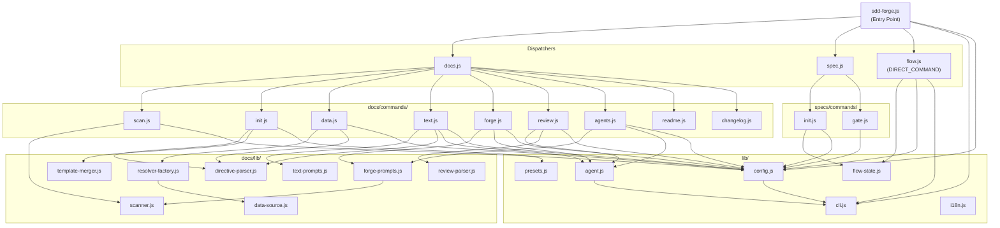

# 04. Internal Design

## Overview

<!-- {{text: Describe the purpose of this chapter in 1–2 sentences. Cover the project structure, module dependency direction, and key processing flows.}} -->

This chapter describes the internal architecture of sdd-forge, covering the directory layout, module responsibilities, dependency direction across the three-layer dispatch structure, and the end-to-end processing flows for representative commands.
<!-- {{/text}} -->

## Contents

### Project Structure

<!-- {{text: Describe the directory structure of this project in a tree-format code block. Include role comments for major directories and files. Cover the dispatchers directly under src/ (sdd-forge.js, docs.js, spec.js, flow.js), docs/commands/ (subcommand implementations), docs/lib/ (document generation library), lib/ (shared utilities), presets/ (preset definitions), and templates/ (bundled templates).}} -->

```
sdd-forge/
├── package.json                        ← Package manifest; bin entry points to src/sdd-forge.js
├── src/
│   ├── sdd-forge.js                    ← Top-level CLI entry point; routes to docs.js / spec.js / flow.js
│   ├── docs.js                         ← Dispatcher for all docs subcommands (build, scan, init, data, text, …)
│   ├── spec.js                         ← Dispatcher for spec subcommands (spec, gate)
│   ├── flow.js                         ← DIRECT_COMMAND: SDD flow automation (no sub-routing)
│   ├── presets-cmd.js                  ← DIRECT_COMMAND: presets listing/inspection
│   ├── help.js                         ← Help text display
│   ├── docs/
│   │   ├── commands/                   ← One file per docs subcommand implementation
│   │   │   ├── scan.js                 ← Source analysis → analysis.json + summary.json
│   │   │   ├── init.js                 ← Initialize docs/ from preset templates
│   │   │   ├── data.js                 ← Resolve {{data}} directives
│   │   │   ├── text.js                 ← Resolve {{text}} directives via AI agent
│   │   │   ├── readme.js               ← Generate README.md
│   │   │   ├── forge.js                ← Iterative docs improvement
│   │   │   ├── review.js               ← Docs quality check
│   │   │   ├── agents.js               ← Update AGENTS.md
│   │   │   ├── changelog.js            ← Generate change_log.md from specs/
│   │   │   ├── setup.js                ← Project registration + config generation
│   │   │   └── …                       ← upgrade, translate, default-project, etc.
│   │   └── lib/                        ← Document generation library (shared by commands)
│   │       ├── scanner.js              ← File discovery and PHP/JS/YAML parsing utilities
│   │       ├── directive-parser.js     ← Parse {{data}}, {{text}}, @block, @extends directives
│   │       ├── template-merger.js      ← Resolve @extends / @block template inheritance
│   │       ├── data-source.js          ← DataSource base class
│   │       ├── data-source-loader.js   ← Dynamic per-preset DataSource loading
│   │       ├── resolver-factory.js     ← createResolver() factory used by data command
│   │       ├── forge-prompts.js        ← Prompt builders for forge / agents; summaryToText()
│   │       ├── text-prompts.js         ← Prompt builders for text command
│   │       ├── review-parser.js        ← Parse structured review command output
│   │       ├── scan-source.js          ← Scan configuration loader
│   │       ├── concurrency.js          ← Parallel file processing utility
│   │       ├── command-context.js      ← resolveCommandContext() and related helpers
│   │       └── php-array-parser.js     ← PHP array syntax parser
│   ├── specs/
│   │   └── commands/
│   │       ├── init.js                 ← Create a new spec (branch + spec.md)
│   │       └── gate.js                 ← Spec gate check (pre / post phase)
│   ├── lib/                            ← Shared utilities used across all layers
│   │   ├── agent.js                    ← AI agent invocation (sync + async)
│   │   ├── cli.js                      ← CLI parser, path resolution, PKG_DIR
│   │   ├── config.js                   ← Config loading, .sdd-forge/ path helpers
│   │   ├── flow-state.js               ← current-spec JSON state management
│   │   ├── presets.js                  ← Auto-discovery of src/presets/
│   │   ├── i18n.js                     ← Internationalisation utilities
│   │   ├── projects.js                 ← Multi-project registry helpers
│   │   ├── types.js                    ← TYPE_ALIASES and type resolution
│   │   └── …                           ← agents-md, entrypoint, process, progress
│   ├── presets/                        ← Preset definitions (auto-discovered via preset.json)
│   │   ├── base/                       ← Base preset; doc templates for ja/ and en/
│   │   ├── webapp/                     ← webapp arch preset
│   │   │   ├── cakephp2/               ← CakePHP 2.x preset with PHP analyzers
│   │   │   ├── laravel/                ← Laravel preset
│   │   │   └── symfony/                ← Symfony preset
│   │   ├── cli/
│   │   │   └── node-cli/               ← Node.js CLI preset
│   │   └── library/                    ← Library arch preset
│   └── templates/                      ← Bundled doc/spec templates
│       ├── config.example.json
│       ├── review-checklist.md
│       └── skills/                     ← Claude skill templates (sdd-flow-start, sdd-flow-close)
├── docs/                               ← sdd-forge's own design docs (published to npm)
├── tests/                              ← Test files (*.test.js, Node built-in runner)
└── specs/                              ← Accumulated SDD spec files (020+ entries)
```
<!-- {{/text}} -->

### Module Overview

<!-- {{text: Describe the major modules in a table format. Include module name, file path, and responsibility. Cover the dispatcher layer (sdd-forge.js, docs.js, spec.js), command layer (docs/commands/*.js, specs/commands/*.js), library layer (lib/agent.js, lib/cli.js, lib/config.js, lib/flow-state.js, lib/presets.js, lib/i18n.js), and document generation layer (docs/lib/scanner.js, directive-parser.js, template-merger.js, forge-prompts.js, text-prompts.js, review-parser.js, data-source.js, resolver-factory.js).}} -->

**Dispatcher Layer**

| Module | Path | Responsibility |
|---|---|---|
| CLI entry point | `src/sdd-forge.js` | Parses the top-level subcommand, resolves project context via `SDD_SOURCE_ROOT` / `SDD_WORK_ROOT`, and delegates to the appropriate dispatcher or DIRECT_COMMAND |
| Docs dispatcher | `src/docs.js` | Routes all docs-related subcommands (`build`, `scan`, `init`, `data`, `text`, `readme`, `forge`, `review`, `agents`, `changelog`, `setup`, `upgrade`, `translate`) to their command modules |
| Spec dispatcher | `src/spec.js` | Routes `spec` and `gate` subcommands to their command modules |

**Command Layer**

| Module | Path | Responsibility |
|---|---|---|
| scan | `src/docs/commands/scan.js` | Analyses source files and writes `analysis.json` + `summary.json` to `.sdd-forge/output/` |
| init | `src/docs/commands/init.js` | Initialises the `docs/` directory from preset templates via `@extends` / `@block` inheritance |
| data | `src/docs/commands/data.js` | Resolves all `{{data: …}}` directives in docs using `createResolver()` |
| text | `src/docs/commands/text.js` | Resolves all `{{text: …}}` directives by calling an AI agent with generated prompts |
| readme | `src/docs/commands/readme.js` | Generates `README.md` from docs content and project metadata |
| forge | `src/docs/commands/forge.js` | Runs iterative AI-driven docs improvement against the current analysis data |
| review | `src/docs/commands/review.js` | Runs the docs quality check and parses structured pass/fail results |
| agents | `src/docs/commands/agents.js` | Rebuilds the `<!-- SDD -->` and `<!-- PROJECT -->` sections of `AGENTS.md` |
| changelog | `src/docs/commands/changelog.js` | Aggregates `specs/` entries into `change_log.md` |
| spec init | `src/specs/commands/init.js` | Creates a feature branch and initialises a new `spec.md` |
| gate | `src/specs/commands/gate.js` | Validates a spec against pre- or post-implementation checklists |
| flow | `src/flow.js` | DIRECT_COMMAND: orchestrates the full SDD flow (spec → gate → implement → forge → review) |

**Library Layer**

| Module | Path | Responsibility |
|---|---|---|
| agent | `src/lib/agent.js` | Invokes AI agents synchronously (`callAgent`) or asynchronously (`callAgentAsync`) with prompt injection and timeout management |
| cli | `src/lib/cli.js` | Provides `parseArgs()`, `PKG_DIR`, `repoRoot()`, `sourceRoot()`, `isInsideWorktree()`, and timestamp formatting |
| config | `src/lib/config.js` | Loads and validates `.sdd-forge/config.json`; exposes all `.sdd-forge/` path helpers and `resolveProjectContext()` |
| flow-state | `src/lib/flow-state.js` | Reads, writes, and clears `.sdd-forge/current-spec` JSON for SDD flow state tracking |
| presets | `src/lib/presets.js` | Auto-discovers `preset.json` files under `src/presets/` and exposes the `PRESETS` constant |
| i18n | `src/lib/i18n.js` | Loads locale strings and provides translation helpers used by CLI output and templates |

**Document Generation Layer**

| Module | Path | Responsibility |
|---|---|---|
| scanner | `src/docs/lib/scanner.js` | File-system traversal, PHP/JS/YAML parsing, and `genericScan` for extracting controllers, models, routes, and shells |
| directive-parser | `src/docs/lib/directive-parser.js` | Tokenises Markdown files into `{{data}}`, `{{text}}`, `@block`, and `@extends` directive segments |
| template-merger | `src/docs/lib/template-merger.js` | Resolves `@extends` / `@block` inheritance chains to produce final template content |
| forge-prompts | `src/docs/lib/forge-prompts.js` | Builds prompts for `forge` and `agents` commands; provides `summaryToText()` for converting analysis JSON to readable text |
| text-prompts | `src/docs/lib/text-prompts.js` | Builds per-directive prompts for the `text` command |
| review-parser | `src/docs/lib/review-parser.js` | Parses structured PASS / FAIL output from the review AI agent |
| data-source | `src/docs/lib/data-source.js` | Base class defining the interface that all preset-specific DataSource implementations must follow |
| resolver-factory | `src/docs/lib/resolver-factory.js` | `createResolver()` factory that wires the correct DataSource to the `data` command based on project type |
<!-- {{/text}} -->

### Module Dependencies

<!-- {{text: Generate a mermaid graph showing the dependencies between modules. Reflect the three-layer dispatch structure and show the dependency direction from dispatcher → command → library. Output only the mermaid code block.}} -->


<!-- {{/text}} -->

### Key Processing Flows

<!-- {{text: Explain the inter-module data and control flow when a representative command (build or forge) is executed, using numbered steps. Include the flow from entry point → dispatch → config loading → analysis data preparation → AI call → file writing.}} -->

**`sdd-forge build` — full pipeline execution**

1. **Entry point** — `sdd-forge.js` receives the `build` subcommand, resolves project context (`--project` flag or `.sdd-forge/projects.json` default), sets `SDD_SOURCE_ROOT` and `SDD_WORK_ROOT` environment variables, and delegates to `docs.js`.
2. **Dispatch** — `docs.js` maps `build` to the sequential pipeline: `scan → init → data → text → readme → agents → [translate]`, invoking each command module in order.
3. **Config loading** — each command calls `loadConfig(root)` in `src/lib/config.js` to read `.sdd-forge/config.json`, obtaining the project type, output languages, AI agent settings, and concurrency limits.
4. **Source analysis (`scan`)** — `scan.js` calls utilities in `docs/lib/scanner.js` to traverse the source tree, parse PHP/JS/YAML files, and write `.sdd-forge/output/analysis.json` (full) and `summary.json` (lightweight AI-friendly version).
5. **Template initialisation (`init`)** — `init.js` uses `directive-parser.js` to locate `@extends` / `@block` directives in preset templates and `template-merger.js` to produce final Markdown skeletons under `docs/`.
6. **Data resolution (`data`)** — `data.js` calls `createResolver()` from `resolver-factory.js`, which selects the appropriate `DataSource` for the project type. Each `{{data: …}}` directive in docs is replaced with structured content derived from `analysis.json`.
7. **AI text generation (`text`)** — `text.js` reads each `{{text: …}}` directive, builds a prompt via `text-prompts.js` (incorporating `summary.json` content and project context), and calls `callAgentAsync()` in `lib/agent.js` to stream the AI response. Results are written back into the docs Markdown files.
8. **Artefact finalisation** — `readme.js` assembles `README.md` from docs content; `agents.js` regenerates `AGENTS.md` sections; `translate.js` (when multiple output languages are configured) produces translated copies.

**`sdd-forge forge` — iterative docs improvement**

1. **Entry point → dispatch** — same as above through step 2; `docs.js` delegates directly to `forge.js`.
2. **Config and analysis loading** — `forge.js` calls `loadConfig()` and then `summaryToText()` from `forge-prompts.js`, which reads `.sdd-forge/output/summary.json` (falling back to `analysis.json`) and converts it to a human-readable text block.
3. **Prompt construction** — `forge-prompts.js` combines the summary text, the current docs content, the `--prompt` argument provided by the caller, and any `documentStyle` settings from config into a single improvement prompt.
4. **AI call** — `callAgentAsync()` in `lib/agent.js` spawns the configured AI agent process with `stdin: "ignore"`, injects the prompt via the `{{PROMPT}}` placeholder (or appends it), and streams output back through a callback.
5. **File writing** — `forge.js` receives the AI response and writes the updated content directly to the relevant docs Markdown files, leaving any content outside `{{text}}` / `{{data}}` directive blocks untouched.
6. **Quality check** — after `forge`, the pipeline (or the user) runs `sdd-forge review`, which calls the AI agent again with the review checklist, and `review-parser.js` parses the structured PASS / FAIL result to determine whether another forge iteration is needed.
<!-- {{/text}} -->

### Extension Points

<!-- {{text: Explain where changes are needed and the extension patterns when adding new commands or features. Cover each of the following with steps: (1) adding a new docs subcommand, (2) adding a new spec subcommand, (3) adding a new preset, (4) adding a new DataSource ({{data}} resolver), and (5) adding a new AI prompt.}} -->

**(1) Adding a new docs subcommand**

1. Create `src/docs/commands/<name>.js` and export a `main(argv, env)` function (or call `main()` at the bottom for direct-run scripts).
2. Open `src/docs.js` and add a `case '<name>':` branch in the dispatcher switch that imports and calls the new command module.
3. Add the subcommand to the help text in `src/help.js` so it appears in `sdd-forge help`.
4. If the command should run as part of the `build` pipeline, insert it at the appropriate position in the pipeline sequence inside `docs/commands/build.js` (or the inline build logic in `docs.js`).

**(2) Adding a new spec subcommand**

1. Create `src/specs/commands/<name>.js` with a `main()` function.
2. Open `src/spec.js` and add the routing case pointing to the new module.
3. Update `src/help.js` with the new subcommand description.
4. If the command participates in SDD flow state, use `saveFlowState()` / `loadFlowState()` from `src/lib/flow-state.js`.

**(3) Adding a new preset**

1. Create a directory `src/presets/<arch>/<key>/` and add a `preset.json` describing the preset's `type`, `arch`, `isArch`, scan targets, and chapter structure.
2. Add Markdown templates under `src/presets/<arch>/<key>/templates/{ja,en}/`, using `@extends base` and `@block` directives to inherit and override the base layout.
3. If the preset requires custom source analysis, add an analyzer module and register it in the preset's resolver or in `docs/lib/scanner.js`.
4. `src/lib/presets.js` auto-discovers all `preset.json` files at startup — no manual registration in `PRESETS` is needed.
5. Add type aliases if desired in `src/lib/types.js` (`TYPE_ALIASES`).

**(4) Adding a new DataSource (`{{data}}` resolver)**

1. Create a new class in `src/docs/data/` (or inside the relevant preset directory) that extends `DataSource` from `src/docs/lib/data-source.js` and implements the required resolver methods.
2. Register the new DataSource in `src/docs/lib/data-source-loader.js` so it is returned for the matching project type.
3. `resolver-factory.js` calls `data-source-loader.js` to obtain the DataSource instance; the `data` command will then invoke your resolver when it encounters a matching `{{data: yourNamespace("…")}}` directive.
4. Add tests in `tests/docs/lib/` covering the new resolver's output format.

**(5) Adding a new AI prompt**

1. Identify whether the prompt belongs to the `forge`/`agents` flow (→ `src/docs/lib/forge-prompts.js`) or the `text` directive resolution flow (→ `src/docs/lib/text-prompts.js`).
2. Add an exported builder function (e.g., `buildMyFeaturePrompt(context)`) in the appropriate prompts file, constructing the prompt string from analysis data, config settings, and any caller-supplied arguments.
3. Import and call the new builder in the relevant command module (`forge.js`, `agents.js`, or `text.js`), then pass the result to `callAgent()` or `callAgentAsync()` in `src/lib/agent.js`.
4. If the prompt requires a custom system prompt, set `systemPromptFlag` in the agent config or pass a `--system-prompt-file` argument as documented in `agent.js`.
<!-- {{/text}} -->
