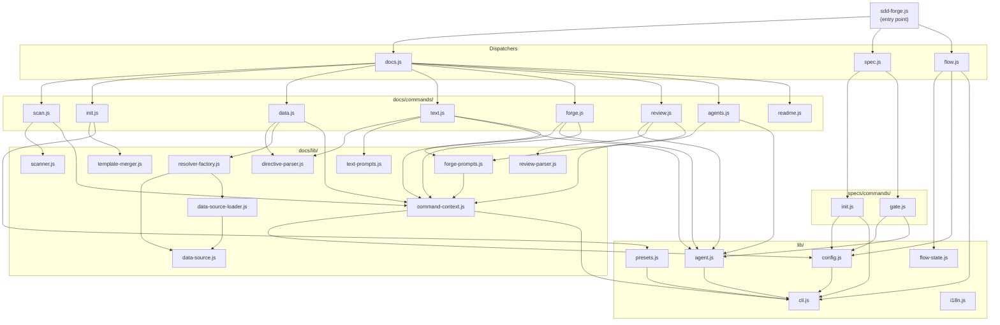

# 04. Internal Design

## Overview

<!-- {{text: Describe the purpose of this chapter in 1–2 sentences. Cover the project structure, module dependency direction, and key processing flows.}} -->

This chapter describes the internal architecture of sdd-forge, covering the directory layout, module responsibilities, and dependency direction from the dispatcher layer down through command implementations and shared libraries. It also documents the key processing flows for representative commands so that contributors can locate and extend the codebase with confidence.
<!-- {{/text}} -->

## Contents

### Project Structure

<!-- {{text: Describe the directory structure of this project in a tree-format code block. Include role comments for major directories and files. Cover the dispatchers directly under src/ (sdd-forge.js, docs.js, spec.js, flow.js), docs/commands/ (subcommand implementations), docs/lib/ (document generation library), lib/ (shared utilities), presets/ (preset definitions), and templates/ (bundled templates).}} -->

```
src/
├── sdd-forge.js              # Top-level CLI entry point — resolves project context and routes to dispatchers
├── docs.js                   # Dispatcher for all docs-related subcommands (build, scan, init, data, text, …)
├── spec.js                   # Dispatcher for spec-related subcommands (spec, gate)
├── flow.js                   # SDD flow automation — DIRECT_COMMAND, no sub-routing
├── presets-cmd.js            # presets subcommand — DIRECT_COMMAND
├── help.js                   # Prints the command reference to stdout
├── docs/
│   ├── commands/             # One file per docs subcommand (scan, init, data, text, readme, forge,
│   │                         # review, agents, changelog, setup, snapshot, upgrade, translate, …)
│   └── lib/                  # Document-generation library shared across commands
│       ├── scanner.js        # File discovery and PHP/JS/YAML parsing utilities
│       ├── directive-parser.js  # Parses {{data}}, {{text}}, @block, @extends directives
│       ├── template-merger.js   # Resolves @extends / @block template inheritance
│       ├── data-source.js    # DataSource base class (toMarkdownTable, toRows, desc, …)
│       ├── data-source-loader.js # Dynamically loads preset-specific DataSource implementations
│       ├── resolver-factory.js  # createResolver() factory used by the data command
│       ├── forge-prompts.js  # Prompt builders for forge / agents; exports summaryToText()
│       ├── text-prompts.js   # Prompt builders for the text command
│       ├── review-parser.js  # Parses structured output from the review command
│       ├── scan-source.js    # Loads scan configuration for a project
│       ├── concurrency.js    # Parallel file-processing utilities
│       ├── command-context.js   # Resolves command execution context; exports loadAnalysis()
│       ├── php-array-parser.js  # Parses PHP array syntax
│       └── test-env-detection.js # Detects test framework from analysis.json
├── specs/
│   └── commands/             # Subcommand implementations for spec-related operations
│       ├── init.js           # Creates a new spec (branch + spec.md scaffold)
│       └── gate.js           # Runs gate checks against a spec file
├── lib/                      # Shared utilities consumed across all layers
│   ├── agent.js              # AI agent invocation (callAgent, callAgentAsync, …)
│   ├── cli.js                # CLI parsing, path resolution (repoRoot, sourceRoot, PKG_DIR)
│   ├── config.js             # Config loading, path helpers, .sdd-forge/ file management
│   ├── flow-state.js         # Reads and writes .sdd-forge/current-spec (SDD flow state)
│   ├── presets.js            # Auto-discovers preset.json files under src/presets/
│   ├── i18n.js               # Loads locale messages from src/locale/
│   ├── projects.js           # Multi-project registration helpers
│   ├── process.js            # Child-process utilities
│   ├── types.js              # TYPE_ALIASES and type resolution
│   └── agents-md.js          # AGENTS.md section injection logic
├── presets/                  # Built-in preset definitions
│   ├── base/                 # Base preset — docs templates (ja/en) + AGENTS.sdd.md
│   ├── webapp/               # Architecture-layer preset for web applications
│   ├── cli/                  # Architecture-layer preset for CLI tools
│   ├── library/              # Architecture-layer preset for libraries
│   ├── node-cli/             # Framework preset for Node.js CLI projects
│   ├── cakephp2/             # Framework preset for CakePHP 2.x
│   ├── laravel/              # Framework preset for Laravel
│   └── symfony/              # Framework preset for Symfony
├── locale/
│   ├── ja/                   # Japanese UI strings (messages.json, prompts.json, ui.json)
│   └── en/                   # English UI strings
└── templates/                # Bundled non-doc templates
    ├── config.example.json
    ├── review-checklist.md
    └── skills/               # Skill definitions (sdd-flow-start, sdd-flow-close, …)
```
<!-- {{/text}} -->

### Module Overview

<!-- {{text: Describe the major modules in a table format. Include module name, file path, and responsibility. Cover the dispatcher layer (sdd-forge.js, docs.js, spec.js), command layer (docs/commands/*.js, specs/commands/*.js), library layer (lib/agent.js, lib/cli.js, lib/config.js, lib/flow-state.js, lib/presets.js, lib/i18n.js), and document generation layer (docs/lib/scanner.js, directive-parser.js, template-merger.js, forge-prompts.js, text-prompts.js, review-parser.js, data-source.js, resolver-factory.js).}} -->

**Dispatcher layer**

| Module | File | Responsibility |
|---|---|---|
| CLI entry point | `src/sdd-forge.js` | Parses the first positional argument, resolves project context via `SDD_SOURCE_ROOT` / `SDD_WORK_ROOT`, and delegates to the appropriate dispatcher or DIRECT_COMMAND module. |
| Docs dispatcher | `src/docs.js` | Maps docs-related subcommand strings (`build`, `scan`, `init`, `data`, `text`, `readme`, `forge`, `review`, `agents`, `changelog`, `snapshot`, `upgrade`, `translate`, `setup`, `default`) to their implementation files under `docs/commands/`. |
| Spec dispatcher | `src/spec.js` | Maps spec-related subcommand strings (`spec`, `gate`) to their implementation files under `specs/commands/`. |

**Command layer**

| Module | File | Responsibility |
|---|---|---|
| scan | `src/docs/commands/scan.js` | Walks the source tree, invokes language-specific analyzers, and writes `analysis.json` and `summary.json` to `.sdd-forge/output/`. |
| init | `src/docs/commands/init.js` | Renders docs templates from the active preset and writes the initial `docs/` file set. |
| data | `src/docs/commands/data.js` | Resolves `{{data}}` directives in docs files by calling `createResolver()` with the current analysis data. |
| text | `src/docs/commands/text.js` | Resolves `{{text}}` directives by generating AI prompts and invoking the configured agent. |
| forge | `src/docs/commands/forge.js` | Runs iterative docs improvement cycles: loads analysis, builds prompts via `forge-prompts.js`, calls the agent, and writes results back. |
| review | `src/docs/commands/review.js` | Calls the agent to quality-check generated docs and parses the structured result via `review-parser.js`. |
| agents | `src/docs/commands/agents.js` | Injects or updates the `<!-- SDD:START/END -->` and `<!-- PROJECT:START/END -->` sections in `AGENTS.md`. |
| spec init | `src/specs/commands/init.js` | Scaffolds a new spec directory with `spec.md`, optionally creates a feature branch. |
| gate | `src/specs/commands/gate.js` | Validates a `spec.md` against all gate-check criteria (pre or post phase) and reports PASS / FAIL. |

**Library layer**

| Module | File | Responsibility |
|---|---|---|
| agent | `src/lib/agent.js` | Wraps AI agent invocation (`callAgent` synchronous, `callAgentAsync` streaming). Handles `{{PROMPT}}` injection, system-prompt flags, and Claude CLI hang prevention. |
| cli | `src/lib/cli.js` | Provides `parseArgs`, path resolvers (`repoRoot`, `sourceRoot`), `PKG_DIR`, and `isInsideWorktree`. |
| config | `src/lib/config.js` | Loads and validates `.sdd-forge/config.json`; provides path helpers for all `.sdd-forge/` files. |
| flow-state | `src/lib/flow-state.js` | Persists and retrieves SDD flow progress in `.sdd-forge/current-spec`. |
| presets | `src/lib/presets.js` | Auto-discovers `preset.json` files under `src/presets/`; exposes `PRESETS`, `presetsForArch`, and `presetByLeaf`. |
| i18n | `src/lib/i18n.js` | Loads locale message bundles from `src/locale/` and resolves message keys with optional interpolation. |

**Document-generation layer**

| Module | File | Responsibility |
|---|---|---|
| scanner | `src/docs/lib/scanner.js` | File discovery, PHP/JS/YAML parsing primitives, and `genericScan` for preset-driven category scanning. |
| directive-parser | `src/docs/lib/directive-parser.js` | Tokenizes docs files into directive segments (`{{data}}`, `{{text}}`, `@block`, `@extends`) and plain text. |
| template-merger | `src/docs/lib/template-merger.js` | Resolves `@extends` / `@block` template inheritance chains to produce a flat merged template. |
| forge-prompts | `src/docs/lib/forge-prompts.js` | Builds structured prompts for the `forge` and `agents` commands; exports `summaryToText()`. |
| text-prompts | `src/docs/lib/text-prompts.js` | Builds per-directive prompts for the `text` command. |
| review-parser | `src/docs/lib/review-parser.js` | Parses the agent's structured review output into a machine-readable result object. |
| data-source | `src/docs/lib/data-source.js` | Base class for all DataSource implementations; provides `toMarkdownTable`, `toRows`, and `desc`. |
| resolver-factory | `src/docs/lib/resolver-factory.js` | `createResolver()` factory — loads the correct DataSource for the active preset and returns a resolver function consumed by the `data` command. |
<!-- {{/text}} -->

### Module Dependencies

<!-- {{text: Generate a mermaid graph showing the dependencies between modules. Reflect the three-layer dispatch structure and show the dependency direction from dispatcher → command → library. Output only the mermaid code block.}} -->


<!-- {{/text}} -->

### Key Processing Flows

<!-- {{text: Explain the inter-module data and control flow when a representative command (build or forge) is executed, using numbered steps. Include the flow from entry point → dispatch → config loading → analysis data preparation → AI call → file writing.}} -->

**`sdd-forge build` flow**

1. **Entry point** — `sdd-forge.js` receives the `build` argument, resolves the project context (reads `.sdd-forge/projects.json` or uses the `--project` flag), sets `SDD_SOURCE_ROOT` and `SDD_WORK_ROOT`, and delegates to `docs.js`.
2. **Dispatch** — `docs.js` maps `build` to the build pipeline and runs the following subcommands in sequence: `scan → init → data → text → readme → agents → [translate]`.
3. **scan** — `docs/commands/scan.js` calls `command-context.js` to load config and resolve paths. It invokes `scanner.js` to walk the source tree and the preset-specific analyzers. Results are serialised as `analysis.json` (full) and `summary.json` (lightweight) in `.sdd-forge/output/`.
4. **init** — `docs/commands/init.js` loads the active preset via `presets.js`, resolves template inheritance with `template-merger.js`, and writes the initial `docs/*.md` files if they do not already exist.
5. **data** — `docs/commands/data.js` reads each `docs/*.md` file, tokenises `{{data}}` directives with `directive-parser.js`, then calls `createResolver()` from `resolver-factory.js`. The resolver loads the appropriate `DataSource` subclass (via `data-source-loader.js`), feeds it the analysis JSON, and replaces each directive block with rendered markdown tables or lists.
6. **text** — `docs/commands/text.js` processes `{{text}}` directives. For each directive, `text-prompts.js` constructs a prompt containing the instruction, the surrounding document context, and the condensed analysis from `summaryToText()` (in `forge-prompts.js`). The prompt is passed to the configured AI agent via `agent.js` (`callAgentAsync`). The returned text is inserted into the document.
7. **readme** — `docs/commands/readme.js` assembles a `README.md` from the completed docs files using configurable section mappings.
8. **agents** — `docs/commands/agents.js` refreshes the `<!-- SDD:START/END -->` section of `AGENTS.md` from the base preset template and calls the AI agent (via `forge-prompts.js` + `agent.js`) to update the `<!-- PROJECT:START/END -->` section with project-specific context derived from `summary.json`.

**`sdd-forge forge` flow**

1. **Entry point** — `sdd-forge.js` routes to `docs.js`, which delegates to `docs/commands/forge.js`.
2. **Context & config loading** — `forge.js` calls `resolveCommandContext()` from `command-context.js`, which loads `.sdd-forge/config.json` (via `config.js`) and resolves the paths for `docs/` and the output directory.
3. **Analysis preparation** — `command-context.js` calls `loadAnalysis()`, which prefers `summary.json` over `analysis.json`. The JSON is passed to `summaryToText()` in `forge-prompts.js` to produce a compact text representation suitable for inclusion in an AI prompt.
4. **Prompt construction** — `forge-prompts.js` combines the condensed analysis, the full content of the target docs file, the `--prompt` argument supplied by the user, and any `documentStyle` settings from config.
5. **AI call** — The assembled prompt is sent to the configured agent via `agent.js` (`callAgentAsync`). Streaming output is collected and written back to the docs file on completion.
6. **Review gate** — After writing, `sdd-forge review` is typically run next: `docs/commands/review.js` calls the agent with a review-specific prompt and parses the structured PASS / FAIL result via `review-parser.js`. If the result is FAIL, the forge–review cycle repeats.
<!-- {{/text}} -->

### Extension Points

<!-- {{text: Explain where changes are needed and the extension patterns when adding new commands or features. Cover each of the following with steps: (1) adding a new docs subcommand, (2) adding a new spec subcommand, (3) adding a new preset, (4) adding a new DataSource ({{data}} resolver), and (5) adding a new AI prompt.}} -->

**(1) Adding a new docs subcommand**

1. Create `src/docs/commands/<name>.js`. Export a `main()` function (or call it at the bottom of the file following the existing conventions).
2. Open `src/docs.js` and add a new case to the subcommand routing map, pointing to your new file.
3. If the command requires a project context (source root, config, analysis), call `resolveCommandContext()` from `src/docs/lib/command-context.js` near the top of `main()`.
4. Add the command name and a one-line description to `src/help.js` so it appears in `sdd-forge help`.
5. Write a test file under `tests/docs/commands/<name>.test.js`.

**(2) Adding a new spec subcommand**

1. Create `src/specs/commands/<name>.js` with a `main()` entry point.
2. Open `src/spec.js` and register the new subcommand name in the routing map.
3. Load config with `loadConfig()` from `src/lib/config.js` and resolve paths with helpers from `src/lib/cli.js`.
4. Add the command to `src/help.js`.
5. Write tests under `tests/specs/commands/<name>.test.js`.

**(3) Adding a new preset**

1. Create `src/presets/<key>/preset.json`. Set `type`, `arch`, and the `chapters` array that defines which template files make up the docs for this preset.
2. Add template files under `src/presets/<key>/templates/<lang>/` (at minimum `en/`).
3. If the preset needs custom source-code scanning, add an analyzer module and reference it from `preset.json` under the `scan` key.
4. If the preset needs a custom `DataSource` for `{{data}}` directives, follow extension point (4) below.
5. `src/lib/presets.js` auto-discovers all `preset.json` files — no manual registration is needed.

**(4) Adding a new DataSource (`{{data}}` resolver)**

1. Create a new class that extends `DataSource` from `src/docs/lib/data-source.js`. Implement `toRows()` (returns structured data from `analysis.json`) and optionally `toMarkdownTable()` or `desc()`.
2. Place the file under `src/docs/data/<name>.js` (for generic resolvers) or inside the preset directory for preset-specific ones.
3. Register the resolver key in `src/docs/lib/data-source-loader.js` so that `createResolver()` can find it.
4. Reference the resolver key in the relevant `{{data: <key>("<args>")}}` directive inside docs template files.

**(5) Adding a new AI prompt**

1. Decide which command the prompt belongs to. For `forge`/`agents`, add a new builder function in `src/docs/lib/forge-prompts.js`. For `text`, add it in `src/docs/lib/text-prompts.js`. For a new command, create a dedicated `<name>-prompts.js` file in `src/docs/lib/`.
2. Accept the analysis text (from `summaryToText()`), any relevant doc content, and command-specific parameters as function arguments.
3. Return a plain string prompt. Keep the prompt deterministic — avoid hardcoding language strings that should come from the `i18n` layer.
4. Call the new builder from the command implementation and pass the result to `callAgentAsync()` in `src/lib/agent.js`.
<!-- {{/text}} -->
