# 04. 内部設計

## 説明

<!-- @text: この章の概要を1〜2文で記述してください。プロジェクト構成・モジュール依存の方向・主要な処理フローを踏まえること。 -->

本章では sdd-forge の内部構造を解説します。エントリポイント `sdd-forge.js` からサブシステムディスパッチャ（`docs.js` / `spec.js` / `flow.js`）、さらに `commands/` 配下の個別コマンドへと三層構造で委譲が行われ、`src/lib/` の共有ユーティリティが各層から横断的に利用されます。


## 内容

### プロジェクト構成

<!-- @text: このプロジェクトのディレクトリ構成を tree 形式のコードブロックで記述してください。主要ディレクトリ・ファイルの役割コメントを含めること。 -->

以下がディレクトリ構成のマークダウンテキストです。

```
sdd-forge/
├── package.json                        ← npm パッケージ定義・bin エントリポイント指定
├── src/
│   ├── sdd-forge.js                    ← CLI エントリポイント・サブコマンドディスパッチャ
│   ├── docs.js                         ← docs 系サブコマンドのディスパッチャ
│   ├── spec.js                         ← spec 系サブコマンドのディスパッチャ
│   ├── flow.js                         ← SDD フロー自動実行（直接コマンド）
│   ├── help.js                         ← コマンド一覧表示
│   ├── lib/                            ← 共有ユーティリティ群
│   │   ├── cli.js                      ← プロジェクトコンテキスト解決・引数パース
│   │   ├── config.js                   ← 設定ファイルの読み書き・検証
│   │   ├── agent.js                    ← AI エージェント呼び出し
│   │   ├── projects.js                 ← projects.json の CRUD 操作
│   │   ├── flow-state.js               ← フロー状態の永続化（current-spec）
│   │   ├── process.js                  ← 子プロセス同期実行ラッパー
│   │   ├── i18n.js                     ← 国際化・メッセージ翻訳
│   │   └── types.js                    ← JSDoc 型定義・バリデーション関数
│   ├── docs/
│   │   ├── commands/                   ← docs 系コマンド実装
│   │   │   ├── scan.js                 ← ソースコード解析 → analysis.json 生成
│   │   │   ├── init.js                 ← テンプレートから docs/ を初期化
│   │   │   ├── data.js                 ← @data ディレクティブを解析データで置換
│   │   │   ├── text.js                 ← @text ディレクティブを AI 生成テキストで置換
│   │   │   ├── forge.js                ← data/text/review を反復実行してドキュメント改善
│   │   │   ├── review.js               ← docs/ の構造・品質チェック
│   │   │   ├── readme.js               ← docs/ から README.md を生成
│   │   │   ├── changelog.js            ← specs/ から change_log.md を生成
│   │   │   ├── agents.js               ← AGENTS.md の PROJECT セクションを更新
│   │   │   ├── setup.js                ← 対話型ウィザードでプロジェクト登録
│   │   │   └── default-project.js      ← デフォルトプロジェクトの表示・変更
│   │   ├── lib/                        ← docs 処理の共有ライブラリ
│   │   │   ├── scanner.js              ← 汎用ソースコード解析器
│   │   │   ├── directive-parser.js     ← @data/@text/@block 等のディレクティブ解析
│   │   │   ├── template-merger.js      ← テンプレート継承チェーンのマージ処理
│   │   │   ├── renderers.js            ← 解析データを Markdown 形式に変換
│   │   │   ├── resolver-factory.js     ← FW 固有カテゴリを合成したリゾルバ生成
│   │   │   ├── resolver-base.js        ← FW 非依存のデータ変換マッピング定義
│   │   │   └── php-array-parser.js     ← PHP 配列・コメント抽出ユーティリティ
│   │   └── presets/webapp/             ← フレームワーク固有プリセット
│   │       ├── cakephp2/               ← CakePHP 2.x 向けスキャナ・リゾルバ・解析器
│   │       ├── laravel/                ← Laravel 8+ 向けスキャナ・リゾルバ・解析器
│   │       └── symfony/                ← Symfony 5+ 向けスキャナ・リゾルバ・解析器
│   ├── specs/
│   │   └── commands/
│   │       ├── init.js                 ← feature ブランチ作成・spec.md 初期化
│   │       └── gate.js                 ← spec ゲートチェック（PASS/FAIL 判定）
│   └── templates/                      ← ドキュメントテンプレート群
│       ├── locale/ja/                  ← 日本語テンプレート
│       │   ├── base/                   ← 全プロジェクト共通ベーステンプレート
│       │   ├── webapp/                 ← Web アプリ向け追加テンプレート
│       │   ├── cli/node-cli/           ← Node.js CLI 向け追加テンプレート
│       │   └── library/               ← ライブラリ向け追加テンプレート
│       ├── locale/en/                  ← 英語テンプレート
│       ├── skills/                     ← Claude Code スキル定義（sdd-flow-start/close）
│       └── config.example.json         ← 設定ファイルのサンプル
├── specs/                              ← SDD スペックファイル管理ディレクトリ
├── docs/                               ← プロジェクト自身のドキュメント（自動生成）
└── tests/                              ← テストスクリプト
```


### モジュール構成

<!-- @text: 全モジュールの一覧を表形式で記述してください。モジュール名・ファイルパス・責務を含めること。 -->

| モジュール名 | ファイルパス | 責務 |
|---|---|---|
| sdd-forge (エントリポイント) | `src/sdd-forge.js` | トップレベルの CLI ディスパッチャ。サブコマンドを `docs.js` / `spec.js` / `flow.js` / `help.js` へ振り分け、環境変数からプロジェクトコンテキストを解決します。 |
| docs ディスパッチャ | `src/docs.js` | docs 関連サブコマンド（scan / init / data / text / readme / forge / review 等）を `docs/commands/` 配下のスクリプトへ委譲します。 |
| spec ディスパッチャ | `src/spec.js` | spec 関連サブコマンド（spec / gate）を `specs/commands/` 配下のスクリプトへ委譲します。 |
| flow (直接コマンド) | `src/flow.js` | SDD フローを自動実行します。spec 作成・gate チェック・forge 実行を順に呼び出します。 |
| help | `src/help.js` | 全コマンドの一覧と使い方を表示します。 |
| CLI ユーティリティ | `src/lib/cli.js` | `repoRoot()` / `parseArgs()` / `isInsideWorktree()` を提供し、全エントリポイントが共有するプロジェクトコンテキスト解決を担います。 |
| 設定管理 | `src/lib/config.js` | JSON ファイルの読み書き・SDD 設定の検証と永続化（`loadConfig()` / `saveContext()` 等）を行います。 |
| プロセス実行 | `src/lib/process.js` | 子プロセスを同期実行する `runSync()` ラッパーを提供します。 |
| AI エージェント呼び出し | `src/lib/agent.js` | 設定済み AI エージェントにプロンプトを渡して実行し、プロンプト変数置換と環境クリーンアップを処理します。 |
| 型定義 | `src/lib/types.js` | 設定・コンテキスト・プロジェクト等の JSDoc 型定義とバリデーション関数を提供します。 |
| プロジェクト管理 | `src/lib/projects.js` | `projects.json` の CRUD 操作（追加・削除・デフォルト設定）とワークルート解決を担います。 |
| 国際化 | `src/lib/i18n.js` | ロケール別メッセージファイルを読み込み、CLI メッセージの翻訳関数を提供します。 |
| フロー状態永続化 | `src/lib/flow-state.js` | `.sdd-forge/current-spec` の読み書きを行い、`sdd-flow-start` / `sdd-flow-close` 間でスペック状態を引き渡します。 |
| scan コマンド | `src/docs/commands/scan.js` | 汎用・FW 固有アナライザを実行してソースコードを解析し、`analysis.json` を生成します。 |
| init コマンド | `src/docs/commands/init.js` | テンプレート継承チェーンから `docs/` ディレクトリを初期化します。 |
| data コマンド | `src/docs/commands/data.js` | `analysis.json` を使用して `@data` ディレクティブをレンダリング済みデータで置換します。 |
| text コマンド | `src/docs/commands/text.js` | AI エージェントを呼び出して `@text` ディレクティブを生成テキストで置換します。 |
| forge コマンド | `src/docs/commands/forge.js` | data / text / review を反復ループで実行し、ドキュメントを品質基準に達するまで改善します。 |
| setup コマンド | `src/docs/commands/setup.js` | 対話型ウィザードでプロジェクトを登録し、`.sdd-forge/config.json` を生成します。 |
| review コマンド | `src/docs/commands/review.js` | `docs/NN_*.md` の構造を検証し、品質問題を報告します。 |
| readme コマンド | `src/docs/commands/readme.js` | `docs/` のチャプターファイルから `README.md` を生成します。MANUAL ブロックは保持します。 |
| changelog コマンド | `src/docs/commands/changelog.js` | `specs/` ディレクトリから `change_log.md` を生成します。 |
| agents コマンド | `src/docs/commands/agents.js` | `analysis.json` をもとに AI 生成サマリーで `AGENTS.md` の PROJECT セクションを更新します。 |
| default-project コマンド | `src/docs/commands/default-project.js` | デフォルトプロジェクトの表示・変更を行います。 |
| spec init コマンド | `src/specs/commands/init.js` | feature ブランチを作成し、`specs/NNN-slug/spec.md` と `qa.md` を初期化します。 |
| gate コマンド | `src/specs/commands/gate.js` | `spec.md` の未解決トークン・必須セクション・ユーザー承認状態を検証し、PASS / FAIL を返します。 |
| 汎用スキャナ | `src/docs/lib/scanner.js` | FW 非依存のソースコード解析器。ファイルパターンでクラス・メソッドを抽出します。 |
| ディレクティブパーサ | `src/docs/lib/directive-parser.js` | テンプレート内の `@data` / `@text` / `@block` / `@extends` / `@parent` ディレクティブを解析します。 |
| テンプレートマージャ | `src/docs/lib/template-merger.js` | ディレクトリ階層に基づくテンプレート継承を実装し、ベースからリーフへブロックをマージします。 |
| データレンダラ | `src/docs/lib/renderers.js` | 解析データを Markdown の table / kv / mermaid-er / bool-matrix 形式に変換します。 |
| ベースカテゴリ | `src/docs/lib/resolver-base.js` | FW 非依存のカテゴリ → `analysis.json` データ変換マッピングを定義します。 |
| リゾルバファクトリ | `src/docs/lib/resolver-factory.js` | ベースカテゴリと FW 固有カテゴリをマージしたリゾルバを生成します。 |
| PHP 配列パーサ | `src/docs/lib/php-array-parser.js` | CakePHP 2.x ソース向けの PHP 配列・文字列・コメント抽出ユーティリティです。 |
| CakePHP 2.x スキャナ | `src/docs/presets/webapp/cakephp2/scanner.js` | CakePHP のディレクトリ構造向けスキャンデフォルト値と `analyzeExtras()` を提供します。 |
| CakePHP 2.x リゾルバ | `src/docs/presets/webapp/cakephp2/resolver.js` | CakePHP 固有のデータ変換カテゴリを定義します。 |
| CakePHP コントローラ解析 | `src/docs/presets/webapp/cakephp2/analyze-controllers.js` | `app/Controller/` からコントローラ・コンポーネント・アクションを抽出します。 |
| CakePHP モデル解析 | `src/docs/presets/webapp/cakephp2/analyze-models.js` | `app/Model/` からテーブル名・リレーション・バリデーションを抽出します。 |
| CakePHP ルート解析 | `src/docs/presets/webapp/cakephp2/analyze-routes.js` | `app/Config/routes.php` の `Router::connect()` パターンからルートを抽出します。 |
| CakePHP シェル解析 | `src/docs/presets/webapp/cakephp2/analyze-shells.js` | `app/Console/Command/` からシェルクラスとメソッドを抽出します。 |
| CakePHP エクストラ解析 | `src/docs/presets/webapp/cakephp2/analyze-extras.js` | 定数・AppController / AppModel・ヘルパー・ライブラリ・SQL・レイアウト等を解析します。 |
| Laravel スキャナ | `src/docs/presets/webapp/laravel/scanner.js` | Laravel のディレクトリ構造向けスキャンデフォルト値と `analyzeExtras()` を提供します。 |
| Laravel リゾルバ | `src/docs/presets/webapp/laravel/resolver.js` | Laravel 固有のデータ変換カテゴリを定義します。 |
| Laravel コントローラ解析 | `src/docs/presets/webapp/laravel/analyze-controllers.js` | `app/Http/Controllers/` からコントローラ・メソッド・ミドルウェア・DI を抽出します。 |
| Laravel モデル解析 | `src/docs/presets/webapp/laravel/analyze-models.js` | `app/Models/` から Eloquent モデルのリレーション・キャスト・スコープ等を抽出します。 |
| Laravel ルート解析 | `src/docs/presets/webapp/laravel/analyze-routes.js` | `routes/web.php` および `routes/api.php` からルートを抽出します。 |
| Laravel マイグレーション解析 | `src/docs/presets/webapp/laravel/analyze-migrations.js` | `database/migrations/` からテーブル・カラム・インデックス・外部キーを抽出します。 |
| Laravel 設定解析 | `src/docs/presets/webapp/laravel/analyze-config.js` | `composer.json` / `.env.example` / `config/` / `app/Providers/` を解析します。 |
| Symfony スキャナ | `src/docs/presets/webapp/symfony/scanner.js` | Symfony のディレクトリ構造向けスキャンデフォルト値と `analyzeExtras()` を提供します。 |
| Symfony リゾルバ | `src/docs/presets/webapp/symfony/resolver.js` | Symfony 固有のデータ変換カテゴリを定義します。 |
| Symfony コントローラ解析 | `src/docs/presets/webapp/symfony/analyze-controllers.js` | `src/Controller/` から Route アトリビュート・メソッド・DI を抽出します。 |
| Symfony エンティティ解析 | `src/docs/presets/webapp/symfony/analyze-entities.js` | `src/Entity/` から Doctrine エンティティのテーブル名・カラム・リレーションを抽出します。 |
| Symfony ルート解析 | `src/docs/presets/webapp/symfony/analyze-routes.js` | `config/routes.yaml` および Controller Route アトリビュートからルートを抽出します。 |
| Symfony マイグレーション解析 | `src/docs/presets/webapp/symfony/analyze-migrations.js` | `migrations/` ディレクトリ内 Doctrine マイグレーションのテーブル操作を抽出します。 |
| Symfony 設定解析 | `src/docs/presets/webapp/symfony/analyze-config.js` | `composer.json` / `.env` / `config/packages/` / `src/Kernel.php` を解析します。 |


### モジュール依存関係

```mermaid
graph TD
    Entry["sdd-forge.js\n(エントリポイント)"]
    Docs["docs.js\n(ディスパッチャ)"]
    Spec["spec.js\n(ディスパッチャ)"]
    Flow["flow.js\n(直接コマンド)"]
    Help["help.js"]

    Entry --> Docs
    Entry --> Spec
    Entry --> Flow
    Entry --> Help
    Entry --> ProjLib["lib/projects.js"]

    subgraph docs_commands["docs/commands/"]
        Scan["scan.js"]
        InitDoc["init.js"]
        Data["data.js"]
        Text["text.js"]
        Readme["readme.js"]
        Forge["forge.js"]
        Review["review.js"]
        Setup["setup.js"]
        Changelog["changelog.js"]
        Agents["agents.js"]
    end

    subgraph spec_commands["specs/commands/"]
        SpecInit["init.js"]
        Gate["gate.js"]
    end

    subgraph docs_lib["docs/lib/"]
        Scanner["scanner.js"]
        ResolverFactory["resolver-factory.js"]
        DirectiveParser["directive-parser.js"]
        TemplateMerger["template-merger.js"]
        ResolverBase["resolver-base.js"]
    end

    subgraph shared_lib["lib/"]
        CLI["cli.js"]
        Config["config.js"]
        Types["types.js"]
        Agent["agent.js"]
        Process["process.js"]
        I18n["i18n.js"]
    end

    subgraph presets["docs/presets/webapp/"]
        FWResolver["&lt;fw&gt;/resolver.js"]
        FWScanner["&lt;fw&gt;/scanner.js"]
    end

    Docs --> Scan & InitDoc & Data & Text & Readme & Forge & Review & Setup & Changelog & Agents
    Spec --> SpecInit & Gate
    Flow --> CLI & Process

    Scan --> CLI & Config & Types & Scanner
    InitDoc --> CLI & Config & Types & Agent & TemplateMerger & DirectiveParser
    Data --> CLI & Config & Types & ResolverFactory & DirectiveParser
    Text --> CLI & Config
    Readme --> CLI & Config & Types & TemplateMerger
    Forge --> CLI & Config & Types & ResolverFactory
    Review --> CLI
    Setup --> CLI & Config & Types & I18n & ProjLib
    Changelog --> CLI
    Agents --> CLI & Config

    SpecInit --> CLI & Process
    Gate --> CLI

    Config --> Types
    TemplateMerger --> DirectiveParser
    ResolverFactory --> ResolverBase
    ResolverFactory -.->|動的 import| FWResolver
    Scan -.->|動的 import| FWScanner
```

<!-- @text: モジュール間の依存関係を mermaid graph で生成してください。出力は mermaid コードブロックのみ。 -->




### 主要な処理フロー

<!-- @text: 代表的なコマンドを実行した際のモジュール間のデータ・制御フローを説明してください。 -->

`sdd-forge build` を実行すると、`sdd-forge.js` がコマンドを `docs.js` へ委譲し、`docs.js` が scan → init → data → text → readme → agents の順にサブコマンドを逐次呼び出します。`scan` では `docs/commands/scan.js` が設定ファイルからフレームワーク種別を取得し、`docs/lib/scanner.js` の `genericScan()` にソースルートを渡して解析を実行します。FW 固有の拡張は `presets/webapp/<fw>/scanner.js` の `analyzeExtras()` が担い、結果を `analysis.json` として `.sdd-forge/output/` に書き出します。

`data` ステップでは `docs/commands/data.js` が `docs/lib/resolver-factory.js` の `createResolver()` を呼び出し、基底カテゴリと FW 固有カテゴリをマージしたリゾルバを生成します。このリゾルバが `analysis.json` のデータを各 `@data` ディレクティブへ注入し、`docs/*.md` を上書きします。`text` ステップでは設定に登録されたエージェントが `@text` ディレクティブを AI 生成テキストで置換します。

`sdd-forge forge` は複数ラウンドの反復ループで動作します。各ラウンドで `createResolver()` → `populateFromAnalysis()` によるデータ充填、エージェントプロセスの起動、`sdd-forge review` による品質チェックを順に実行し、レビューが PASS するか最大ラウンド数に達するまでループが継続します。レビュー失敗時は `parseReviewMisses()` が不足箇所を抽出し、`patchGeneratedForMisses()` が決定論的パッチを適用した後、次ラウンドへ進みます。

`sdd-forge spec` は `specs/commands/init.js` が `nextIndex()` で連番を採番した後、git ブランチの作成と `specs/NNN-slug/spec.md` および `qa.md` の生成を行います。`sdd-forge gate` は `specs/commands/gate.js` が `spec.md` を読み込み、未解決トークン・必須セクションの有無・ユーザー承認チェックボックスの状態を検証して PASS/FAIL を返します。


### 拡張ポイント

<!-- @text: 新しいコマンドや機能を追加する際に変更が必要な箇所と、拡張パターンを説明してください。 -->

新しいコマンドや機能を追加する際は、3段階のディスパッチ構造に従って複数のファイルを連携させる必要があります。

**docs サブコマンドを追加する場合**は、以下のファイルを変更します。

1. `src/docs/commands/<name>.js` — コマンド実装を作成。`parseArgs()` で引数を処理し、`main()` 関数をエクスポートします。
2. `src/docs.js` — `SCRIPTS` マップに `{ <name>: "docs/commands/<name>.js" }` のエントリを追加します。
3. `src/help.js` — `commands` 配列に追加し、ヘルプ表示に反映させます。

**spec サブコマンドを追加する場合**は、同様のパターンで `src/specs/commands/<name>.js` を作成し、`src/spec.js` の `SCRIPTS` マップに登録します。

**`sdd-forge build` パイプラインに組み込む場合**は、`src/docs.js` の build 処理ブロック（scan → init → data → text → readme → agents の順で実行）に追記します。コマンドファイルが他のモジュールから import される可能性がある場合は `isDirectRun` ガードを必ず設けてください。

**フレームワークプリセットを追加する場合**は、`src/docs/presets/webapp/<fw>/scanner.js`（`SCAN_DEFAULTS` と `analyzeExtras()` をエクスポート）および `src/docs/presets/webapp/<fw>/resolver.js`（`create<Fw>Categories()` をエクスポート）を作成し、それぞれ `src/docs/commands/scan.js` の `FW_MODULES` と `src/docs/lib/resolver-factory.js` の `FW_RESOLVER_MODULES` に登録します。テンプレートは `src/templates/locale/ja|en/webapp/<fw>/` に配置することで、基底テンプレートを上書きできます。
