# 04. 内部設計

## 説明

<!-- {{text: この章の概要を1〜2文で記述してください。プロジェクト構成・モジュール依存の方向・主要な処理フローを踏まえること。}} -->

本章では、sdd-forge の内部アーキテクチャとして、CLI エントリポイントから各コマンド実装への3段階ルーティング構造・モジュール間の依存方向・代表的な処理フロー（scan / forge）を解説します。依存の方向は「エントリポイント → ディスパッチャ → コマンド実装 → 共有ライブラリ」の一方向で設計されており、共有ライブラリ（`src/lib/`）は他のすべての層から参照されます。

## 内容

### プロジェクト構成

<!-- {{text: このプロジェクトのディレクトリ構成を tree 形式のコードブロックで記述してください。主要ディレクトリ・ファイルの役割コメントを含めること。}} -->

```
sdd-forge/
├── package.json                        ← パッケージ定義（bin: sdd-forge → src/sdd-forge.js）
├── src/
│   ├── sdd-forge.js                    ← CLIエントリポイント・トップレベルディスパッチャ
│   ├── docs.js                         ← docsサブコマンド群のディスパッチャ（build/scan/init/...）
│   ├── spec.js                         ← specサブコマンド群のディスパッチャ（spec/gate）
│   ├── flow.js                         ← SDDフロー自動実行（直接コマンド）
│   ├── help.js                         ← コマンド一覧表示
│   ├── presets-cmd.js                  ← presetsサブコマンド
│   ├── docs/
│   │   ├── commands/                   ← 各docsコマンドの実装
│   │   │   ├── scan.js                 ← ソースコード解析・analysis.json生成
│   │   │   ├── init.js                 ← テンプレートからdocs/を初期化
│   │   │   ├── data.js                 ← {{data}}ディレクティブ解決
│   │   │   ├── text.js                 ← {{text}}ディレクティブをAIで解決
│   │   │   ├── forge.js                ← docs反復改善（AI + レビューループ）
│   │   │   ├── review.js               ← docsの品質チェック
│   │   │   ├── readme.js               ← README.md自動生成
│   │   │   ├── agents.js               ← AGENTS.md更新
│   │   │   ├── changelog.js            ← specs/からchange_log.md生成
│   │   │   ├── setup.js                ← プロジェクト登録・設定生成
│   │   │   ├── upgrade.js              ← テンプレートのアップグレード
│   │   │   └── default-project.js      ← デフォルトプロジェクト設定
│   │   ├── lib/                        ← docsコマンド共有ライブラリ
│   │   │   ├── scanner.js              ← PHP/JSファイル解析・クラス/メソッド抽出
│   │   │   ├── directive-parser.js     ← {{data}} / {{text}}ディレクティブ解析
│   │   │   ├── template-merger.js      ← テンプレートマージ処理
│   │   │   ├── resolver-factory.js     ← プリセット別リゾルバ生成
│   │   │   ├── forge-prompts.js        ← AI向けプロンプト構築
│   │   │   ├── renderers.js            ← Markdownレンダラー
│   │   │   ├── review-parser.js        ← レビュー結果パーサー
│   │   │   ├── data-source.js          ← DataSourceベースクラス
│   │   │   └── scan-source.js          ← スキャン用DataSourceユーティリティ
│   │   └── data/                       ← docs/projectデータ定義
│   ├── specs/
│   │   └── commands/
│   │       ├── init.js                 ← spec.md初期化（featureブランチ作成含む）
│   │       └── gate.js                 ← specゲートチェック
│   ├── lib/                            ← 全コマンドから参照される共有ライブラリ
│   │   ├── agent.js                    ← AI エージェント呼び出し（sync/async）
│   │   ├── agents-md.js                ← AGENTS.mdセクション管理
│   │   ├── cli.js                      ← 引数パース・リポジトリルート解決
│   │   ├── config.js                   ← .sdd-forge/config.json 読み書き
│   │   ├── flow-state.js               ← フロー状態管理
│   │   ├── i18n.js                     ← 多言語対応ユーティリティ
│   │   ├── presets.js                  ← プリセット自動検出（preset.jsonから）
│   │   ├── process.js                  ← 子プロセス実行ラッパー
│   │   ├── progress.js                 ← プログレス表示・ロガー
│   │   ├── projects.js                 ← projects.json CRUD（マルチプロジェクト管理）
│   │   └── types.js                    ← JSDoc型定義・config/contextバリデーション
│   ├── presets/                        ← FW別プリセット定義
│   │   ├── base/                       ← 共通基盤（アーキテクチャ層）
│   │   ├── webapp/                     ← Webアプリ共通（アーキテクチャ層）
│   │   ├── cakephp2/                   ← CakePHP 2.x プリセット
│   │   ├── laravel/                    ← Laravel プリセット
│   │   ├── symfony/                    ← Symfony プリセット
│   │   ├── cli/                        ← CLI共通（アーキテクチャ層）
│   │   ├── node-cli/                   ← Node.js CLIプリセット
│   │   └── library/                    ← ライブラリ共通（アーキテクチャ層）
│   └── templates/                      ← バンドル済みテンプレート・スキル定義
├── docs/                               ← 本プロジェクト自身のドキュメント
├── tests/                              ← テストスイート（Node.js test runner）
└── specs/                              ← SDDスペックファイル（NNN-xxx/spec.md形式）
```

### モジュール構成

<!-- {{text: 全モジュールの一覧を表形式で記述してください。モジュール名・ファイルパス・責務を含めること。}} -->

| モジュール名 | ファイルパス | 責務 |
|---|---|---|
| sdd-forge（エントリ） | `src/sdd-forge.js` | CLIエントリポイント。`--project` 解決・サブコマンドをディスパッチャへルーティング |
| docs ディスパッチャ | `src/docs.js` | docs系サブコマンドを `docs/commands/` の各スクリプトへルーティング。`build` パイプラインの制御も担う |
| spec ディスパッチャ | `src/spec.js` | `spec` / `gate` を `specs/commands/` へルーティング |
| flow | `src/flow.js` | SDDフロー（spec作成〜レビュー）の自動実行。直接コマンド |
| help | `src/help.js` | コマンド一覧の表示 |
| presets-cmd | `src/presets-cmd.js` | 利用可能なプリセット一覧の表示 |
| scan | `src/docs/commands/scan.js` | DataSourceベースのスキャンパイプライン。`analysis.json` / `summary.json` を生成 |
| init（docs） | `src/docs/commands/init.js` | テンプレートから `docs/` ディレクトリを初期化 |
| data | `src/docs/commands/data.js` | `{{data}}` ディレクティブを解析データで解決 |
| text | `src/docs/commands/text.js` | `{{text}}` ディレクティブをAIエージェントで解決 |
| forge | `src/docs/commands/forge.js` | AIエージェントによるdocs反復改善ループ（生成→レビュー→フィードバック） |
| review | `src/docs/commands/review.js` | `docs/` の品質チェック |
| readme | `src/docs/commands/readme.js` | `README.md` の自動生成 |
| agents | `src/docs/commands/agents.js` | `AGENTS.md` のSDD・PROJECTセクション更新 |
| changelog | `src/docs/commands/changelog.js` | `specs/` からchange_log.mdを生成 |
| setup | `src/docs/commands/setup.js` | プロジェクト登録・`.sdd-forge/config.json` 生成 |
| upgrade | `src/docs/commands/upgrade.js` | テンプレートのアップグレード処理 |
| default-project | `src/docs/commands/default-project.js` | デフォルトプロジェクトの設定 |
| init（spec） | `src/specs/commands/init.js` | spec.md の初期化・featureブランチ作成 |
| gate | `src/specs/commands/gate.js` | specのゲートチェック（未解決事項の検出） |
| agent | `src/lib/agent.js` | AIエージェント呼び出し。`callAgent`（sync）/ `callAgentAsync`（spawn）を提供 |
| agents-md | `src/lib/agents-md.js` | `AGENTS.md` のセクション（SDD/PROJECT）管理 |
| cli | `src/lib/cli.js` | 引数パース・リポジトリルート（`repoRoot`）・ソースルート（`sourceRoot`）解決 |
| config | `src/lib/config.js` | `.sdd-forge/config.json` / `context.json` の読み書きとバリデーション |
| flow-state | `src/lib/flow-state.js` | `.sdd-forge/current-spec` によるフロー状態管理 |
| i18n | `src/lib/i18n.js` | 多言語対応（ja/en）ユーティリティ |
| presets | `src/lib/presets.js` | `src/presets/*/preset.json` の自動検出・登録 |
| process | `src/lib/process.js` | 子プロセス実行ラッパー |
| progress | `src/lib/progress.js` | プログレスバー・ロガー |
| projects | `src/lib/projects.js` | `projects.json` によるマルチプロジェクト管理 |
| types | `src/lib/types.js` | JSDoc型定義・`SddConfig` / `SddContext` のバリデーション |
| scanner | `src/docs/lib/scanner.js` | PHP/JSファイル解析・クラス/メソッド抽出・extras解析 |
| directive-parser | `src/docs/lib/directive-parser.js` | `{{data}}` / `{{text}}` ディレクティブのパース |
| template-merger | `src/docs/lib/template-merger.js` | テンプレートブロック継承・マージ処理 |
| resolver-factory | `src/docs/lib/resolver-factory.js` | プリセット別データリゾルバの生成 |
| forge-prompts | `src/docs/lib/forge-prompts.js` | forge/text向けAIプロンプト構築（`summaryToText` 等） |
| renderers | `src/docs/lib/renderers.js` | Markdownテーブル等のレンダラー |
| review-parser | `src/docs/lib/review-parser.js` | レビュー結果のパースとパッチ処理 |
| data-source | `src/docs/lib/data-source.js` | DataSourceベースクラス定義 |
| scan-source | `src/docs/lib/scan-source.js` | スキャン用DataSourceユーティリティ |

### モジュール依存関係

```mermaid
graph TD
    Entry["sdd-forge.js\nCLIエントリ"]
    Docs["docs.js\ndocsディスパッチャ"]
    Spec["spec.js\nspecディスパッチャ"]
    Flow["flow.js\nSDDフロー"]
    Help["help.js"]
    PresetsCmd["presets-cmd.js"]

    CmdScan["scan.js"]
    CmdInit["init.js（docs）"]
    CmdData["data.js"]
    CmdText["text.js"]
    CmdForge["forge.js"]
    CmdReview["review.js"]
    CmdReadme["readme.js"]
    CmdAgents["agents.js"]
    CmdSetup["setup.js"]

    SpecInit["init.js（spec）"]
    SpecGate["gate.js"]

    LibAgent["lib/agent.js"]
    LibCli["lib/cli.js"]
    LibConfig["lib/config.js"]
    LibPresets["lib/presets.js"]
    LibProjects["lib/projects.js"]
    LibTypes["lib/types.js"]
    LibI18n["lib/i18n.js"]
    LibProgress["lib/progress.js"]
    LibAgentsMd["lib/agents-md.js"]
    LibFlowState["lib/flow-state.js"]

    DocsScanner["docs/lib/scanner.js"]
    DocsDirective["docs/lib/directive-parser.js"]
    DocsMerger["docs/lib/template-merger.js"]
    DocsResolver["docs/lib/resolver-factory.js"]
    DocsForgePrompts["docs/lib/forge-prompts.js"]
    DocsReviewParser["docs/lib/review-parser.js"]
    DocsRenderers["docs/lib/renderers.js"]

    Entry --> Docs
    Entry --> Spec
    Entry --> Flow
    Entry --> Help
    Entry --> PresetsCmd
    Entry --> LibProjects

    Docs --> CmdScan
    Docs --> CmdInit
    Docs --> CmdData
    Docs --> CmdText
    Docs --> CmdForge
    Docs --> CmdReview
    Docs --> CmdReadme
    Docs --> CmdAgents
    Docs --> CmdSetup
    Docs --> LibProgress

    Spec --> SpecInit
    Spec --> SpecGate

    CmdScan --> LibCli
    CmdScan --> LibConfig
    CmdScan --> LibPresets
    CmdScan --> LibProgress
    CmdScan --> DocsScanner

    CmdData --> LibCli
    CmdData --> LibConfig
    CmdData --> DocsDirective
    CmdData --> DocsResolver
    CmdData --> DocsRenderers

    CmdText --> LibCli
    CmdText --> LibConfig
    CmdText --> LibAgent
    CmdText --> DocsDirective
    CmdText --> DocsForgePrompts

    CmdForge --> LibCli
    CmdForge --> LibConfig
    CmdForge --> LibAgent
    CmdForge --> LibI18n
    CmdForge --> DocsForgePrompts
    CmdForge --> DocsReviewParser
    CmdForge --> DocsResolver
    CmdForge --> CmdData
    CmdForge --> CmdText

    CmdAgents --> LibAgentsMd
    CmdAgents --> LibAgent
    CmdAgents --> LibConfig

    Flow --> LibCli
    Flow --> LibConfig
    Flow --> LibAgent
    Flow --> LibFlowState

    SpecInit --> LibCli
    SpecInit --> LibConfig
    SpecGate --> LibCli
    SpecGate --> LibConfig
    SpecGate --> LibAgent

    LibConfig --> LibTypes
    LibPresets --> LibTypes
    LibProjects --> LibConfig
```

<!-- {{text: モジュール間の依存関係を mermaid graph で生成してください。出力は mermaid コードブロックのみ。}} -->



### 主要な処理フロー

<!-- {{text: 代表的なコマンドを実行した際のモジュール間のデータ・制御フローを説明してください。}} -->

**`sdd-forge build` の処理フロー**

`sdd-forge build` を実行すると、`sdd-forge.js` が `docs.js` へ制御を渡します。`docs.js` はパイプライン全体を以下の順序で順次実行します。

1. **scan** — `docs/commands/scan.js` が起動します。`lib/cli.js` でリポジトリルートを解決し、`lib/config.js` で設定を読み込みます。`lib/presets.js` で該当プリセットを特定し、プリセットの `data/` ディレクトリから `DataSource` クラスをロードします。各 `DataSource.scan()` を実行してソースコードを解析し、結果を `.sdd-forge/output/analysis.json` と `summary.json` に書き出します。
2. **init** — `docs/commands/init.js` がテンプレートを読み込み、`docs/lib/template-merger.js` でブロック継承を解決しながら `docs/` ディレクトリを初期化します。
3. **data** — `docs/commands/data.js` が `docs/` 内の `{{data}}` ディレクティブを `docs/lib/directive-parser.js` で抽出します。`docs/lib/resolver-factory.js` でプリセット別リゾルバを生成し、`analysis.json` のデータを Markdown テーブルに変換して埋め込みます。
4. **text** — `docs/commands/text.js` が `{{text}}` ディレクティブを抽出し、`lib/agent.js` 経由でAIエージェントを呼び出してテキストを生成・埋め込みます。
5. **readme** — `docs/commands/readme.js` が `docs/` の内容から `README.md` を生成します。
6. **agents** — `docs/commands/agents.js` が `lib/agents-md.js` を通じて `AGENTS.md` の PROJECT セクションを更新します。

**`sdd-forge forge` の処理フロー**

`forge.js` は `analysis.json` / `summary.json` を読み込み、`{{data}}` の埋め込みと `{{text}}` の解決を先行実行します。その後、AIエージェント（`lib/agent.js`）に `docs/lib/forge-prompts.js` で構築したプロンプトを渡して `docs/` を更新させます。更新後に `sdd-forge review` を実行し、結果を `docs/lib/review-parser.js` でパースします。レビューが失敗した場合はフィードバックを次ラウンドのプロンプトに組み込んで再実行し、最大 `--max-runs` 回まで繰り返します。

### 拡張ポイント

<!-- {{text: 新しいコマンドや機能を追加する際に変更が必要な箇所と、拡張パターンを説明してください。}} -->

**新しいサブコマンドを追加する場合**

docs 系コマンドを追加するには、`src/docs/commands/` に実装ファイルを作成し、`src/docs.js` の `SCRIPTS` マップにエントリを追加します。次に、`src/sdd-forge.js` の `DISPATCHERS` マップで新コマンドを `"docs"` ディスパッチャに紐付けます。`build` パイプラインに組み込む場合は `docs.js` 内のパイプライン定義（`pipelineSteps` とシーケンシャル実行部分）にも追加します。

spec 系コマンドを追加する場合は `src/specs/commands/` に実装を置き、`src/spec.js` の `SCRIPTS` マップと `sdd-forge.js` の `DISPATCHERS` に追加します。

**新しいプリセット（対応フレームワーク）を追加する場合**

`src/presets/<名前>/` ディレクトリを作成し、以下のファイルを配置します。

- `preset.json` — `arch`・`label`・`aliases`・`scan` を定義するマニフェスト
- `data/<カテゴリ>.js` — `scan()` メソッドを持つ `DataSource` クラスをデフォルトエクスポート
- `templates/` — プリセット固有のドキュメントテンプレート（任意）

`lib/presets.js` は `src/presets/` 以下の `preset.json` を自動検出するため、ファイルを配置するだけで `sdd-forge setup` の選択肢に表示されます。

**新しい `{{data}}` データソースを追加する場合**

対象プリセットの `data/` ディレクトリに `DataSource` クラスを実装します。`scan(sourceRoot, scanCfg)` メソッドが `{ summary, <カテゴリ名>: [...] }` を返すように実装すると、`scan.js` が自動的に `analysis.json` に取り込みます。対応する `docs/lib/resolver-factory.js` のリゾルバにカテゴリ処理を追加することで、`{{data}}` ディレクティブからの参照が有効になります。
