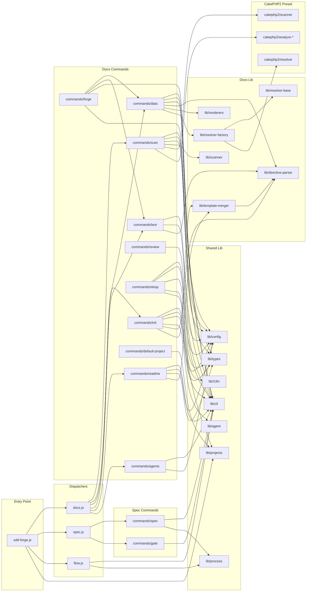

# 04. 内部設計

## 説明

<!-- @text: この章の概要を1〜2文で記述してください。プロジェクト構成・モジュール依存の方向・主要な処理フローを踏まえること。 -->

sdd-forge は、CLIエントリポイント・ドメイン別ディスパッチャ・コマンド実装という3階層のルーティング構造を採用しており、各コマンドは `src/lib/` の共有ユーティリティへ向かって一方向に依存します。主要な処理フローは、ソースコード解析からドキュメント生成までを担う build パイプライン（scan → init → data → text → readme）と、仕様策定から実装承認までを管理する SDD フロー（spec → gate → forge → review）の2系統で構成されます。


## 内容

### プロジェクト構成

<!-- @text: このプロジェクトのディレクトリ構成を tree 形式のコードブロックで記述してください。主要ディレクトリ・ファイルの役割コメントを含めること。 -->

```
sdd-forge/
├── package.json                          ← パッケージ定義・bin エントリポイント指定
├── AGENTS.md                             ← エージェント向けプロジェクト仕様（CLAUDE.md のリンク先）
├── README.md                             ← 公開向けドキュメント（自動生成）
├── docs/                                 ← 自動生成ドキュメント（sdd-forge build で更新）
│   ├── 01_overview.md
│   ├── 02_cli_commands.md
│   ├── 03_configuration.md
│   ├── 04_internal_design.md
│   └── 05_development.md
├── src/                                  ← ソースコード本体
│   ├── sdd-forge.js                      ← CLIエントリポイント・サブコマンドルーティング
│   ├── docs.js                           ← docs 系コマンドのディスパッチャ
│   ├── spec.js                           ← spec 系コマンドのディスパッチャ
│   ├── flow.js                           ← SDD フロー自動実行
│   ├── help.js                           ← コマンド一覧表示
│   ├── docs/
│   │   ├── commands/                     ← docs サブコマンド実装（scan/init/data/text 等）
│   │   ├── lib/                          ← docs 処理ライブラリ（パーサ・マージャ・リゾルバ）
│   │   └── presets/webapp/cakephp2/      ← CakePHP 2.x 固有のスキャナ・リゾルバ・解析モジュール
│   ├── specs/
│   │   └── commands/                     ← spec/gate コマンド実装
│   ├── lib/                              ← 共有ユーティリティ（cli/config/agent/i18n 等）
│   └── templates/                        ← バンドルされたドキュメントテンプレート
│       └── locale/
│           ├── ja/                       ← 日本語テンプレート（base/cli/webapp 等のプリセット）
│           └── en/                       ← 英語ロケールメッセージ
└── .sdd-forge/                           ← プロジェクト設定・解析出力（自動生成）
    ├── config.json                       ← プロジェクト設定
    └── output/
        └── analysis.json                 ← scan コマンドが生成する解析データ
```


### モジュール構成

<!-- @text: 全モジュールの一覧を表形式で記述してください。モジュール名・ファイルパス・責務を含めること。 -->

| モジュール名 | ファイルパス | 責務 |
|---|---|---|
| CLI エントリポイント | `src/sdd-forge.js` | トップレベルのサブコマンドを各ディスパッチャへルーティングし、プロジェクトコンテキストを環境変数へ設定します |
| docs ディスパッチャ | `src/docs.js` | docs 系サブコマンド（scan / init / data / text / readme / forge / review / setup / changelog / agents / build）を `docs/commands/` 配下のスクリプトへ振り分けます |
| spec ディスパッチャ | `src/spec.js` | spec 系サブコマンド（spec / gate）を `specs/commands/` 配下のスクリプトへ振り分けます |
| SDD フロー自動化 | `src/flow.js` | spec 作成 → gate チェック → forge の SDD ワークフロー全体を自動実行します |
| ヘルプ表示 | `src/help.js` | 全コマンドの一覧と使い方を表示します |
| ソースコードスキャナ | `src/docs/commands/scan.js` | フレームワーク固有・汎用の解析を実行し、`analysis.json` を生成します |
| テンプレート初期化 | `src/docs/commands/init.js` | テンプレート継承チェーンをマージし、`docs/` ディレクトリを初期化します |
| データ解決 | `src/docs/commands/data.js` | `@data` ディレクティブを `analysis.json` のデータで置換します |
| テキスト生成 | `src/docs/commands/text.js` | `@text` ディレクティブを AI エージェントで解決してドキュメントに書き込みます |
| README 生成 | `src/docs/commands/readme.js` | `docs/` の章ファイルから `README.md` を自動生成します |
| ドキュメント反復改善 | `src/docs/commands/forge.js` | AI フィードバックを用いてドキュメントを反復的に改善します |
| 品質チェック | `src/docs/commands/review.js` | 章ファイルの構造と品質を検証します |
| セットアップウィザード | `src/docs/commands/setup.js` | プロジェクト登録と設定ファイル（`.sdd-forge/config.json`）を対話形式で生成します |
| デフォルトプロジェクト管理 | `src/docs/commands/default-project.js` | マルチプロジェクト環境でのデフォルトプロジェクトを設定・表示します |
| 変更ログ生成 | `src/docs/commands/changelog.js` | `specs/` ディレクトリから `change_log.md` を生成します |
| AGENTS.md 更新 | `src/docs/commands/agents.js` | `analysis.json` を元に `AGENTS.md` の PROJECT セクションを更新します |
| ディレクティブパーサ | `src/docs/lib/directive-parser.js` | テンプレートから `@data` / `@text` / `@block` 等のディレクティブを抽出します |
| 汎用スキャナ | `src/docs/lib/scanner.js` | フレームワーク非依存のファイル・クラス・メソッド構造解析を行います |
| テンプレート継承エンジン | `src/docs/lib/template-merger.js` | `@extends` / `@block` / `@parent` によるテンプレート継承チェーンをマージします |
| リゾルバファクトリ | `src/docs/lib/resolver-factory.js` | ベースカテゴリと FW 固有マッピングを組み合わせてリゾルバを返します |
| ベースリゾルバ | `src/docs/lib/resolver-base.js` | フレームワーク非依存の `@data` カテゴリ → マークダウン変換ロジックを提供します |
| レンダラ | `src/docs/lib/renderers.js` | `@data` ディレクティブ向けのマークダウン生成関数（テーブル・リスト等）を提供します |
| PHP 配列パーサ | `src/docs/lib/php-array-parser.js` | CakePHP 2.x ソースファイルから PHP 配列のプロパティ・値を抽出します |
| CakePHP 2 スキャナ | `src/docs/presets/webapp/cakephp2/scanner.js` | CakePHP 2.x 固有のスキャンデフォルト値と拡張解析を定義します |
| CakePHP 2 リゾルバ | `src/docs/presets/webapp/cakephp2/resolver.js` | CakePHP 2.x 固有の `@data` カテゴリ変換（DB 設定・バリデーション等）を提供します |
| コントローラ解析 | `src/docs/presets/webapp/cakephp2/analyze-controllers.js` | CakePHP Controller ファイルからクラス名・コンポーネント・アクションを抽出します |
| モデル解析 | `src/docs/presets/webapp/cakephp2/analyze-models.js` | CakePHP Model ファイルからテーブル名・DB 設定・リレーション・バリデーションを抽出します |
| ルート解析 | `src/docs/presets/webapp/cakephp2/analyze-routes.js` | `app/Config/routes.php` から `Router::connect()` パターンを抽出します |
| シェル解析 | `src/docs/presets/webapp/cakephp2/analyze-shells.js` | CakePHP Shell ファイルからクラス名・公開メソッド・uses を抽出します |
| エクストラ解析 | `src/docs/presets/webapp/cakephp2/analyze-extras.js` | const.php・bootstrap・AppController・ヘルパー・Lib・ビヘイビア・レイアウト等を解析します |
| spec 初期化 | `src/specs/commands/init.js` | フィーチャブランチを作成し、`specs/NNN-xxx/spec.md` を初期化します |
| ゲートチェック | `src/specs/commands/gate.js` | spec 内の未解決事項（TBD / TODO / FIXME 等）を検出し、実装可否を判定します |
| CLI ユーティリティ | `src/lib/cli.js` | `repoRoot()` と `parseArgs()` を提供し、全エントリポイントで共通利用されます |
| 設定管理 | `src/lib/config.js` | 設定ファイルの読み書き・バリデーション・プロジェクト状態の永続化を担います |
| 型定義・バリデーション | `src/lib/types.js` | 設定・コンテキスト・ドキュメントスタイルの JSDoc 型定義と検証関数を提供します |
| エージェント呼び出し | `src/lib/agent.js` | 設定済み LLM エージェントにプロンプトを送信する `callAgent()` / `resolveAgent()` を提供します |
| プロセス実行 | `src/lib/process.js` | `spawnSync()` の同期ラッパーで、エラーハンドリングと結果整形を行います |
| 国際化 | `src/lib/i18n.js` | ロケール別メッセージファイルを読み込み、多言語 UI 向けの翻訳関数を提供します |
| プロジェクト管理 | `src/lib/projects.js` | `projects.json` の CRUD・デフォルト設定・作業ルートの解決を行います |


### モジュール依存関係

<!-- @text: モジュール間の依存関係を mermaid graph で生成してください。出力は mermaid コードブロックのみ。 -->




### 主要な処理フロー

<!-- @text: 代表的なコマンドを実行した際のモジュール間のデータ・制御フローを説明してください。 -->

これで主要なコマンドの処理フローを把握できました。以下がドキュメントに挿入するテキストです。

---

`sdd-forge <subcommand>` を実行すると、まず `sdd-forge.js` が `lib/projects.js` を介してプロジェクトコンテキスト（`SDD_SOURCE_ROOT` / `SDD_WORK_ROOT`）を環境変数に設定し、サブコマンドに応じて `docs.js`・`spec.js`・`flow.js` のいずれかにディスパッチします。

**`sdd-forge build`（ドキュメント一括生成）** は `docs.js` がパイプラインを直列実行します。`scan.js` がソースコードを解析して `analysis.json` を生成し、`init.js` がテンプレートから `docs/` を初期化し、`data.js` が `analysis.json` を読み込んで `directive-parser.js` で `@data` ディレクティブを抽出し、`resolver-factory.js` が FW 固有の `resolver.js` を動的にロードしてカテゴリを解決し、`renderers.js` がマークダウン形式に変換して `docs/*.md` を上書きします。続いて `text.js` が AI エージェントで `@text` ディレクティブを解決し、`readme.js` が `README.md` を生成します。

**`sdd-forge data`（個別実行）** は上記の `@data` 解決フローのみを実行します。`lib/config.js` → `lib/types.js` でプロジェクトタイプを特定し、`resolver-factory.js` → `presets/webapp/<fw>/resolver.js` の順でリゾルバを構築します。

**`sdd-forge forge`** は `analysis.json` を読み込んで `@data` ディレクティブを先行解決した後、AI エージェントに `docs/` ファイルの改善を依頼し、`review` コマンドでチェックして失敗フィードバックを次ラウンドへ渡す反復ループを最大 `maxRuns` 回実行します。

**`sdd-forge flow`** は `sdd-forge.js` から直接 `flow.js` にルーティングされ（ディスパッチャを経由しない）、`specs/commands/init.js` で spec を作成 → `specs/commands/gate.js` でゲートチェック → PASS 後に `docs/commands/forge.js` を起動するという SDD フロー全体を自動化します。


### 拡張ポイント

<!-- @text: 新しいコマンドや機能を追加する際に変更が必要な箇所と、拡張パターンを説明してください。 -->

コマンドを新たに追加する際は、3 箇所のファイルを必ず変更する必要があります。

**docs 系コマンドを追加する場合**（`scan`・`forge` と同カテゴリ）:
1. `src/docs/commands/<name>.js` にコマンド本体を実装する
2. `src/docs.js` の `SCRIPTS` マップにエントリを追加する（例: `newcmd: "docs/commands/newcmd.js"`）
3. `src/sdd-forge.js` の `DISPATCHERS` マップに `newcmd: "docs"` を追加する
4. `src/help.js` の `commands` 配列にヘルプ表示エントリを追加する

**spec 系コマンドを追加する場合**（`spec`・`gate` と同カテゴリ）:
手順は同様で、スクリプト配置先を `src/specs/commands/`、ディスパッチャを `src/spec.js` の `SCRIPTS` マップ、`DISPATCHERS` の値を `"spec"` にする。

**`build` パイプラインに組み込む場合**は、`src/docs.js` の `build` ブロック内に `await import(...)` のステップを追加する。

**新フレームワークプリセットを追加する場合**は、`src/docs/presets/webapp/<fw>/` 以下に `scanner.js`・`resolver.js` を実装し、`src/docs/lib/resolver-factory.js` の `FW_RESOLVER_MODULES` にエントリを追加する。

**`@data` ディレクティブの解決カテゴリを増やす場合**は、`src/docs/lib/resolver-base.js` の `createBaseCategories` 関数、またはフレームワーク固有の場合は `src/docs/presets/webapp/<fw>/resolver.js` の `createXxxCategories` 関数に追加する。
