# 04. 内部設計

## 説明

<!-- @text: この章の概要を1〜2文で記述してください。プロジェクト構成・モジュール依存の方向・主要な処理フローを踏まえること。 -->

`src/bin/sdd-forge.js` を起点としたサブコマンドディスパッチ構造を持ち、`src/lib/` の共通ユーティリティ（cli・config・process）を土台に、解析（analyzers）・エンジン（engine）・仕様管理（spec）・改善（forge/flow）の各モジュールが一方向に依存する構成となっている。主要な処理フローは「ソースコード解析（scan）→ ドキュメント初期生成（init）→ データ埋め込み（populate）→ LLM によるテキスト生成（tfill）→ 反復改善（forge）」の順に構成される。


## 内容

### プロジェクト構成

<!-- @text: このプロジェクトのディレクトリ構成を tree 形式のコードブロックで記述してください。主要ディレクトリ・ファイルの役割コメントを含めること。 -->

```
sdd-forge/
├── package.json                        # パッケージ定義・エントリポイント宣言
├── src/
│   ├── bin/
│   │   └── sdd-forge.js                # CLI エントリポイント・サブコマンドディスパッチ
│   ├── lib/
│   │   ├── cli.js                      # 共通ユーティリティ（ルート検出・ファイル操作・ログ）
│   │   ├── config.js                   # .sdd-forge/config.json 読み込み
│   │   └── process.js                  # 子プロセス実行ラッパー
│   ├── engine/
│   │   ├── init.js                     # テンプレートから docs/ を初期生成
│   │   ├── populate.js                 # @data ディレクティブを解析データで置換
│   │   ├── tfill.js                    # @text ディレクティブを LLM CLI 呼び出しで解決
│   │   ├── readme.js                   # README.md 自動生成
│   │   ├── directive-parser.js         # Markdown からディレクティブを抽出・パース
│   │   ├── renderers.js                # 解析データをマークダウン形式にレンダリング
│   │   └── resolver.js                 # @data キーに対応する解析データの抽出
│   ├── analyzers/
│   │   ├── scan.js                     # 各解析器を統括し analysis.json を生成
│   │   ├── analyze-controllers.js      # CakePHP コントローラの静的解析
│   │   ├── analyze-models.js           # CakePHP モデルの静的解析
│   │   ├── analyze-shells.js           # CakePHP Shell の静的解析
│   │   ├── analyze-routes.js           # routes.php のルート定義解析
│   │   ├── analyze-extras.js           # 定数・設定などの補足情報解析
│   │   └── lib/
│   │       └── php-array-parser.js     # PHP 配列リテラルの汎用パーサー
│   ├── spec/
│   │   ├── spec.js                     # feature ブランチ作成と spec.md 初期化
│   │   └── gate.js                     # spec.md の未解決事項チェックと PASS/FAIL 判定
│   ├── forge/
│   │   └── forge.js                    # data + text を組み合わせた docs 反復改善
│   ├── flow/
│   │   └── flow.js                     # spec 作成・gate・docs 反映を自動実行する SDD フロー
│   ├── projects/
│   │   ├── projects.js                 # ワークスペース登録情報の読み書きと解決
│   │   ├── add.js                      # プロジェクトをワークスペースに追加
│   │   └── setdefault.js               # デフォルトプロジェクトの設定
│   ├── templates/
│   │   ├── locale/ja/
│   │   │   ├── messages.json           # UI メッセージ定義（日本語）
│   │   │   ├── prompts.json            # LLM プロンプト定義（日本語）
│   │   │   ├── sections.json           # ドキュメントセクション定義
│   │   │   ├── php-mvc/                # PHP-MVC プロジェクト用 docs テンプレート（10章）
│   │   │   └── node-cli/               # Node.js CLI プロジェクト用 docs テンプレート（5章）
│   │   ├── checks/                     # docs レビュー用シェルスクリプト
│   │   └── review-checklist.md         # レビューチェックリスト
│   └── help.js                         # コマンド一覧の表示
└── docs/                               # sdd-forge 自身の生成ドキュメント
```


### モジュール構成

<!-- @text: 全モジュールの一覧を表形式で記述してください。モジュール名・ファイルパス・責務を含めること。 -->

| モジュール名 | ファイルパス | 責務 |
|---|---|---|
| sdd-forge CLI | `src/bin/sdd-forge.js` | サブコマンドのディスパッチ、プロジェクトコンテキスト解決、環境変数セット |
| help | `src/help.js` | 利用可能なコマンド一覧の表示 |
| cli | `src/lib/cli.js` | リポジトリルート検出、ファイル読み書き、ログ出力などの共通 CLI ユーティリティ |
| config | `src/lib/config.js` | `.sdd-forge/config.json` の読み込みと設定値アクセス |
| process | `src/lib/process.js` | 子プロセス実行のラッパー（`execFileSync` / `spawnSync`） |
| init | `src/engine/init.js` | テンプレートから `docs/` を初期生成 |
| data | `src/engine/populate.js` | `@data` ディレクティブを解析データで置換 |
| text | `src/engine/tfill.js` | `@text` ディレクティブを LLM CLI 呼び出しで解決 |
| readme | `src/engine/readme.js` | `README.md` の自動生成 |
| directive-parser | `src/engine/directive-parser.js` | Markdown ファイルからディレクティブを抽出・パース |
| renderers | `src/engine/renderers.js` | 解析データをマークダウン形式にレンダリング |
| resolver | `src/engine/resolver.js` | `@data` キーに対応する解析データの抽出ロジック |
| scan | `src/analyzers/scan.js` | 各解析器を統括し `analysis.json` を生成 |
| analyze-controllers | `src/analyzers/analyze-controllers.js` | CakePHP コントローラの静的解析 |
| analyze-models | `src/analyzers/analyze-models.js` | CakePHP モデルの静的解析 |
| analyze-shells | `src/analyzers/analyze-shells.js` | CakePHP Shell の静的解析 |
| analyze-routes | `src/analyzers/analyze-routes.js` | `routes.php` のルート定義解析 |
| analyze-extras | `src/analyzers/analyze-extras.js` | 定数・設定などの補足情報解析 |
| php-array-parser | `src/analyzers/lib/php-array-parser.js` | PHP 配列リテラルの汎用パーサー（解析器共通ユーティリティ） |
| spec | `src/spec/spec.js` | feature ブランチ作成と `spec.md` の初期化 |
| gate | `src/spec/gate.js` | `spec.md` の未解決事項チェックと PASS/FAIL 判定 |
| forge | `src/forge/forge.js` | `data` / `text` を組み合わせたドキュメント反復改善 |
| flow | `src/flow/flow.js` | spec 作成・gate・初期 docs 反映を自動実行する SDD フロー |
| projects | `src/projects/projects.js` | ワークスペース登録情報の読み書きと解決 |
| add | `src/projects/add.js` | プロジェクトをワークスペースに追加 |
| setdefault | `src/projects/setdefault.js` | デフォルトプロジェクトの設定 |


### モジュール依存関係

```mermaid
graph TD
  bin["bin/sdd-forge.js"]
  help["help.js"]

  subgraph lib
    cli["lib/cli.js"]
    config["lib/config.js"]
    process_["lib/process.js"]
  end

  subgraph engine
    init["engine/init.js"]
    populate["engine/populate.js"]
    tfill["engine/tfill.js"]
    readme["engine/readme.js"]
    directive_parser["engine/directive-parser.js"]
    renderers["engine/renderers.js"]
    resolver["engine/resolver.js"]
  end

  subgraph analyzers
    scan["analyzers/scan.js"]
    ctrl["analyzers/analyze-controllers.js"]
    model["analyzers/analyze-models.js"]
    shell["analyzers/analyze-shells.js"]
    route["analyzers/analyze-routes.js"]
    extras["analyzers/analyze-extras.js"]
    php_parser["analyzers/lib/php-array-parser.js"]
  end

  subgraph spec
    spec_js["spec/spec.js"]
    gate["spec/gate.js"]
  end

  subgraph forge
    forge_js["forge/forge.js"]
  end

  subgraph flow
    flow_js["flow/flow.js"]
  end

  subgraph projects
    projects_js["projects/projects.js"]
    add_js["projects/add.js"]
    setdefault_js["projects/setdefault.js"]
  end

  bin --> scan
  bin --> populate
  bin --> tfill
  bin --> init
  bin --> readme
  bin --> spec_js
  bin --> gate
  bin --> forge_js
  bin --> flow_js
  bin --> add_js
  bin --> setdefault_js

  init --> cli
  init --> config

  populate --> directive_parser
  populate --> renderers
  populate --> resolver
  populate --> cli

  tfill --> directive_parser
  tfill --> cli
  tfill --> config

  readme --> cli
  readme --> config

  scan --> ctrl
  scan --> model
  scan --> shell
  scan --> route
  scan --> extras
  scan --> cli

  ctrl --> php_parser
  model --> php_parser
  shell --> php_parser
  route --> php_parser
  extras --> php_parser

  spec_js --> cli
  spec_js --> process_

  gate --> cli

  forge_js --> populate
  forge_js --> tfill
  forge_js --> cli
  forge_js --> config

  flow_js --> cli
  flow_js --> process_

  add_js --> projects_js
  setdefault_js --> projects_js
```

<!-- @text: モジュール間の依存関係を mermaid graph で生成してください。出力は mermaid コードブロックのみ。 -->




### 主要な処理フロー

<!-- @text: 代表的なコマンドを実行した際のモジュール間のデータ・制御フローを説明してください。 -->

`sdd-forge scan` を実行すると、`bin/sdd-forge.js` がプロジェクトコンテキストを `projects/projects.js` 経由で解決し（`SDD_SOURCE_ROOT` / `SDD_WORK_ROOT` を環境変数にセット）、`analyzers/scan.js` へ制御を渡す。`scan.js` は各解析器（`analyze-controllers.js` ほか）を個別に呼び出し、戻り値を1つのオブジェクトにマージして `.sdd-forge/output/analysis.json` へ書き出す。

`sdd-forge data` では `engine/populate.js` が `analysis.json` を読み込み、`docs/*.md` を順に処理する。各ファイルを `engine/directive-parser.js` の `parseDirectives()` に渡してディレクティブ一覧を取得し、`@data` ディレクティブごとに `engine/resolver.js` の `resolve()` で解析データを抽出、`engine/renderers.js` の対応レンダラーがマークダウンに変換して元の行を置換する。

`sdd-forge text` では `engine/tfill.js` が `analysis.json` と `.sdd-forge/config.json` からエージェント設定を読み込む。`docs/*.md` の各ファイルに対してデフォルトのバッチモードで動作し、ファイル全体を1つのプロンプトにまとめて `callAgent()` が `execFileSync` で LLM CLI（`claude` 等）を子プロセスとして同期呼び出しする。バッチ呼び出しで `filled === 0` になった場合はディレクティブ単位のフォールバックモードで再試行する。

`sdd-forge scan:all` は `bin/sdd-forge.js` 内で特別扱いされ、`scan.js` → `populate.js` を順次 `await import()` で直列実行する複合フローである。


### 拡張ポイント

<!-- @text: 新しいコマンドや機能を追加する際に変更が必要な箇所と、拡張パターンを説明してください。 -->

新しいサブコマンドを追加する場合、変更が必要な箇所は `src/bin/sdd-forge.js` と `src/help.js` の2ファイルである。

**`src/bin/sdd-forge.js` の変更点：**
- `SCRIPTS` オブジェクトにサブコマンド名とスクリプトの相対パスのペアを追加する
- 引数の注入が必要な場合は `INJECT` オブジェクトにエントリを追加する
- プロジェクトコンテキスト解決が不要なコマンドは `PROJECT_MGMT` セットに追加する
- `scan:all` のように複数スクリプトを順次実行する複合コマンドは、`SCRIPTS` を経由せず専用の `if` ブロックとして実装する

**`src/help.js` の変更点：**
- `commands` 配列に `{ name, desc, usage }` 形式でエントリを追加する（セパレータ `{ sep: "--- xxx ---" }` で既存グループに属させるか新グループを設ける）

**新しい解析器を追加する場合：**
- `src/analyzers/` に `analyze-xxx.js` を作成し、名前付きエクスポート `analyzeXxx(appDir)` を実装する
- `src/analyzers/scan.js` の `VALID_ONLY` セットと `main()` 内の条件分岐に対象キーを追加する

**新しいドキュメントテンプレートタイプを追加する場合：**
- `src/templates/locale/<lang>/<type>/` にテンプレートファイル群を配置する
- `src/engine/init.js` のテンプレートタイプ解決ロジックに新タイプを追加する
