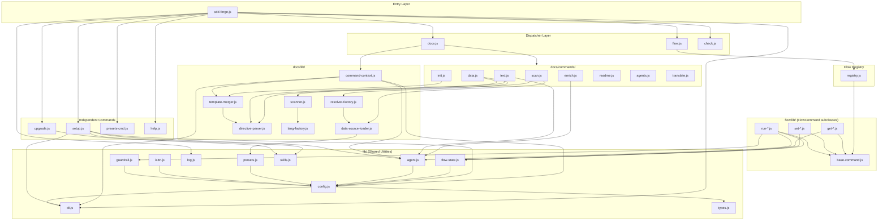

<!-- {{data("base.docs.langSwitcher", {labels: "relative"})}} -->
[日本語](ja/internal_design.md) | **English**
<!-- {{/data}} -->

# Internal Design

## Description

<!-- {{text({prompt: "Write a 1-2 sentence overview of this chapter. Include the project structure, module dependency direction, and key processing flows."})}} -->

The sdd-forge codebase is organized into a layered architecture where a top-level CLI dispatcher (`sdd-forge.js`) routes commands to three namespace dispatchers (`docs.js`, `flow.js`, `check.js`) and several independent command modules, with all shared utilities living in `src/lib/`. Dependencies flow strictly downward: entry points depend on dispatchers, dispatchers depend on command modules, and command modules depend only on `lib/` utilities — there are no circular imports.
<!-- {{/text}} -->

## Content

### Project Structure

<!-- {{text({prompt: "Describe the project's directory structure as a tree-format code block. Include role comments for key directories and files. Generate from the actual source code structure.", mode: "deep"})}} -->

```
src/
├── sdd-forge.js            # CLI entry point — top-level command router
├── docs.js                 # Dispatcher for docs subcommands and build pipeline
├── flow.js                 # Dispatcher for flow commands via registry
├── check.js                # Dispatcher for health-check subcommands
├── setup.js                # Interactive project setup wizard
├── upgrade.js              # Template and skill upgrade tool
├── presets-cmd.js          # Preset listing and query command
├── help.js                 # Help display (reads from registry)
│
├── lib/                   # Shared utilities — imported by all layers
│   ├── cli.js             # repoRoot(), parseArgs(), PKG_DIR, worktree helpers
│   ├── config.js          # .sdd-forge/ path helpers, config.json loader, validateConfig()
│   ├── flow-state.js      # flow.json persistence, step/phase management
│   ├── flow-envelope.js   # ok()/fail() JSON response wrapper
│   ├── entrypoint.js      # runIfDirect() for CLI entry detection
│   ├── agent.js           # AI agent invocation (spawn-based)
│   ├── presets.js         # Preset discovery and parent-chain resolution
│   ├── types.js           # SddConfig type validation
│   ├── i18n.js            # 3-layer i18n system with domain namespacing
│   ├── log.js             # Logger singleton with structured output
│   ├── git-helpers.js     # git/gh status query helpers
│   ├── guardrail.js       # Guardrail loading and phase-based filtering
│   ├── lint.js            # Lint pattern matching
│   ├── process.js         # runCmd() and assertOk() wrappers
│   ├── skills.js          # Skill file deployment to .agents/ and .claude/
│   └── ...                # (progress, formatter, json-parse, multi-select, include, agents-md)
│
├── docs/                  # Documentation generation pipeline
│   ├── commands/          # One file per docs subcommand
│   │   ├── scan.js        # Collect source files → analysis.json
│   │   ├── enrich.js      # AI-enriched metadata for analysis entries
│   │   ├── init.js        # Template inheritance → docs/ initialization
│   │   ├── data.js        # Resolve {{data}} directives
│   │   ├── text.js        # Resolve {{text}} directives via AI
│   │   ├── readme.js      # Assemble README.md from chapters
│   │   ├── agents.js      # Generate/update AGENTS.md
│   │   ├── review.js      # Validate chapter file structure
│   │   ├── changelog.js   # Generate CHANGELOG from git history
│   │   └── translate.js   # Translate chapters to non-default languages
│   ├── data/              # Built-in DataSource implementations
│   │   ├── project.js     # Project metadata (name, version, description)
│   │   ├── docs.js        # Doc files and chapter structure
│   │   ├── lang.js        # Language and translation metadata
│   │   └── agents.js      # SDD agent list
│   └── lib/               # Docs engine shared utilities
│       ├── command-context.js    # Unified context (root, lang, docsDir, config, agent)
│       ├── data-source.js        # Base DataSource class
│       ├── data-source-loader.js # Load DataSources from preset chain
│       ├── scanner.js            # File collection with include/exclude and dedup
│       ├── directive-parser.js   # Parse {{data}}/{{text}}/ in templates
│       ├── template-merger.js    # Template inheritance and block merging
│       ├── lang-factory.js       # Route file extension to JS/PHP/Python/YAML handler
│       ├── resolver-factory.js   # Factory for {{data}} directive resolution
│       ├── analysis-entry.js     # Analysis entry schema and summary generation
│       ├── concurrency.js        # mapWithConcurrency() for parallel file processing
│       └── lang/                 # Language-specific file parsers
│           ├── js.js
│           ├── php.js
│           ├── py.js
│           └── yaml.js
│
├── check/
│   └── commands/          # Health-check subcommands
│       ├── config.js      # Validate config.json structure
│       ├── freshness.js   # Check analysis.json staleness
│       └── scan.js        # Verify preset scan patterns
│
├── flow/                  # SDD workflow orchestration
│   ├── registry.js        # Single source of truth — command metadata, args, hooks
│   ├── commands/          # Higher-level flow helpers
│   │   ├── merge.js       # Git merge logic used by finalize
│   │   ├── review.js      # AI code review implementation
│   │   └── report.js      # Work report generation
│   └── lib/               # FlowCommand implementations
│       ├── base-command.js      # FlowCommand base class
│       ├── phases.js            # VALID_PHASES constant
│       ├── get-*.js             # flow get <key> implementations (8 files)
│       ├── set-*.js             # flow set <key> implementations (10 files)
│       └── run-*.js             # flow run <action> implementations (9 files)
│
├── presets/               # Framework-specific preset definitions
│   ├── base/              # Root preset (required ancestor of all presets)
│   ├── webapp/            # Web application base preset
│   │   ├── js-webapp/     # JavaScript web framework presets (hono, nextjs, …)
│   │   └── php-webapp/    # PHP framework presets (laravel, symfony, cakephp2)
│   ├── library/           # Reusable library preset
│   ├── cli/node-cli/      # CLI tool preset
│   ├── database/drizzle/  # Database layer preset
│   └── …                  # 30+ additional presets (api, rest, graphql, edge, …)
│       └── [each preset]  # preset.json, guardrail.json, data/, templates/, tests/
│
├── locale/                # Internationalization files
│   ├── en/                # English: messages.json, prompts.json, ui.json
│   └── ja/                # Japanese: messages.json, prompts.json, ui.json
│
└── templates/             # User-facing files deployed by setup/upgrade
    ├── config.example.json
    ├── review-checklist.md
    ├── skills/            # SDD workflow skill definitions
    │   ├── sdd-forge.flow-plan/
    │   ├── sdd-forge.flow-impl/
    │   ├── sdd-forge.flow-finalize/
    │   └── …              # (flow-auto, flow-resume, flow-status, flow-sync)
    └── partials/          # Shared include fragments for skill templates
```
<!-- {{/text}} -->

### Module Composition

<!-- {{text({prompt: "List the major modules in table format. Include module name, file path, and responsibility. Extract from import/require relationships and exports in each file.", mode: "deep"})}} -->

| Module | File Path | Responsibility |
|---|---|---|
| **CLI Entry** | `src/sdd-forge.js` | Top-level command router; initializes logger; dispatches to namespace dispatchers or independent commands |
| **Docs Dispatcher** | `src/docs.js` | Routes `docs <subcommand>` arguments; orchestrates the full `docs build` pipeline with progress tracking |
| **Flow Dispatcher** | `src/flow.js` | Routes `flow` commands via the registry; resolves context; executes pre/post/onError/finally hooks |
| **Check Dispatcher** | `src/check.js` | Routes `check <subcommand>` to health-check command modules |
| **cli** | `src/lib/cli.js` | Provides `repoRoot()`, `parseArgs()`, `PKG_DIR`, and worktree detection helpers; imported by virtually every module |
| **config** | `src/lib/config.js` | Resolves `.sdd-forge/` paths and loads/validates `config.json`; depends on `cli.js` and `types.js` |
| **flow-state** | `src/lib/flow-state.js` | Persists and loads `flow.json`; manages step status, phase derivation, and spec path resolution |
| **agent** | `src/lib/agent.js` | Invokes the AI agent via `spawn` (not `execFile`); builds prompts and streams output |
| **presets** | `src/lib/presets.js` | Discovers preset definitions and resolves the full parent-chain for a given preset type |
| **types** | `src/lib/types.js` | Validates `SddConfig` schema; throws on invalid structure (fail-fast boundary) |
| **i18n** | `src/lib/i18n.js` | 3-layer internationalization (ui / messages / domain); lazy locale loading with domain namespacing |
| **log** | `src/lib/log.js` | Logger singleton initialized at startup; writes structured logs to `.sdd-forge/logs/` |
| **guardrail** | `src/lib/guardrail.js` | Loads `guardrail.json` from the preset chain and filters rules by phase |
| **skills** | `src/lib/skills.js` | Deploys skill template files to `.agents/` and `.claude/` directories; shared by `setup` and `upgrade` |
| **command-context** | `src/docs/lib/command-context.js` | Resolves unified docs command context (root, lang, docsDir, config, agent); imported by all docs commands |
| **data-source-loader** | `src/docs/lib/data-source-loader.js` | Loads and merges DataSource classes from the full preset parent chain |
| **scanner** | `src/docs/lib/scanner.js` | Collects source files with include/exclude glob patterns; deduplicates by content hash |
| **directive-parser** | `src/docs/lib/directive-parser.js` | Parses `{{data}}`, `{{text}}`, and `` directives from markdown templates |
| **template-merger** | `src/docs/lib/template-merger.js` | Implements template inheritance and `` merging across the preset chain |
| **lang-factory** | `src/docs/lib/lang-factory.js` | Routes file extensions to the appropriate language handler (JS, PHP, Python, YAML) |
| **resolver-factory** | `src/docs/lib/resolver-factory.js` | Creates resolvers that map `{{data("source.method")}}` calls to DataSource method results |
| **analysis-entry** | `src/docs/lib/analysis-entry.js` | Defines the analysis entry schema and generates per-file summaries |
| **flow registry** | `src/flow/registry.js` | Single source of truth for all flow command metadata, argument specs, and lifecycle hooks |
| **FlowCommand base** | `src/flow/lib/base-command.js` | Base class extended by all `flow get/set/run` implementations; enforces `requiresFlow` constraint |
| **scan** | `src/docs/commands/scan.js` | Walks source files, invokes language handlers and DataSources, writes `analysis.json` |
| **enrich** | `src/docs/commands/enrich.js` | Sends analysis entries to the AI agent for metadata enrichment |
| **init** | `src/docs/commands/init.js` | Merges preset template chains and initializes the `docs/` directory |
| **data** | `src/docs/commands/data.js` | Resolves all `{{data}}` directives in docs files using loaded DataSources |
| **text** | `src/docs/commands/text.js` | Resolves all `{{text}}` directives by prompting the AI agent |
| **readme** | `src/docs/commands/readme.js` | Assembles `README.md` from ordered chapter files |
| **agents** | `src/docs/commands/agents.js` | Generates or updates `AGENTS.md` with current project context |
| **translate** | `src/docs/commands/translate.js` | Translates chapter files into non-default configured languages |
<!-- {{/text}} -->

### Module Dependencies

<!-- {{text({prompt: "Generate a mermaid graph showing inter-module dependencies. Analyze import/require statements in the source code and show the layer structure and dependency direction. Output only the mermaid code block.", mode: "deep"})}} -->


<!-- {{/text}} -->

### Key Processing Flows

<!-- {{text({prompt: "Describe the inter-module data and control flow when running a representative command in numbered steps. Include the flow from entry point to final output.", mode: "deep"})}} -->

The following steps describe the data and control flow when running `sdd-forge docs build`, the most representative multi-stage command.

1. **Entry** — `sdd-forge.js` parses `process.argv`, identifies `docs` as the namespace, and delegates all remaining arguments to `docs.js`.
2. **Pipeline construction** — `docs.js` recognizes the `build` subcommand and constructs an ordered list of pipeline steps: `scan → enrich → init → data → text → readme → agents → [translate]`. Each step carries a progress weight; steps that require an AI agent are skipped if no `agent.default` is configured.
3. **Context resolution** — Before running each step, `docs.js` calls `command-context.js` to resolve `{ root, mainRoot, config, lang, docsDir, agent }`. Config is loaded from `.sdd-forge/config.json` via `config.js`, which in turn calls `validateConfig()` from `types.js`.
4. **Scan** (`docs/commands/scan.js`) — Loads the preset chain via `presets.js`, instantiates all DataSources via `data-source-loader.js`, and collects source files using `scanner.js` with the preset's include/exclude glob patterns. Each file is routed through `lang-factory.js` to the appropriate language handler (`lang/js.js`, `lang/php.js`, etc.). The DataSources produce structured analysis entries, which are deduplicated by content hash and written to `.sdd-forge/output/analysis.json`.
5. **Enrich** (`docs/commands/enrich.js`) — Reads `analysis.json` and sends each entry to the AI agent via `agent.js` (spawned process) to produce enriched metadata (summaries, tags). Results are merged back into `analysis.json`.
6. **Init** (`docs/commands/init.js`) — Resolves the preset template chain via `template-merger.js`, which reads `preset.json` parent chains, merges `` overrides, and writes the merged chapter templates into the `docs/` directory. Skipped if `--regenerate` flag is absent and `docs/` already exists.
7. **Data** (`docs/commands/data.js`) — Parses every file in `docs/` with `directive-parser.js` to locate `{{data("source.method")}}` directives, then resolves each call via `resolver-factory.js` against the loaded DataSource registry, replacing the directive content inline.
8. **Text** (`docs/commands/text.js`) — Parses `{{text({prompt: "..."})}}` directives and for each one invokes the AI agent with the prompt and surrounding document context, replacing the directive content with the generated markdown.
9. **Readme** (`docs/commands/readme.js`) — Reads the ordered chapter list from `preset.json`, concatenates the resolved chapter files, and writes `README.md` to the project root.
10. **Agents** (`docs/commands/agents.js`) — Reads the `AGENTS.md` template, resolves all `{{data}}` directives referencing project-level DataSources, and writes the result to `AGENTS.md` (with `CLAUDE.md` as a symlink).
11. **Translate** (`docs/commands/translate.js`) — If `docs.languages` in config lists languages beyond `docs.defaultLanguage`, each chapter is sent to the AI agent for translation and written into a language-specific subdirectory (e.g., `docs/en/`).
12. **Output** — The pipeline completes with a progress summary logged to the terminal via `log.js`.
<!-- {{/text}} -->

### Extension Points

<!-- {{text({prompt: "Describe the locations that need changes and extension patterns when adding new commands or features. Derive from plugin points and dispatch registration patterns in the source code.", mode: "deep"})}} -->

**Adding a new `flow run` action**

The single registration point for all flow commands is `src/flow/registry.js`. To add a new action:

1. Create `src/flow/lib/run-myaction.js` that exports a class extending `FlowCommand` from `base-command.js` and implements `async execute(ctx)`.
2. Add an entry to the `run` section of the `FLOW_COMMANDS` object in `registry.js`, providing `helpKey`, `command` (a lazy-import factory `() => import("./lib/run-myaction.js")`), `args` (positional, flags, options), and optionally `pre`, `post`, `onError`, and `finally` lifecycle hooks.
3. Add i18n keys for the help text in `src/locale/en/ui.json` and `src/locale/ja/ui.json`.

No changes are needed in `flow.js` — the dispatcher reads the registry dynamically.

**Adding a new `docs` subcommand**

1. Create `src/docs/commands/mycommand.js` as a standalone module that calls `runIfDirect(import.meta.url, main)` for direct CLI invocation.
2. Add the mapping `mycommand: "docs/commands/mycommand.js"` to the `SCRIPTS` object in `src/docs.js`.
3. To include the command in `docs build`, add a step entry to the pipeline array in `docs.js` with its weight and any skip condition.

**Adding a new preset**

1. Create `src/presets/mypreset/` with at minimum `preset.json` (setting `parent`, `label`, `scan.include`, and `chapters`), `guardrail.json`, language-specific template directories under `templates/`, and optionally DataSource modules under `data/`.
2. DataSource classes extend the base `DataSource` class from `src/docs/lib/data-source.js`; scannable sources additionally mix in `Scannable`. No central registration is needed — `data-source-loader.js` discovers them from the preset chain automatically.
3. Run the preset integrity tests (`npm test`) to verify that scan patterns and DataSource method exports are consistent.

**Adding a language handler for a new file extension**

1. Create `src/docs/lib/lang/myext.js` implementing `parse()`, `minify()`, `extractImports()`, and `extractExports()`.
2. Register the extension in `src/docs/lib/lang-factory.js` by adding an entry to the `EXT_MAP` object with a lazy-import factory.

**Plugin boundary summary**

| Extension type | Registration file | Pattern |
|---|---|---|
| Flow command | `src/flow/registry.js` | Add entry to `FLOW_COMMANDS` with lazy `command()` factory |
| Docs subcommand | `src/docs.js` | Add key to `SCRIPTS` map |
| Preset | `src/presets/<name>/preset.json` | Set `parent` to chain into existing tree |
| DataSource method | `src/presets/<name>/data/<source>.js` | Export method on DataSource subclass |
| Language handler | `src/docs/lib/lang-factory.js` | Add extension to `EXT_MAP` |
| Check subcommand | `src/check.js` | Add key to `SCRIPTS` map |
<!-- {{/text}} -->

---

<!-- {{data("base.docs.nav")}} -->
[← Configuration and Customization](configuration.md)
<!-- {{/data}} -->
