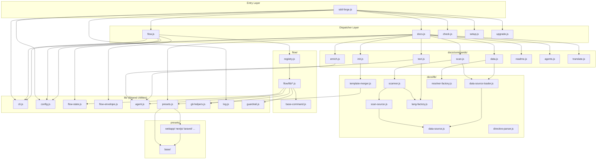

<!-- {{data("base.docs.langSwitcher", {labels: "relative"})}} -->
[日本語](ja/internal_design.md) | **English**
<!-- {{/data}} -->

# Internal Design

## Description

<!-- {{text({prompt: "Write a 1-2 sentence overview of this chapter. Include the project structure, module dependency direction, and key processing flows."})}} -->

The sdd-forge CLI is organized into a three-tier dispatch architecture — a top-level entry point (`sdd-forge.js`), namespace dispatchers (`docs.js`, `flow.js`, `check.js`), and individual command modules — with shared utilities under `lib/` and preset-specific logic isolated under `src/presets/`. Dependencies flow strictly downward from dispatchers through command handlers to utility libraries, while the docs pipeline executes sequentially and flow state persists across invocations via `flow.json` and `.active-flow` files.
<!-- {{/text}} -->

## Content

### Project Structure

<!-- {{text({prompt: "Describe the project's directory structure as a tree-format code block. Include role comments for key directories and files. Generate from the actual source code structure.", mode: "deep"})}} -->

```
src/
├── sdd-forge.js          # Main CLI entry point — routes to namespace dispatchers
├── docs.js               # Docs subcommand dispatcher — orchestrates the build pipeline
├── flow.js               # Flow subcommand dispatcher — routes get/set/run groups
├── check.js              # Check subcommand dispatcher
├── setup.js              # Standalone setup command
├── upgrade.js            # Standalone upgrade command
├── presets-cmd.js        # Preset listing command
├── help.js               # Help command
│
├── lib/                  # Shared utility layer (used across all command layers)
│   ├── cli.js            # repoRoot(), parseArgs(), PKG_DIR, worktree detection
│   ├── config.js         # config.json loader and path helpers
│   ├── flow-state.js     # Flow state persistence (flow.json, .active-flow)
│   ├── flow-envelope.js  # Standardized JSON envelope helpers (ok/fail/warn)
│   ├── agent.js          # AI agent invocation via child process
│   ├── presets.js        # Preset discovery and inheritance chain resolution
│   ├── git-helpers.js    # Git status, branch, and worktree queries
│   ├── guardrail.js      # Guardrail rule loading and phase-based filtering
│   ├── i18n.js           # Three-layer internationalization (domain/locale/fallback)
│   ├── log.js            # Logger singleton with request ID generation
│   ├── process.js        # runCmd() shell wrapper
│   ├── types.js          # Config validation and type resolution
│   └── progress.js       # Progress bar and per-step logging
│
├── docs/                 # Documentation generation pipeline
│   ├── commands/         # Individual pipeline step modules
│   │   ├── scan.js       # Source file scanning → analysis.json
│   │   ├── enrich.js     # AI enrichment of analysis entries
│   │   ├── init.js       # Template inheritance merge → docs/ chapter files
│   │   ├── data.js       # Resolves {{data}} directives
│   │   ├── text.js       # Resolves {{text}} directives via AI agent
│   │   ├── readme.js     # Generates README.md
│   │   ├── agents.js     # Generates AGENTS.md
│   │   ├── changelog.js  # Generates CHANGELOG.md
│   │   └── translate.js  # Multi-language translation
│   ├── data/             # Built-in DataSource modules (project, docs, lang, agents)
│   └── lib/              # Pipeline internals
│       ├── data-source.js        # Base class for {{data}} resolvers
│       ├── scan-source.js        # Scannable mixin (match/parse interface)
│       ├── data-source-loader.js # Dynamic DataSource instance loader
│       ├── scanner.js            # File collection and scanning pipeline
│       ├── directive-parser.js   # {{}} and  directive parser
│       ├── lang-factory.js       # File extension → language handler factory
│       ├── lang/                 # Language-specific parsers (js, php, py, yaml)
│       ├── resolver-factory.js   # {{data}} directive resolver builder
│       ├── template-merger.js    # Template inheritance chain processor
│       └── command-context.js    # Command context builder
│
├── flow/                 # SDD workflow state and action layer
│   ├── flow.js           # Flow group dispatcher (get/set/run router)
│   ├── registry.js       # Single source of truth for all flow commands
│   └── lib/              # Pure-function command implementations
│       ├── base-command.js       # FlowCommand base class
│       ├── phases.js             # Phase constants (plan/impl/finalize/sync)
│       ├── get-*.js              # Read-only flow queries
│       ├── set-*.js              # State mutation commands
│       └── run-*.js              # Action commands (gate, review, finalize, etc.)
│
├── check/
│   └── commands/         # Config, freshness, and scan validation
│
├── presets/              # Framework-specific preset definitions
│   ├── base/             # Root preset (shared templates, guardrails, DataSources)
│   ├── webapp/           # Web application parent preset
│   ├── nextjs/           # Next.js-specific preset
│   ├── laravel/          # Laravel-specific preset
│   ├── node-cli/         # Node.js CLI preset
│   └── [30+ others]/     # Additional framework presets
│
├── templates/            # Installable skill and partial templates
│   ├── skills/           # SDD flow skill definitions (SKILL.md files)
│   └── partials/         # Reusable prompt fragments
│
└── locale/               # CLI message translations (en/, ja/)
```
<!-- {{/text}} -->

### Module Composition

<!-- {{text({prompt: "List the major modules in table format. Include module name, file path, and responsibility. Extract from import/require relationships and exports in each file.", mode: "deep"})}} -->

| Module | File Path | Responsibility |
|---|---|---|
| CLI Entry | `src/sdd-forge.js` | Parses the top-level subcommand and dispatches to namespace dispatchers or standalone commands |
| Docs Dispatcher | `src/docs.js` | Routes `docs <cmd>` to individual pipeline commands; orchestrates the full `docs build` pipeline with progress tracking |
| Flow Dispatcher | `src/flow.js` | Resolves flow context, routes `flow get/set/run/<cmd>` through the registry, and manages the command lifecycle with pre/post hooks |
| Check Dispatcher | `src/check.js` | Routes `check config/freshness/scan` to validation command modules |
| CLI Utilities | `src/lib/cli.js` | Provides `repoRoot()`, `parseArgs()`, `PKG_DIR`, and worktree detection helpers used by all dispatchers |
| Config Loader | `src/lib/config.js` | Loads and validates `.sdd-forge/config.json`; provides path helpers (`sddDir()`, `sddConfigPath()`) |
| Flow State | `src/lib/flow-state.js` | Reads and writes `flow.json` and `.active-flow`; exposes `loadFlowState()`, `saveFlowState()`, `updateStepStatus()`, `incrementMetric()`, and `derivePhase()` |
| Flow Envelope | `src/lib/flow-envelope.js` | Produces standardized JSON response objects (`ok()`, `fail()`, `warn()`, `output()`) for all flow commands |
| Agent Invocation | `src/lib/agent.js` | Spawns AI agent processes via `callAgentWithLog()` and `resolveAgent()`; applies configured timeout and provider settings |
| Preset Resolution | `src/lib/presets.js` | Discovers presets under `src/presets/`, resolves single-inheritance chains via `resolveChain()`, and exposes `PRESETS` and `PRESETS_DIR` |
| Git Helpers | `src/lib/git-helpers.js` | Queries git status, current branch, and worktree metadata for flow and check commands |
| Logger | `src/lib/log.js` | Singleton logger with request ID generation; writes structured event logs per invocation |
| Guardrail Loader | `src/lib/guardrail.js` | Loads `guardrail.json` from the preset chain and filters rules by phase |
| i18n | `src/lib/i18n.js` | Three-layer message lookup: domain-specific overrides → locale files → fallback locale |
| Flow Registry | `src/flow/registry.js` | Single source of truth for all flow command definitions; contains command factory (`command()`), arg specs, help text, and lifecycle hooks (pre/post/onError/finally) |
| FlowCommand Base | `src/flow/lib/base-command.js` | Base class for all flow commands; enforces `requiresFlow` guard and delegates execution to `execute(ctx)` |
| Scanner | `src/docs/lib/scanner.js` | Collects files matching preset glob patterns and feeds them through DataSource `match()`/`parse()` pairs |
| DataSource Base | `src/docs/lib/data-source.js` | Base class for `{{data}}` resolvers; provides table generation and override loading |
| Scannable Mixin | `src/docs/lib/scan-source.js` | Mixin that adds `match(relPath)` and `parse(absPath)` interface to a DataSource subclass |
| DataSource Loader | `src/docs/lib/data-source-loader.js` | Dynamically imports and instantiates DataSource classes from a given directory at runtime |
| Language Factory | `src/docs/lib/lang-factory.js` | Maps file extensions to language handler modules (js/php/py/yaml), exposing `parse()`, `minify()`, `extractImports()`, and `extractExports()` |
| Directive Parser | `src/docs/lib/directive-parser.js` | Parses `{{data}}`, `{{text}}`, and `` block directives from Markdown templates |
| Template Merger | `src/docs/lib/template-merger.js` | Processes preset inheritance chains to merge chapter templates with `` overrides |
| Command Context | `src/docs/lib/command-context.js` | Builds the shared context object (root, config, presets, analysis path) passed to all docs pipeline commands |
<!-- {{/text}} -->

### Module Dependencies

<!-- {{text({prompt: "Generate a mermaid graph showing inter-module dependencies. Analyze import/require statements in the source code and show the layer structure and dependency direction. Output only the mermaid code block.", mode: "deep"})}} -->


<!-- {{/text}} -->

### Key Processing Flows

<!-- {{text({prompt: "Describe the inter-module data and control flow when running a representative command in numbered steps. Include the flow from entry point to final output.", mode: "deep"})}} -->

The following steps describe the data and control flow when executing `sdd-forge docs build`:

1. **Entry** — `sdd-forge.js` receives `docs build` from `process.argv`, initializes the Logger singleton, and dynamically imports `docs.js`.
2. **Context resolution** — `docs.js` calls `resolveCommandContext()` from `docs/lib/command-context.js`, which invokes `repoRoot()` and `loadConfig()` to build the shared context object containing the repository root, `config.json` values, and preset chain (resolved by `presets.js`).
3. **Pipeline orchestration** — `docs.js` assembles the ordered pipeline steps (`scan → enrich → init → data → text → readme → agents → translate`) with assigned weights, starts the progress bar, and executes each step sequentially.
4. **scan** — `docs/commands/scan.js` calls `collectFiles()` in `scanner.js` using glob patterns from the preset chain. `data-source-loader.js` dynamically imports `Scannable` DataSource classes from each preset's `data/` directory. For each collected file, the matching DataSource calls `parse()` (using `lang-factory.js` handlers) if the file hash has changed since the last run; otherwise the cached entry is reused. Results are saved to `.sdd-forge/output/analysis.json`.
5. **enrich** — `docs/commands/enrich.js` reads `analysis.json`, identifies entries lacking enrichment fields (summary, chapter, role), and calls `agent.js` → `callAgentWithLog()` to request AI-generated annotations. Enriched entries are written back to `analysis.json`.
6. **init** — `docs/commands/init.js` invokes `template-merger.js`, which walks the preset inheritance chain (via `presets.js`), merges chapter template files applying `` overrides from child presets, and writes merged Markdown files into `docs/`.
7. **data** — `docs/commands/data.js` parses `{{data(...)}}` directives in the merged chapter files using `directive-parser.js`, then uses `resolver-factory.js` and loaded DataSource instances to resolve each directive to a table or structured text block, writing the result in place.
8. **text** — `docs/commands/text.js` parses `{{text(...)}}` directives, minifies the surrounding source context using `lang-factory.js` handlers, assembles a prompt, and calls `agent.js` to generate the replacement text. Results are written back into the chapter files.
9. **readme / agents** — The respective commands generate `README.md` and `AGENTS.md` from templates, substituting data and text directives following the same pattern as steps 7–8.
10. **translate** — If the config specifies multiple output languages, `docs/commands/translate.js` calls the AI agent to produce translated copies of each chapter file.
11. **Completion** — `docs.js` marks the progress bar complete and exits with code `0`. All output files reside under the configured `docs/` directory.
<!-- {{/text}} -->

### Extension Points

<!-- {{text({prompt: "Describe the locations that need changes and extension patterns when adding new commands or features. Derive from plugin points and dispatch registration patterns in the source code.", mode: "deep"})}} -->

**Adding a new `docs` pipeline command**

Create `src/docs/commands/<name>.js` exporting a `main(ctx)` function. Call `runIfDirect()` from `lib/entrypoint.js` to make the module independently runnable. Register the command name in the `SCRIPTS` map inside `src/docs.js` so the dispatcher can route `sdd-forge docs <name>` to it. If the command is part of the standard build sequence, add an entry (with a `weight`) to the ordered `pipelineSteps` array in `src/docs.js` and insert the corresponding `await` call in the sequential execution block.

**Adding a new `flow` command**

Create `src/flow/lib/<name>.js` exporting a default class that extends `FlowCommand` from `base-command.js` and implements `execute(ctx)`. Register the class in `src/flow/registry.js` under the appropriate group (`get`, `set`, or `run`) with a `command` factory (`() => import(...)`), an `args` spec, and a `help` string. Lifecycle hooks (`pre`, `post`, `onError`, `finally`) are optional and defined inline in the registry entry. No changes to `flow.js` are required — the dispatcher reads the registry at runtime.

**Adding a new preset**

Create a directory under `src/presets/<key>/` containing `preset.json` (with `parent`, `label`, `chapters`, and `scan` fields), an optional `guardrail.json`, and `data/` DataSource classes that extend `Scannable(DataSource)` and implement `match(relPath)` and `parse(absPath)`. Chapter templates go in `templates/en/` (and `templates/ja/` for Japanese). `presets.js` discovers all presets automatically by scanning `src/presets/` for `preset.json` files, so no registration step is needed.

**Adding a new DataSource to an existing preset**

Add a new `.js` file to the preset's `data/` directory. `data-source-loader.js` imports all files in that directory dynamically, so the new DataSource is picked up automatically. Implement `match()`, `parse()`, and any named resolver methods referenced by `{{data(...)}}` directives in templates.

**Adding a new language handler**

Add a handler module to `src/docs/lib/lang/` exporting `parse()`, `minify()`, `extractImports()`, and `extractExports()` as needed. Register the relevant file extensions in the `EXT_MAP` inside `src/docs/lib/lang-factory.js`. The scanner, minifier, and text pipeline will then use the new handler automatically for matching file types.
<!-- {{/text}} -->

---

<!-- {{data("base.docs.nav")}} -->
[← Configuration and Customization](configuration.md)
<!-- {{/data}} -->
