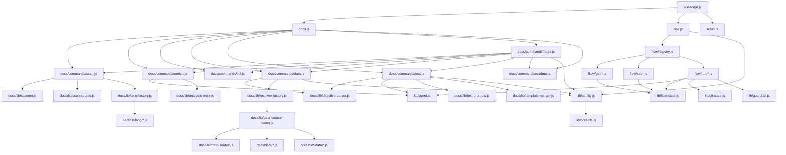

<!-- {{data("base.docs.langSwitcher", {labels: "relative"})}} -->
**English** | [日本語](ja/internal_design.md)
<!-- {{/data}} -->

# Internal Design

## Description

<!-- {{text({prompt: "Write a 1-2 sentence overview of this chapter. Include the project structure, module dependency direction, and key processing flows."})}} -->

This chapter describes the internal structure of sdd-forge, covering how source directories map to responsibilities, the direction of module dependencies from entry points through command layers down to shared utilities, and the key processing flows for documentation generation and SDD lifecycle management.
<!-- {{/text}} -->

## Content

### Project Structure

<!-- {{text({prompt: "Describe the project's directory structure as a tree-format code block. Include role comments for key directories and files. Generate from the actual source code structure.", mode: "deep"})}} -->

```
sdd-forge/
├── src/
│   ├── sdd-forge.js          # CLI entry point; resolves project context via env vars
│   ├── docs.js               # Dispatcher for docs subcommands
│   ├── flow.js               # Dispatcher for flow subcommands
│   ├── help.js               # Help text output
│   ├── setup.js              # Project setup and AGENTS.md generation
│   ├── docs/
│   │   ├── commands/         # Docs pipeline command implementations
│   │   │   ├── scan.js       # Source file scanning → analysis.json
│   │   │   ├── enrich.js     # AI enrichment of analysis entries
│   │   │   ├── init.js       # Template initialization from preset
│   │   │   ├── data.js       # {{data}} directive resolution
│   │   │   ├── text.js       # {{text}} directive resolution via LLM
│   │   │   ├── forge.js      # Full docs build orchestration
│   │   │   ├── review.js     # AI doc review
│   │   │   └── readme.js     # README generation
│   │   ├── lib/              # Shared docs internals
│   │   │   ├── scanner.js            # File traversal logic
│   │   │   ├── scan-source.js        # Per-file analysis extraction
│   │   │   ├── analysis-entry.js     # Analysis entry schema/helpers
│   │   │   ├── chapter-resolver.js   # Maps chapters to template files
│   │   │   ├── command-context.js    # Shared context object for pipeline steps
│   │   │   ├── concurrency.js        # Async concurrency limiter
│   │   │   ├── data-source.js        # DataSource base class
│   │   │   ├── data-source-loader.js # Loads DataSource classes per preset chain
│   │   │   ├── directive-parser.js   # Parses {{data}}/{{text}} directives
│   │   │   ├── forge-prompts.js      # LLM prompt builders for forge/text
│   │   │   ├── lang-factory.js       # Language-specific scanner factory
│   │   │   ├── minify.js             # Template minification helpers
│   │   │   ├── resolver-factory.js   # Builds DataSource method map per preset
│   │   │   ├── template-merger.js    # Merges generated content into templates
│   │   │   ├── text-prompts.js       # LLM prompt builders for text directives
│   │   │   └── lang/                 # Language parsers
│   │   │       ├── js.js, php.js, py.js, yaml.js
│   │   └── data/             # Built-in DataSource implementations
│   │       ├── agents.js, docs.js, lang.js, project.js, text.js
│   ├── flow/
│   │   ├── registry.js       # Flow command registry
│   │   ├── get.js            # Read-only flow state accessors
│   │   ├── set.js            # Mutating flow state writers
│   │   ├── run.js            # Executable flow actions
│   │   ├── get/              # Granular getters (status, context, prompt, ...)
│   │   ├── set/              # Granular setters (step, req, note, ...)
│   │   └── run/              # Flow operations (review, sync, finalize, ...)
│   ├── lib/                  # Shared cross-cutting utilities
│   │   ├── agent.js          # AI invocation wrapper
│   │   ├── cli.js            # parseArgs, repoRoot, PKG_DIR
│   │   ├── config.js         # Config loading and validation
│   │   ├── flow-state.js     # flow.json + .active-flow persistence
│   │   ├── flow-envelope.js  # ok/fail/warn response envelope
│   │   ├── git-state.js      # Git status helpers
│   │   ├── guardrail.js      # Pre-condition checks
│   │   ├── i18n.js           # 3-layer locale resolution
│   │   ├── json-parse.js     # Backtracking JSON parser
│   │   ├── lint.js           # Output linting
│   │   ├── presets.js        # Preset parent-chain resolution
│   │   ├── process.js        # Child process helpers
│   │   ├── progress.js       # Progress reporting
│   │   └── skills.js         # Skill file management
│   └── presets/              # Preset definitions (templates + DataSources)
│       ├── base/, php/, node/, cli/, webapp/, library/
│       ├── node-cli/, cakephp2/, laravel/, symfony/
```
<!-- {{/text}} -->

### Module Composition

<!-- {{text({prompt: "List the major modules in table format. Include module name, file path, and responsibility. Extract from import/require relationships and exports in each file.", mode: "deep"})}} -->

| Module | File Path | Responsibility |
|---|---|---|
| Entry point | `src/sdd-forge.js` | Parses top-level subcommand; resolves `SDD_SOURCE_ROOT` / `SDD_WORK_ROOT`; dispatches to docs.js, flow.js, or standalone commands |
| Docs dispatcher | `src/docs.js` | Routes docs subcommands (`scan`, `enrich`, `init`, `data`, `text`, `forge`, `review`, `readme`) to `docs/commands/*.js` |
| Flow dispatcher | `src/flow.js` | Routes flow subcommands via `flow/registry.js` to get/set/run handlers |
| scan | `src/docs/commands/scan.js` | Traverses source files, extracts per-file analysis entries, writes `analysis.json` |
| enrich | `src/docs/commands/enrich.js` | Sends analysis entries to LLM to attach role, summary, and chapter classification |
| init | `src/docs/commands/init.js` | Copies preset templates into the docs output directory |
| data | `src/docs/commands/data.js` | Resolves `{{data(...)}}` directives synchronously using DataSource method map |
| text | `src/docs/commands/text.js` | Resolves `{{text(...)}}` directives asynchronously via LLM calls |
| forge | `src/docs/commands/forge.js` | Orchestrates the full docs build pipeline (scan → enrich → init → data → text → readme) |
| DataSource base | `src/docs/lib/data-source.js` | Abstract base class; each public method is callable as a `{{data}}` directive |
| resolver-factory | `src/docs/lib/resolver-factory.js` | Walks preset parent chain, loads DataSource classes, builds method dispatch map |
| directive-parser | `src/docs/lib/directive-parser.js` | Parses `{{data}}` and `{{text}}` directive syntax from template files |
| template-merger | `src/docs/lib/template-merger.js` | Merges LLM-generated or data-resolved content back into template files |
| chapter-resolver | `src/docs/lib/chapter-resolver.js` | Maps chapter names to template file paths per preset and config |
| scanner | `src/docs/lib/scanner.js` | File-system traversal with include/exclude filtering |
| lang-factory | `src/docs/lib/lang-factory.js` | Returns the language-specific parser (js, php, py, yaml) for a given file |
| agent | `src/lib/agent.js` | Unified AI invocation wrapper used by enrich, text, and flow run modules |
| config | `src/lib/config.js` | Loads and validates `.sdd-forge/config.json`; exposes typed config object |
| presets | `src/lib/presets.js` | Resolves preset parent chain; locates preset directories in `src/presets/` |
| flow-state | `src/lib/flow-state.js` | Reads and writes `flow.json` and `.active-flow` for SDD lifecycle persistence |
| i18n | `src/lib/i18n.js` | 3-layer locale resolution: package → preset → project override |
| json-parse | `src/lib/json-parse.js` | Backtracking JSON parser for tolerant LLM output parsing |
| flow/get | `src/flow/get/` | Read-only accessors for flow state (status, context, prompt, guardrail, qa-count, issue) |
| flow/set | `src/flow/set/` | Mutating writers for flow state (step, req, note, summary, request, issue, metric, redo, auto) |
| flow/run | `src/flow/run/` | Executable flow operations (retro, review, sync, finalize, prepare-spec, gate, impl-confirm, lint) |
<!-- {{/text}} -->

### Module Dependencies

<!-- {{text({prompt: "Generate a mermaid graph showing inter-module dependencies. Analyze import/require statements in the source code and show the layer structure and dependency direction. Output only the mermaid code block.", mode: "deep"})}} -->


<!-- {{/text}} -->

### Key Processing Flows

<!-- {{text({prompt: "Describe the inter-module data and control flow when running a representative command in numbered steps. Include the flow from entry point to final output.", mode: "deep"})}} -->

1. The user runs `sdd-forge docs build` (or `sdd-forge forge`). `src/sdd-forge.js` reads `SDD_SOURCE_ROOT` and `SDD_WORK_ROOT` from the environment, then dispatches to `src/docs.js`.
2. `docs.js` routes to `src/docs/commands/forge.js`, which loads config via `lib/config.js` and resolves the preset parent chain via `lib/presets.js`.
3. `forge.js` calls `scan.js`: `docs/lib/scanner.js` traverses the source tree, `docs/lib/lang-factory.js` selects the language parser (js/php/py/yaml) per file, and `docs/lib/scan-source.js` extracts per-file analysis entries. Results are written to `.sdd-forge/output/analysis.json`.
4. `forge.js` calls `enrich.js`: the analysis entries are batched and sent to the LLM via `lib/agent.js`. The LLM attaches role, summary, and chapter classification to each entry. The enriched data is written back to `analysis.json`.
5. `forge.js` calls `init.js`: `docs/lib/chapter-resolver.js` maps chapter names (from `preset.json` and `config.json`) to template file paths. Preset templates are copied into the docs output directory if not already present.
6. `forge.js` calls `data.js`: `docs/lib/directive-parser.js` extracts all `{{data(...)}}` directives from the template files. `docs/lib/resolver-factory.js` walks the preset parent chain, loads DataSource classes from `docs/data/` and `presets/*/data/` via `docs/lib/data-source-loader.js`, and builds a method dispatch map. Each directive is resolved synchronously by calling the corresponding DataSource method. Results are merged back into the templates.
7. `forge.js` calls `text.js`: `docs/lib/directive-parser.js` extracts `{{text(...)}}` directives. For each directive, `docs/lib/text-prompts.js` constructs a prompt incorporating enriched analysis context, `lib/agent.js` calls the LLM, and `docs/lib/template-merger.js` merges the response into the template. Concurrency is managed by `docs/lib/concurrency.js`.
8. `forge.js` calls `readme.js` to produce the final README from the assembled docs output.
<!-- {{/text}} -->

### Extension Points

<!-- {{text({prompt: "Describe the locations that need changes and extension patterns when adding new commands or features. Derive from plugin points and dispatch registration patterns in the source code.", mode: "deep"})}} -->

**Adding a new docs subcommand**
- Create `src/docs/commands/<name>.js` implementing a `main()` export and `runIfDirect` guard.
- Register the subcommand in `src/docs.js` by adding a case to the dispatch switch.
- Use `docs/lib/command-context.js` to access shared context (config, preset chain, output paths).

**Adding a new DataSource method (built-in)**
- Add a public method to an existing class in `src/docs/data/`, or create a new class extending `docs/lib/data-source.js` in that directory.
- The method is then callable from templates as `{{data("source.method")}}`.
- `docs/lib/data-source-loader.js` discovers all `.js` files in the data directory automatically.

**Adding a DataSource method in a preset**
- Create `src/presets/<preset>/data/<name>.js` exporting a class that extends `DataSource`.
- `resolver-factory.js` walks the parent chain leaf-to-root, so preset-level methods override base-level methods of the same name.

**Adding a new flow subcommand**
- Add an entry to `src/flow/registry.js` under `get`, `set`, or `run`.
- Implement the handler in the corresponding `src/flow/get/`, `src/flow/set/`, or `src/flow/run/` directory.
- Use `lib/flow-state.js` for reading or writing `flow.json` / `.active-flow`, and `lib/flow-envelope.js` for structured JSON responses.

**Adding a new preset**
- Create `src/presets/<name>/preset.json` declaring `parent`, `chapters`, and scan patterns.
- Add templates under `src/presets/<name>/templates/` and optional DataSources under `src/presets/<name>/data/`.
- `lib/presets.js` resolves the parent chain automatically; no further registration is required.
<!-- {{/text}} -->

---

<!-- {{data("base.docs.nav")}} -->
[← Configuration and Customization](configuration.md)
<!-- {{/data}} -->
