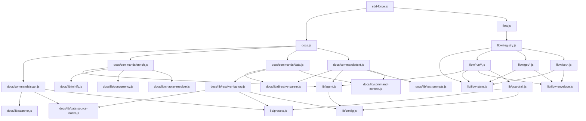

<!-- {{data("base.docs.langSwitcher", {labels: "relative"})}} -->
**English** | [日本語](ja/internal_design.md)
<!-- {{/data}} -->

# Internal Design

## Description

<!-- {{text({prompt: "Write a 1-2 sentence overview of this chapter. Include the project structure, module dependency direction, and key processing flows."})}} -->

This chapter documents the internal architecture of sdd-forge, tracing the three-level command dispatch hierarchy from the CLI entry point through subcommand dispatchers to individual command implementations, and describing the preset-based DataSource plugin system, the scan→enrich→data→text documentation pipeline, and the SDD flow orchestration layer.
<!-- {{/text}} -->

## Content

### Project Structure

<!-- {{text({prompt: "Describe the project's directory structure as a tree-format code block. Include role comments for key directories and files. Generate from the actual source code structure.", mode: "deep"})}} -->

```
src/
├── sdd-forge.js          # Top-level CLI entry point; routes subcommands to dispatchers
├── docs.js               # Docs dispatcher; orchestrates build pipeline and subcommand routing
├── flow.js               # Flow dispatcher; resolves context and delegates via registry.js
├── help.js               # Standalone help command
├── setup.js              # Project initialisation wizard
├── upgrade.js            # Upgrades skills and templates in an existing project
├── presets-cmd.js        # Presets listing command
├── docs/
│   ├── commands/         # One file per CLI subcommand (scan, enrich, data, text, …)
│   ├── data/             # DataSource classes for {{data}} directive resolution
│   └── lib/              # Shared doc-generation libraries
│       ├── directive-parser.js    # Parses {{data}} / {{text}} /  directives
│       ├── resolver-factory.js    # Assembles DataSource resolver from preset chain
│       ├── scanner.js             # File traversal and hash computation
│       ├── template-merger.js     # Merges preset-chain templates and resolves chapters order
│       ├── text-prompts.js        # Builds AI prompts for {{text}} directives
│       ├── minify.js              # Dispatches to language-specific minifiers
│       ├── lang/                  # Per-language parse/minify/extract handlers (js, php, py, yaml)
│       ├── analysis-entry.js      # AnalysisEntry base class and category utilities
│       ├── concurrency.js         # Bounded-concurrency async map helper
│       └── …
├── flow/
│   ├── registry.js       # FLOW_COMMANDS dispatch table with pre/post hooks
│   ├── commands/         # Complex multi-step flow scripts (review, merge, cleanup, report)
│   ├── get/              # Read-only query handlers (context, check, guardrail, resolve-context, …)
│   ├── run/              # State-mutating pipeline steps (gate, finalize, lint, retro, …)
│   └── set/              # Flow state mutation handlers (step, req, metric, note, redo, …)
├── lib/                  # Shared core libraries used across docs and flow subsystems
│   ├── agent.js          # Claude CLI invocation (sync and async) with retry and stdin fallback
│   ├── flow-state.js     # flow.json read/write, active-flow tracking, step and metric mutation
│   ├── flow-envelope.js  # Typed ok/fail/warn envelope constructors and output()
│   ├── guardrail.js      # Guardrail loading, merging, phase filtering, and lint matching
│   ├── i18n.js           # Multi-tier locale loading with deep-merge and interpolation
│   ├── presets.js        # Preset key resolution and parent-chain traversal
│   ├── config.js         # config.json loading, path helpers (sddDir, sddOutputDir)
│   ├── include.js        # Template include directive processor
│   ├── skills.js         # Skill file deployment to .agents/skills/ and .claude/skills/
│   ├── json-parse.js     # Lenient JSON repair for AI-generated output
│   ├── lint.js           # Guardrail lint checks against git-changed files
│   ├── git-state.js      # Git worktree, branch, and ahead-count utilities
│   ├── process.js        # Thin spawnSync wrapper
│   └── progress.js       # ANSI progress bar and logger factory
└── presets/              # Preset definitions (base, node, cli, cakephp2, laravel, hono, …)
    ├── base/
    │   ├── preset.json   # Chapters order, scan patterns
    │   ├── data/         # Preset-specific DataSource overrides
    │   ├── templates/    # Per-language chapter Markdown templates
    │   └── locale/       # Preset-specific locale strings
    └── …
```
<!-- {{/text}} -->

### Module Composition

<!-- {{text({prompt: "List the major modules in table format. Include module name, file path, and responsibility. Extract from import/require relationships and exports in each file.", mode: "deep"})}} -->

| Module | File path | Responsibility |
| --- | --- | --- |
| CLI entry | `src/sdd-forge.js` | Parses top-level subcommand; dynamically imports the correct dispatcher or standalone command |
| Docs dispatcher | `src/docs.js` | Routes `sdd-forge docs` subcommands; orchestrates the multi-step `build` pipeline |
| Flow dispatcher | `src/flow.js` | Resolves project context; dispatches `sdd-forge flow` commands via `FLOW_COMMANDS` with pre/post hooks |
| Flow registry | `src/flow/registry.js` | Declares the `FLOW_COMMANDS` dispatch table mapping group+command to module factories and lifecycle hooks |
| scan | `src/docs/commands/scan.js` | Walks source files, runs DataSource parsers, writes `analysis.json` with stable IDs and MD5 hashes |
| enrich | `src/docs/commands/enrich.js` | Batch-calls AI agent on `analysis.json` entries; merges summary, detail, chapter, role, and keywords |
| data | `src/docs/commands/data.js` | Resolves `{{data}}` directives in chapter files using the DataSource resolver chain |
| text | `src/docs/commands/text.js` | Fills `{{text}}` directives by invoking AI agent with enriched analysis context; supports batch and per-directive modes |
| DataSource base | `src/docs/lib/data-source.js` | Base class for all DataSources; provides `desc()`, `mergeDesc()`, and `toMarkdownTable()` helpers |
| directive-parser | `src/docs/lib/directive-parser.js` | Parses `{{data}}`, `{{text}}`, and `` directives; performs in-place block replacement |
| resolver-factory | `src/docs/lib/resolver-factory.js` | Builds a resolver from the preset chain by loading DataSource instances and layering overrides |
| template-merger | `src/docs/lib/template-merger.js` | Resolves and merges per-language Markdown templates across the preset parent chain |
| text-prompts | `src/docs/lib/text-prompts.js` | Constructs AI system prompts, per-directive prompts, and batch prompts from enriched analysis data |
| scanner | `src/docs/lib/scanner.js` | File traversal, glob-to-regex, hash computation, and language-handler dispatch for source parsing |
| minify | `src/docs/lib/minify.js` | Central minification dispatcher delegating to per-language handlers via `lang-factory.js` |
| agent | `src/lib/agent.js` | Wraps Claude CLI invocation with ARG_MAX-safe stdin fallback, async retry, and work-dir management |
| flow-state | `src/lib/flow-state.js` | Persists `flow.json` per spec; manages `.active-flow` registry; exposes step/metric mutation helpers |
| flow-envelope | `src/lib/flow-envelope.js` | Typed `ok`/`fail`/`warn` envelope constructors; `output()` serialises to stdout and sets exit code |
| guardrail | `src/lib/guardrail.js` | Loads and merges guardrail definitions from preset chain and project overrides; filters by phase |
| i18n | `src/lib/i18n.js` | Multi-tier locale deep-merge with namespaced key lookup and `{{param}}` interpolation |
| presets | `src/lib/presets.js` | Resolves preset parent chains; `resolveMultiChains()` supports array types for multi-stack projects |
<!-- {{/text}} -->

### Module Dependencies

<!-- {{text({prompt: "Generate a mermaid graph showing inter-module dependencies. Analyze import/require statements in the source code and show the layer structure and dependency direction. Output only the mermaid code block.", mode: "deep"})}} -->


<!-- {{/text}} -->

### Key Processing Flows

<!-- {{text({prompt: "Describe the inter-module data and control flow when running a representative command in numbered steps. Include the flow from entry point to final output.", mode: "deep"})}} -->

The following describes the data and control flow for `sdd-forge build`, the primary documentation generation command:

1. **Entry** — `sdd-forge.js` receives `build` as the subcommand, resolves `SDD_SOURCE_ROOT` and `SDD_WORK_ROOT` from environment variables, and delegates to `docs.js`.
2. **scan** — `docs/commands/scan.js` calls `collectFiles()` to gather source files matching preset glob patterns. It loads DataSource modules via `loadDataSources()` from each preset in the chain, runs `parse()` on every file, computes MD5 hashes for change detection, assigns stable IDs by matching against any existing `analysis.json`, and writes the result to `.sdd-forge/output/analysis.json`.
3. **enrich** — `docs/commands/enrich.js` reads `analysis.json`, calls `collectEntries()` to flatten categories, splits entries into token-limited batches via `splitIntoBatches()`, and sends each batch to the AI agent using `callAgentAsync()` with bounded concurrency from `mapWithConcurrency()`. The JSON response is repaired via `repairJson()`, validated against the known chapter list, and merged back into `analysis.json` incrementally, adding `summary`, `detail`, `chapter`, `role`, and `keywords` fields per entry.
4. **init** — `docs/commands/init.js` reads the preset template hierarchy via `resolveTemplates()` in `template-merger.js`, merges parent and child chapter templates using block inheritance, and writes the resolved Markdown files into the `docs/` directory, skipping files that already exist.
5. **data** — `docs/commands/data.js` creates a resolver via `createResolver()` in `resolver-factory.js`, which loads DataSource class instances from the preset chain. It then iterates each chapter file, calls `resolveDataDirectives()` from `directive-parser.js` to replace `{{data(...)}}` blocks with the output of the corresponding DataSource method, and writes changed files back to disk.
6. **text** — `docs/commands/text.js` reads each chapter file, calls `parseDirectives()` to locate `{{text(...)}}` blocks, assembles enriched analysis context for the chapter via `getEnrichedContext()` (reading source files for deep-mode directives), constructs a batch prompt via `buildBatchPrompt()`, and sends it to the AI agent. The JSON response is applied to the file using `applyBatchJsonToFile()`, filling each directive block with generated prose.
7. **Output** — All chapter files in `docs/` are now populated with structured data tables and AI-generated narrative text, ready for review or commit.
<!-- {{/text}} -->

### Extension Points

<!-- {{text({prompt: "Describe the locations that need changes and extension patterns when adding new commands or features. Derive from plugin points and dispatch registration patterns in the source code.", mode: "deep"})}} -->

**Adding a new `{{data}}` method:**
Add a public method to an existing DataSource class under `src/docs/data/` or create a new `.js` file in that directory. The `data-source-loader.js` module auto-discovers all `.js` files in `data/` directories and instantiates their default export class, making the new method available as `{{data("preset.sourceName.methodName")}}` in any chapter template. Preset-specific DataSources belong in `src/presets/<preset>/data/`.

**Adding a new docs subcommand:**
Register the command name and script path in the `SCRIPTS` map inside `src/docs.js`, then create the handler file under `src/docs/commands/`. Export a `main(ctx)` function and call `runIfDirect()` at the bottom for standalone execution support.

**Adding a new flow step or command:**
Declare the step ID in the `FLOW_STEPS` array in `src/lib/flow-state.js` and map it to a phase in `PHASE_MAP`. Register the command in the `FLOW_COMMANDS` object in `src/flow/registry.js` under the appropriate group (`get`, `set`, or `run`), providing an `execute` factory returning the module, plus optional `pre`, `post`, and `onError` lifecycle hooks. Create the handler file in `src/flow/get/`, `src/flow/run/`, or `src/flow/set/`; export an `execute(ctx)` function that calls `output()` from `flow-envelope.js` to emit structured results.

**Adding a new preset:**
Create a directory under `src/presets/<name>/` containing a `preset.json` that declares the `parent` key and `chapters` ordering. Add DataSource files to the `data/` subdirectory and Markdown chapter templates to `templates/<lang>/`. The preset becomes available in `resolveChainSafe()` automatically via `presets.js`.

**Adding guardrail rules:**
Add entries to `guardrail.json` inside `src/presets/<preset>/templates/<lang>/` for preset-level rules, or to `.sdd-forge/guardrail.json` for project-level overrides. Each entry requires an `id`, `title`, `body`, and a `meta.phase` array selecting which pipeline phase enforces it. Lint-mode rules additionally carry a `meta.lint` regex string processed by `guardrail.js`.

**Adding a language handler:**
Create a module under `src/docs/lib/lang/` implementing `minify`, `parse`, `extractImports`, `extractExports`, and `extractEssential` as needed, then register the file extension(s) in the `EXT_MAP` in `src/docs/lib/lang-factory.js`.
<!-- {{/text}} -->

---

<!-- {{data("base.docs.nav")}} -->
[← Configuration and Customization](configuration.md)
<!-- {{/data}} -->
