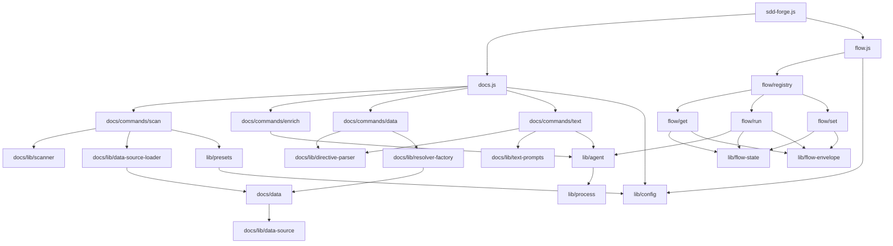

<!-- {{data("base.docs.langSwitcher", {labels: "relative"})}} -->
**English** | [日本語](ja/internal_design.md)
<!-- {{/data}} -->

# Internal Design

## Description

<!-- {{text({prompt: "Write a 1-2 sentence overview of this chapter. Include the project structure, module dependency direction, and key processing flows."})}} -->

sdd-forge follows a three-level CLI dispatch hierarchy: the top-level `sdd-forge.js` entry point routes to domain dispatchers (`docs.js`, `flow.js`), which delegate to individual command modules under `docs/commands/` and `flow/`. Module dependencies flow downward from CLI commands through shared utility libraries in `docs/lib/` and `lib/`, with AI invocation centralised in `lib/agent.js` and persistent SDD flow state managed in `lib/flow-state.js`.
<!-- {{/text}} -->

## Content

### Project Structure

<!-- {{text({prompt: "Describe the project's directory structure as a tree-format code block. Include role comments for key directories and files. Generate from the actual source code structure.", mode: "deep"})}} -->

```
src/
├── sdd-forge.js               # CLI entry point and subcommand router
├── docs.js                    # docs subcommand dispatcher
├── flow.js                    # flow subcommand dispatcher
├── docs/
│   ├── commands/              # Executable doc pipeline commands
│   │   ├── scan.js            # Source analysis → analysis.json
│   │   ├── enrich.js          # AI enrichment of analysis entries
│   │   ├── data.js            # Populates {{data}} directives
│   │   ├── text.js            # Fills {{text}} directives via AI
│   │   └── forge.js           # Full doc generation orchestrator
│   ├── data/                  # Shared DataSource implementations
│   │   ├── project.js         # Package name, version, description
│   │   ├── docs.js            # Chapter list, nav, lang switcher
│   │   ├── lang.js            # Language navigation links
│   │   └── agents.js          # SDD template and project context
│   └── lib/                   # Doc generation utilities
│       ├── lang/              # Language parsers (js, php, py, yaml)
│       ├── directive-parser.js    # {{data}}/{{text}} directive processing
│       ├── scanner.js             # File traversal, glob matching, hashing
│       ├── resolver-factory.js    # DataSource resolver construction
│       ├── template-merger.js     # Preset-chain template inheritance
│       ├── text-prompts.js        # AI prompt builders
│       ├── command-context.js     # Shared context resolution
│       ├── chapter-resolver.js    # Category-to-chapter mapping
│       ├── analysis-entry.js      # AnalysisEntry base class
│       ├── minify.js              # Code minification dispatcher
│       └── concurrency.js         # Async concurrency pool
├── flow/
│   ├── registry.js            # Command registry with pre/post hooks
│   ├── get/                   # Read-only flow state queries
│   │   ├── check.js           # Prerequisite and git state checks
│   │   ├── context.js         # Analysis context search (ngram/AI)
│   │   ├── resolve-context.js # Full flow context for skills
│   │   ├── guardrail.js       # Guardrail article retrieval
│   │   └── qa-count.js        # QA question counter
│   ├── run/                   # Stateful flow step execution
│   │   ├── prepare-spec.js    # Spec init and branch/worktree creation
│   │   ├── gate.js            # Spec quality gate (heuristic + AI)
│   │   ├── impl-confirm.js    # Implementation readiness check
│   │   ├── review.js          # AI code review dispatcher
│   │   └── retro.js           # Post-implementation retrospective
│   └── set/                   # State mutation commands
│       ├── step.js            # Step status updates
│       ├── req.js             # Requirement status updates
│       ├── metric.js          # Phase metric counters
│       ├── note.js            # Append notes to flow state
│       └── summary.js         # Requirements list initialization
├── lib/                       # Core shared library
│   ├── agent.js               # Claude CLI invocation (sync/async/retry)
│   ├── flow-state.js          # flow.json CRUD and step lifecycle
│   ├── flow-envelope.js       # Typed JSON output helpers
│   ├── guardrail.js           # Guardrail article parsing and merging
│   ├── i18n.js                # Locale loading and interpolation
│   ├── config.js              # Config loading and path resolution
│   ├── presets.js             # Preset chain resolution
│   ├── progress.js            # ANSI progress bar and logger
│   ├── process.js             # spawnSync wrapper
│   ├── git-state.js           # Git state utilities
│   ├── lint.js                # Guardrail lint runner
│   ├── include.js             # Template include processor
│   └── json-parse.js          # Lenient JSON repair utility
├── presets/                   # Built-in preset definitions
│   └── <name>/
│       ├── preset.json        # Metadata, parent, chapters, scan config
│       ├── templates/<lang>/  # Chapter Markdown templates with directives
│       └── data/              # Preset-specific DataSource modules
└── locale/
    └── <lang>/
        ├── ui.json
        ├── messages.json
        └── prompts.json
```
<!-- {{/text}} -->

### Module Composition

<!-- {{text({prompt: "List the major modules in table format. Include module name, file path, and responsibility. Extract from import/require relationships and exports in each file.", mode: "deep"})}} -->

| Module | Path | Responsibility |
|---|---|---|
| CLI Entry | `src/sdd-forge.js` | Top-level argument parsing and subcommand routing |
| Docs Dispatcher | `src/docs.js` | Routes `docs` subcommands to command modules |
| Flow Dispatcher | `src/flow.js` | Routes `flow` subcommands via `registry.js` |
| scan | `src/docs/commands/scan.js` | Traverses source files, runs DataSources, and writes `analysis.json` |
| enrich | `src/docs/commands/enrich.js` | Sends analysis batches to AI agent to annotate entries with summary, detail, chapter, and keywords |
| data | `src/docs/commands/data.js` | Resolves `{{data}}` directives in chapter files using DataSource resolver maps |
| text | `src/docs/commands/text.js` | Fills `{{text}}` directives via batched AI calls with shrinkage validation |
| directive-parser | `src/docs/lib/directive-parser.js` | Lexes and processes `{{data}}`, `{{text}}`, and `` template directives |
| scanner | `src/docs/lib/scanner.js` | File traversal, glob matching, MD5 hashing, and language handler dispatch |
| resolver-factory | `src/docs/lib/resolver-factory.js` | Assembles per-preset DataSource resolver maps from the inheritance chain |
| data-source | `src/docs/lib/data-source.js` | Base class for all DataSources; provides `toMarkdownTable`, `desc`, and override helpers |
| template-merger | `src/docs/lib/template-merger.js` | Merges preset-chain Markdown templates using block inheritance |
| text-prompts | `src/docs/lib/text-prompts.js` | Builds system prompts, file prompts, and batch prompts for the `text` command |
| command-context | `src/docs/lib/command-context.js` | Resolves shared CLI context (root, agent, config, docsDir, language) |
| agent | `src/lib/agent.js` | Synchronous and async Claude CLI invocation with stdin fallback and configurable retry |
| flow-state | `src/lib/flow-state.js` | Reads and writes `flow.json`; manages step lifecycle, requirements, metrics, and active-flow registry |
| flow-envelope | `src/lib/flow-envelope.js` | Constructs `ok`/`fail`/`warn` envelopes and serialises them to stdout |
| registry | `src/flow/registry.js` | Maps flow command names to `execute` modules with optional `pre`/`post` lifecycle hooks |
| guardrail | `src/lib/guardrail.js` | Parses guardrail articles from Markdown, filters by phase, and merges preset and project rules |
| presets | `src/lib/presets.js` | Resolves preset inheritance chains for DataSource loading and template resolution |
<!-- {{/text}} -->

### Module Dependencies

<!-- {{text({prompt: "Generate a mermaid graph showing inter-module dependencies. Analyze import/require statements in the source code and show the layer structure and dependency direction. Output only the mermaid code block.", mode: "deep"})}} -->


<!-- {{/text}} -->

### Key Processing Flows

<!-- {{text({prompt: "Describe the inter-module data and control flow when running a representative command in numbered steps. Include the flow from entry point to final output.", mode: "deep"})}} -->

The following steps trace execution of `sdd-forge text`, which fills `{{text}}` directives across docs chapter files.

1. `sdd-forge.js` receives the `text` subcommand and delegates to `docs.js`.
2. `docs.js` dynamically imports `docs/commands/text.js` and calls `main()`.
3. `text.js` calls `resolveCommandContext()` from `docs/lib/command-context.js`, which loads `config.json`, resolves the AI agent profile, and determines `docsDir` and the output language.
4. `loadFullAnalysis()` reads `.sdd-forge/output/analysis.json` into memory.
5. `getChapterFiles()` returns the ordered chapter filenames, respecting the preset's `chapters` array and any project-level `config.chapters` overrides.
6. For each chapter file, `parseDirectives()` from `docs/lib/directive-parser.js` scans for `{{text(...)}}` directives and extracts their prompt text, parameters (mode, id, limits), and line positions.
7. `getEnrichedContext()` from `docs/lib/text-prompts.js` selects enriched analysis entries whose `chapter` field matches the current file and formats them as a structured context block.
8. `buildBatchPrompt()` assembles a single prompt combining the stripped chapter content, enriched context, and all directive instructions indexed by unique IDs.
9. `callAgentAsync()` in `lib/agent.js` spawns the configured Claude CLI process; prompts exceeding the `ARGV_SIZE_THRESHOLD` constant are delivered via stdin rather than command-line arguments to avoid OS ARG_MAX limits.
10. The response is repaired with `repairJson()` from `lib/json-parse.js` and parsed as a `{ id: generatedText }` map; `applyBatchJsonToFile()` inserts each value between its directive's open and close tags.
11. Shrinkage detection compares line counts before and after; if the result passes validation, the updated chapter file is written to disk and a summary is logged.
<!-- {{/text}} -->

### Extension Points

<!-- {{text({prompt: "Describe the locations that need changes and extension patterns when adding new commands or features. Derive from plugin points and dispatch registration patterns in the source code.", mode: "deep"})}} -->

**New doc command**: Create a module in `src/docs/commands/` exporting a `main(ctx)` function and register it in the `docs.js` dispatch switch. The `resolveCommandContext()` function from `docs/lib/command-context.js` provides a standardised context object (root, agent, config, docsDir, language) for all commands.

**New DataSource**: Create a class extending `DataSource` from `src/docs/lib/data-source.js` and place it in `src/docs/data/` (shared across all presets) or `src/presets/<name>/data/` (preset-scoped). `data-source-loader.js` auto-discovers all `.js` files in those directories at runtime without any manual registration. The class is addressed in templates as `{{data("presetKey.sourceName.methodName")}}`.

**New preset**: Create a directory under `src/presets/<name>/` with a `preset.json` file specifying `parent`, `scan`, and `chapters` fields, Markdown templates under `templates/<lang>/`, and optionally custom DataSources under `data/`. The `template-merger.js` inheritance chain is resolved automatically from the `parent` field.

**New flow command**: Create an `execute(ctx)` module in `src/flow/get/`, `src/flow/run/`, or `src/flow/set/`, then register it in `src/flow/registry.js` under the corresponding namespace. Attach optional `pre(ctx)` and `post(ctx, result)` functions to the registry entry for automatic step-status transitions via `lib/flow-state.js`.

**New guardrail rule**: Append a `<!--  --> ... <!--  -->` block to `guardrail.md` in a preset's `templates/<lang>/` directory. Project-specific rules go in `.sdd-forge/guardrail.md` and are merged with preset rules at runtime by `lib/guardrail.js`.
<!-- {{/text}} -->

---

<!-- {{data("base.docs.nav")}} -->
[← Configuration and Customization](configuration.md)
<!-- {{/data}} -->
