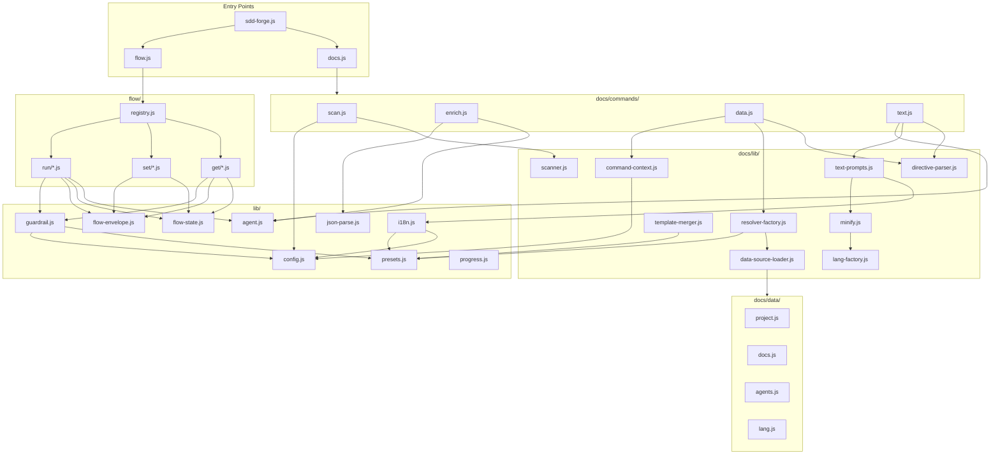

<!-- {{data("base.docs.langSwitcher", {labels: "relative"})}} -->
**English** | [日本語](ja/internal_design.md)
<!-- {{/data}} -->

# Internal Design

## Description

<!-- {{text({prompt: "Write a 1-2 sentence overview of this chapter. Include the project structure, module dependency direction, and key processing flows."})}} -->

This chapter documents the internal architecture of sdd-forge, organised into three subsystems — documentation generation (`docs/`), SDD workflow (`flow/`), and shared utilities (`lib/`) — with dependencies flowing strictly from CLI commands inward through domain libraries to shared primitives, and key pipelines orchestrated by the top-level dispatchers `docs.js` and `flow.js`.
<!-- {{/text}} -->

## Content

### Project Structure

<!-- {{text({prompt: "Describe the project's directory structure as a tree-format code block. Include role comments for key directories and files. Generate from the actual source code structure.", mode: "deep"})}} -->

```
src/
├── sdd-forge.js          # Main CLI entry point; routes to docs.js, flow.js, or standalone commands
├── docs.js               # Docs subsystem dispatcher; orchestrates scan→enrich→data→text→readme pipeline
├── flow.js               # Flow subsystem dispatcher; resolves context and routes via registry.js
├── help.js               # Help output (direct console.log, no main())
├── setup.js              # Interactive project setup wizard
├── upgrade.js            # Skill and template diff-based upgrade
├── lib/                  # Shared cross-cutting utilities
│   ├── agent.js          # AI agent invocation (sync/async, stdin fallback, retry)
│   ├── flow-state.js     # flow.json CRUD; steps, requirements, metrics, active-flow tracking
│   ├── flow-envelope.js  # Typed ok/fail/warn JSON envelope constructors
│   ├── guardrail.js      # Guardrail article parsing, filtering, and merging
│   ├── i18n.js           # Multi-tier locale loading and interpolation
│   ├── config.js         # Config loading and sdd-forge path helpers
│   ├── presets.js        # Preset chain resolution (resolveChainSafe, resolveMultiChains)
│   ├── json-parse.js     # Lenient JSON repair for AI-generated output
│   ├── progress.js       # ANSI progress bar, spinner, and prefixed logger
│   ├── skills.js         # Skill template deployment to .agents/skills/ and .claude/skills/
│   ├── include.js        # Template include directive processor
│   ├── git-state.js      # Git dirty detection, branch, ahead count, gh availability
│   ├── lint.js           # Guardrail lint runner over changed files
│   └── process.js        # Thin spawnSync wrapper
├── docs/
│   ├── commands/         # Docs CLI entry points
│   │   ├── scan.js       # Source traversal → analysis.json
│   │   ├── enrich.js     # Batched AI enrichment of analysis entries
│   │   ├── data.js       # Resolves {{data}} directives in chapter files
│   │   └── text.js       # Fills {{text}} directives via AI agent
│   ├── data/             # DataSource implementations
│   │   ├── project.js    # Package name, version, description, scripts
│   │   ├── docs.js       # Chapter list, nav links, language switcher
│   │   ├── agents.js     # SDD template content and agent metadata
│   │   └── lang.js       # Language navigation link generator
│   └── lib/              # Docs domain library
│       ├── directive-parser.js    # Parses {{data}}/{{text}}/block directives
│       ├── resolver-factory.js    # Assembles DataSources from preset chains
│       ├── template-merger.js     # Preset-chain template resolution and merging
│       ├── scanner.js             # File traversal, glob matching, hash computation
│       ├── text-prompts.js        # AI prompt builders for text directives
│       ├── minify.js              # Language-agnostic code minification dispatcher
│       ├── lang/                  # Language-specific parsers
│       │   ├── js.js              # JS/TS: parse, minify, extractEssential
│       │   ├── php.js             # PHP: parse, minify, extractEssential
│       │   ├── py.js              # Python: minify, extractEssential
│       │   └── yaml.js            # YAML: hash-comment stripping
│       ├── analysis-entry.js      # AnalysisEntry base class and summary builders
│       ├── chapter-resolver.js    # Category-to-chapter mapping from docs templates
│       ├── command-context.js     # Shared context resolution for all doc commands
│       ├── concurrency.js         # Promise-based bounded concurrency pool
│       └── forge-prompts.js       # Prompt builders for the forge command
├── flow/
│   ├── registry.js       # FLOW_COMMANDS dispatch table with pre/post hooks
│   ├── get/              # Read-only flow query commands
│   │   ├── resolve-context.js  # Full flow context (worktree, git, spec, requirements)
│   │   ├── context.js          # Analysis entry keyword/ngram/AI search
│   │   ├── check.js            # Prerequisite and dirty-state checks
│   │   ├── prompt.js           # Built-in prompt text lookup by lang and kind
│   │   ├── guardrail.js        # Guardrail article retrieval by phase
│   │   └── qa-count.js         # QA question counter from flow state
│   ├── set/              # Flow state mutation commands
│   │   ├── step.js, req.js, note.js, metric.js, summary.js, request.js, redo.js, auto.js
│   └── run/              # Active execution commands
│       ├── prepare-spec.js     # Branch/worktree creation and spec initialisation
│       ├── gate.js             # Spec quality gate (heuristic + AI guardrail)
│       ├── impl-confirm.js     # Implementation readiness check
│       └── retro.js            # Post-implementation AI retrospective
├── presets/              # Framework-specific preset directories
│   ├── base/             # Base preset (templates, data sources, guardrail rules)
│   ├── node/, php/, cli/, webapp/, library/, ...  # Derived presets
│   └── cakephp2/, laravel/, symfony/, ...         # Framework leaf presets
└── locale/               # i18n message files
    ├── en/               # ui.json, messages.json, prompts.json
    └── ja/               # Japanese translations
```
<!-- {{/text}} -->

### Module Composition

<!-- {{text({prompt: "List the major modules in table format. Include module name, file path, and responsibility. Extract from import/require relationships and exports in each file.", mode: "deep"})}} -->

| Module | File Path | Responsibility |
| --- | --- | --- |
| sdd-forge | `src/sdd-forge.js` | Main CLI entry; routes to docs.js, flow.js, or standalone commands |
| docs dispatcher | `src/docs.js` | Orchestrates the scan→enrich→data→text→readme build pipeline |
| flow dispatcher | `src/flow.js` | Resolves flow context and dispatches to registry.js handlers |
| flow registry | `src/flow/registry.js` | Maps flow subcommands to handlers with pre/post lifecycle hooks |
| scan | `src/docs/commands/scan.js` | Traverses source files, runs DataSources, produces analysis.json |
| enrich | `src/docs/commands/enrich.js` | Batched AI enrichment of analysis entries (summary, detail, chapter) |
| data | `src/docs/commands/data.js` | Resolves `{{data}}` directives in chapter files via DataSource resolvers |
| text | `src/docs/commands/text.js` | Fills `{{text}}` directives by invoking an AI agent in batch mode |
| directive-parser | `src/docs/lib/directive-parser.js` | Parses `{{data}}`, `{{text}}`, and block directives from Markdown |
| resolver-factory | `src/docs/lib/resolver-factory.js` | Assembles DataSource instances from preset inheritance chains |
| template-merger | `src/docs/lib/template-merger.js` | Resolves and merges per-preset Markdown templates for all chapters |
| scanner | `src/docs/lib/scanner.js` | File traversal, glob matching, MD5 hashing, and language dispatch |
| text-prompts | `src/docs/lib/text-prompts.js` | Builds system prompts and batch prompts for AI text generation |
| minify | `src/docs/lib/minify.js` | Dispatches to language-specific handlers for code minification |
| data-source-loader | `src/docs/lib/data-source-loader.js` | Dynamically discovers and instantiates DataSource .js files from a directory |
| DataSource base | `src/docs/lib/data-source.js` | Base class providing desc lookup, override merging, and table rendering |
| agent | `src/lib/agent.js` | Invokes AI agents synchronously or asynchronously with retry and stdin fallback |
| flow-state | `src/lib/flow-state.js` | Reads and writes flow.json; manages steps, requirements, metrics, active flows |
| flow-envelope | `src/lib/flow-envelope.js` | Constructs typed ok/fail/warn JSON envelopes for flow command output |
| guardrail | `src/lib/guardrail.js` | Parses, filters, and merges guardrail rule articles from preset templates |
| i18n | `src/lib/i18n.js` | Multi-tier locale loading, namespaced key resolution, and string interpolation |
| presets | `src/lib/presets.js` | Resolves preset inheritance chains (resolveChainSafe, resolveMultiChains) |
| json-parse | `src/lib/json-parse.js` | Lenient JSON repair utility for malformed AI-generated output |
| progress | `src/lib/progress.js` | ANSI progress bar, animated spinner, and prefixed logger factory |
<!-- {{/text}} -->

### Module Dependencies

<!-- {{text({prompt: "Generate a mermaid graph showing inter-module dependencies. Analyze import/require statements in the source code and show the layer structure and dependency direction. Output only the mermaid code block.", mode: "deep"})}} -->


<!-- {{/text}} -->

### Key Processing Flows

<!-- {{text({prompt: "Describe the inter-module data and control flow when running a representative command in numbered steps. Include the flow from entry point to final output.", mode: "deep"})}} -->

The following steps trace the `sdd-forge build` pipeline — the most representative end-to-end command — from entry point to written documentation.

1. **`sdd-forge.js`** parses `build` as a docs subcommand and delegates to `docs.js`, forwarding remaining argv. Environment variables `SDD_SOURCE_ROOT` and `SDD_WORK_ROOT` are resolved to locate the project.
2. **`docs.js` pipeline setup** calls `resolveCommandContext()` (command-context.js) once, loading `config.json`, determining the preset type, and resolving the AI agent. A weighted step list is created and handed to `createProgress()` (progress.js).
3. **scan step** — `docs/commands/scan.js` calls `collectFiles()` (scanner.js) with the preset's include/exclude globs, collecting relative file paths and MD5 hashes. DataSource modules are loaded from the preset chain via `loadDataSources()` (data-source-loader.js) and each runs its `parse()` method per file. New entries receive stable IDs matched against any existing `analysis.json`. The result is written to `.sdd-forge/output/analysis.json`.
4. **enrich step** — `docs/commands/enrich.js` reads `analysis.json`, groups unenriched entries into token-limited batches, and submits each batch asynchronously via `callAgentAsync()` (agent.js) with a concurrency cap from `mapWithConcurrency()`. Each batch prompt is built by `buildEnrichPrompt()`, referencing the available chapter list from `resolveChaptersOrder()`. Responses are repaired with `repairJson()` (json-parse.js) and merged back into the analysis; the file is saved after each successful batch.
5. **data step** — `docs/commands/data.js` creates a resolver via `createResolver()` (resolver-factory.js), which loads all DataSource instances for the preset chain and project overrides. For each chapter file, `resolveDataDirectives()` (directive-parser.js) scans for `{{data(...)}}` markers, calls the matching DataSource method, and replaces the block content in-place. Changed files are written back to `docs/`.
6. **text step** — `docs/commands/text.js` reads each chapter, extracts `{{text(...)}}` directives, and calls `getEnrichedContext()` (text-prompts.js) to build analysis context filtered to that chapter's entries. `buildBatchPrompt()` formats all directives into a single JSON-structured request, which is submitted via `callAgentAsync()`. The JSON response is applied to the file via `applyBatchJsonToFile()`, filling each directive block.
7. **Output** — Updated chapter Markdown files are written to `docs/`. The pipeline logs a summary of changed files and total elapsed time via the progress bar.
<!-- {{/text}} -->

### Extension Points

<!-- {{text({prompt: "Describe the locations that need changes and extension patterns when adding new commands or features. Derive from plugin points and dispatch registration patterns in the source code.", mode: "deep"})}} -->

**Adding a new docs CLI command**
Create a file in `src/docs/commands/` that exports a `main(ctx)` function. Register it in the `SCRIPTS` map in `src/docs.js`. The `resolveCommandContext()` helper (docs/lib/command-context.js) standardises context resolution including root, docsDir, config, agent, and translation helpers.

**Adding a new DataSource**
Extend the `DataSource` base class (docs/lib/data-source.js) and place the file in a preset's `data/` directory. The `loadDataSources()` function (docs/lib/data-source-loader.js) discovers all `.js` files in that directory automatically and instantiates them. Each public method becomes callable from templates via `{{data("preset.sourceName.methodName")}}`.

**Adding a new flow subcommand**
Implement an `execute(ctx)` function in `src/flow/get/`, `src/flow/set/`, or `src/flow/run/`, then add a corresponding entry to `FLOW_COMMANDS` in `src/flow/registry.js`. Each entry supports optional `pre` and `post` hook functions for step status transitions and metric increments. The `ctx` object provides `root`, `flowState`, `config`, `args`, and agent resolution.

**Adding a new preset**
Create a directory under `src/presets/` with a `preset.json` declaring the `parent` chain, `scan` include/exclude patterns, and `chapters` array. Add Markdown templates under `templates/<lang>/` and optional DataSources under `data/`. Run `sdd-forge upgrade` to propagate skill and template changes to active projects.

**Adding guardrail rules**
Add `<!--  --> ... <!--  -->` blocks to the preset's `templates/<lang>/guardrail.md`. Project-specific overrides go in `.sdd-forge/guardrail.md`. The `loadMergedArticles()` function (lib/guardrail.js) merges preset and project articles, deduplicating by title.
<!-- {{/text}} -->

---

<!-- {{data("base.docs.nav")}} -->
[← Configuration and Customization](configuration.md)
<!-- {{/data}} -->
