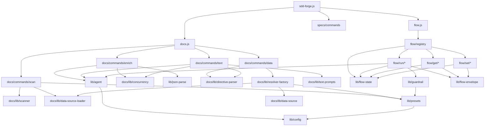

<!-- {{data("base.docs.langSwitcher", {labels: "relative"})}} -->
**English** | [日本語](ja/internal_design.md)
<!-- {{/data}} -->

# Internal Design

## Description

<!-- {{text({prompt: "Write a 1-2 sentence overview of this chapter. Include the project structure, module dependency direction, and key processing flows."})}} -->

This chapter describes the internal architecture of `sdd-forge`: a three-layer CLI tool composed of a top-level entry dispatcher, domain command groups (`docs/`, `flow/`, `specs/`), and shared infrastructure (`lib/`). Dependencies flow inward from CLI commands toward shared libraries, with DataSource resolvers bridging analysis data to document templates and AI agent calls driving both the enrichment and text-generation pipelines.
<!-- {{/text}} -->

## Content

### Project Structure

<!-- {{text({prompt: "Describe the project's directory structure as a tree-format code block. Include role comments for key directories and files. Generate from the actual source code structure.", mode: "deep"})}} -->

```
src/
├── sdd-forge.js            # Top-level CLI entry point and command dispatcher
├── docs.js                  # docs subcommand dispatcher
├── flow.js                  # flow subcommand dispatcher
├── docs/
│   ├── commands/            # CLI commands: scan, enrich, data, text, forge, readme, agents
│   ├── data/                # Built-in DataSource classes (agents, docs, lang, project, text)
│   └── lib/                 # Shared doc utilities
│       ├── directive-parser.js    # Parses {{data}} / {{text}} directives
│       ├── resolver-factory.js    # Creates DataSource resolver instances
│       ├── scanner.js             # File collection and hash computation
│       ├── template-merger.js     # Resolves and merges preset-chain templates
│       ├── text-prompts.js        # Builds AI prompts for text directives
│       ├── chapter-resolver.js    # Maps analysis categories to chapter files
│       ├── concurrency.js         # Bounded-concurrency async worker pool
│       └── lang/                  # Language-specific parsers (js, php, py, yaml)
├── flow/
│   ├── registry.js          # Central dispatch table for flow sub-commands
│   ├── get/                 # Read-only flow handlers (context, check, guardrail, …)
│   ├── set/                 # Mutation handlers (step, req, metric, note, …)
│   └── run/                 # Execution handlers (gate, lint, review, retro, …)
├── specs/
│   └── commands/            # spec init and gate commands
├── lib/                     # Shared infrastructure (no domain knowledge)
│   ├── agent.js             # AI agent invocation (sync + async + retry)
│   ├── config.js            # Config loading and path helpers
│   ├── flow-state.js        # Flow state persistence and mutation helpers
│   ├── flow-envelope.js     # Structured JSON output protocol (ok/fail/warn)
│   ├── guardrail.js         # Guardrail loading, merging, and filtering
│   ├── i18n.js              # Locale loading and translation factory
│   ├── presets.js           # Preset chain resolution
│   ├── lint.js              # Lint guardrail validation against changed files
│   └── git-state.js         # Git status, branch, and ahead-count utilities
├── presets/                 # Preset definitions (base, php, node, cakephp2, …)
│   └── <name>/
│       ├── preset.json      # Parent chain, scan patterns, chapter order
│       ├── data/            # Preset-specific DataSource classes
│       └── templates/<lang>/# Chapter template Markdown files
├── locale/                  # Translation JSON files (ui, messages, prompts)
└── templates/
    └── skills/              # Skill SKILL.md templates deployed to .claude/skills/
```
<!-- {{/text}} -->

### Module Composition

<!-- {{text({prompt: "List the major modules in table format. Include module name, file path, and responsibility. Extract from import/require relationships and exports in each file.", mode: "deep"})}} -->

| Module | File Path | Responsibility |
| --- | --- | --- |
| CLI entry | `sdd-forge.js` | Parses top-level subcommand, resolves project context via env vars, dispatches to domain runners |
| Docs dispatcher | `docs.js` | Routes `scan`, `enrich`, `data`, `text`, `forge`, `readme`, `agents`, `translate` |
| Flow dispatcher | `flow.js` | Routes `flow get/set/run` to `flow/registry.js` via dynamic import |
| scan | `docs/commands/scan.js` | Traverses source files with DataSources, computes hashes, writes `analysis.json` |
| enrich | `docs/commands/enrich.js` | Batch-calls AI agent to annotate analysis entries with summary, detail, chapter, keywords |
| data | `docs/commands/data.js` | Resolves `{{data}}` directives in chapter files using DataSource resolver |
| text | `docs/commands/text.js` | Fills `{{text}}` directives via AI agent in batch or per-directive mode |
| directive-parser | `docs/lib/directive-parser.js` | Parses `{{data(...)}}` and `{{text(...)}}` markers and resolves replacements in-place |
| resolver-factory | `docs/lib/resolver-factory.js` | Instantiates DataSource classes from preset chains and project overrides |
| scanner | `docs/lib/scanner.js` | Glob-to-regex file collection, MD5 hashing, language handler dispatch |
| template-merger | `docs/lib/template-merger.js` | Resolves preset-chain template inheritance, handles block/extends directives |
| text-prompts | `docs/lib/text-prompts.js` | Builds system prompts, enriched context, and batch prompts for AI text generation |
| agent | `lib/agent.js` | Wraps Claude CLI invocation (sync/async), handles stdin fallback for long prompts |
| flow-state | `lib/flow-state.js` | Reads and writes `flow.json`, manages `.active-flow`, provides atomic mutation helpers |
| flow-envelope | `lib/flow-envelope.js` | Serialises `ok`/`fail`/`warn` envelopes to stdout for machine-readable output |
| flow/registry | `flow/registry.js` | Maps flow command paths to execute factories with pre/post lifecycle hooks |
| guardrail | `lib/guardrail.js` | Loads guardrail JSON from preset chains and project overrides, hydrates lint regex |
| presets | `lib/presets.js` | Resolves preset key to parent-chain directory list via `preset.json` traversal |
| i18n | `lib/i18n.js` | Merges locale JSON from package, preset, and project tiers; provides `translate()` factory |
| concurrency | `docs/lib/concurrency.js` | Queue-based async worker pool used by enrich, forge, text, and translate |
<!-- {{/text}} -->

### Module Dependencies

<!-- {{text({prompt: "Generate a mermaid graph showing inter-module dependencies. Analyze import/require statements in the source code and show the layer structure and dependency direction. Output only the mermaid code block.", mode: "deep"})}} -->


<!-- {{/text}} -->

### Key Processing Flows

<!-- {{text({prompt: "Describe the inter-module data and control flow when running a representative command in numbered steps. Include the flow from entry point to final output.", mode: "deep"})}} -->

The following steps trace execution of `sdd-forge build`, which runs the full `scan → enrich → data → text` pipeline:

1. `sdd-forge.js` reads `SDD_SOURCE_ROOT` / `SDD_WORK_ROOT` env vars, loads `config.json`, and dispatches to `docs.js` with a resolved context object.
2. `docs.js` calls `scan` → `docs/commands/scan.js` reads preset chain directories via `lib/presets.js`, dynamically imports each `data/<source>.js` DataSource module through `data-source-loader.js`, and calls `collectFiles()` in `docs/lib/scanner.js` to walk the source tree.
3. Each DataSource's `parse()` method is invoked per file; results are assigned stable IDs by matching against an existing `analysis.json` index and written to `.sdd-forge/output/analysis.json`.
4. `docs.js` calls `enrich` → `docs/commands/enrich.js` collects all entries from `analysis.json`, splits them into token-limited batches, and calls `callAgentAsync()` in `lib/agent.js` concurrently via `mapWithConcurrency()`.
5. Each AI response is repaired with `repairJson()` and merged back into the analysis; progress is saved incrementally to disk after each batch.
6. `docs.js` calls `data` → `docs/commands/data.js` creates a resolver via `resolver-factory.js` (which instantiates DataSource classes from the preset chain), then iterates chapter files calling `resolveDataDirectives()` in `directive-parser.js` to inline data blocks and writes changed files.
7. `docs.js` calls `text` → `docs/commands/text.js` reads enriched analysis context per chapter via `text-prompts.js`, sends a single batch JSON prompt to the AI agent, parses the response, and applies generated content into each `{{text}}` block.
<!-- {{/text}} -->

### Extension Points

<!-- {{text({prompt: "Describe the locations that need changes and extension patterns when adding new commands or features. Derive from plugin points and dispatch registration patterns in the source code.", mode: "deep"})}} -->

**Adding a new doc command**

- Create a handler file under `src/docs/commands/<name>.js` implementing a `main(ctx)` function and calling `runIfDirect(import.meta.url, main)` at the bottom.
- Register the command name in `src/docs.js` dispatch table alongside existing entries such as `scan`, `enrich`, `data`, and `text`.

**Adding a new DataSource method**

- Extend an existing class in `src/docs/data/` or create a new `<name>.js` file that `export default`s a class extending `DataSource`. The `data-source-loader.js` auto-discovers all `.js` files in `data/` directories, so no registration step is needed.
- Expose new methods matching the `(analysis, labels)` signature; they become callable from `{{data("preset.source.method")}}` directives.

**Adding a new preset type**

- Create `src/presets/<name>/preset.json` declaring `parent`, `scan`, and `chapters` fields.
- Add preset-specific DataSources under `src/presets/<name>/data/` and chapter templates under `src/presets/<name>/templates/<lang>/`.

**Adding a new flow sub-command**

- Create a handler module under `src/flow/get/`, `src/flow/set/`, or `src/flow/run/` exporting an `async execute(ctx)` function that calls `output(ok(...))` or `output(fail(...))`.
- Register the command in `src/flow/registry.js` under the appropriate namespace with an `execute` dynamic-import factory. Optionally attach `pre` and `post` lifecycle hooks for step-status side effects.
- If the command introduces a new pipeline step, add its ID to the `FLOW_STEPS` array and `PHASE_MAP` in `src/lib/flow-state.js`.
<!-- {{/text}} -->

---

<!-- {{data("base.docs.nav")}} -->
[← Configuration and Customization](configuration.md)
<!-- {{/data}} -->
