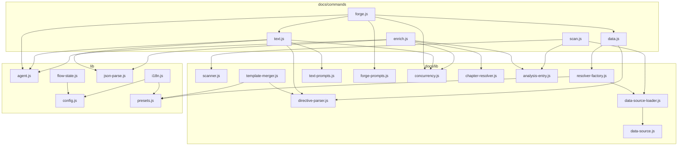

<!-- {{data("base.docs.langSwitcher", {labels: "relative"})}} -->
**English** | [日本語](ja/internal_design.md)
<!-- {{/data}} -->

# Internal Design

## Description

<!-- {{text({prompt: "Write a 1-2 sentence overview of this chapter. Include the project structure, module dependency direction, and key processing flows."})}} -->

This chapter describes the internal architecture of sdd-forge, covering the layered module structure that flows from CLI entry points through doc-pipeline command modules down to shared utility libraries and preset-scoped DataSources. Dependencies are strictly top-down: command modules depend on lib utilities and DataSources, while no utility module imports from command modules, ensuring clean separation between orchestration and infrastructure.
<!-- {{/text}} -->

## Content

### Project Structure

<!-- {{text({prompt: "Describe the project's directory structure as a tree-format code block. Include role comments for key directories and files. Generate from the actual source code structure.", mode: "deep"})}} -->

```
src/
├── docs/
│   ├── commands/               # Pipeline stage executables: scan, enrich, data, text, forge, review
│   ├── data/                   # Built-in DataSource classes (agents, docs, lang, project, text)
│   └── lib/                    # Shared doc-pipeline library code
│       ├── lang/               # Per-language parse/minify handlers (js.js, php.js, py.js, yaml.js)
│       ├── directive-parser.js # Parses and resolves {{data}} / {{text}} template directives
│       ├── template-merger.js  # Preset-chain template resolution and block-inheritance merging
│       ├── resolver-factory.js # Assembles DataSource resolver instances from preset chains
│       ├── scanner.js          # File collection, glob matching, language-aware file parsing
│       ├── text-prompts.js     # Prompt builders for the {{text}} fill pipeline
│       ├── forge-prompts.js    # Prompt builders for the forge multi-round AI loop
│       ├── concurrency.js      # mapWithConcurrency bounded async worker pool
│       ├── analysis-entry.js   # AnalysisEntry base class and category summary utilities
│       └── chapter-resolver.js # Maps analysis categories to doc chapter assignments
├── lib/                        # Core cross-cutting utilities
│   ├── agent.js                # AI agent invocation: sync, async, retry, stdin fallback
│   ├── config.js               # Config loading and sdd path helpers
│   ├── flow-state.js           # Persistent SDD flow state via flow.json and .active-flow
│   ├── flow-envelope.js        # Structured JSON response envelope for flow commands
│   ├── guardrail.js            # Guardrail rule loading, merging, and scope matching
│   ├── i18n.js                 # Layered locale loading with domain:key namespacing
│   ├── json-parse.js           # LLM JSON repair (tolerates truncation, trailing commas)
│   ├── lint.js                 # Lint-phase guardrail checks over git-changed files
│   └── presets.js              # Preset chain resolution by leaf type key
├── presets/                    # Built-in preset definitions (base, node, php, laravel, …)
│   └── <preset>/
│       ├── preset.json         # Metadata, parent chain, scan patterns, chapters order
│       ├── templates/          # Language-specific doc templates per lang code
│       └── data/               # Preset-specific DataSource class files
└── locale/                     # Translation files by language and domain (ui, messages, prompts)
```
<!-- {{/text}} -->

### Module Composition

<!-- {{text({prompt: "List the major modules in table format. Include module name, file path, and responsibility. Extract from import/require relationships and exports in each file.", mode: "deep"})}} -->

| Module | File | Responsibility |
| --- | --- | --- |
| scan | `src/docs/commands/scan.js` | Walks source files through preset DataSources to produce `analysis.json` with incremental hash-based updates |
| enrich | `src/docs/commands/enrich.js` | Annotates each analysis entry with AI-generated summary, detail, chapter assignment, role, and keywords in token-bounded batches |
| data | `src/docs/commands/data.js` | Resolves `{{data(...)}}` directives in chapter files by dispatching to DataSource methods via the preset-chain resolver |
| text | `src/docs/commands/text.js` | Fills `{{text(...)}}` directives via batched AI agent calls with enriched context and shrinkage validation |
| forge | `src/docs/commands/forge.js` | Orchestrates multi-round AI doc generation with configurable review feedback loop and per-file concurrency |
| directive-parser | `src/docs/lib/directive-parser.js` | Parses block and inline `{{data}}` / `{{text}}` directives and performs in-place substitution in chapter file text |
| resolver-factory | `src/docs/lib/resolver-factory.js` | Builds a resolver object by loading and initializing DataSource instances from each preset in the inheritance chain |
| template-merger | `src/docs/lib/template-merger.js` | Resolves chapter templates across preset layers using additive or block-override merge strategies |
| scanner | `src/docs/lib/scanner.js` | Collects files matching include/exclude glob patterns, computes MD5 hashes, and delegates language-specific parsing |
| data-source | `src/docs/lib/data-source.js` | Base class for all DataSources providing `toMarkdownTable()`, `desc()`, and per-entry override merging |
| data-source-loader | `src/docs/lib/data-source-loader.js` | Dynamically imports DataSource class files from a directory and attaches source file path for change detection |
| lang-factory | `src/docs/lib/lang-factory.js` | Maps file extensions to per-language handler objects (parse, minify, extractEssential) |
| agent | `src/lib/agent.js` | Core AI agent invocation with sync, async, and retry modes; routes large prompts through stdin to avoid ARG_MAX limits |
| flow-state | `src/lib/flow-state.js` | Reads and writes `flow.json` and `.active-flow` to track multi-step SDD workflow progress and metrics |
| i18n | `src/lib/i18n.js` | Loads and merges locale JSON files from package, preset, and project directories with `{{param}}` interpolation |
| json-parse | `src/lib/json-parse.js` | Repairs truncated or malformed LLM JSON responses using a hand-written recursive descent parser |
<!-- {{/text}} -->

### Module Dependencies

<!-- {{text({prompt: "Generate a mermaid graph showing inter-module dependencies. Analyze import/require statements in the source code and show the layer structure and dependency direction. Output only the mermaid code block.", mode: "deep"})}} -->


<!-- {{/text}} -->

### Key Processing Flows

<!-- {{text({prompt: "Describe the inter-module data and control flow when running a representative command in numbered steps. Include the flow from entry point to final output.", mode: "deep"})}} -->

The following steps trace a `sdd-forge build` invocation that runs the full scan → enrich → data → text pipeline.

1. The top-level `sdd-forge.js` entry point parses the subcommand and delegates to the `docs.js` dispatcher, which calls each stage command in sequence.
2. `scan.js` calls `resolveCommandContext()` to load `config.json`, then `collectFiles()` walks the configured source root against the preset's include/exclude glob patterns and computes MD5 hashes for each file.
3. `loadDataSources()` dynamically imports every `.js` DataSource from each preset in the resolved inheritance chain, then calls each DataSource's `scan()` method to produce structured category entries.
4. An existing-entry index is built from the prior `analysis.json` to preserve stable entry IDs and skip unchanged files (hash match). The merged result is written to `.sdd-forge/output/analysis.json`.
5. `enrich.js` reads the analysis, flattens all categories via `collectEntries()`, and splits them into token-bounded batches using character-count estimation.
6. For each batch, `buildEnrichPrompt()` constructs a structured prompt embedding the chapter list and code snippets. `callAgentAsync()` is invoked per batch through `mapWithConcurrency()` with configurable concurrency.
7. Each AI response is repaired by `repairJson()` and merged back into the analysis object via `mergeEnrichment()`, which validates chapter assignments against the known chapter list and writes progress incrementally.
8. `data.js` constructs a resolver via `createResolver()`, which assembles DataSource instances for each preset chain. `resolveDataDirectives()` iterates chapter files and replaces every `{{data(...)}}` block by dispatching to the matching DataSource method.
9. `text.js` parses each chapter for `{{text(...)}}` directives, builds a batch prompt via `buildBatchPrompt()` with enriched context from `getEnrichedContext()`, calls the AI agent, parses the JSON response, validates against shrinkage thresholds, and writes the updated chapter files to `docs/`.
<!-- {{/text}} -->

### Extension Points

<!-- {{text({prompt: "Describe the locations that need changes and extension patterns when adding new commands or features. Derive from plugin points and dispatch registration patterns in the source code.", mode: "deep"})}} -->

**Adding a new DataSource**: Create a `.js` file that exports a default class extending `DataSource` and place it in `src/presets/<preset>/data/` for a preset-scoped source, or in the project's `.sdd-forge/data/` for a project-specific override. `loadDataSources()` in `data-source-loader.js` discovers and instantiates all `.js` files in those directories automatically at resolver construction time; no registration step is required.

**Adding a new preset**: Create a directory under `src/presets/` containing a `preset.json` file (with `parent`, `scan.include`, `scan.exclude`, and `chapters` fields), a `templates/<lang>/` directory for chapter template files, and an optional `data/` directory. The preset is activated by setting `type` in the project's `.sdd-forge/config.json`.

**Adding a new docs pipeline command**: Add a module to `src/docs/commands/` following the `async function main(ctx)` pattern with `runIfDirect(import.meta.url, main)` at the bottom, then register the subcommand in the `docs.js` dispatcher. Call `resolveCommandContext()` to obtain the standard context object (root, config, agent, type, docsDir).

**Adding a new language handler**: Create a module in `src/docs/lib/lang/` implementing at minimum `minify(code)` and optionally `parse()`, `extractImports()`, `extractExports()`, and `extractEssential()`. Register the target file extension(s) in the `EXT_MAP` object in `src/docs/lib/lang-factory.js`.

**Extending SDD flow steps**: Add a new step ID to the `FLOW_STEPS` array in `src/lib/flow-state.js` and add its phase mapping to `PHASE_MAP`. Implement the step handler as a new module under `src/flow/commands/` and register it in the `flow.js` dispatcher.
<!-- {{/text}} -->

---

<!-- {{data("base.docs.nav")}} -->
[← Configuration and Customization](configuration.md)
<!-- {{/data}} -->
