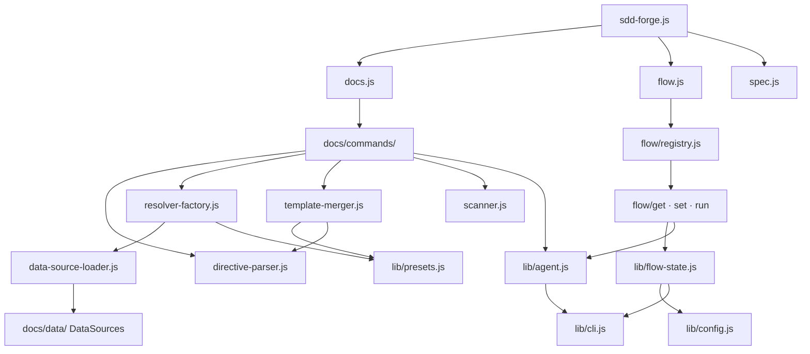

<!-- {{data("base.docs.langSwitcher", {labels: "relative"})}} -->
**English** | [日本語](ja/internal_design.md)
<!-- {{/data}} -->

# Internal Design

## Description

<!-- {{text({prompt: "Write a 1-2 sentence overview of this chapter. Include the project structure, module dependency direction, and key processing flows."})}} -->

sdd-forge follows a three-level CLI dispatch hierarchy — `sdd-forge.js` → domain dispatchers (`docs.js`, `flow.js`, `spec.js`) → individual command scripts — with modules flowing inward from entry points through a docs build pipeline into a shared library layer (`lib/`). The docs subsystem processes source code through five sequential stages (scan → enrich → init → data → text), each reading or writing `.sdd-forge/output/analysis.json` and `docs/` chapter files, while the flow subsystem maintains SDD workflow state independently via a two-file persistence scheme centered on `flow.json`.
<!-- {{/text}} -->

## Content

### Project Structure

<!-- {{text({prompt: "Describe the project's directory structure as a tree-format code block. Include role comments for key directories and files. Generate from the actual source code structure.", mode: "deep"})}} -->

```
src/
├── sdd-forge.js                  # Main CLI entry; dispatches docs/spec/flow via PKG_DIR
├── docs.js                       # docs subcommand dispatcher
├── flow.js                       # flow subcommand dispatcher; routes via registry.js
├── spec.js                       # spec subcommand dispatcher
├── docs/
│   ├── commands/                 # docs pipeline step implementations
│   │   ├── scan.js               # Step 1: file collection and DataSource parsing
│   │   ├── enrich.js             # Step 2: AI batch metadata enrichment
│   │   ├── init.js               # Step 3: template initialization from preset chain
│   │   ├── data.js               # Step 4: {{data}} directive resolution
│   │   ├── text.js               # Step 5: {{text}} AI generation
│   │   ├── forge.js              # Full pipeline orchestrator (build alias)
│   │   ├── review.js             # Documentation quality review
│   │   ├── readme.js             # README.md generation
│   │   └── changelog.js          # Changelog generation
│   ├── data/                     # Built-in DataSource implementations
│   │   ├── agents.js             # AGENTS.md SDD/PROJECT section generators
│   │   ├── docs.js               # Chapter listing, navigation, langSwitcher
│   │   ├── lang.js               # Language switcher link generator
│   │   ├── project.js            # package.json metadata (name, version, scripts)
│   │   └── text.js               # {{text}} delegation stub (always returns null)
│   └── lib/                      # Shared library for the docs pipeline
│       ├── scanner.js            # File discovery, glob-to-regex, MD5 hashing
│       ├── directive-parser.js   # {{data}}/{{text}}/ parser and resolver
│       ├── template-merger.js    # Block inheritance and multi-chain merge engine
│       ├── resolver-factory.js   # DataSource loader and preset.source.method router
│       ├── data-source.js        # DataSource base class with table/desc helpers
│       ├── scan-source.js        # Scannable mixin for parse-capable DataSources
│       ├── analysis-entry.js     # Entry base class, isEmptyEntry, buildSummary
│       ├── analysis-filter.js    # docs.exclude glob filtering
│       ├── chapter-resolver.js   # Chapter ordering and category-to-chapter mapping
│       ├── command-context.js    # Shared context resolver for all docs commands
│       ├── text-prompts.js       # Prompt builders for the text command
│       ├── forge-prompts.js      # Prompt builders for the forge command
│       ├── lang-factory.js       # File-extension to language handler dispatch
│       ├── lang/                 # Per-language parse/minify handlers
│       │   ├── js.js             # JS/TS parser and minifier
│       │   ├── php.js            # PHP parser with CakePHP relation extraction
│       │   ├── py.js             # Python hash-comment stripper
│       │   └── yaml.js           # YAML hash-comment stripper
│       ├── minify.js             # Generic minifier delegating to lang/
│       ├── concurrency.js        # Bounded parallel task runner
│       └── data-source-loader.js # Dynamic DataSource importer
├── flow/
│   ├── registry.js               # Single source of truth for all flow subcommand metadata
│   ├── get.js / set.js / run.js  # Second-level dispatchers
│   ├── get/                      # Read-only flow state access
│   │   ├── context.js            # Analysis entries for AI agent context
│   │   ├── prompt.js             # Structured prompts for flow step decisions
│   │   ├── guardrail.js          # Phase-filtered guardrail articles
│   │   └── resolve-context.js    # Full context recovery after compaction
│   ├── set/                      # State mutation commands
│   │   └── step.js, req.js, note.js, metric.js, auto.js, ...
│   └── run/                      # Action execution commands
│       └── retro.js, review.js, sync.js, finalize.js, ...
├── lib/                          # Shared utilities across all subsystems
│   ├── agent.js                  # Sync/async AI invocation, stdin fallback, retry
│   ├── cli.js                    # repoRoot, parseArgs, PKG_DIR, worktree detection
│   ├── config.js                 # Config loading and .sdd-forge path resolution
│   ├── flow-state.js             # Flow state persistence and mutation helpers
│   ├── flow-envelope.js          # ok/fail/warn JSON response format
│   ├── git-state.js              # Read-only git query helpers
│   ├── guardrail.js              # Guardrail article parsing, filtering, and loading
│   ├── i18n.js                   # 3-layer locale merge system
│   ├── json-parse.js             # AI response JSON repair utility
│   ├── lint.js                   # Guardrail lint pipeline runner
│   ├── process.js                # spawnSync wrapper with normalized result
│   ├── progress.js               # ANSI progress bar and structured logger
│   ├── skills.js                 # Skill deployment to .agents/ and .claude/
│   ├── entrypoint.js             # runIfDirect guard for ES module files
│   └── presets.js                # Preset chain resolution
├── presets/                      # Preset definitions (base, php, node, cli, ...)
│   └── <type>/
│       ├── preset.json           # parent link, scan globs, chapters order
│       ├── data/                 # Preset-specific DataSource classes
│       ├── templates/<lang>/     # Chapter and AGENTS.md templates
│       └── locale/               # i18n overrides for this preset
├── templates/
│   └── skills/                   # Skill SKILL.md templates for deployment
└── locale/                       # Default i18n locale files (en/, ja/, ...)
```
<!-- {{/text}} -->

### Module Composition

<!-- {{text({prompt: "List the major modules in table format. Include module name, file path, and responsibility. Extract from import/require relationships and exports in each file.", mode: "deep"})}} -->

| Module | File Path | Responsibility |
| --- | --- | --- |
| Main entry | `src/sdd-forge.js` | Top-level CLI entry; resolves and re-executes subcommand scripts via `PKG_DIR` |
| docs dispatcher | `src/docs.js` | Routes docs subcommands (scan, enrich, init, data, text, forge, review, …) to command scripts |
| flow dispatcher | `src/flow.js` | Routes `flow get/set/run` using `flow/registry.js` as the command map |
| flow registry | `src/flow/registry.js` | Single source of truth mapping all flow subcommand names to script paths and bilingual descriptions |
| scan | `src/docs/commands/scan.js` | Collects source files via globs, routes to Scannable DataSources, writes incremental `analysis.json` with hash-based caching |
| enrich | `src/docs/commands/enrich.js` | AI batch enrichment adding summary, detail, chapter, role, and keywords to each analysis entry |
| init | `src/docs/commands/init.js` | Initializes `docs/` from preset template inheritance chains; optionally AI-filters chapters by relevance |
| data | `src/docs/commands/data.js` | Resolves `{{data(...)}}` directives in chapter files using DataSource method output |
| text | `src/docs/commands/text.js` | Fills `{{text(...)}}` directives via batch JSON-mode AI calls; supports light and deep enriched context modes |
| forge | `src/docs/commands/forge.js` | Full pipeline orchestrator: scan → enrich → init → data → text → readme |
| directive-parser | `src/docs/lib/directive-parser.js` | Parses `{{data}}`, `{{text}}`, and `` directives; performs in-place replacement in template text |
| template-merger | `src/docs/lib/template-merger.js` | Block-level template inheritance and additive multi-preset chain merge for `init` |
| resolver-factory | `src/docs/lib/resolver-factory.js` | Loads DataSources per preset chain; routes `preset.source.method` calls to the correct instance |
| DataSource base | `src/docs/lib/data-source.js` | Base class providing `desc()`, `toMarkdownTable()`, and override helpers for all DataSources |
| scanner | `src/docs/lib/scanner.js` | File discovery, glob-to-regex conversion, per-file MD5 hashing, and language-agnostic file parsing |
| analysis-entry | `src/docs/lib/analysis-entry.js` | Base entry class (file, hash, lines); `buildSummary()` aggregation; `ANALYSIS_META_KEYS` exclusion set |
| command-context | `src/docs/lib/command-context.js` | Resolves shared command context (root, config, type, agent, lang, docsDir) for all docs commands |
| agent | `src/lib/agent.js` | Sync/async AI agent invocation with stdin fallback for large prompts, retry support, and env isolation |
| flow-state | `src/lib/flow-state.js` | Two-file flow state persistence (`.active-flow` registry + per-spec `flow.json`); mutation helpers |
| flow-envelope | `src/lib/flow-envelope.js` | Standardized `ok/fail/warn` JSON response format for all flow get/set/run commands |
| presets | `src/lib/presets.js` | Preset inheritance chain resolution via `resolveChainSafe()` and `resolveMultiChains()` |
| i18n | `src/lib/i18n.js` | Three-layer locale merge (src/locale → preset/locale → project/locale) with domain-namespaced keys |
| guardrail | `src/lib/guardrail.js` | Parses guardrail articles from Markdown, filters by phase and scope, merges preset and project sources |
<!-- {{/text}} -->

### Module Dependencies

<!-- {{text({prompt: "Generate a mermaid graph showing inter-module dependencies. Analyze import/require statements in the source code and show the layer structure and dependency direction. Output only the mermaid code block.", mode: "deep"})}} -->


<!-- {{/text}} -->

### Key Processing Flows

<!-- {{text({prompt: "Describe the inter-module data and control flow when running a representative command in numbered steps. Include the flow from entry point to final output.", mode: "deep"})}} -->

The following steps describe the data and control flow for `sdd-forge docs build`, which runs the full documentation pipeline:

1. `sdd-forge.js` receives `docs build`, resolves `docs.js` via `PKG_DIR`, and re-executes with the remaining arguments.
2. `docs.js` maps `build` to `docs/commands/forge.js` and imports it as the pipeline orchestrator.
3. **scan** — `forge.js` invokes `scan.js`: `collectFiles()` in `scanner.js` walks the source tree applying include/exclude glob patterns; each file is MD5-hashed and compared against the existing `analysis.json` (unchanged files, including their enrichment data, are preserved); matching `Scannable` DataSource instances parse changed files; the updated result is written to `.sdd-forge/output/analysis.json`.
4. **enrich** — `forge.js` invokes `enrich.js`: pending entries are grouped into batches by line count via `splitIntoBatches()`; `buildEnrichPrompt()` constructs a structured prompt per batch requesting JSON output; `callAgentAsync()` in `lib/agent.js` invokes the configured AI agent; `mergeEnrichment()` writes `summary`, `detail`, `chapter`, `role`, and `keywords` back into `analysis.json`.
5. **init** — `forge.js` invokes `init.js`: `resolveTemplates()` in `template-merger.js` builds a layer stack from the preset chain resolved via `lib/presets.js`; `mergeResolved()` applies ``/`` overrides bottom-up; the resulting chapter files are written to `docs/`.
6. **data** — `forge.js` invokes `data.js`: for each chapter file, `parseDirectives()` locates `{{data(...)}}` blocks; `createResolver()` in `resolver-factory.js` loads DataSources from all preset chain directories; each directive is replaced in-place with the string returned by the resolved `DataSource.method()`.
7. **text** — `forge.js` invokes `text.js`: `stripFillContent()` clears existing fill content; `buildBatchPrompt()` packages all `{{text(...)}}` directives in the file into a single JSON-mode prompt keyed by directive ID; `callAgentAsync()` returns the JSON response; `applyBatchJsonToFile()` inserts content in reverse line order to preserve offsets.
8. The completed `docs/` contains fully populated Markdown documentation reflecting the current source code state.
<!-- {{/text}} -->

### Extension Points

<!-- {{text({prompt: "Describe the locations that need changes and extension patterns when adding new commands or features. Derive from plugin points and dispatch registration patterns in the source code.", mode: "deep"})}} -->

**New `{{data}}` method (extending DataSource output):**
Create a class extending `DataSource` in `src/docs/data/` for universal availability, or in `src/presets/<type>/data/` for type-specific scope. `resolver-factory.js` auto-discovers all `.js` files in `data/` directories along the preset chain at startup and calls `instance.init(ctx)` on each. The new method is immediately callable via `{{data("preset.sourceName.methodName")}}` in any chapter template without further registration.

**New Scannable DataSource (new analysis category):**
Extend `Scannable(DataSource)`, implement `match(relPath)` and `parse(absPath)`, and define a static `Entry` class extending `AnalysisEntry` with category-specific fields. Place the file in a preset's `data/` directory. `scan.js` detects scannable sources by checking `typeof instance.parse === 'function'` and routes matching files automatically during the scan step.

**New docs pipeline command:**
Add a script in `src/docs/commands/` and register the name-to-path mapping in `src/docs.js`. Use `resolveCommandContext()` from `docs/lib/command-context.js` to receive the standard context object (root, config, type, agent, lang, docsDir), and `runIfDirect()` from `lib/entrypoint.js` as the entry guard.

**New flow subcommand:**
Add a script to `src/flow/get/`, `src/flow/set/`, or `src/flow/run/` as appropriate, then register the entry in `src/flow/registry.js` under the corresponding category with `script` path and bilingual `desc`. The second-level dispatchers (`get.js`, `set.js`, `run.js`) auto-route by key with no further modification required.

**New preset type:**
Create `src/presets/<new-type>/preset.json` declaring a `parent` field for chain inheritance, `scan.include`/`scan.exclude` globs, and a `chapters` array. Add `data/`, `templates/<lang>/`, and `locale/` directories as needed. `lib/presets.js` resolves the full inheritance chain at runtime via `resolveChainSafe()` by following `parent` links from the leaf preset up to `base`.
<!-- {{/text}} -->

---

<!-- {{data("base.docs.nav")}} -->
[← Configuration and Customization](configuration.md) | [Development, Testing, and Distribution →](development_testing.md)
<!-- {{/data}} -->
