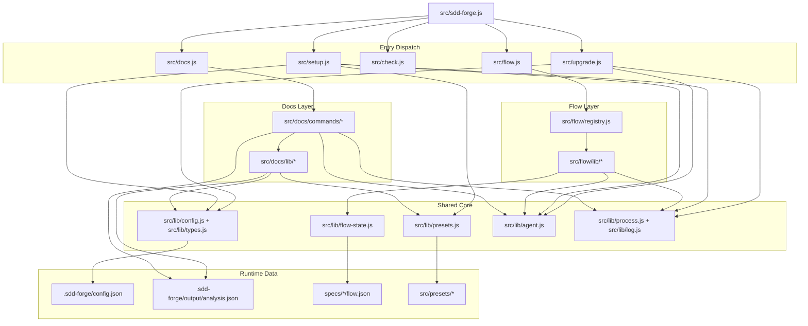

<!-- {{data("base.docs.langSwitcher", {labels: "relative"})}} -->
[日本語](ja/internal_design.md) | **English**
<!-- {{/data}} -->

# Internal Design

## Description

<!-- {{text({prompt: "Write a 1-2 sentence overview of this chapter. Include the project structure, module dependency direction, and key processing flows."})}} -->

The project is organized around a top-level CLI entrypoint (`src/sdd-forge.js`) that dispatches to namespace-specific runners (`docs`, `flow`, `check`) and standalone commands (`setup`, `upgrade`, `presets`, `help`). Dependencies flow from entrypoints to command modules and then to shared `src/lib/*` and `src/docs/lib/*` utilities, with major runtime paths centered on `docs build` pipeline execution and `flow` registry-driven command dispatch.
<!-- {{/text}} -->

## Content

### Project Structure

<!-- {{text({prompt: "Describe the project's directory structure as a tree-format code block. Include role comments for key directories and files. Generate from the actual source code structure.", mode: "deep"})}} -->

```text
sdd-forge/
├── package.json                    # CLI package manifest; maps `sdd-forge` bin to `src/sdd-forge.js`
├── src/
│   ├── sdd-forge.js                # Top-level CLI entrypoint and command router
│   ├── docs.js                     # `docs` namespace dispatcher and `build` pipeline orchestrator
│   ├── flow.js                     # `flow` namespace dispatcher using registry metadata
│   ├── check.js                    # `check` namespace dispatcher
│   ├── setup.js                    # Interactive project bootstrap and config generation
│   ├── upgrade.js                  # Template/skill upgrade and config migration command
│   ├── docs/commands/              # Docs subcommands (`scan`, `enrich`, `init`, `data`, `text`, etc.)
│   ├── flow/lib/                   # Flow command implementations (`run-*`, `get-*`, `set-*`)
│   ├── flow/registry.js            # Declarative flow command definitions and hooks
│   ├── lib/                        # Shared utilities (config, agent, presets, flow-state, logging)
│   └── presets/                    # Built-in preset definitions (`preset.json`, guardrails, templates)
├── docs/                           # Generated project documentation outputs
├── specs/                          # Spec-Driven Development artifacts per spec ID
└── .sdd-forge/                     # Runtime state/config/output (config.json, output/analysis.json)
```
<!-- {{/text}} -->

### Module Composition

<!-- {{text({prompt: "List the major modules in table format. Include module name, file path, and responsibility. Extract from import/require relationships and exports in each file.", mode: "deep"})}} -->

| Module | File Path | Responsibility |
| --- | --- | --- |
| CLI Entrypoint | `src/sdd-forge.js` | Parses top-level args, initializes logger/config, and dynamically imports namespace or standalone command scripts. |
| Docs Dispatcher | `src/docs.js` | Routes docs subcommands and executes the `build` sequence (`scan -> enrich -> init -> data -> text -> readme -> agents -> translate`). |
| Flow Dispatcher | `src/flow.js` | Resolves execution context, parses registry-defined args, and runs flow commands with envelope output and lifecycle hooks. |
| Flow Registry | `src/flow/registry.js` | Defines command metadata (help, args, lazy imports, pre/post/onError/finally hooks) as the flow command source of truth. |
| Docs Command Context | `src/docs/lib/command-context.js` | Builds common docs command context (`root`, `srcRoot`, `config`, language, docsDir, resolved agent) and shared file helpers. |
| Scan Command | `src/docs/commands/scan.js` | Collects source files, loads DataSources, performs incremental parsing/hash checks, and writes `.sdd-forge/output/analysis.json`. |
| Data Command | `src/docs/commands/data.js` | Resolves `{{data}}` directives in chapter files by applying preset resolvers against analysis data. |
| Text Command | `src/docs/commands/text.js` | Resolves `{{text}}` directives through configured AI agents (batch/per-directive), validates results, and writes generated prose. |
| Config and Type Validation | `src/lib/config.js`, `src/lib/types.js` | Loads `.sdd-forge/config.json`, validates schema, and provides path/concurrency/output configuration helpers. |
| Agent Execution Layer | `src/lib/agent.js` | Normalizes provider invocation, prompt/system-prompt injection, JSON output parsing, timeout handling, and logged agent calls. |
<!-- {{/text}} -->

### Module Dependencies

<!-- {{text({prompt: "Generate a mermaid graph showing inter-module dependencies. Analyze import/require statements in the source code and show the layer structure and dependency direction. Output only the mermaid code block.", mode: "deep"})}} -->


<!-- {{/text}} -->

### Key Processing Flows

<!-- {{text({prompt: "Describe the inter-module data and control flow when running a representative command in numbered steps. Include the flow from entry point to final output.", mode: "deep"})}} -->

1. The user runs `sdd-forge docs build ...`, and `src/sdd-forge.js` receives `docs` as the top-level subcommand.
2. `src/sdd-forge.js` initializes logging/config (best effort), rewrites `process.argv`, and dynamically imports `src/docs.js`.
3. `src/docs.js` resolves shared context via `resolveCommandContext`, reads output mode via `resolveOutputConfig`, and builds weighted pipeline steps.
4. The dispatcher imports command modules and runs `scan` first; `src/docs/commands/scan.js` collects files, loads preset DataSources, parses matched files, and writes `.sdd-forge/output/analysis.json`.
5. `enrich` loads analysis entries, batches them, calls the configured agent, merges `summary/detail/chapter/role/keywords`, and persists incremental updates.
6. `init` resolves and merges preset templates (with optional AI chapter filtering), then writes or updates chapter files under `docs/`.
7. `data` resolves `{{data}}` directives using resolver factories and filtered analysis, then `text` fills `{{text}}` directives through agent calls with concurrency control and output validation.
8. `readme` regenerates README from templates/directives, `agents` updates `AGENTS.md` directives (with AI refinement for project section), and optional `translate` generates non-default language outputs before the pipeline finishes.
<!-- {{/text}} -->

### Extension Points

<!-- {{text({prompt: "Describe the locations that need changes and extension patterns when adding new commands or features. Derive from plugin points and dispatch registration patterns in the source code.", mode: "deep"})}} -->

New top-level commands are added by editing `src/sdd-forge.js` (`NAMESPACE_DISPATCHERS` or `INDEPENDENT`) and creating the target script file.
New `docs` or `check` subcommands follow the same pattern: register in each dispatcher’s `SCRIPTS` map and implement the command module under `src/docs/commands/` or `src/check/commands/`.
Flow features are extended declaratively in `src/flow/registry.js` by adding command metadata (`args`, `help`, lazy `command`, and optional lifecycle hooks) and implementing logic in `src/flow/lib/*` as `FlowCommand` subclasses.
To add scan coverage for new source artifacts, implement a DataSource and load path through `src/docs/lib/data-source-loader.js` and resolver/scanner chain (`scan.js`, `resolver-factory.js`).
To add new preset behavior, create/update `src/presets/<key>/preset.json` (parent/scan/chapters) and related templates/guardrails; runtime discovery is handled by `src/lib/presets.js`.
Agent-driven features are extended through `src/lib/agent.js` and command-level `commandId` resolution in `resolveCommandContext`, which supports per-command provider/profile selection.
<!-- {{/text}} -->

---

<!-- {{data("base.docs.nav")}} -->
[← Configuration and Customization](configuration.md)
<!-- {{/data}} -->
