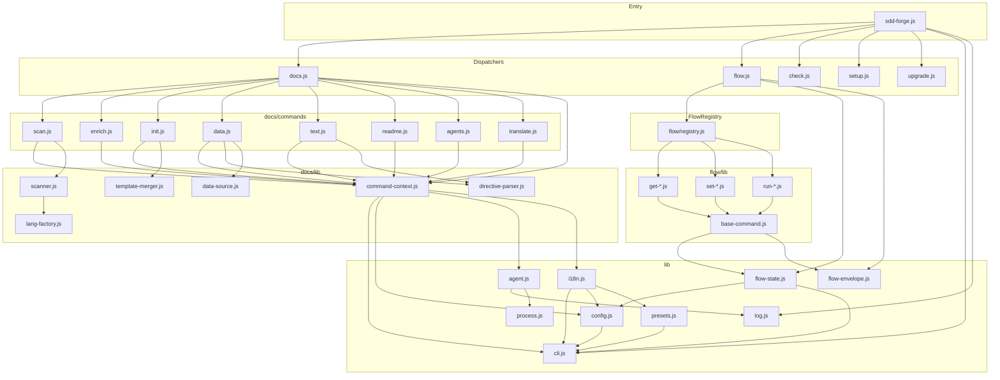

<!-- {{data("base.docs.langSwitcher", {labels: "relative"})}} -->
[日本語](ja/internal_design.md) | **English**
<!-- {{/data}} -->

# Internal Design

## Description

<!-- {{text({prompt: "Write a 1-2 sentence overview of this chapter. Include the project structure, module dependency direction, and key processing flows."})}} -->

This chapter describes the internal structure of sdd-forge: a layered CLI tool built entirely on Node.js built-in modules. The codebase is organized around a top-level dispatcher that routes to namespace dispatchers (`docs`, `flow`, `check`), which in turn delegate to individual command modules; all shared logic flows inward through a flat `lib/` utility layer.
<!-- {{/text}} -->

## Content

### Project Structure

<!-- {{text({prompt: "Describe the project's directory structure as a tree-format code block. Include role comments for key directories and files. Generate from the actual source code structure.", mode: "deep"})}} -->

```
src/
├── sdd-forge.js          # CLI entry point — version, help, and top-level dispatch
├── docs.js               # Dispatcher for the `docs` subcommand namespace
├── flow.js               # Dispatcher for the `flow` subcommand namespace
├── check.js              # Dispatcher for the `check` subcommand namespace
├── setup.js              # `setup` command — project initialization
├── upgrade.js            # `upgrade` command — sync skills and templates
├── presets-cmd.js        # `presets` command — list available presets
├── help.js               # `help` command — usage output
│
├── lib/                  # Shared utilities used across all layers
│   ├── cli.js            # PKG_DIR, repoRoot(), parseArgs()
│   ├── config.js         # loadConfig(), .sdd-forge/config.json helpers
│   ├── agent.js          # AI agent invocation (claude / codex)
│   ├── presets.js        # Preset discovery and parent-chain resolution
│   ├── flow-state.js     # Flow state persistence (flow.json, .active-flow)
│   ├── flow-envelope.js  # Structured JSON output envelope (ok / fail)
│   ├── i18n.js           # Translation and locale loading
│   ├── log.js            # Logger singleton
│   ├── types.js          # Config validation
│   ├── process.js        # runCmd / execFile wrappers
│   ├── git-helpers.js    # Git operations
│   ├── guardrail.js      # Guardrail rule filtering
│   ├── skills.js         # Skill file management
│   ├── entrypoint.js     # runIfDirect() — guards direct script execution
│   └── exit-codes.js     # Exit code constants
│
├── docs/
│   ├── commands/         # Individual `docs` subcommand handlers
│   │   ├── scan.js       # Source analysis → analysis.json
│   │   ├── enrich.js     # AI enrichment of analysis entries
│   │   ├── init.js       # Template initialization from preset chain
│   │   ├── data.js       # Process {{data}} directives
│   │   ├── text.js       # Process {{text}} directives (AI generation)
│   │   ├── readme.js     # Generate README.md
│   │   ├── agents.js     # Generate AGENTS.md
│   │   ├── review.js     # Review documentation quality
│   │   ├── changelog.js  # Generate CHANGELOG
│   │   └── translate.js  # Multi-language translation
│   ├── data/             # Built-in DataSource implementations
│   │   ├── project.js    # Project metadata DataSource
│   │   ├── docs.js       # Docs metadata DataSource
│   │   ├── agents.js     # Agent config DataSource
│   │   └── lang.js       # Language DataSource
│   └── lib/              # Docs-layer utilities
│       ├── command-context.js     # Unified context resolution
│       ├── data-source.js         # DataSource base class
│       ├── data-source-loader.js  # Load DataSources from preset chain
│       ├── scan-source.js         # Scannable mixin for DataSources
│       ├── scanner.js             # File scanning utilities
│       ├── directive-parser.js    # Parse {{}} template directives
│       ├── chapter-resolver.js    # Resolve chapter ordering
│       ├── template-merger.js     # Merge template files
│       ├── lang-factory.js        # Language handler factory
│       ├── lang/                  # Per-language scanners
│       │   ├── js.js
│       │   ├── php.js
│       │   ├── py.js
│       │   └── yaml.js
│       ├── text-prompts.js        # Prompt builders for text generation
│       └── concurrency.js         # Concurrent task runner
│
├── flow/
│   ├── registry.js       # Command metadata registry (args, help, hooks)
│   └── lib/              # Flow command implementations
│       ├── base-command.js        # FlowCommand base class
│       ├── phases.js              # Phase definitions
│       ├── get-*.js               # Read-only flow operations
│       ├── set-*.js               # State mutation operations
│       └── run-*.js               # Action / pipeline operations
│
├── check/
│   └── commands/         # `check` subcommand handlers
│       ├── config.js
│       ├── freshness.js
│       └── scan.js
│
├── presets/              # Built-in preset definitions (40+ frameworks)
│   ├── base/             # Root preset — inherited by all others
│   ├── webapp/           # Generic web application preset
│   ├── laravel/          # Laravel preset
│   ├── nextjs/           # Next.js preset
│   ├── nodejs/           # Node.js preset
│   └── ...               # (40+ additional framework presets)
│
├── templates/            # Project scaffold templates
│   ├── config.example.json
│   └── skills/           # Skill YAML templates
│
└── locale/               # i18n translation files
    ├── en/               # English messages, prompts, UI strings
    └── ja/               # Japanese equivalents
```
<!-- {{/text}} -->

### Module Composition

<!-- {{text({prompt: "List the major modules in table format. Include module name, file path, and responsibility. Extract from import/require relationships and exports in each file.", mode: "deep"})}} -->

| Module | File Path | Responsibility |
|---|---|---|
| CLI Entry Point | `src/sdd-forge.js` | Parses the top-level command, handles `--version` / `--help`, and routes to namespace dispatchers or standalone commands |
| Docs Dispatcher | `src/docs.js` | Routes `docs <subcommand>` to individual handlers; orchestrates the full `docs build` pipeline |
| Flow Dispatcher | `src/flow.js` | Routes `flow <subcommand>` via the registry; supplies parsed arguments and config to each flow command |
| Check Dispatcher | `src/check.js` | Routes `check <subcommand>` to validation handlers |
| CLI Utilities | `src/lib/cli.js` | Provides `PKG_DIR`, `repoRoot()`, `parseArgs()`, and worktree detection helpers used throughout every layer |
| Config Loader | `src/lib/config.js` | Loads and validates `.sdd-forge/config.json`; provides path helpers (`sddDir`, `sddOutputDir`) |
| Preset Resolver | `src/lib/presets.js` | Discovers built-in and project-local presets; resolves the full parent-chain for a given preset type |
| AI Agent | `src/lib/agent.js` | Invokes the configured AI agent process (claude / codex) and returns parsed output |
| Flow State | `src/lib/flow-state.js` | Reads and writes `flow.json` and `.active-flow`; provides typed accessors for flow fields |
| Flow Envelope | `src/lib/flow-envelope.js` | Emits structured `{ok, data}` / `{ok: false, error}` JSON to stdout for agent-readable output |
| i18n | `src/lib/i18n.js` | Loads locale files from the package and the active preset chain; resolves translation keys |
| Logger | `src/lib/log.js` | Singleton logger with `init()` and `event()` for structured log output |
| Process Runner | `src/lib/process.js` | Wraps `child_process.execFile` and `spawn` for safe subprocess execution |
| Guardrail Filter | `src/lib/guardrail.js` | Filters guardrail rules by phase for injection into agent prompts |
| Skill Manager | `src/lib/skills.js` | Reads and writes skill YAML files under `.claude/skills/` and `.agents/skills/` |
| Flow Registry | `src/flow/registry.js` | Single source of truth for all `flow` command metadata: argument specs, help text, lazy imports, and lifecycle hooks |
| FlowCommand Base | `src/flow/lib/base-command.js` | Abstract base class extended by every `get/*`, `set/*`, and `run/*` flow handler |
| Command Context | `src/docs/lib/command-context.js` | Resolves the unified execution context (config, preset chain, agent, i18n) for every `docs` command |
| DataSource Base | `src/docs/lib/data-source.js` | Base class for all `{{data}}` resolvers; defines `init()`, `desc()`, and table-rendering methods |
| Scannable Mixin | `src/docs/lib/scan-source.js` | Mixin that adds `match()` and `scan()` to a DataSource for source-file analysis |
| Directive Parser | `src/docs/lib/directive-parser.js` | Parses `{{data(...)}}` and `{{text(...)}}` directives from Markdown template files |
| Template Merger | `src/docs/lib/template-merger.js` | Merges parent-chain templates into the project `docs/` directory during `docs init` |
| Scanner | `src/docs/lib/scanner.js` | Collects matching source files and dispatches them to language-specific handlers |
| Language Factory | `src/docs/lib/lang-factory.js` | Returns the appropriate language handler (`js`, `php`, `py`, `yaml`) for a given file |
| Chapter Resolver | `src/docs/lib/chapter-resolver.js` | Resolves chapter ordering from `preset.json` `chapters` arrays across the inheritance chain |
<!-- {{/text}} -->

### Module Dependencies

<!-- {{text({prompt: "Generate a mermaid graph showing inter-module dependencies. Analyze import/require statements in the source code and show the layer structure and dependency direction. Output only the mermaid code block.", mode: "deep"})}} -->


<!-- {{/text}} -->

### Key Processing Flows

<!-- {{text({prompt: "Describe the inter-module data and control flow when running a representative command in numbered steps. Include the flow from entry point to final output.", mode: "deep"})}} -->

The `sdd-forge docs build` command is the most representative end-to-end flow, covering source analysis, AI enrichment, template processing, and output generation.

1. **Entry — `sdd-forge.js`**: The CLI entry point receives `docs build` as arguments, resolves the `docs` namespace, and delegates to `docs.js`.
2. **Dispatch — `docs.js`**: The docs dispatcher identifies `build` as a pipeline alias and calls each pipeline step in order: `scan → enrich → init → data → text → readme → agents → [translate]`.
3. **Context resolution — `command-context.js`**: Before each step, `resolveCommandContext()` loads `config.json` via `lib/config.js`, resolves the active preset chain via `lib/presets.js`, initialises the i18n system via `lib/i18n.js`, and selects the AI agent via `lib/agent.js`.
4. **Scan — `docs/commands/scan.js`**: Collects source files using glob patterns from the preset chain. Each matched file is dispatched to the appropriate language handler through `lang-factory.js`. Scannable DataSources from `scan-source.js` extract structured entries. Results are written to `.sdd-forge/output/analysis.json`.
5. **Enrich — `docs/commands/enrich.js`**: Reads `analysis.json`, batches entries by token count, and calls the AI agent via `lib/agent.js` to produce richer descriptions. Progress is checkpointed so interrupted runs can resume.
6. **Init — `docs/commands/init.js`**: Walks the preset parent chain, collects template files, and calls `template-merger.js` to write missing or updated chapter files into the project `docs/` directory.
7. **Data — `docs/commands/data.js`**: Reads each `docs/*.md` file, uses `directive-parser.js` to locate `{{data(...)}}` directives, dynamically loads the referenced DataSource classes (resolved through the preset chain via `data-source-loader.js`), calls their render methods, and writes the expanded content back.
8. **Text — `docs/commands/text.js`**: Similarly parses `{{text({prompt: "..."})}}` directives, constructs prompt strings via `text-prompts.js`, invokes the AI agent, and injects the generated Markdown between directive delimiters.
9. **Readme / Agents — `docs/commands/readme.js` and `agents.js`**: Concatenate or transform the completed `docs/*.md` files to produce the top-level `README.md` and `AGENTS.md` outputs.
10. **Output**: All generated files land in the project `docs/` directory (and root for `README.md` / `AGENTS.md`). Structured progress events are emitted to the console throughout via `lib/log.js`.
<!-- {{/text}} -->

### Extension Points

<!-- {{text({prompt: "Describe the locations that need changes and extension patterns when adding new commands or features. Derive from plugin points and dispatch registration patterns in the source code.", mode: "deep"})}} -->

sdd-forge uses several explicit registration points that make it straightforward to extend with new commands or capabilities.

**Adding a new `docs` subcommand**

Create a handler file at `src/docs/commands/<name>.js`. Export a default async function that accepts the resolved command context. Register the new subcommand name in the dispatch table inside `src/docs.js` and, if the command belongs in the `build` pipeline, add it to the ordered pipeline array in that same file. The handler can import any utility from `src/lib/` or `src/docs/lib/` without further wiring.

**Adding a new `flow` command**

Create an implementation file at `src/flow/lib/<group>-<action>.js` that exports a class extending `FlowCommand` from `base-command.js` and implements an async `run(ctx)` method. Then add the command's entry to `src/flow/registry.js`: define `command` as a lazy `import()` function, declare the `args` spec, provide `help` text, and optionally specify `pre`, `post`, `onError`, or `finally` hooks. The `flow.js` dispatcher reads this registry automatically—no changes to the dispatcher itself are needed.

**Adding a new DataSource**

Create a class extending `DataSource` from `src/docs/lib/data-source.js` in either a preset's `data/` directory (for preset-scoped sources) or `src/docs/data/` (for built-in sources). Implement `init()` and any rendering methods. The source becomes available to `{{data("namespace.source.method")}}` directives once the containing preset is part of the active chain.

**Adding a new preset**

Create a directory under `src/presets/<key>/` containing a `preset.json` with at minimum `type` and optionally a `parent` key pointing to an existing preset. Add `templates/`, `data/`, and `scan/` subdirectories as needed. The preset is discovered automatically by `lib/presets.js` and becomes selectable in `config.json`.

**Adding a new language scanner**

Add a handler module to `src/docs/lib/lang/` and register its file-extension mappings in `src/docs/lib/lang-factory.js`. The scanner will be invoked automatically during `docs scan` for any file whose extension matches.
<!-- {{/text}} -->

---

<!-- {{data("base.docs.nav")}} -->
[← Configuration and Customization](configuration.md) | [Preset Creation Guide →](creating_presets.md)
<!-- {{/data}} -->
