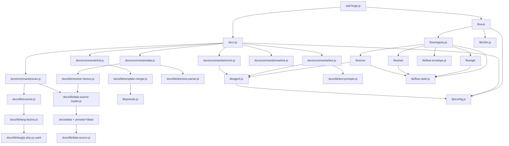

<!-- {{data("base.docs.langSwitcher", {labels: "relative"})}} -->
**English** | [日本語](ja/internal_design.md)
<!-- {{/data}} -->

# Internal Design

## Description

<!-- {{text({prompt: "Write a 1-2 sentence overview of this chapter. Include the project structure, module dependency direction, and key processing flows."})}} -->

This chapter describes the internal design of sdd-forge, covering its layered directory structure, the unidirectional module dependency from entry points through dispatchers to command implementations, and the two primary processing flows: the docs generation pipeline (`scan → enrich → init → data → text → readme`) and the SDD flow pipeline (`flow.js → registry.js → get/set/run`).
<!-- {{/text}} -->

## Content

### Project Structure

<!-- {{text({prompt: "Describe the project's directory structure as a tree-format code block. Include role comments for key directories and files. Generate from the actual source code structure.", mode: "deep"})}} -->

```
src/
├── sdd-forge.js              # CLI entry point — top-level dispatcher
├── docs.js                   # docs subcommand dispatcher + build pipeline
├── flow.js                   # flow subcommand dispatcher
├── setup.js                  # one-time project setup wizard
├── upgrade.js                # skill and template upgrade
├── help.js                   # help output
├── lib/                      # shared utilities (all layers depend on this)
│   ├── cli.js                # PKG_DIR, repoRoot(), parseArgs()
│   ├── config.js             # .sdd-forge/config.json loader and path helpers
│   ├── agent.js              # AI agent invocation (sync/async, retry, stdin delivery)
│   ├── presets.js            # preset auto-discovery and parent chain resolution
│   ├── flow-state.js         # flow.json read/write and step/metric mutation
│   ├── flow-envelope.js      # ok/fail/warn/output JSON protocol
│   ├── git-state.js          # git and gh CLI state helpers
│   ├── guardrail.js          # guardrail loading, merging, and phase filtering
│   ├── i18n.js               # 3-layer i18n with domain namespace support
│   ├── include.js            # template include directive expansion
│   ├── json-parse.js         # lenient JSON repair for AI responses
│   ├── lint.js               # lint guardrail checks on changed files
│   ├── process.js            # synchronous process execution wrapper
│   ├── progress.js           # ANSI progress bar and prefixed logger
│   └── skills.js             # skill template deployment
├── docs/
│   ├── commands/             # docs pipeline CLI commands
│   │   ├── scan.js           # source file scan → analysis.json
│   │   ├── enrich.js         # AI enrichment of analysis entries
│   │   ├── init.js           # template merge → docs/ chapter files
│   │   ├── data.js           # {{data}} directive replacement
│   │   ├── text.js           # {{text}} directive AI fill
│   │   ├── readme.js         # README.md generation
│   │   ├── agents.js         # AGENTS.md generation
│   │   ├── forge.js          # interactive iterative forge mode
│   │   ├── review.js         # docs review command
│   │   ├── changelog.js      # changelog generation
│   │   └── translate.js      # multi-language translation
│   ├── data/                 # built-in shared DataSource implementations
│   │   ├── project.js        # package.json identity metadata
│   │   ├── docs.js           # chapter list, nav links, lang-switcher
│   │   ├── lang.js           # language navigation links
│   │   ├── agents.js         # SDD template and agent config data
│   │   └── text.js           # text fill state stub
│   └── lib/                  # docs engine internal libraries
│       ├── directive-parser.js   # parse {{data}} and {{text}} directives
│       ├── template-merger.js    # / inheritance resolution
│       ├── scanner.js            # file walking, glob matching, MD5 hashing
│       ├── data-source.js        # DataSource base class
│       ├── data-source-loader.js # auto-discover DataSources from preset chain
│       ├── resolver-factory.js   # build DataSource resolver from preset chain
│       ├── chapter-resolver.js   # chapter order from preset.json and config
│       ├── analysis-entry.js     # AnalysisEntry model and summary utilities
│       ├── analysis-filter.js    # filter entries by docs.exclude patterns
│       ├── text-prompts.js       # AI prompt builders for {{text}} directives
│       ├── forge-prompts.js      # AI prompt builders for forge mode
│       ├── concurrency.js        # bounded concurrency for parallel AI calls
│       ├── minify.js             # source code minification dispatcher
│       ├── lang-factory.js       # file extension → language handler factory
│       └── lang/                 # per-language handlers (js, php, py, yaml)
├── flow/
│   ├── registry.js           # FLOW_COMMANDS — declarative dispatch table with hooks
│   ├── commands/             # high-level orchestration scripts
│   ├── get/                  # read-only flow queries (context, status, check, guardrail)
│   ├── run/                  # step execution handlers (gate, finalize, retro, lint)
│   └── set/                  # state mutation handlers (step, req, metric, note, redo)
├── presets/                  # framework-specific preset packages
│   ├── base/                 # root preset — all others inherit via parent chain
│   └── .../                  # cli, node-cli, webapp, hono, laravel, cakephp2, ...
├── locale/                   # i18n message bundles (en/, ja/)
└── templates/                # skill SKILL.md templates and spec partials
```
<!-- {{/text}} -->

### Module Composition

<!-- {{text({prompt: "List the major modules in table format. Include module name, file path, and responsibility. Extract from import/require relationships and exports in each file.", mode: "deep"})}} -->

| Module | File Path | Responsibility |
|---|---|---|
| CLI Entry | `src/sdd-forge.js` | Top-level argument dispatch; routes to docs.js, flow.js, or standalone commands |
| Docs Dispatcher | `src/docs.js` | Routes `docs` subcommands and orchestrates the full `build` pipeline |
| Flow Dispatcher | `src/flow.js` | Resolves flow context (root, config, flowState); dispatches via FLOW_COMMANDS with pre/post hooks |
| Flow Registry | `src/flow/registry.js` | Single source of truth for all flow subcommand metadata, handler imports, and lifecycle hooks |
| Agent Caller | `src/lib/agent.js` | Invokes AI agent CLI via `spawn`; handles sync/async, retry, and stdin prompt delivery |
| Config | `src/lib/config.js` | Loads `.sdd-forge/config.json`; resolves output, data, and config directory paths |
| Preset Resolver | `src/lib/presets.js` | Auto-discovers preset packages and resolves the full parent inheritance chain |
| Flow State | `src/lib/flow-state.js` | Reads/writes `flow.json`; manages step status, phase derivation, and active-flow tracking |
| Flow Envelope | `src/lib/flow-envelope.js` | Typed `ok`/`fail`/`warn`/`output` constructors for structured JSON communication |
| Guardrail | `src/lib/guardrail.js` | Loads and merges guardrail.json from preset chain; filters by phase and scope |
| i18n | `src/lib/i18n.js` | Three-layer locale loading (package → preset → project) with domain namespace support |
| Scanner | `src/docs/lib/scanner.js` | File traversal, glob matching, MD5 hashing, and language-handler dispatch |
| Directive Parser | `src/docs/lib/directive-parser.js` | Parses `{{data(...)}}` and `{{text(...)}}` directive syntax from Markdown chapter files |
| Template Merger | `src/docs/lib/template-merger.js` | Resolves ``/`` inheritance across the preset chain into final chapter files |
| DataSource Loader | `src/docs/lib/data-source-loader.js` | Auto-discovers and instantiates DataSource classes from preset `data/` directories |
| Resolver Factory | `src/docs/lib/resolver-factory.js` | Builds a method-dispatch resolver from the loaded DataSource set and analysis context |
| Text Prompts | `src/docs/lib/text-prompts.js` | Constructs AI prompts for `{{text}}` directives, including enriched analysis context |
| Lang Factory | `src/docs/lib/lang-factory.js` | Maps file extensions to language-specific parse/minify handler modules |
| Concurrency | `src/docs/lib/concurrency.js` | Bounded concurrency queue for parallel AI agent calls in enrich, text, and translate commands |
<!-- {{/text}} -->

### Module Dependencies

<!-- {{text({prompt: "Generate a mermaid graph showing inter-module dependencies. Analyze import/require statements in the source code and show the layer structure and dependency direction. Output only the mermaid code block.", mode: "deep"})}} -->


<!-- {{/text}} -->

### Key Processing Flows

<!-- {{text({prompt: "Describe the inter-module data and control flow when running a representative command in numbered steps. Include the flow from entry point to final output.", mode: "deep"})}} -->

The following steps trace the control and data flow for `sdd-forge docs build`:

1. **Entry — `sdd-forge.js`**: Parses top-level arguments. Recognises `docs` as a namespace dispatcher and delegates to `docs.js`, passing the remaining argv.
2. **Dispatch — `docs.js`**: The `build` subcommand triggers `resolveCommandContext()` from `docs/lib/command-context.js`, which loads `config.json`, derives `sourceRoot`, `docsDir`, `type`, and `lang`. A weighted pipeline step list is constructed and a `createProgress` instance is started.
3. **Scan — `docs/commands/scan.js`**: `collectFiles()` walks source directories using glob patterns from `preset.json`. For each file, `scanner.js` routes to the appropriate `lang-factory.js` handler to extract structure metadata. Preset-defined DataSources contribute additional entries. Results are written to `.sdd-forge/output/analysis.json`, preserving enriched fields from previous runs via MD5 hash comparison.
4. **Enrich — `docs/commands/enrich.js`**: Reads `analysis.json` and batches un-enriched entries within token limits. Each batch is submitted to the AI agent via `callAgentAsync()` with concurrency control from `concurrency.js`. The JSON response is repaired via `json-parse.js`, then merged back into `analysis.json` with `processedAt` timestamps.
5. **Init — `docs/commands/init.js`**: Resolves the full preset chain with `lib/presets.js`. `template-merger.js` walks each chain level resolving `` and `` directives, merging parent and child templates into final chapter `.md` files written to `docs/`.
6. **Data — `docs/commands/data.js`**: Parses `{{data(...)}}` directives from each chapter file via `directive-parser.js`. For each directive, `resolver-factory.js` locates the matching DataSource from the loaded preset chain and invokes its method with the current analysis. The returned markdown replaces the directive body in-place.
7. **Text — `docs/commands/text.js`**: Parses `{{text(...)}}` directives. `text-prompts.js` builds batch prompts including enriched analysis context via `getEnrichedContext()`. The AI agent fills all directives in a chapter with one call; `applyBatchJsonToFile()` writes results back with shrinkage validation.
8. **Readme / Agents**: `readme.js` and `agents.js` compose `README.md` and `AGENTS.md` from chapter titles, descriptions, and DataSource-resolved metadata.
9. **Output**: All generated files reside in `docs/`. The `progress.js` bar reports weighted completion after each pipeline step completes.
<!-- {{/text}} -->

### Extension Points

<!-- {{text({prompt: "Describe the locations that need changes and extension patterns when adding new commands or features. Derive from plugin points and dispatch registration patterns in the source code.", mode: "deep"})}} -->

**Adding a new `docs` subcommand**

1. Create `src/docs/commands/<name>.js` following the `runIfDirect` + exported `main(ctx)` pattern used by existing commands.
2. Register the command name and its import in the switch/case block inside `src/docs.js`.
3. To include the command in the `build` pipeline, add a weighted step entry to the `pipelineSteps` array in `docs.js` and call `main(ctx)` at the appropriate position.

**Adding a new `flow` subcommand**

1. Create a handler module under `src/flow/get/`, `src/flow/set/`, or `src/flow/run/` (read / write / execute respectively), exporting an `async execute(ctx)` function.
2. Use `ok`/`fail`/`output` from `lib/flow-envelope.js` to return results.
3. Add a declarative entry to the matching group in `src/flow/registry.js` (`FLOW_COMMANDS`). Optionally attach `pre`, `post`, or `requiresFlow` properties to control step-status tracking and context requirements.

**Adding a new preset**

1. Create `src/presets/<name>/preset.json` specifying `parent`, `label`, `chapters`, and `scan` glob patterns.
2. Add templates under `templates/<lang>/` — these are merged with parent templates via `` / `` inheritance in `template-merger.js`.
3. Add DataSources under `data/` as plain `.js` files exporting a default class that extends `DataSource`. `data-source-loader.js` discovers and instantiates them automatically — no registration is required.

**Adding a new language handler for scanning**

1. Create `src/docs/lib/lang/<ext>.js` exporting `parse`, `minify`, `extractImports`, and `extractExports` as needed.
2. Add the file extension mapping in `EXT_MAP` inside `src/docs/lib/lang-factory.js`.

**Architectural constraint**: Modules in `src/lib/` must not import from `src/docs/` or `src/flow/`. Dependencies flow strictly downward: CLI entry → command modules → `lib/` utilities.
<!-- {{/text}} -->

---

<!-- {{data("base.docs.nav")}} -->
[← Configuration and Customization](configuration.md)
<!-- {{/data}} -->
