# 04. Internal Design

## Description

<!-- {{text: Write a 1-2 sentence overview of this chapter. Include the project structure, module dependency direction, and key processing flows.}} -->

This chapter describes the internal architecture of sdd-forge, covering its three-layer dispatch structure (`sdd-forge.js` → domain dispatchers → command modules), the directive-based document generation engine, and the preset inheritance system that enables framework-specific source code analysis. Dependencies flow inward from CLI entry points and commands toward shared libraries (`src/lib/`) and the document engine (`src/docs/lib/`), while the preset layer (`src/presets/`) extends the engine through a plugin-like DataSource class hierarchy.

<!-- {{/text}} -->

## Content

### Project Structure

<!-- {{text[mode=deep]: Describe the project's directory structure as a tree-format code block. Include role comments for key directories and files. Generate from the actual source code structure.}} -->

```
sdd-forge/
├── package.json                          # Package manifest (type: module, no external deps)
├── tests/                                # Test suite
└── src/
    ├── sdd-forge.js                      # CLI entry point & top-level router
    ├── docs.js                           # docs subcommand dispatcher
    ├── spec.js                           # spec subcommand dispatcher
    ├── flow.js                           # flow subcommand dispatcher (direct command)
    ├── setup.js                          # Interactive project setup wizard
    ├── upgrade.js                        # Config migration utility
    ├── presets-cmd.js                    # Preset listing command
    ├── help.js                           # Help text output
    │
    ├── lib/                              # Shared utilities (all layers)
    │   ├── cli.js                        # repoRoot, sourceRoot, parseArgs, PKG_DIR
    │   ├── config.js                     # .sdd-forge/config.json loader & validators
    │   ├── agent.js                      # AI agent invocation (sync & async)
    │   ├── agents-md.js                  # AGENTS.md SDD template loader
    │   ├── presets.js                    # Preset auto-discovery & parent-chain resolution
    │   ├── flow-state.js                # SDD flow state persistence (flow.json)
    │   ├── i18n.js                       # 3-layer i18n (domain-namespaced)
    │   ├── types.js                      # Type alias resolution & config validation
    │   ├── entrypoint.js                # ES Module direct-run detection
    │   ├── process.js                    # spawnSync thin wrapper
    │   └── progress.js                  # Progress bar & logging for build pipeline
    │
    ├── docs/                             # Document generation engine
    │   ├── commands/                     # Individual doc commands
    │   │   ├── scan.js                   # Source code scanning
    │   │   ├── enrich.js                 # AI-powered analysis enrichment
    │   │   ├── init.js                   # Template scaffolding
    │   │   ├── data.js                   # {{data}} directive resolution
    │   │   ├── text.js                   # {{text}} directive resolution (LLM)
    │   │   ├── readme.js                 # README.md generation
    │   │   ├── forge.js                  # AI-assisted doc writing
    │   │   ├── review.js                 # Document quality review
    │   │   ├── changelog.js              # Changelog generation
    │   │   ├── agents.js                 # AGENTS.md generation
    │   │   └── translate.js              # Multi-language translation
    │   │
    │   ├── data/                         # Common DataSources (all project types)
    │   │   ├── project.js                # package.json metadata
    │   │   ├── docs.js                   # Chapter listing & language switcher
    │   │   ├── lang.js                   # Language navigation links
    │   │   └── agents.js                 # AGENTS.md section generation
    │   │
    │   └── lib/                          # Document engine internals
    │       ├── directive-parser.js       # {{data}}/{{text}} & block inheritance parser
    │       ├── resolver-factory.js       # DataSource loader & resolve() factory
    │       ├── data-source.js            # DataSource base class
    │       ├── data-source-loader.js     # Dynamic DataSource module loader
    │       ├── scan-source.js            # ScanSource base & Scannable mixin
    │       ├── scanner.js                # File discovery & language-specific parsers
    │       ├── template-merger.js        # Template inheritance & chapter ordering
    │       ├── command-context.js        # Shared command context resolution
    │       ├── concurrency.js            # Parallel execution queue
    │       ├── text-prompts.js           # {{text}} prompt construction
    │       ├── forge-prompts.js          # forge command prompt construction
    │       ├── review-parser.js          # Review output parser
    │       └── php-array-parser.js       # CakePHP array syntax parser
    │
    ├── flow/commands/                    # SDD workflow commands
    │   ├── start.js                      # Flow initialization
    │   ├── status.js                     # Flow status display
    │   ├── review.js                     # Flow review
    │   ├── merge.js                      # Flow merge & cleanup
    │   ├── resume.js                     # Flow resume after compaction
    │   └── cleanup.js                    # Worktree cleanup
    │
    ├── spec/commands/                    # Spec-Driven Development commands
    │   ├── init.js                       # Spec initialization
    │   ├── gate.js                       # Spec gate check
    │   └── guardrail.js                  # Spec guardrail validation
    │
    ├── presets/                           # Framework-specific presets
    │   ├── base/                         # Base preset (inherited by all)
    │   │   ├── preset.json
    │   │   ├── data/package.js           # package.json/composer.json scanner
    │   │   └── templates/{lang}/         # Base chapter templates
    │   ├── webapp/                       # Web application arch-level preset
    │   │   └── data/                     # controllers, models, shells, tables, routes
    │   ├── cli/                          # CLI arch-level preset
    │   │   └── data/modules.js           # Generic JS module scanner
    │   ├── library/                      # Library arch-level preset
    │   ├── node/                         # Node.js language-layer preset
    │   ├── php/                          # PHP language-layer preset
    │   ├── node-cli/                     # Node CLI leaf preset (parent: cli)
    │   ├── cakephp2/                     # CakePHP 2.x leaf preset (parent: webapp)
    │   │   ├── data/                     # CakePHP-specific DataSources
    │   │   └── scan/                     # CakePHP-specific analyzers
    │   ├── laravel/                      # Laravel leaf preset (parent: webapp)
    │   │   ├── data/                     # Laravel-specific DataSources
    │   │   └── scan/                     # Laravel-specific analyzers
    │   └── symfony/                      # Symfony leaf preset (parent: webapp)
    │       ├── data/                     # Symfony-specific DataSources
    │       └── scan/                     # Symfony-specific analyzers
    │
    ├── locale/                           # i18n message files
    │   ├── en/                           # English (ui.json, messages.json, prompts.json)
    │   └── ja/                           # Japanese
    │
    └── templates/                        # Scaffold templates for setup
```

<!-- {{/text}} -->

### Module Composition

<!-- {{text[mode=deep]: List the major modules in table format. Include module name, file path, and responsibility. Extract from import/require relationships and exports in each file.}} -->

| Module | Path | Responsibility |
| --- | --- | --- |
| CLI Router | `src/sdd-forge.js` | Top-level command dispatch to docs/spec/flow/setup/help subcommands |
| Docs Dispatcher | `src/docs.js` | Routes `docs <cmd>` to individual command modules; orchestrates `build` pipeline |
| Spec Dispatcher | `src/spec.js` | Routes `spec <cmd>` to spec command modules |
| Flow Dispatcher | `src/flow.js` | Direct command handler for SDD workflow operations |
| Directive Parser | `src/docs/lib/directive-parser.js` | Parses `{{data}}` / `{{text}}` directives and block inheritance syntax from templates |
| Resolver Factory | `src/docs/lib/resolver-factory.js` | Loads DataSource modules along the preset chain and produces a `resolve()` function |
| DataSource Base | `src/docs/lib/data-source.js` | Base class for `{{data}}` resolvers; provides `toMarkdownTable()` and override merging |
| Scannable Mixin | `src/docs/lib/scan-source.js` | Adds `match()` and `scan()` capabilities to DataSource for source code analysis |
| Scanner Utilities | `src/docs/lib/scanner.js` | File discovery (`collectFiles`, `findFiles`), language-specific parsers (PHP, JS), glob conversion |
| Template Merger | `src/docs/lib/template-merger.js` | Bottom-up template resolution with `@block`/`@extends` inheritance and chapter ordering |
| Command Context | `src/docs/lib/command-context.js` | Unified context builder (root, config, type, agent, i18n) shared by all doc commands |
| Data Command | `src/docs/commands/data.js` | Resolves `{{data}}` directives in chapter files using analysis.json |
| Text Command | `src/docs/commands/text.js` | Resolves `{{text}}` directives via LLM agents in batch or per-directive mode |
| Agent Utility | `src/lib/agent.js` | AI agent invocation (sync/async), prompt size management, per-command agent resolution |
| Preset System | `src/lib/presets.js` | Auto-discovers presets, resolves parent chains, manages lang-layer and type aliases |
| Config & Types | `src/lib/config.js`, `src/lib/types.js` | Config loading, validation, type alias resolution |
| i18n | `src/lib/i18n.js` | 3-layer message loading (default → preset → project) with domain namespacing |
| Flow State | `src/lib/flow-state.js` | Persists SDD workflow state (steps, requirements, branches) to flow.json |
| Progress | `src/lib/progress.js` | TTY-aware progress bar with pinned header, spinner animation, and scoped logging |
| Concurrency | `src/docs/lib/concurrency.js` | Promise-based parallel execution queue with configurable concurrency limit |

<!-- {{/text}} -->

### Module Dependencies

```mermaid
graph TD
    subgraph "CLI Entry Layer"
        ENTRY["sdd-forge.js"]
    end

    subgraph "Dispatchers"
        DOCS["docs.js"]
        SPEC["spec.js"]
        FLOW["flow.js"]
        SETUP["setup.js"]
    end

    subgraph "Doc Commands"
        SCAN["commands/scan.js"]
        ENRICH["commands/enrich.js"]
        INIT["commands/init.js"]
        DATA["commands/data.js"]
        TEXT["commands/text.js"]
        README["commands/readme.js"]
        FORGE["commands/forge.js"]
        REVIEW["commands/review.js"]
        AGENTS_CMD["commands/agents.js"]
        TRANSLATE["commands/translate.js"]
    end

    subgraph "Document Engine (docs/lib)"
        DPARSER["directive-parser.js"]
        RFACTORY["resolver-factory.js"]
        DSBASE["data-source.js"]
        DSLOADER["data-source-loader.js"]
        SCANNER["scanner.js"]
        TMERGER["template-merger.js"]
        CMDCTX["command-context.js"]
        TPROMPTS["text-prompts.js"]
        FPROMPTS["forge-prompts.js"]
        CONCUR["concurrency.js"]
        RPARSER["review-parser.js"]
    end

    subgraph "Shared Libraries (lib)"
        CLI["cli.js"]
        CONFIG["config.js"]
        AGENT["agent.js"]
        PRESETS["presets.js"]
        FSTATE["flow-state.js"]
        I18N["i18n.js"]
        TYPES["types.js"]
        PROGRESS["progress.js"]
        ENTRYPT["entrypoint.js"]
    end

    subgraph "Preset DataSources"
        COMMON_DS["docs/data/ (project, docs, lang, agents)"]
        WEBAPP_DS["webapp/data/ (controllers, models, tables, shells, routes)"]
        CAKE_DS["cakephp2/data/ + scan/"]
        LARAVEL_DS["laravel/data/ + scan/"]
        SYMFONY_DS["symfony/data/ + scan/"]
        CLI_DS["cli/data/modules.js"]
    end

    ENTRY --> DOCS
    ENTRY --> SPEC
    ENTRY --> FLOW
    ENTRY --> SETUP

    DOCS --> SCAN
    DOCS --> ENRICH
    DOCS --> INIT
    DOCS --> DATA
    DOCS --> TEXT
    DOCS --> README
    DOCS --> AGENTS_CMD
    DOCS --> TRANSLATE

    DATA --> DPARSER
    DATA --> RFACTORY
    DATA --> CMDCTX
    TEXT --> DPARSER
    TEXT --> TPROMPTS
    TEXT --> CONCUR
    TEXT --> AGENT
    TEXT --> CMDCTX
    FORGE --> FPROMPTS
    FORGE --> RPARSER
    FORGE --> CONCUR
    FORGE --> AGENT
    INIT --> TMERGER
    SCAN --> SCANNER
    SCAN --> DSLOADER

    RFACTORY --> DSLOADER
    RFACTORY --> DSBASE
    RFACTORY --> PRESETS
    DSLOADER --> DSBASE
    TMERGER --> DPARSER
    TMERGER --> PRESETS

    CMDCTX --> CLI
    CMDCTX --> CONFIG
    CMDCTX --> TYPES
    CMDCTX --> AGENT
    CMDCTX --> I18N
    CMDCTX --> TMERGER

    COMMON_DS --> DSBASE
    WEBAPP_DS --> DSBASE
    CAKE_DS --> WEBAPP_DS
    LARAVEL_DS --> WEBAPP_DS
    SYMFONY_DS --> WEBAPP_DS
    CLI_DS --> DSBASE

    FLOW --> FSTATE
    FLOW --> CLI

    PRESETS -.-> CONFIG
    TYPES --> PRESETS
    I18N --> CONFIG
    I18N --> PRESETS
```

<!-- {{text[mode=deep]: Generate a mermaid graph showing inter-module dependencies. Analyze import/require statements in the source code and show the layer structure and dependency direction. Output only the mermaid code block.}} -->



<!-- {{/text}} -->

### Key Processing Flows

<!-- {{text[mode=deep]: Describe the inter-module data and control flow when running a representative command in numbered steps. Include the flow from entry point to final output.}} -->

**`sdd-forge docs build` — Full Documentation Pipeline**

1. `sdd-forge.js` receives the `docs` subcommand and delegates to `docs.js`.
2. `docs.js` recognizes `build` as a pipeline alias and executes the steps sequentially: `scan → enrich → init → data → text → readme → agents → [translate]`.
3. `createProgress()` initializes a TTY-aware progress bar to track pipeline steps.

4. **scan** — `commands/scan.js` calls `collectFiles()` from `scanner.js` using include/exclude glob patterns from preset and config. It loads DataSource classes via `data-source-loader.js`, calls `match()` on each file to route it to the appropriate DataSource, then invokes `scan()` on each DataSource to extract structured data (controllers, models, routes, etc.). The aggregated result is written to `.sdd-forge/output/analysis.json`.

5. **enrich** — `commands/enrich.js` reads analysis.json and sends batches of entries to the AI agent via `agent.js`. The agent assigns each entry a role, summary, detail, and chapter classification. The enriched data is written back to analysis.json with an `enrichedAt` timestamp.

6. **init** — `commands/init.js` calls `resolveTemplates()` from `template-merger.js`, which builds layers from the preset parent chain (project-local → leaf → arch → base → lang). For each chapter file, `resolveOneFile()` searches layers bottom-up, resolving `@extends`/`@block` inheritance. The merged templates are written to the `docs/` directory, and `resolveChaptersOrder()` determines chapter ordering from config or preset definitions.

7. **data** — `commands/data.js` calls `createResolver()` from `resolver-factory.js`, which loads DataSources along the preset chain (common → base → arch → leaf → lang → project-local). For each chapter file, `processTemplate()` invokes `resolveDataDirectives()` from `directive-parser.js`, which parses `{{data: source.method("labels")}}` directives and calls `resolver.resolve()` to render Markdown tables. The resolved content replaces directive blocks in-place.

8. **text** — `commands/text.js` processes `{{text: prompt}}` directives. In batch mode (`processTemplateFileBatch`), it strips existing generated content via `stripFillContent()`, builds a prompt with `buildBatchPrompt()` including enriched analysis context from `getEnrichedContext()`, and sends the entire file to the AI agent in a single call. The response replaces content between directive tags. `validateBatchResult()` checks for content shrinkage and fill rate.

9. **readme** — `commands/readme.js` applies the same `{{data}}` resolution to the README.md template, generating the project's top-level documentation.

10. **agents** — `commands/agents.js` generates or updates AGENTS.md with SDD and PROJECT sections using the `agents` DataSource.

11. `docs.js` calls `progress.done()` to finalize the progress bar and report total elapsed time.

<!-- {{/text}} -->

### Extension Points

<!-- {{text[mode=deep]: Describe the locations that need changes and extension patterns when adding new commands or features. Derive from plugin points and dispatch registration patterns in the source code.}} -->

**Adding a New Preset (Framework Support)**

To add support for a new framework (e.g., "express"), create a directory at `src/presets/express/` with a `preset.json` declaring `parent` (e.g., `"cli"` or `"webapp"`), `lang`, `aliases`, `scan` globs, and `chapters` order. Add DataSource classes in `data/` extending the parent preset's DataSources (e.g., `WebappDataSource` or `Scannable(DataSource)`). Implement `match()` to identify relevant source files and `scan()` to extract structured data. Add resolve methods (e.g., `list()`, `actions()`) that convert analysis data to Markdown tables. The preset is automatically discovered by `presets.js` at module load time — no registration code is needed.

**Adding a New DataSource to an Existing Preset**

Create a new `.js` file in the preset's `data/` directory exporting a default class that extends `DataSource` or `Scannable(DataSource)`. The `data-source-loader.js` module dynamically imports all `.js` files from `data/` directories, so the new DataSource is available immediately. Reference it in templates with `{{data: newSource.methodName("Header1|Header2")}}`.

**Adding a New Doc Command**

Create a command module in `src/docs/commands/` exporting a `main(ctx)` function. Register it in `docs.js` by adding an entry to the command dispatch map. The command receives a `CommandContext` from `resolveCommandContext()` providing root, config, type, agent, and i18n. Use `runIfDirect()` from `entrypoint.js` to support both pipeline and standalone execution.

**Adding a New Flow Step**

Add the step ID to the `FLOW_STEPS` array and its phase mapping to `PHASE_MAP` in `src/lib/flow-state.js`. Implement the step logic in the relevant flow command (`flow/commands/`). The step tracking (pending → in_progress → done/skipped) is managed through `updateStepStatus()`.

**Extending the Template System**

Add new `{{data}}` directives by implementing methods on existing or new DataSources. Add new `{{text}}` directives by writing prompt instructions in chapter template files. For template inheritance, use `<!-- @extends -->` in a child template and `<!-- @block: name -->` / `<!-- @endblock -->` to override specific sections from the parent. Project-local templates in `.sdd-forge/templates/` take highest priority.

**Customizing i18n Messages**

Place locale files in `.sdd-forge/locale/{lang}/` (project level) or `src/presets/{preset}/locale/` (preset level). Messages are merged in order: default (`src/locale/`) → preset → project, with later values winning. The three domains (`ui`, `messages`, `prompts`) are accessed via `translate()` with `"domain:dotted.key"` syntax.

<!-- {{/text}} -->
