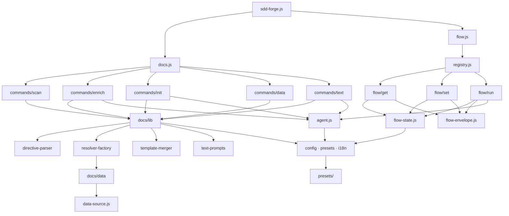

<!-- {{data("base.docs.langSwitcher", {labels: "relative"})}} -->
**English** | [日本語](ja/internal_design.md)
<!-- {{/data}} -->

# Internal Design

## Description

<!-- {{text({prompt: "Write a 1-2 sentence overview of this chapter. Include the project structure, module dependency direction, and key processing flows."})}} -->

sdd-forge follows a three-tier architecture: top-level dispatchers (`sdd-forge.js`, `docs.js`, `flow.js`) route subcommands to domain-specific command modules in `docs/commands/` and `flow/get|set|run/`, which in turn consume shared utilities from `lib/` and `docs/lib/`. Dependencies flow strictly downward, and the core documentation build pipeline advances sequentially through `scan → enrich → init → data → text` stages to produce structured Markdown output from source code analysis.
<!-- {{/text}} -->

## Content

### Project Structure

<!-- {{text({prompt: "Describe the project's directory structure as a tree-format code block. Include role comments for key directories and files. Generate from the actual source code structure.", mode: "deep"})}} -->

```
src/
├── sdd-forge.js              # Top-level CLI entry point and dispatcher
├── docs.js                   # docs subcommand dispatcher
├── flow.js                   # flow subcommand dispatcher
├── docs/
│   ├── commands/             # Documentation build pipeline steps
│   │   ├── scan.js           # Source file scanning; produces analysis.json
│   │   ├── enrich.js         # AI-powered metadata annotation
│   │   ├── init.js           # Template initialization and chapter selection
│   │   ├── data.js           # {{data}} directive resolution
│   │   └── text.js           # {{text}} AI text generation
│   ├── data/                 # Built-in DataSource implementations
│   │   ├── agents.js         # AGENTS.md content generator
│   │   ├── docs.js           # Chapter listing, navigation, langSwitcher
│   │   ├── lang.js           # Language switch link generator
│   │   ├── project.js        # package.json metadata provider
│   │   └── text.js           # {{text}} delegation stub
│   └── lib/                  # Docs-domain shared library
│       ├── analysis-entry.js # AnalysisEntry base class; buildSummary()
│       ├── command-context.js# Context resolution; getChapterFiles()
│       ├── data-source.js    # DataSource base class with table helpers
│       ├── directive-parser.js # Template directive parser and replacer
│       ├── resolver-factory.js # Preset DataSource resolver factory
│       ├── scanner.js        # File collection and glob utilities
│       ├── template-merger.js# Block-inheritance template merge engine
│       ├── text-prompts.js   # LLM prompt builders for {{text}}
│       └── lang/             # Language parsers (js, php, py, yaml)
├── flow/
│   ├── registry.js           # Flow subcommand metadata registry
│   ├── get.js / set.js / run.js # Second-level dispatchers
│   ├── get/                  # Read-only flow state queries
│   ├── set/                  # Flow state mutation commands
│   └── run/                  # Flow action executors
├── lib/                      # Core shared utilities
│   ├── agent.js              # AI agent invocation (sync and async)
│   ├── cli.js                # parseArgs, repoRoot, PKG_DIR
│   ├── config.js             # Config loading and path helpers
│   ├── entrypoint.js         # runIfDirect ES module entry guard
│   ├── flow-envelope.js      # ok/fail/warn JSON response schema
│   ├── flow-state.js         # Flow state persistence layer
│   ├── guardrail.js          # Guardrail article parsing and filtering
│   ├── i18n.js               # 3-layer locale merge system
│   ├── presets.js            # Preset chain resolution
│   └── process.js            # runSync spawnSync wrapper
└── presets/                  # Preset definitions per project type
    └── <type>/
        ├── preset.json       # Scan globs and chapter ordering
        ├── data/             # Preset-specific DataSource classes
        └── templates/        # Chapter templates per language
```
<!-- {{/text}} -->

### Module Composition

<!-- {{text({prompt: "List the major modules in table format. Include module name, file path, and responsibility. Extract from import/require relationships and exports in each file.", mode: "deep"})}} -->

| Module | File | Responsibility |
|--------|------|----------------|
| DataSource base | `docs/lib/data-source.js` | Base class for all `{{data}}` resolvers; provides `toMarkdownTable()`, `desc()`, and `mergeDesc()` helpers |
| directive-parser | `docs/lib/directive-parser.js` | Parses `{{data()}}` and `{{text()}}` directives from templates; handles inline and block forms with closing-tag detection |
| resolver-factory | `docs/lib/resolver-factory.js` | Creates per-preset DataSource resolver maps by loading and initializing classes from the full preset inheritance chain |
| template-merger | `docs/lib/template-merger.js` | Bottom-up template resolution supporting ``/`` inheritance and multi-chain additive merge |
| command-context | `docs/lib/command-context.js` | Standardizes root, config, language, type, docsDir, and agent resolution across all docs commands |
| scanner | `docs/lib/scanner.js` | Recursive file collection with include/exclude glob matching and MD5 hash computation |
| text-prompts | `docs/lib/text-prompts.js` | Builds LLM prompts for `{{text}}` directives in per-directive and file-level batch modes |
| flow-state | `lib/flow-state.js` | Two-file persistence scheme (`.active-flow` pointer + per-spec `flow.json`) for SDD workflow state |
| flow-envelope | `lib/flow-envelope.js` | `ok()`/`fail()`/`warn()` factories and `output()` for uniform JSON responses across all flow commands |
| agent | `lib/agent.js` | Synchronous and async AI agent invocation; handles system prompt injection, retry, and stdin fallback |
| config | `lib/config.js` | Loads `.sdd-forge/config.json`; provides `sddDir()`, `sddOutputDir()`, and `DEFAULT_LANG` |
| presets | `lib/presets.js` | `resolveChainSafe()` and `resolveMultiChains()` for traversing preset parent hierarchies |
| flow registry | `flow/registry.js` | Single source of truth for all `flow get/set/run` subcommand script paths and bilingual descriptions |
| i18n | `lib/i18n.js` | Three-layer locale merge (built-in → preset → project) with domain-namespaced keys and `{{placeholder}}` interpolation |
<!-- {{/text}} -->

### Module Dependencies

<!-- {{text({prompt: "Generate a mermaid graph showing inter-module dependencies. Analyze import/require statements in the source code and show the layer structure and dependency direction. Output only the mermaid code block.", mode: "deep"})}} -->


<!-- {{/text}} -->

### Key Processing Flows

<!-- {{text({prompt: "Describe the inter-module data and control flow when running a representative command in numbered steps. Include the flow from entry point to final output.", mode: "deep"})}} -->

The following steps trace execution of `sdd-forge docs data`, which resolves all `{{data}}` directives across the project's chapter files.

1. `sdd-forge.js` receives `docs` as the first argument and dynamically imports `docs.js` via a top-level `await import()`.
2. `docs.js` matches `data` in its subcommand dispatch table and imports `docs/commands/data.js`, forwarding remaining CLI arguments.
3. `data.js` calls `resolveCommandContext(cli)` from `command-context.js`, which reads `.sdd-forge/config.json` to resolve `root`, `type`, `docsDir`, `outputLang`, and `agent`.
4. `analysis.json` is loaded from `.sdd-forge/output/`; `filterAnalysisByDocsExclude()` removes entries matching any `config.docs.exclude` glob patterns.
5. `createResolver(type, root, opts)` in `resolver-factory.js` calls `resolveMultiChains()` to build the preset chain, then loads DataSource `.js` files from each chain level in order (base → leaf → project), calling `init(ctx)` on each instance.
6. `getChapterFiles(docsDir)` returns the ordered list of `docs/*.md` filenames using the preset's `chapters` array.
7. For each chapter file, `processTemplate()` calls `resolveDataDirectives()` from `directive-parser.js`, scanning every line for `{{data(...)}}` / `{{/data}}` block pairs.
8. A `wrappedResolveFn` applies file-context overrides for methods such as `docs.nav` and `docs.langSwitcher`, then routes to `resolver.resolve(preset, source, method, analysis, labels)`, which calls the named method on the matching DataSource instance.
9. Each rendered string replaces the directive block in-place; chapter files with at least one replacement are written back to disk via `fs.writeFileSync()`.
<!-- {{/text}} -->

### Extension Points

<!-- {{text({prompt: "Describe the locations that need changes and extension patterns when adding new commands or features. Derive from plugin points and dispatch registration patterns in the source code.", mode: "deep"})}} -->

**Adding a new DataSource (common to all presets)**
Create a `.js` file in `src/docs/data/`. The class must extend `DataSource` from `docs/lib/data-source.js` and be the module's `default` export. Each public method is automatically callable as `{{data("preset.sourceName.methodName")}}` in any Markdown template; `resolver-factory.js` discovers and loads it without additional registration.

**Adding a preset-specific DataSource or override**
Place a `.js` file with the same base name in `src/presets/<type>/data/`. The resolver-factory loads chain layers bottom-up (base → leaf → project), so later entries shadow earlier ones of the same name, enabling targeted per-preset overrides.

**Adding a new docs build command**
Create `src/docs/commands/<name>.js` following the `resolveCommandContext` + `runIfDirect` pattern used by the existing command files, then add the `name → file path` mapping to the dispatch table inside `docs.js`.

**Adding a new flow subcommand**
Add an entry to `src/flow/registry.js` under `get`, `set`, or `run` with a `script` path relative to `PKG_DIR` and a bilingual `desc`. Create the corresponding handler file and use `ok()`/`fail()`/`output()` from `lib/flow-envelope.js`; the second-level dispatcher (`get.js`, `set.js`, or `run.js`) picks it up from the registry automatically.

**Extending the preset template system**
Add a new `.md` file to `src/presets/<type>/templates/<lang>/` and register its filename in the `chapters` array of the preset's `preset.json`. The `template-merger.js` engine discovers and includes it automatically during `sdd-forge docs init`.
<!-- {{/text}} -->

---

<!-- {{data("base.docs.nav")}} -->
[← Configuration and Customization](configuration.md)
<!-- {{/data}} -->
