# 04. Internal Design

## Description

<!-- {{text: Write a 1-2 sentence overview of this chapter. Include the project structure, module dependency direction, and key processing flows.}} -->

This chapter describes sdd-forge's internal architecture: the three-layer directory structure under `src/`, the dependency flow from CLI entry points through dispatchers to command implementations and shared libraries, and the key processing flows for source scanning, template resolution, and document generation.

<!-- {{/text}} -->

## Content

### Project Structure

<!-- {{text[mode=deep]: Describe the project's directory structure as a tree-format code block. Include role comments for key directories and files. Generate from the actual source code structure.}} -->

```
src/
├── sdd-forge.js              # CLI entry point & top-level router
├── docs.js                   # docs subcommand dispatcher
├── spec.js                   # spec subcommand dispatcher
├── flow.js                   # flow subcommand dispatcher
├── setup.js                  # setup command (standalone)
├── upgrade.js                # upgrade command (standalone)
├── presets-cmd.js             # presets command (standalone)
├── help.js                   # help display
│
├── docs/
│   ├── commands/              # docs subcommand implementations
│   │   ├── scan.js            #   DataSource-based file scanning → analysis.json
│   │   ├── enrich.js          #   AI-powered enrichment of analysis entries
│   │   ├── init.js            #   template resolution & chapter initialization
│   │   ├── data.js            #   {{data}} directive resolution
│   │   ├── text.js            #   {{text}} directive resolution (AI-driven)
│   │   ├── readme.js          #   README.md generation
│   │   ├── forge.js           #   AI-driven iterative document generation
│   │   ├── review.js          #   document quality review
│   │   ├── changelog.js       #   changelog generation
│   │   ├── agents.js          #   AGENTS.md generation
│   │   ├── translate.js       #   multi-language translation
│   │   └── snapshot.js        #   document snapshot
│   ├── data/                  # Common DataSources (all project types)
│   │   ├── project.js         #   package.json metadata
│   │   ├── docs.js            #   chapter listing & language switcher
│   │   ├── agents.js          #   AGENTS.md section generation
│   │   └── lang.js            #   language navigation links
│   └── lib/                   # Document generation library
│       ├── scanner.js         #   file discovery & language-specific parsers
│       ├── directive-parser.js#   {{data}}/{{text}} directive & @block parsing
│       ├── template-merger.js #   preset layer template inheritance engine
│       ├── data-source.js     #   DataSource base class
│       ├── data-source-loader.js # dynamic DataSource loader
│       ├── scan-source.js     #   Scannable mixin for DataSource
│       ├── resolver-factory.js#   preset-layered resolver factory
│       ├── command-context.js #   shared command context resolution
│       ├── forge-prompts.js   #   forge command prompt construction
│       ├── text-prompts.js    #   {{text}} prompt construction
│       ├── review-parser.js   #   review output parsing & patching
│       ├── concurrency.js     #   parallel execution queue utility
│       └── php-array-parser.js#   CakePHP PHP array extraction
│
├── flow/
│   └── commands/              # SDD flow subcommand implementations
│       ├── start.js           #   flow initiation
│       ├── status.js          #   flow status display
│       ├── review.js          #   flow review
│       ├── merge.js           #   flow merge & cleanup
│       └── cleanup.js         #   worktree cleanup
│
├── spec/
│   └── commands/              # spec subcommand implementations
│       ├── init.js            #   spec initialization
│       ├── gate.js            #   spec gate check
│       └── guardrail.js       #   spec guardrail validation
│
├── lib/                       # Cross-layer shared utilities
│   ├── agent.js               #   AI agent invocation (sync & async)
│   ├── cli.js                 #   repoRoot, sourceRoot, parseArgs, PKG_DIR
│   ├── config.js              #   .sdd-forge/config.json loader
│   ├── presets.js             #   preset.json discovery & resolution
│   ├── flow-state.js          #   SDD flow state persistence (flow.json)
│   ├── i18n.js                #   3-layer i18n with domain namespaces
│   ├── types.js               #   type alias resolution & validation
│   ├── agents-md.js           #   AGENTS.md SDD template loader
│   ├── entrypoint.js          #   ES module direct-run detection
│   ├── process.js             #   spawnSync wrapper
│   └── progress.js            #   progress bar & logging utility
│
├── presets/                   # Preset configurations
│   ├── base/                  #   base preset (inherited by all)
│   │   ├── data/              #     common DataSources (package.js)
│   │   └── templates/         #     base templates (en/, ja/)
│   ├── cli/                   #   CLI preset parent
│   │   └── data/              #     modules DataSource
│   ├── node-cli/              #   Node.js CLI preset (extends cli)
│   ├── webapp/                #   webapp preset parent
│   │   └── data/              #     controllers, models, shells, tables, routes
│   ├── cakephp2/              #   CakePHP 2.x preset (extends webapp)
│   │   ├── data/              #     FW-specific DataSources
│   │   └── scan/              #     FW-specific scanners
│   ├── laravel/               #   Laravel preset (extends webapp)
│   │   ├── data/              #     FW-specific DataSources
│   │   └── scan/              #     FW-specific scanners
│   ├── symfony/               #   Symfony preset (extends webapp)
│   │   ├── data/              #     FW-specific DataSources
│   │   └── scan/              #     FW-specific scanners
│   └── library/               #   library preset
│
├── locale/                    # i18n message files
│   ├── en/                    #   English (ui.json, messages.json, prompts.json)
│   └── ja/                    #   Japanese
│
└── templates/                 # Miscellaneous templates
    ├── config.example.json
    ├── review-checklist.md
    └── skills/                #   Claude Code skill definitions
```

<!-- {{/text}} -->

### Module Composition

<!-- {{text[mode=deep]: List the major modules in table format. Include module name, file path, and responsibility. Extract from import/require relationships and exports in each file.}} -->

| Module | Path | Responsibility |
| --- | --- | --- |
| CLI Router | `src/sdd-forge.js` | Top-level command dispatch to docs/spec/flow/setup/upgrade/presets |
| Docs Dispatcher | `src/docs.js` | Routes `docs <cmd>` to individual command implementations; orchestrates the `build` pipeline |
| Spec Dispatcher | `src/spec.js` | Routes `spec <cmd>` to init/gate/guardrail commands |
| Flow Dispatcher | `src/flow.js` | Routes `flow <cmd>` to start/status/review/merge/cleanup commands |
| Scanner | `src/docs/commands/scan.js` | Collects files via glob patterns, dispatches to DataSource `match()`/`scan()`, produces `analysis.json` |
| Data Command | `src/docs/commands/data.js` | Resolves `{{data}}` directives in template files using DataSource resolvers |
| Text Command | `src/docs/commands/text.js` | Resolves `{{text}}` directives via AI agent calls with enriched analysis context |
| Directive Parser | `src/docs/lib/directive-parser.js` | Parses `{{data}}`/`{{text}}` directives and `@block`/`@extends` inheritance syntax |
| Template Merger | `src/docs/lib/template-merger.js` | Bottom-up template resolution across preset layers (project-local → leaf → arch → base) |
| DataSource Base | `src/docs/lib/data-source.js` | Base class for `{{data}}` resolvers; provides `toMarkdownTable()`, `mergeDesc()`, `desc()` |
| Scannable Mixin | `src/docs/lib/scan-source.js` | Adds `match()`/`scan()` capabilities to DataSource classes |
| DataSource Loader | `src/docs/lib/data-source-loader.js` | Dynamically loads and instantiates DataSource classes from `data/` directories |
| Resolver Factory | `src/docs/lib/resolver-factory.js` | Builds the layered resolver (common → arch → leaf → project-local DataSources) |
| Command Context | `src/docs/lib/command-context.js` | Resolves shared context (root, config, type, agent, i18n) for all docs commands |
| Agent Utility | `src/lib/agent.js` | AI agent invocation (sync/async), stdin fallback for large prompts, context file management |
| CLI Utility | `src/lib/cli.js` | `repoRoot()`, `sourceRoot()`, `parseArgs()`, worktree detection, `PKG_DIR` |
| Config Loader | `src/lib/config.js` | Loads and validates `.sdd-forge/config.json`; provides `sddDir()`/`sddOutputDir()` path helpers |
| Preset Resolver | `src/lib/presets.js` | Discovers and resolves `preset.json` files across the preset hierarchy; exports `PRESETS_DIR` |
| Flow State | `src/lib/flow-state.js` | Persists SDD workflow state to `.sdd-forge/flow.json`; tracks steps and requirements |
| i18n | `src/lib/i18n.js` | 3-layer locale merge (default → preset → project); domain-namespaced key lookup with interpolation |
| Type Resolver | `src/lib/types.js` | Resolves and validates type aliases (e.g., `"cakephp2"` → `"webapp/cakephp2"`) |
| Progress | `src/lib/progress.js` | TTY progress bar with ANSI pinned header, spinner animation, and scoped logger creation |
| Entrypoint | `src/lib/entrypoint.js` | `isDirectRun()` detection and `runIfDirect()` guard for ES module entry points |

<!-- {{/text}} -->

### Module Dependencies

```mermaid
graph TD
    subgraph "CLI Layer"
        entry["sdd-forge.js"]
        docs_d["docs.js"]
        spec_d["spec.js"]
        flow_d["flow.js"]
        setup["setup.js"]
    end

    subgraph "Command Layer (docs)"
        scan["scan.js"]
        data_cmd["data.js"]
        text_cmd["text.js"]
        init_cmd["init.js"]
        forge["forge.js"]
        review["review.js"]
        readme["readme.js"]
        agents_cmd["agents.js"]
    end

    subgraph "Command Layer (spec/flow)"
        spec_init["spec/init.js"]
        spec_gate["spec/gate.js"]
        flow_start["flow/start.js"]
        flow_merge["flow/merge.js"]
    end

    subgraph "Library Layer (docs/lib)"
        scanner["scanner.js"]
        dp["directive-parser.js"]
        tm["template-merger.js"]
        ds["data-source.js"]
        dsl["data-source-loader.js"]
        rf["resolver-factory.js"]
        cc["command-context.js"]
        fp["forge-prompts.js"]
        tp["text-prompts.js"]
        rp["review-parser.js"]
        conc["concurrency.js"]
    end

    subgraph "Shared Library Layer (lib)"
        agent["agent.js"]
        cli["cli.js"]
        config["config.js"]
        presets["presets.js"]
        fs_mod["flow-state.js"]
        i18n["i18n.js"]
        types["types.js"]
        progress["progress.js"]
        ep["entrypoint.js"]
    end

    subgraph "DataSource Layer (presets)"
        base_ds["base/data/"]
        webapp_ds["webapp/data/"]
        cakephp_ds["cakephp2/data/"]
        laravel_ds["laravel/data/"]
        symfony_ds["symfony/data/"]
        cli_ds["cli/data/"]
    end

    entry --> docs_d & spec_d & flow_d & setup
    docs_d --> scan & data_cmd & text_cmd & init_cmd & forge & review & readme & agents_cmd
    spec_d --> spec_init & spec_gate
    flow_d --> flow_start & flow_merge

    scan --> scanner & dsl & cc & presets & config & progress
    data_cmd --> dp & rf & cc & config & progress
    text_cmd --> dp & tp & cc & agent & conc & progress
    init_cmd --> tm & cc & presets
    forge --> fp & rp & data_cmd & agent & conc & cc
    review --> cc & agent & progress
    readme --> dp & rf & cc

    rf --> dsl & presets & config
    dsl --> ds
    cc --> cli & config & types & agent & i18n & tm
    tm --> dp & presets
    tp --> i18n
    fp --> i18n

    flow_start --> fs_mod & cli
    flow_merge --> fs_mod & cli

    webapp_ds --> ds
    cakephp_ds --> webapp_ds
    laravel_ds --> webapp_ds
    symfony_ds --> webapp_ds
    cli_ds --> ds
    base_ds --> ds

    i18n --> config & presets & cli
    config --> cli
```

<!-- {{text[mode=deep]: Generate a mermaid graph showing inter-module dependencies. Analyze import/require statements in the source code and show the layer structure and dependency direction. Output only the mermaid code block.}} -->



<!-- {{/text}} -->

### Key Processing Flows

<!-- {{text[mode=deep]: Describe the inter-module data and control flow when running a representative command in numbered steps. Include the flow from entry point to final output.}} -->

**`sdd-forge docs build` — Full Documentation Pipeline**

1. **Entry** (`sdd-forge.js`): The CLI router parses the top-level command `docs` and delegates to `docs.js`.
2. **Pipeline Orchestration** (`docs.js`): The `build` subcommand triggers a sequential pipeline: `scan → enrich → init → data → text → readme → agents → [translate]`. A `createProgress()` instance tracks each step with a weighted progress bar.
3. **Scan** (`docs/commands/scan.js`): Loads preset scan configuration via `presetByLeaf()`. Collects source files using `collectFiles()` with include/exclude glob patterns. Loads DataSources from the preset hierarchy (base → arch → leaf → project-local) using `loadScanSources()`. Each DataSource's `match()` filters files, and `scan()` extracts structured data. Results are stored in `.sdd-forge/output/analysis.json`. `preserveEnrichment()` carries over enriched fields from the previous analysis for unchanged files (hash-based matching).
4. **Enrich** (`docs/commands/enrich.js`): Sends the full analysis to an AI agent to annotate each entry with `summary`, `detail`, `chapter`, and `role` fields, providing a global understanding of the codebase.
5. **Init** (`docs/commands/init.js`): Calls `resolveTemplates()` from `template-merger.js` to resolve template files across the preset layer hierarchy (project-local → leaf → arch → base). Templates with `@extends`/`@block` directives are merged bottom-up. Resolved templates are written to `docs/` as chapter files, with `stripBlockDirectives()` removing inheritance markers.
6. **Data** (`docs/commands/data.js`): Builds a resolver via `createResolver()` from `resolver-factory.js`, which loads DataSources from all layers and calls `init(ctx)` on each. Iterates through chapter files, calling `resolveDataDirectives()` from `directive-parser.js` to find `{{data: source.method("labels")}}` directives. Each directive invokes the corresponding DataSource method, which returns rendered Markdown (typically via `toMarkdownTable()`). The directive content between opening and closing tags is replaced with the result.
7. **Text** (`docs/commands/text.js`): Parses `{{text}}` directives from chapter files. Builds prompts using `buildTextSystemPrompt()` and `buildPrompt()`/`buildBatchPrompt()` from `text-prompts.js`, incorporating enriched analysis context via `getEnrichedContext()`. Calls the configured AI agent via `callAgentAsync()` with concurrency control from `mapWithConcurrency()`. AI-generated prose replaces directive content.
8. **README** (`docs/commands/readme.js`): Processes `{{data}}` directives in the README template (chapter table, language switcher) using the same resolver pipeline as the data command.
9. **Agents** (`docs/commands/agents.js`): Generates/updates `AGENTS.md` with SDD template content and project context derived from analysis data via the `AgentsSource` DataSource.
10. **Output**: The pipeline produces a complete `docs/` directory with fully rendered chapter files, a README with chapter index, and an AGENTS.md for AI agent context.

**`sdd-forge docs data` — Standalone Data Resolution**

1. `sdd-forge.js` routes to `docs.js`, which delegates to `docs/commands/data.js`.
2. `resolveCommandContext()` builds the shared context (root, config, type, docsDir, agent, i18n).
3. `analysis.json` is loaded from `.sdd-forge/output/`.
4. `createResolver(type, root)` loads DataSources from common → arch → leaf → project-local directories, calling `init(ctx)` on each to inject the `desc()` helper and `loadOverrides()` function.
5. `getChapterFiles()` resolves the ordered list of chapter files (config.chapters → preset chapters → alphabetical fallback).
6. For each file, `processTemplate()` calls `resolveDataDirectives()`, which parses directives in reverse order (to prevent line-number drift) and calls the resolver for each `{{data}}` directive. `{{text}}` directives are skipped and counted.
7. Modified files are written back to disk (unless `--dry-run` is set), with replacement and skip counts logged.

<!-- {{/text}} -->

### Extension Points

<!-- {{text[mode=deep]: Describe the locations that need changes and extension patterns when adding new commands or features. Derive from plugin points and dispatch registration patterns in the source code.}} -->

**Adding a New Preset (Framework Support)**

To support a new framework (e.g., a new PHP or JS framework), create a new directory under `src/presets/` that extends an existing parent preset (`webapp` or `cli`). The directory should contain:

- `preset.json`: Defines `scan.include`/`scan.exclude` glob patterns and a `chapters` array for document ordering.
- `data/`: One or more DataSource classes extending `WebappDataSource` (for webapp types) or `Scannable(DataSource)` (for CLI types). Each class implements `match(file)` to filter relevant source files and `scan(files)` to extract structured data. Resolve methods (e.g., `list()`, `relations()`) return Markdown strings for `{{data}}` directives.
- `scan/`: Pure analyzer modules (functions, not classes) that perform framework-specific source code parsing. These are called by the DataSource `scan()` methods.
- `templates/{lang}/`: Markdown template files with `{{data}}`/`{{text}}` directives. Templates can use `@extends`/`@block`/`@endblock` for inheritance from parent presets.

The preset is automatically discovered by `presetByLeaf()` in `src/lib/presets.js` and integrated into the layered loading chain. No registration code changes are needed.

**Adding a New DataSource**

Place a new `.js` file in any `data/` directory within the preset hierarchy. The file must `export default` a class extending `DataSource` (or `Scannable(DataSource)` if scan capability is needed). The `data-source-loader.js` module dynamically imports all `.js` files from `data/` directories and instantiates them. Method names on the class become available as `{{data: sourceName.methodName("labels")}}` directives, where `sourceName` is the filename without extension.

**Adding a New docs Subcommand**

1. Create a new file in `src/docs/commands/` implementing an async `main(ctx)` function and calling `runIfDirect(import.meta.url, main)` at the bottom.
2. Register the command name in the dispatch table within `src/docs.js` so the dispatcher can route `sdd-forge docs <newcmd>` to the implementation.
3. Add help text entries in `src/locale/en/ui.json` and `src/locale/ja/ui.json` under the `help.cmdHelp` namespace.

**Adding a New flow/spec Subcommand**

Follow the same pattern: create a file in `src/flow/commands/` or `src/spec/commands/`, then register it in the corresponding dispatcher (`src/flow.js` or `src/spec.js`).

**Customizing Per-Project Behavior**

- **DataSources**: Place custom `.js` DataSource files in `.sdd-forge/data/`. These are loaded last and override preset DataSources with the same filename.
- **Templates**: Place custom templates in `.sdd-forge/templates/{lang}/`. These form the highest-priority layer in template resolution.
- **Locale overrides**: Place custom message files in `.sdd-forge/locale/{lang}/` to override UI strings, messages, or prompt text via the 3-layer i18n merge.
- **Config overrides**: Use `.sdd-forge/config.json` fields such as `chapters` (override preset chapter order), `scan` (replace preset scan config entirely), and `agent.commands` (configure per-command AI agent settings).

**Adding i18n Support for a New Language**

Create a new directory under `src/locale/` (e.g., `src/locale/zh/`) with `ui.json`, `messages.json`, and `prompts.json`. The `i18n.js` module automatically discovers locale directories. Add the language code to the `LANG_NAMES` maps in `text-prompts.js` and `lang.js` for display name resolution.

<!-- {{/text}} -->
