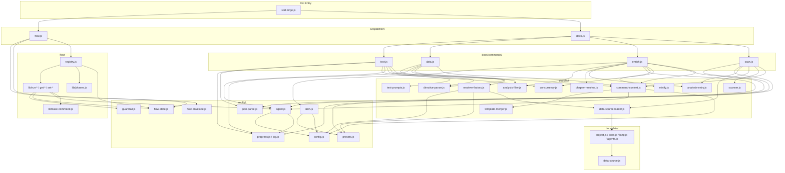

<!-- {{data("base.docs.langSwitcher", {labels: "relative"})}} -->
[日本語](ja/internal_design.md) | **English**
<!-- {{/data}} -->

# Internal Design

## Description

<!-- {{text({prompt: "Write a 1-2 sentence overview of this chapter. Include the project structure, module dependency direction, and key processing flows."})}} -->

sdd-forge is a Node.js CLI tool organized into three primary source layers — `src/docs/` for documentation pipeline commands and their supporting library, `src/flow/` for the Spec-Driven Development workflow engine, and `src/lib/` for shared utilities — with dependencies flowing strictly downward: commands depend on lib modules, lib modules depend only on Node.js built-ins. The core processing flows are: (1) the docs pipeline (`scan → enrich → data → text → readme → agents`) that transforms source code into structured documentation, and (2) the flow engine (`prepare → gate → review → finalize`) that manages SDD spec lifecycle using persistent state in `.sdd-forge/`.
<!-- {{/text}} -->

## Content

### Project Structure

<!-- {{text({prompt: "Describe the project's directory structure as a tree-format code block. Include role comments for key directories and files. Generate from the actual source code structure.", mode: "deep"})}} -->

```
src/
├── sdd-forge.js              # CLI entry point; top-level subcommand dispatcher
├── docs.js                   # Dispatcher for docs subcommands
├── flow.js                   # Dispatcher for flow subcommands (uses registry.js)
├── check.js                  # Dispatcher for check subcommands
├── setup.js                  # One-time project setup command
├── upgrade.js                # Upgrades skills and templates in the project
├── presets-cmd.js            # Lists available presets
├── help.js                   # Global help output
├── lib/                      # Shared utilities (no inbound deps from docs/ or flow/)
│   ├── agent.js              # AI agent invocation (spawn-based, async)
│   ├── config.js             # Loads and resolves .sdd-forge/config.json
│   ├── presets.js            # Preset auto-discovery and parent-chain resolution
│   ├── flow-state.js         # SDD flow state persistence (flow.json)
│   ├── flow-envelope.js      # Structured ok/fail/output envelope for flow commands
│   ├── i18n.js               # 3-layer i18n with domain namespaces
│   ├── git-helpers.js        # Git/gh status helpers
│   ├── guardrail.js          # Guardrail policy loading and evaluation
│   ├── lint.js               # Lint integration
│   ├── log.js                # Logger singleton
│   ├── progress.js           # Named logger factory (createLogger)
│   ├── json-parse.js         # Fault-tolerant JSON parsing and repair
│   ├── formatter.js          # Markdown table and output formatting
│   ├── include.js            # {{include}} directive expansion
│   ├── multi-select.js       # Interactive multi-select UI helper
│   ├── agents-md.js          # AGENTS.md generation logic
│   ├── cli.js                # repoRoot, sourceRoot, parseArgs, PKG_DIR
│   ├── entrypoint.js         # runIfDirect() guard for ES module scripts
│   ├── exit-codes.js         # Shared process exit code constants
│   ├── process.js            # Child process utilities
│   ├── skills.js             # Skill file management
│   └── types.js              # Config type aliases, validation, resolveOutputConfig
├── docs/
│   ├── commands/             # Docs pipeline command implementations
│   │   ├── scan.js           # Collects source files and builds analysis.json
│   │   ├── enrich.js         # AI-enriches analysis entries (summary/chapter/role)
│   │   ├── init.js           # Merges preset templates into docs/
│   │   ├── data.js           # Resolves {{data}} directives in doc files
│   │   ├── text.js           # Resolves {{text}} directives via AI agent
│   │   ├── readme.js         # Generates README.md
│   │   ├── agents.js         # Generates AGENTS.md
│   │   ├── changelog.js      # Generates changelog entries
│   │   ├── review.js         # AI-based doc review
│   │   ├── translate.js      # Translates docs to additional languages
│   │   └── forge.js          # Runs the full pipeline in a single call
│   ├── lib/                  # Documentation engine core library
│   │   ├── directive-parser.js    # Parses {{data}}, {{text}},  directives
│   │   ├── resolver-factory.js    # Builds preset-aware DataSource resolver
│   │   ├── data-source-loader.js  # Dynamically imports DataSource .js files
│   │   ├── data-source.js         # DataSource base class (init, desc, mergeDesc)
│   │   ├── analysis-entry.js      # AnalysisEntry base class and summary builder
│   │   ├── analysis-filter.js     # Filters analysis by docs.exclude patterns
│   │   ├── scanner.js             # File collection, hashing, glob pattern matching
│   │   ├── scan-source.js         # Scannable mixin for DataSources with parse()
│   │   ├── template-merger.js     # Block-based template inheritance engine
│   │   ├── chapter-resolver.js    # Maps analysis categories to doc chapters
│   │   ├── command-context.js     # Resolves shared CommandContext for all commands
│   │   ├── text-prompts.js        # Prompt builders for {{text}} AI calls
│   │   ├── concurrency.js         # mapWithConcurrency() async queue utility
│   │   ├── minify.js              # Source code minification for AI prompt compression
│   │   ├── lang-factory.js        # Maps file extension to language handler
│   │   ├── lang/                  # Per-language parse/minify/import handlers
│   │   │   ├── js.js              # JavaScript/TypeScript
│   │   │   ├── php.js             # PHP
│   │   │   ├── py.js              # Python
│   │   │   └── yaml.js            # YAML
│   │   ├── forge-prompts.js       # Prompt helpers for forge (full pipeline)
│   │   ├── review-parser.js       # Parses AI review output
│   │   ├── toml-parser.js         # Minimal TOML parser
│   │   └── php-array-parser.js    # PHP array literal parser
│   └── data/                 # Common (non-preset-specific) DataSource plugins
│       ├── project.js        # Project-level metadata (name, description, lang)
│       ├── docs.js           # Doc nav, lang switcher, cross-references
│       ├── lang.js           # Language-related data (links, labels)
│       ├── agents.js         # AGENTS.md section data
│       └── text.js           # Text directive metadata source
├── flow/
│   ├── registry.js           # Single source of truth for flow command metadata
│   ├── commands/             # High-level flow command implementations
│   │   ├── merge.js          # Merge/PR creation logic
│   │   ├── review.js         # Review phase coordination
│   │   └── report.js         # Flow status reporting
│   └── lib/                  # Flow logic modules (pure functions)
│       ├── base-command.js   # FlowCommand base class
│       ├── phases.js         # Phase definitions and VALID_PHASES
│       ├── get-*.js          # State readers (status, context, guardrail, issue, ...)
│       ├── set-*.js          # State writers (step, request, metric, issue-log, ...)
│       └── run-*.js          # Action runners (prepare-spec, gate, review, finalize, ...)
├── presets/                  # Framework-specific preset packages
│   ├── base/                 # Root preset (all presets inherit)
│   ├── webapp/               # Generic web application preset
│   ├── laravel/              # Laravel-specific DataSources and templates
│   ├── nextjs/               # Next.js DataSources and templates
│   ├── hono/                 # Hono DataSources and templates
│   └── ...                   # Additional framework and database presets
├── locale/
│   ├── en/                   # English message bundles
│   └── ja/                   # Japanese message bundles
└── templates/
    ├── skills/               # Skill file templates installed by sdd-forge upgrade
    └── partials/             # Shared include partials
```
<!-- {{/text}} -->

### Module Composition

<!-- {{text({prompt: "List the major modules in table format. Include module name, file path, and responsibility. Extract from import/require relationships and exports in each file.", mode: "deep"})}} -->

| Module | File Path | Responsibility |
|---|---|---|
| sdd-forge.js | `src/sdd-forge.js` | Top-level CLI entry point; dispatches to namespace dispatchers and standalone commands |
| docs.js | `src/docs.js` | Docs subcommand dispatcher; maps subcommand names to `docs/commands/*.js` scripts |
| flow.js | `src/flow.js` | Flow subcommand dispatcher; resolves root/config/flowState and invokes commands from the registry |
| scan.js | `src/docs/commands/scan.js` | Collects source files via glob patterns, loads Scannable DataSources from the preset chain, performs incremental hash-based parsing, and writes `analysis.json` |
| enrich.js | `src/docs/commands/enrich.js` | Batches unenriched analysis entries by token count, calls the AI agent to add `summary`/`detail`/`chapter`/`role`, and saves results with resume support |
| data.js | `src/docs/commands/data.js` | Reads doc chapter files, resolves `{{data}}` directives via `resolver-factory.js`, and writes updated files |
| text.js | `src/docs/commands/text.js` | Fills `{{text}}` directives in chapter files with AI-generated prose using batch or per-directive mode |
| directive-parser.js | `src/docs/lib/directive-parser.js` | Parses and replaces `{{data}}`, `{{text}}`, ``, and `` directives in markdown template files |
| resolver-factory.js | `src/docs/lib/resolver-factory.js` | Builds a `preset.source.method` resolver by loading DataSource instances from the full preset inheritance chain |
| data-source-loader.js | `src/docs/lib/data-source-loader.js` | Dynamically imports DataSource class files from a directory, instantiates them, and merges into an inherited Map |
| data-source.js | `src/docs/lib/data-source.js` | Abstract base class for all DataSource plugins; provides `init()`, `desc()`, `mergeDesc()`, and `toMarkdownTable()` |
| analysis-entry.js | `src/docs/lib/analysis-entry.js` | Defines `ANALYSIS_META_KEYS`, the `AnalysisEntry` base class, `isEmptyEntry()`, and `buildSummary()` |
| analysis-filter.js | `src/docs/lib/analysis-filter.js` | Filters analysis entries by `docs.exclude` glob patterns from config |
| scanner.js | `src/docs/lib/scanner.js` | Provides `collectFiles()` with glob matching, MD5 hashing, mtime tracking, and `globToRegex()` |
| template-merger.js | `src/docs/lib/template-merger.js` | Resolves ``/`` template inheritance across the preset chain and merges output |
| chapter-resolver.js | `src/docs/lib/chapter-resolver.js` | Builds a category-to-chapter map by scanning `{{data}}` directives in existing doc files |
| command-context.js | `src/docs/lib/command-context.js` | Resolves the shared `CommandContext` (root, srcRoot, config, lang, type, docsDir, agent) for docs commands |
| text-prompts.js | `src/docs/lib/text-prompts.js` | Builds system and batch prompts for `{{text}}` AI calls; provides `getEnrichedContext()` for deep mode |
| concurrency.js | `src/docs/lib/concurrency.js` | `mapWithConcurrency()` — processes an array with bounded parallelism, returning ordered `{value, error}` results |
| minify.js | `src/docs/lib/minify.js` | Dispatches source minification to the language handler; supports `essential` and `light` modes |
| lang-factory.js | `src/docs/lib/lang-factory.js` | Maps file extension to the appropriate language handler module (js, php, py, yaml) |
| registry.js | `src/flow/registry.js` | Single source of truth for all flow subcommand metadata: args, help text, lazy imports, and lifecycle hooks |
| base-command.js | `src/flow/lib/base-command.js` | `FlowCommand` abstract base class enforcing `execute(ctx)` and flow-state presence |
| phases.js | `src/flow/lib/phases.js` | Exports the frozen `VALID_PHASES` array used across gate, guardrail, and review modules |
| agent.js | `src/lib/agent.js` | Invokes AI agents synchronously or asynchronously with provider-specific output parsing, retry, and structured logging |
| config.js | `src/lib/config.js` | Loads `.sdd-forge/config.json` and provides path helpers (`sddDir`, `sddOutputDir`, `sddDataDir`) |
| presets.js | `src/lib/presets.js` | Auto-discovers preset directories and provides `resolveChainSafe()`, `resolveMultiChains()`, `presetByLeaf()` |
| flow-state.js | `src/lib/flow-state.js` | Reads, writes, and atomically mutates `flow.json`; provides `updateStepStatus()`, `incrementMetric()`, `derivePhase()` |
| flow-envelope.js | `src/lib/flow-envelope.js` | Provides `ok()`, `fail()`, `warn()`, and `output()` for structured flow command return values |
| i18n.js | `src/lib/i18n.js` | 3-layer locale loading (built-in → preset → project) with domain-namespaced `translate()` and `t.raw()` |
| guardrail.js | `src/lib/guardrail.js` | Loads and merges preset and project guardrail rules; filters by phase with `filterByPhase()` |
| json-parse.js | `src/lib/json-parse.js` | `repairJson()` — repairs malformed or markdown-fenced JSON returned by AI agents before `JSON.parse()` |
| log.js | `src/lib/log.js` | Singleton structured logger writing JSONL records and per-request prompt files to `.tmp/logs/` |
| progress.js | `src/lib/progress.js` | `createLogger(prefix)` factory producing named stderr loggers with `log()` and `verbose()` methods |
<!-- {{/text}} -->

### Module Dependencies

<!-- {{text({prompt: "Generate a mermaid graph showing inter-module dependencies. Analyze import/require statements in the source code and show the layer structure and dependency direction. Output only the mermaid code block.", mode: "deep"})}} -->


<!-- {{/text}} -->

### Key Processing Flows

<!-- {{text({prompt: "Describe the inter-module data and control flow when running a representative command in numbered steps. Include the flow from entry point to final output.", mode: "deep"})}} -->

1. **CLI dispatch**: The user runs `sdd-forge docs data`. `sdd-forge.js` identifies `docs` as a namespace command and delegates to `src/docs.js`, forwarding the remaining args.

2. **Subcommand routing**: `docs.js` maps `"data"` to `src/docs/commands/data.js` and invokes its `main()` entry point.

3. **Argument parsing**: `main()` detects it is running in CLI mode (no `ctx` argument) and calls `parseArgs(process.argv.slice(2), ...)` from `src/lib/cli.js` to extract flags (`--dry-run`, `--stdout`) and options (`--docs-dir`).

4. **Context resolution**: `resolveCommandContext(cli)` in `command-context.js` calls `repoRoot()`, reads `.sdd-forge/config.json` via `config.js`, validates it with `validateConfig()`, resolves `type`, `lang`, `docsDir`, and the agent config. The result is a `CommandContext` object.

5. **Analysis loading**: `data.js` reads `.sdd-forge/output/analysis.json` using the path from `sddOutputDir(root)`. The raw JSON is passed through `filterAnalysisByDocsExclude(rawAnalysis, docsExclude)` in `analysis-filter.js` to remove entries matching `docs.exclude` glob patterns.

6. **Resolver creation**: `createResolver(type, root, { docsDir, configChapters })` in `resolver-factory.js` calls `resolveMultiChains(type)` from `presets.js` to build the ordered preset inheritance chain. For each chain, `loadChainDataSources()` calls `loadDataSources()` from `data-source-loader.js` on the built-in `docs/data/` directory, then each preset's `data/` directory, then the project-local `.sdd-forge/data/` directory. Each DataSource file is dynamically imported, instantiated, and `init(ctx)` is called. A unified `resolve(preset, source, method, analysis, labels)` closure is returned.

7. **Chapter file enumeration**: `getChapterFiles(docsDir, { type, configChapters })` in `command-context.js` returns the ordered list of chapter `.md` files using the preset-defined chapter order from `template-merger.js`.

8. **Directive resolution per file**: For each chapter file, the content is read from disk. File-path-aware context overrides are applied via `FILE_CONTEXT_RULES` in `data.js` for navigation-sensitive directives (e.g., `docs.langSwitcher`, `docs.nav`). `resolveDataDirectives(text, resolveFn, callbacks)` in `directive-parser.js` scans each `{{data("preset.source.method", {...})}}` block and calls the resolver, which invokes the named method on the matching DataSource instance (e.g., `project.name()`, `docs.chapters()`), returning rendered Markdown. `{{text}}` directives are skipped and logged.

9. **File writing**: If replacements were made and `--dry-run` is not set, `fs.writeFileSync(filePath, result.text)` writes the updated chapter back to disk.

10. **Summary logging**: After all chapter files are processed, the count of changed files, total replacements, and skipped `{{text}}` directives is reported via the named logger from `progress.js`.
<!-- {{/text}} -->

### Extension Points

<!-- {{text({prompt: "Describe the locations that need changes and extension patterns when adding new commands or features. Derive from plugin points and dispatch registration patterns in the source code.", mode: "deep"})}} -->

**Adding a new `docs` subcommand**

Create `src/docs/commands/<name>.js` following the existing command pattern: export an async `main(ctx)` function that calls `resolveCommandContext(cli)` when `ctx` is absent, and call `runIfDirect(import.meta.url, main)` at the bottom. Register the new command in the `SCRIPTS` lookup map in `src/docs.js`. No other changes are required — the dispatcher resolves it automatically.

**Adding a new `flow` subcommand or action**

All flow commands are declared in `src/flow/registry.js` under `FLOW_COMMANDS`. Each entry specifies a lazy `command` import, `args` definition, `help` text, and optional `pre`/`post`/`onError` hooks. Add a new entry to `FLOW_COMMANDS` and create the corresponding implementation in `src/flow/lib/<name>.js`, extending `FlowCommand` and implementing `execute(ctx)`. The `flow.js` dispatcher discovers and routes to it through the registry without any further changes.

**Adding a new DataSource method to an existing preset**

Add the method directly to the DataSource class in `src/presets/<preset>/data/<source>.js` (or `src/docs/data/<source>.js` for common DataSources). Because `resolver-factory.js` instantiates DataSources at runtime, the new method is immediately callable from a `{{data("preset.source.newMethod")}}` directive in any template with no registration step.

**Adding a new preset**

Create `src/presets/<leaf>/preset.json` with a `parent` field pointing to an existing preset key, and add DataSource classes in `src/presets/<leaf>/data/`. The `presets.js` module discovers preset directories by scanning `src/presets/` at runtime — no central registry update is required. Templates go in `src/presets/<leaf>/templates/<lang>/` and are merged automatically by `template-merger.js` through the inheritance chain.

**Adding a new language handler**

Create `src/docs/lib/lang/<ext>.js` exporting any subset of `parse()`, `minify()`, `extractImports()`, `extractExports()`, and `extractEssential()`. Add the new extension to the `EXT_MAP` in `src/docs/lib/lang-factory.js`. The handler is then used automatically by `scanner.js`, `minify.js`, and any DataSource that calls `getLangHandler(filePath)`.
<!-- {{/text}} -->

---

<!-- {{data("base.docs.nav")}} -->
[← Configuration and Customization](configuration.md)
<!-- {{/data}} -->
