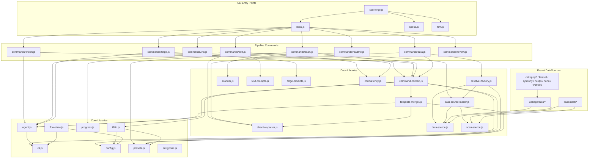

# Internal Design

## Description

<!-- {{text({prompt: "Write a 1-2 sentence overview of this chapter. Include the project structure, module dependency direction, and key processing flows."})}} -->

This chapter describes the internal architecture of sdd-forge, covering the layered module structure where CLI entry points delegate to command implementations backed by shared libraries, the preset inheritance system that flows from base through framework-specific presets, and the core processing pipeline of `scan → enrich → init → data → text → readme` that transforms source code into structured documentation.

<!-- {{/text}} -->

## Content

### Project Structure

<!-- {{text({prompt: "Describe the project's directory structure as a tree-format code block. Include role comments for key directories and files. Generate from the actual source code structure.", mode: "deep"})}} -->

```
src/
├── sdd-forge.js              # Main CLI entry point (3-level dispatch)
├── docs.js                    # docs subcommand dispatcher
├── specs.js                   # specs subcommand dispatcher
├── flow.js                    # SDD flow direct command (not a dispatcher)
├── docs/
│   ├── commands/              # Documentation pipeline commands
│   │   ├── scan.js            # DataSource-based file scanning → analysis.json
│   │   ├── enrich.js          # AI enrichment of analysis entries
│   │   ├── init.js            # Template initialization
│   │   ├── data.js            # {{data}} directive resolution
│   │   ├── text.js            # {{text}} directive LLM processing
│   │   ├── readme.js          # README generation
│   │   ├── forge.js           # AI-driven documentation generation with review loop
│   │   ├── review.js          # Documentation quality review
│   │   └── changelog.js       # Changelog generation
│   ├── data/                  # Common DataSource classes (all presets)
│   │   ├── agents.js          # AGENTS.md section generation
│   │   ├── docs.js            # Chapter listing and navigation
│   │   ├── lang.js            # Language switcher links
│   │   ├── project.js         # package.json metadata
│   │   └── text.js            # Text generation placeholder
│   └── lib/                   # Shared libraries for docs pipeline
│       ├── command-context.js  # Common context resolution for all commands
│       ├── concurrency.js      # Parallel execution queue utility
│       ├── data-source.js      # Base class for {{data}} resolvers
│       ├── data-source-loader.js # Dynamic DataSource module loader
│       ├── directive-parser.js # Template directive parser ({{data}}, {{text}}, )
│       ├── forge-prompts.js    # Prompt construction for forge command
│       ├── resolver-factory.js # Resolver factory with preset chain support
│       ├── review-parser.js    # Review output parser (PASS/FAIL extraction)
│       ├── scan-source.js      # ScanSource base and Scannable mixin
│       ├── scanner.js          # File collection, glob matching, language parsers
│       ├── template-merger.js  # Template inheritance engine (block merge, translation)
│       ├── test-env-detection.js # Test framework auto-detection
│       ├── text-prompts.js     # Prompt building for {{text}} processing
│       ├── toml-parser.js      # Minimal TOML parser for wrangler.toml
│       └── php-array-parser.js # PHP array() syntax parser
├── specs/
│   └── commands/              # Spec-related commands (init, gate)
├── lib/                       # Core shared utilities
│   ├── agent.js               # AI agent invocation (sync/async, stdin fallback)
│   ├── agents-md.js           # AGENTS.md template loader
│   ├── cli.js                 # CLI utilities (repoRoot, parseArgs, worktree detection)
│   ├── config.js              # Configuration loading and path resolution
│   ├── entrypoint.js          # Direct execution guard (isDirectRun, runIfDirect)
│   ├── flow-state.js          # SDD flow state persistence (.active-flow + flow.json)
│   ├── i18n.js                # Internationalization (3-layer merge)
│   ├── multi-select.js        # Interactive terminal selection widget
│   ├── presets.js             # Preset registry and inheritance chain resolution
│   ├── process.js             # spawnSync wrapper
│   ├── progress.js            # Progress bar and logging for build pipeline
│   ├── skills.js              # Skill file deployment logic
│   └── types.js               # Config validation
├── presets/                   # Preset hierarchy (parent chain inheritance)
│   ├── base/                  # Root preset (inherited by all)
│   │   └── data/package.js    # package.json / composer.json scanner
│   ├── cli/                   # CLI application preset
│   │   └── data/modules.js    # Generic JS module scanner
│   ├── webapp/                # Web application base preset
│   │   └── data/              # Common webapp DataSources (controllers, models, routes, tables)
│   ├── cakephp2/              # CakePHP 2.x preset
│   ├── laravel/               # Laravel preset
│   ├── symfony/               # Symfony preset
│   ├── nextjs/                # Next.js preset
│   ├── hono/                  # Hono framework preset
│   ├── workers/               # Cloudflare Workers preset
│   ├── drizzle/               # Drizzle ORM preset
│   ├── graphql/               # GraphQL preset
│   ├── database/, postgres/   # Database presets
│   ├── storage/, r2/          # Storage presets
│   └── monorepo/              # Monorepo support preset
├── locale/                    # i18n message files (en/, ja/)
└── templates/                 # Skill and setup templates
```

<!-- {{/text}} -->

### Module Composition

<!-- {{text({prompt: "List the major modules in table format. Include module name, file path, and responsibility. Extract from import/require relationships and exports in each file.", mode: "deep"})}} -->

| Module | Path | Responsibility |
| --- | --- | --- |
| CLI Dispatcher | `src/sdd-forge.js` → `docs.js` / `specs.js` / `flow.js` | Three-level command dispatch; resolves project context via `SDD_SOURCE_ROOT` and `SDD_WORK_ROOT` environment variables |
| Scan Pipeline | `src/docs/commands/scan.js` | Collects files via glob patterns, routes them through DataSource `match()`/`scan()` methods, produces `analysis.json` with incremental delta support |
| Enrich Command | `src/docs/commands/enrich.js` | Batch AI enrichment of analysis entries; adds `summary`, `detail`, `chapter`, and `role` metadata with resume capability |
| Text Processor | `src/docs/commands/text.js` | Resolves `{{text}}` directives via LLM; supports batch mode (file-level) and per-directive mode with shrinkage validation |
| Data Resolver | `src/docs/lib/resolver-factory.js` | Creates resolvers by loading DataSource modules along preset inheritance chains; resolves `{{data}}` directives |
| Directive Parser | `src/docs/lib/directive-parser.js` | Parses `{{data()}}`, `{{text()}}`, ``, and `` directives from template files |
| Template Merger | `src/docs/lib/template-merger.js` | Bottom-up template resolution with block-level merging, additive multi-chain merge, and AI-powered translation |
| DataSource Base | `src/docs/lib/data-source.js` | OOP base class for `{{data}}` resolvers; provides `desc()`, `mergeDesc()`, `toMarkdownTable()` utilities |
| Scannable Mixin | `src/docs/lib/scan-source.js` | Mixin that adds `match()` and `scan()` capabilities to DataSource classes |
| Scanner Library | `src/docs/lib/scanner.js` | File collection with glob matching, PHP/JS parsers, MD5 hashing, and file stats |
| Agent Invocation | `src/lib/agent.js` | Sync/async AI CLI execution with system prompt injection, stdin fallback for large prompts, and per-command agent resolution |
| Command Context | `src/docs/lib/command-context.js` | Resolves shared context (root, config, lang, type, agent, docsDir) for all pipeline commands |
| Preset System | `src/lib/presets.js` | Preset registry with parent-chain inheritance; `resolveChainSafe()` and `resolveMultiChains()` for multi-type support |
| i18n Module | `src/lib/i18n.js` | Three-layer message merge (package → preset → project) with domain namespaces (`ui:`, `messages:`, `prompts:`) |
| Flow State | `src/lib/flow-state.js` | SDD workflow persistence via `.active-flow` pointer and `specs/NNN/flow.json`; 21-step workflow tracking |
| Progress Bar | `src/lib/progress.js` | TTY-aware progress display with ANSI spinner, step tracking, and scoped logger creation |
| Concurrency | `src/docs/lib/concurrency.js` | Generic parallel execution queue with configurable concurrency limit |

<!-- {{/text}} -->

### Module Dependencies

<!-- {{text({prompt: "Generate a mermaid graph showing inter-module dependencies. Analyze import/require statements in the source code and show the layer structure and dependency direction. Output only the mermaid code block.", mode: "deep"})}} -->



<!-- {{/text}} -->

### Key Processing Flows

<!-- {{text({prompt: "Describe the inter-module data and control flow when running a representative command in numbered steps. Include the flow from entry point to final output.", mode: "deep"})}} -->

**`sdd-forge build` Pipeline (scan → enrich → init → data → text → readme)**

1. **Entry (`sdd-forge.js`)** — The CLI dispatcher receives the `build` subcommand. It resolves project context via `SDD_WORK_ROOT` / `SDD_SOURCE_ROOT` environment variables and delegates to `docs.js`.

2. **Scan (`commands/scan.js`)** — `collectFiles()` gathers source files using include/exclude glob patterns from the preset configuration. `resolveMultiChains()` resolves the preset inheritance chains (e.g., `base → webapp → laravel`), and `loadScanSources()` dynamically imports DataSource modules from each preset's `data/` directory. Each DataSource's `match()` method filters relevant files, and `scan()` extracts structured data. If a previous `analysis.json` exists, `analyzeCategoryDelta()` performs incremental scanning — only changed files are re-scanned, and `preserveEnrichment()` carries forward enriched metadata from unchanged entries. The result is written to `.sdd-forge/output/analysis.json`.

3. **Enrich (`commands/enrich.js`)** — `collectEntries()` flattens all analysis categories into a list. Entries already containing a `summary` field are skipped (resume support). `splitIntoBatches()` groups entries by total line count (default 3000 lines) or item count (default 20). For each batch, `buildEnrichPrompt()` constructs a prompt with the file list, available chapters, and expected JSON output format. `callAgentAsync()` invokes the AI agent, `parseEnrichResponse()` extracts JSON (with `fixUnescapedQuotes()` for error recovery), and `mergeEnrichment()` writes `summary`, `detail`, `chapter`, and `role` fields back into the analysis. The analysis is saved after each batch for fault tolerance.

4. **Init (`commands/init.js`)** — `resolveTemplates()` walks the preset layer hierarchy (project-local → leaf preset → base) to discover and resolve template files. The `template-merger.js` engine processes `` and `` directives to merge parent/child templates. If a target language file is missing, it marks the file for AI translation from a fallback language.

5. **Data (`commands/data.js`)** — `createResolver()` builds a resolver by loading DataSource modules along each preset chain and injecting `desc()` and `loadOverrides()` context. The directive parser scans each template file for `{{data("preset.source.method", {labels: "..."})}}` directives. `resolveDataDirectives()` calls the appropriate DataSource method (e.g., `controllers.list()`) which reads from `analysis.json` and returns a Markdown table or text. Content is inserted between directive open and close tags.

6. **Text (`commands/text.js`)** — Templates are scanned for `{{text({prompt: "...", mode: "deep"})}}` directives. In batch mode, `stripFillContent()` removes previously generated content, and `buildBatchPrompt()` constructs a single prompt for all directives in a file. `getEnrichedContext()` pulls chapter-relevant entries from the enriched analysis; in `deep` mode, source code (up to 8000 chars per file) is included. The AI response replaces directive content. `validateBatchResult()` checks for content shrinkage and fill rate, rejecting results that fall below thresholds.

7. **README (`commands/readme.js`)** — The README template undergoes the same data and text resolution pipeline. `docs.chapters()` generates the chapter navigation table, and `docs.langSwitcher()` adds multilingual navigation links. The final output is written to the project root.

**Data Flow Summary:**

```
Source Files → scan → analysis.json → enrich → enriched analysis.json
                                                        ↓
Templates (preset chain) → init → data (resolve {{data}}) → text (resolve {{text}}) → docs/*.md
```

<!-- {{/text}} -->

### Extension Points

<!-- {{text({prompt: "Describe the locations that need changes and extension patterns when adding new commands or features. Derive from plugin points and dispatch registration patterns in the source code.", mode: "deep"})}} -->

**Adding a New Preset**

To support a new framework or technology, create a directory under `src/presets/<name>/` with:

- `preset.json` — Define `parent` (e.g., `"webapp"` or `"base"`), `scan.include`/`scan.exclude` glob patterns, and `chapters` array for documentation structure.
- `data/*.js` — DataSource classes extending the parent preset's DataSource (e.g., `extends ControllersSource` from `webapp/data/controllers.js`). Override `match(file)` to define file matching rules, `scan(files)` for extraction logic, and add named resolver methods (e.g., `list()`, `relations()`) for `{{data}}` directives.
- `templates/{lang}/*.md` — Chapter templates with `{{data}}` and `{{text}}` directives. Use `` and `` for template inheritance from parent presets.

The preset system automatically discovers new presets via `presets.js` and includes them in the inheritance chain resolution.

**Adding a New DataSource**

1. Create a `.js` file in the appropriate preset's `data/` directory.
2. Export a default class extending `DataSource` (data-only) or `Scannable(DataSource)` (scan + data).
3. Implement `match(file)` to return `true` for target files, and `scan(files)` to return structured analysis data.
4. Add named methods that accept `(analysis, labels)` and return Markdown strings or `null`.
5. The `data-source-loader.js` automatically discovers and instantiates the module on startup.

**Adding Project-Specific DataSources**

Place custom DataSource files in `.sdd-forge/data/`. These are loaded with highest priority and can override any preset DataSource of the same name. Use `init(ctx)` to access `ctx.root`, `ctx.desc()`, and `ctx.loadOverrides()`.

**Adding a New CLI Command**

1. Create a command file in `src/docs/commands/` (or `src/specs/commands/`).
2. Use `runIfDirect(import.meta.url, main)` from `entrypoint.js` for standalone execution.
3. Use `resolveCommandContext(cli)` from `command-context.js` to obtain the shared context (root, config, agent, lang, type).
4. Register the command in the dispatcher (`docs.js` or `specs.js`) by adding a case in the subcommand routing.

**Extending the Build Pipeline**

The `sdd-forge build` command executes pipeline steps sequentially. To add a new step:

1. Add the step definition to the progress steps array with a `label` and `weight`.
2. Import and call the command's `main(ctx)` function with the shared pipeline context.
3. The `createProgress()` utility handles progress tracking and display.

**Customizing Agent Behavior**

Agent configuration supports per-command overrides via `config.agent.commands` (e.g., `"docs.review"` → specific agent settings). The `resolveAgent(config, commandId)` function resolves the agent by looking up `commands["docs.review"]` → `commands["docs"]` → `agent.default`. Custom profiles can merge additional CLI arguments.

**Adding Locale Support**

The three-layer i18n merge (package `src/locale/` → preset `locale/` → project `.sdd-forge/locale/`) allows adding translations at any level. Create `{lang}/{domain}.json` files where domain is `ui`, `messages`, or `prompts`. Later layers override earlier ones via `deepMerge()`.

<!-- {{/text}} -->

---

<!-- {{data("base.docs.nav")}} -->
[← Configuration and Customization](configuration.md) | [Development, Testing, and Distribution →](development_testing.md)
<!-- {{/data}} -->
