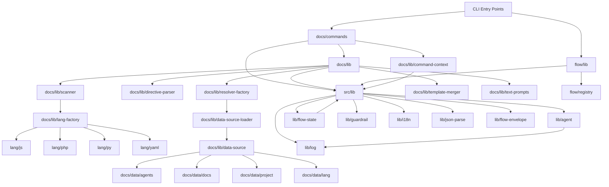

<!-- {{data("base.docs.langSwitcher", {labels: "relative"})}} -->
[日本語](ja/internal_design.md) | **English**
<!-- {{/data}} -->

# Internal Design

## Description

<!-- {{text({prompt: "Write a 1-2 sentence overview of this chapter. Include the project structure, module dependency direction, and key processing flows."})}} -->

sdd-forge is organized into three subsystems — `docs` (documentation pipeline), `flow` (Spec-Driven Development workflow), and `lib` (shared core utilities) — with a strict unidirectional dependency rule: commands depend on library modules, library modules never depend on commands. Data flows from source-code scanning through AI enrichment and directive resolution to final Markdown output, while the flow subsystem manages development-phase state through a central registry-based command dispatch pattern.
<!-- {{/text}} -->

## Content

### Project Structure

<!-- {{text({prompt: "Describe the project's directory structure as a tree-format code block. Include role comments for key directories and files. Generate from the actual source code structure.", mode: "deep"})}} -->

```
src/
├── docs/                         # Documentation generation pipeline
│   ├── commands/                 # Pipeline stage entry points (scan, enrich, data, text)
│   ├── data/                     # DataSource plugin implementations (agents, docs, lang, project)
│   └── lib/                      # Pipeline library modules
│       ├── lang/                 # Language-specific parsers (js, php, py, yaml)
│       ├── directive-parser.js   # {{data}}/{{text}}/ template directive parser
│       ├── resolver-factory.js   # DataSource resolver assembled from preset chain
│       ├── scanner.js            # File discovery, glob matching, hash and stat collection
│       ├── template-merger.js    # Layered preset template merge with block/extends inheritance
│       ├── data-source-loader.js # Dynamic import of DataSource .js plugin files
│       ├── data-source.js        # Base DataSource class defining the plugin interface
│       ├── text-prompts.js       # Prompt builders for {{text}} AI generation
│       ├── command-context.js    # Resolves runtime context (config, agent, docsDir) for commands
│       └── analysis-entry.js     # AnalysisEntry base class and summary utilities
├── flow/                         # Spec-Driven Development workflow commands
│   ├── lib/                      # FlowCommand subclass implementations
│   │   ├── base-command.js       # Abstract FlowCommand with flow-state guard
│   │   ├── phases.js             # VALID_PHASES constant array
│   │   ├── run-retro.js          # Retrospective analysis against git diff
│   │   ├── run-review.js         # Review command with retry logic
│   │   ├── run-sync.js           # Docs rebuild and git commit wrapper
│   │   ├── set-issue-log.js      # Issue-log.json read/write utilities
│   │   └── set-metric.js         # Phase metric counter increment
│   └── registry.js               # Central command dispatch registry
├── lib/                          # Shared core utilities
│   ├── agent.js                  # AI agent invocation (sync/async, multi-provider, logging)
│   ├── flow-state.js             # flow.json read/write and active-flow tracking
│   ├── guardrail.js              # Guardrail rule loading, merging, and phase filtering
│   ├── i18n.js                   # Multi-domain i18n with locale merging and interpolation
│   ├── log.js                    # Singleton JSONL logger for agent calls and events
│   ├── json-parse.js             # Tolerant JSON repair for AI-generated output
│   ├── flow-envelope.js          # ok/fail/warn structured JSON output constructors
│   ├── skills.js                 # Skill SKILL.md deployment to .claude/skills/
│   ├── include.js                # HTML include directive resolver for templates
│   └── progress.js               # Terminal spinner and progress bar utilities
├── presets/                      # Built-in preset chain definitions
│   └── base/
│       ├── templates/            # Chapter Markdown templates per language
│       ├── data/                 # Preset-specific DataSource overrides
│       └── guardrail.json        # Base guardrail rules
├── locale/                       # i18n message files (ui, messages, prompts domains)
└── templates/
    └── skills/                   # SKILL.md templates deployed to agent skill directories
```
<!-- {{/text}} -->

### Module Composition

<!-- {{text({prompt: "List the major modules in table format. Include module name, file path, and responsibility. Extract from import/require relationships and exports in each file.", mode: "deep"})}} -->

| Module | File Path | Responsibility |
| --- | --- | --- |
| scan | `src/docs/commands/scan.js` | Walks source tree, hashes files, runs DataSource parsers, writes `analysis.json` incrementally |
| enrich | `src/docs/commands/enrich.js` | Batches analysis entries by token count and sends them to AI for summary and chapter assignment |
| data | `src/docs/commands/data.js` | Resolves `{{data(…)}}` directives in chapter files via DataSource methods |
| text | `src/docs/commands/text.js` | Fills `{{text(…)}}` directives using batched AI-generated content with shrinkage guard |
| directive-parser | `src/docs/lib/directive-parser.js` | Parses `{{data}}`, `{{text}}`, and `` directives from Markdown template text |
| resolver-factory | `src/docs/lib/resolver-factory.js` | Assembles a DataSource resolver map from the full preset chain |
| data-source-loader | `src/docs/lib/data-source-loader.js` | Dynamically imports and instantiates DataSource `.js` plugin files from a directory |
| DataSource (base) | `src/docs/lib/data-source.js` | Base class defining the plugin interface, `toMarkdownTable`, and override helpers |
| scanner | `src/docs/lib/scanner.js` | File discovery with glob/regex matching, per-file MD5 hash and stat collection |
| template-merger | `src/docs/lib/template-merger.js` | Resolves layered preset templates with `/` inheritance |
| lang-factory | `src/docs/lib/lang-factory.js` | Maps file extensions to language handler modules (js, php, py, yaml) |
| command-context | `src/docs/lib/command-context.js` | Resolves full runtime context (config, agent, docsDir, type) for docs commands |
| text-prompts | `src/docs/lib/text-prompts.js` | Builds system and batch prompts for AI `{{text}}` generation |
| analysis-entry | `src/docs/lib/analysis-entry.js` | Defines `AnalysisEntry` base class, `ANALYSIS_META_KEYS`, and summary builders |
| agent | `src/lib/agent.js` | AI agent invocation with sync/async variants, multi-provider JSON parsing, and logging |
| flow-state | `src/lib/flow-state.js` | Loads, saves, and atomically mutates `flow.json`; tracks active flows across worktrees |
| flow-envelope | `src/lib/flow-envelope.js` | Constructs structured `ok`/`fail`/`warn` JSON output envelopes for flow commands |
| registry | `src/flow/registry.js` | Declares all flow commands with arg schemas, pre/post lifecycle hooks, and command instances |
| FlowCommand | `src/flow/lib/base-command.js` | Abstract base enforcing flow-state guard and the `execute(ctx)` contract |
| guardrail | `src/lib/guardrail.js` | Loads and merges guardrail JSON files from preset chain and project, filters by phase |
| i18n | `src/lib/i18n.js` | Loads locale domains, resolves namespaced keys, interpolates `{{var}}` placeholders |
| log | `src/lib/log.js` | Singleton JSONL logger writing agent calls with prompt payload files and token metrics |
| json-parse | `src/lib/json-parse.js` | Repairs malformed AI-generated JSON via tolerant recursive-descent parsing |
<!-- {{/text}} -->

### Module Dependencies

<!-- {{text({prompt: "Generate a mermaid graph showing inter-module dependencies. Analyze import/require statements in the source code and show the layer structure and dependency direction. Output only the mermaid code block.", mode: "deep"})}} -->


<!-- {{/text}} -->

### Key Processing Flows

<!-- {{text({prompt: "Describe the inter-module data and control flow when running a representative command in numbered steps. Include the flow from entry point to final output.", mode: "deep"})}} -->

The `sdd-forge docs build` command illustrates the full pipeline data flow:

1. **CLI dispatch** — The top-level entry point parses the `docs build` subcommand. `resolveCommandContext()` in `command-context.js` loads `.sdd-forge/config.json`, validates it via `validateConfig()`, resolves the agent configuration, project type string, and docs directory path.
2. **scan** — `collectFiles()` in `scanner.js` walks the source root using include/exclude glob patterns. Each file's MD5 hash is compared against the cached `analysis.json` to skip unchanged entries. Changed files are dispatched to the matching DataSource `parse()` implementations loaded by `loadDataSources()`. Incremental results are written to `.sdd-forge/output/analysis.json`.
3. **enrich** — `collectEntries()` gathers all non-meta entries and splits them into token-capped batches via `splitIntoBatches()`. Each batch is sent concurrently to the AI via `callAgentAsyncWithLog()` in `agent.js`. Raw AI responses are repaired with `repairJson()` from `json-parse.js` and merged back into the analysis object via `mergeEnrichment()`, which validates chapter names and preserves attempt counts.
4. **data** — `createResolver()` in `resolver-factory.js` walks the preset chain, calling `loadDataSources()` for each preset's `data/` directory to build a resolver map keyed by source name. For each chapter file, `resolveDataDirectives()` in `directive-parser.js` iterates `{{data(…)}}` directives in reverse line order and calls the matching DataSource method, writing resolved Markdown back to the file.
5. **text** — `processTemplateFileBatch()` strips existing fill content with `stripFillContent()`, groups all `{{text(…)}}` directives, and calls `buildBatchPrompt()` in `text-prompts.js` to construct a single prompt enriched with per-chapter analysis entries. The AI response JSON is mapped back to directive positions by `applyBatchJsonToFile()`. A shrinkage guard rejects responses that reduce file size by more than 50%.
6. **agents / readme** — The AGENTS.md template is read by `loadSddTemplate()` from `agents-md.js` and its `{{data(…)}}` directives are resolved through the same DataSource resolver, producing the final project-context AGENTS.md.
<!-- {{/text}} -->

### Extension Points

<!-- {{text({prompt: "Describe the locations that need changes and extension patterns when adding new commands or features. Derive from plugin points and dispatch registration patterns in the source code.", mode: "deep"})}} -->

Extension points follow consistent registration patterns across all three subsystems:

**New DataSource plugin** — Create a `.js` file in `src/docs/data/` or a preset's `data/` subdirectory exporting a default class that extends `DataSource` from `docs/lib/data-source.js`. `loadDataSources()` in `data-source-loader.js` auto-discovers and instantiates every `.js` file in registered data directories at resolver creation time. Project-level files in `.sdd-forge/data/` override built-in sources with the same name.

**New preset type** — Add a directory under `src/presets/` containing a `preset.json` with `parent`, `chapters`, and `scan` fields. Optionally include `templates/<lang>/` chapter Markdown files and a `data/` directory for DataSource overrides. The preset chain is resolved via `resolveChainSafe()` in `presets.js`, allowing inherited behavior through the `parent` field.

**New flow command** — Declare an entry in `FLOW_COMMANDS` in `src/flow/registry.js` with `args`, `help`, optional `pre`/`post` lifecycle hooks, and a `command()` dynamic import pointing to a new file under `src/flow/lib/` that extends `FlowCommand` and implements `execute(ctx)`. The dispatcher in `flow.js` resolves nested keys (e.g., `get.context`, `set.metric`) from the registry map.

**New language handler** — Add a module to `src/docs/lib/lang/` exporting `minify()`, `parse()`, `extractImports()`, `extractExports()`, and `extractEssential()`. Register the file extension(s) in `EXT_MAP` in `lang-factory.js`. No other changes are required; `scanner.js` and `minify.js` both route through the factory.

**New guardrail rule** — Add entries to `src/presets/<type>/guardrail.json` or the project-local `.sdd-forge/guardrail.json`. The `mergeById()` function in `guardrail.js` handles project-level ID-based overrides of preset rules, and `filterByPhase()` selects rules applicable to the current workflow phase.

**New i18n message** — Add keys under the appropriate domain file (`ui.json`, `messages.json`, or `prompts.json`) in `src/locale/<lang>/`. `deepMerge()` in `i18n.js` composites preset-level and project-level locale directories at runtime, so project overrides take precedence without modifying the package source.
<!-- {{/text}} -->

---

<!-- {{data("base.docs.nav")}} -->
[← Configuration and Customization](configuration.md)
<!-- {{/data}} -->
