# 04. Internal Design

## Description

<!-- {{text: Write a 1-2 sentence overview of this chapter. Include the project structure, module dependency direction, and key processing flows.}} -->

This chapter describes sdd-forge's internal architecture, including its three-layer directory structure (`src/lib/` → `src/docs/lib/` → `src/docs/commands/`), the unidirectional module dependency flow from CLI entry points through dispatchers to command implementations, and the key processing pipelines such as `scan → enrich → init → data → text → readme` that drive automated documentation generation.

<!-- {{/text}} -->

## Content

### Project Structure

<!-- {{text[mode=deep]: Describe the project's directory structure as a tree-format code block. Include role comments for key directories and files. Generate from the actual source code structure.}} -->

```
sdd-forge/
├── package.json
└── src/
    ├── sdd-forge.js              # CLI entry point & top-level router
    ├── docs.js                   # docs subcommand dispatcher
    ├── spec.js                   # spec subcommand dispatcher
    ├── flow.js                   # flow subcommand dispatcher
    ├── setup.js                  # Interactive project setup
    ├── upgrade.js                # Config migration utility
    ├── presets-cmd.js             # Preset listing command
    ├── help.js                   # Help text display
    │
    ├── docs/
    │   ├── commands/             # docs subcommand implementations
    │   │   ├── scan.js           #   Source code analysis → analysis.json
    │   │   ├── enrich.js         #   AI-powered enrichment of analysis entries
    │   │   ├── init.js           #   Template resolution & docs/ initialization
    │   │   ├── data.js           #   {{data}} directive resolution
    │   │   ├── text.js           #   {{text}} directive resolution via LLM
    │   │   ├── readme.js         #   README.md generation
    │   │   ├── forge.js          #   Multi-round AI doc generation
    │   │   ├── review.js         #   Documentation quality review
    │   │   ├── changelog.js      #   specs/ → change_log.md generation
    │   │   ├── agents.js         #   AGENTS.md generation
    │   │   ├── translate.js      #   Multi-language translation
    │   │   └── snapshot.js       #   Documentation snapshot
    │   │
    │   ├── data/                 # Built-in DataSources (all project types)
    │   │   ├── project.js        #   package.json metadata
    │   │   ├── docs.js           #   Chapter listing & language switcher
    │   │   ├── lang.js           #   Language navigation links
    │   │   └── agents.js         #   AGENTS.md section generation
    │   │
    │   └── lib/                  # Documentation engine libraries
    │       ├── scanner.js        #   File discovery & language parsers
    │       ├── directive-parser.js #  {{data}}/{{text}} & @block parser
    │       ├── template-merger.js #   Preset template inheritance engine
    │       ├── data-source.js    #   DataSource base class
    │       ├── data-source-loader.js # Dynamic DataSource loader
    │       ├── scan-source.js    #   Scannable mixin for DataSources
    │       ├── resolver-factory.js #  Layered DataSource resolver factory
    │       ├── command-context.js #   Shared CLI context resolution
    │       ├── concurrency.js    #   Promise-based parallel execution queue
    │       ├── forge-prompts.js  #   Forge command prompt construction
    │       ├── text-prompts.js   #   {{text}} directive prompt construction
    │       ├── review-parser.js  #   Review output parsing & patching
    │       └── php-array-parser.js #  CakePHP array syntax parser
    │
    ├── flow/
    │   └── commands/
    │       ├── start.js          # SDD flow initiation
    │       └── status.js         # SDD flow status display
    │
    ├── spec/
    │   └── commands/
    │       ├── init.js           # Spec file scaffolding
    │       ├── gate.js           # Spec gate check
    │       └── guardrail.js      # Spec guardrail validation
    │
    ├── lib/                      # Cross-layer shared utilities
    │   ├── agent.js              #   AI agent invocation (sync & async)
    │   ├── cli.js                #   repoRoot, sourceRoot, parseArgs
    │   ├── config.js             #   .sdd-forge/config.json loader
    │   ├── presets.js             #   Preset discovery & resolution
    │   ├── flow-state.js         #   SDD flow state persistence
    │   ├── i18n.js               #   3-layer i18n with domain namespaces
    │   ├── types.js              #   Type alias resolution & validation
    │   ├── entrypoint.js         #   ES module direct-run guard
    │   ├── process.js            #   spawnSync wrapper
    │   ├── progress.js           #   Progress bar & logging
    │   └── agents-md.js          #   AGENTS.md SDD template loader
    │
    ├── presets/                  # Preset definitions (inheritable)
    │   ├── base/                 #   Base preset (all project types)
    │   │   └── data/             #     package.json DataSource
    │   ├── cli/                  #   CLI architecture preset
    │   │   └── data/             #     ModulesSource (JS/MJS/CJS)
    │   ├── node-cli/             #   Node.js CLI preset (extends cli)
    │   ├── webapp/               #   Web application preset
    │   │   └── data/             #     Controllers/Models/Tables/Shells bases
    │   ├── cakephp2/             #   CakePHP 2.x preset (extends webapp)
    │   │   ├── data/             #     CakePHP-specific DataSources
    │   │   └── scan/             #     CakePHP-specific scanners
    │   ├── laravel/              #   Laravel preset (extends webapp)
    │   │   ├── data/             #     Laravel-specific DataSources
    │   │   └── scan/             #     Laravel-specific scanners
    │   ├── symfony/              #   Symfony preset (extends webapp)
    │   │   ├── data/             #     Symfony-specific DataSources
    │   │   └── scan/             #     Symfony-specific scanners
    │   └── library/              #   Library preset
    │
    ├── locale/                   # i18n message files
    │   ├── en/                   #   English (ui.json, messages.json, prompts.json)
    │   └── ja/                   #   Japanese
    │
    └── templates/                # Miscellaneous templates
        └── skills/               #   Claude Code skill definitions
```

<!-- {{/text}} -->

### Module Composition

<!-- {{text[mode=deep]: List the major modules in table format. Include module name, file path, and responsibility. Extract from import/require relationships and exports in each file.}} -->

| Module | Path | Responsibility |
| --- | --- | --- |
| CLI Router | `src/sdd-forge.js` | Top-level command dispatch to `docs.js`, `spec.js`, `flow.js`, and standalone commands |
| Docs Dispatcher | `src/docs.js` | Routes `sdd-forge docs <cmd>` to individual command files; orchestrates the `build` pipeline |
| Scan Command | `src/docs/commands/scan.js` | Collects files via glob patterns, delegates to DataSource `match()`/`scan()` methods, outputs `analysis.json` |
| Init Command | `src/docs/commands/init.js` | Resolves template inheritance chains, merges presets, optionally filters chapters via AI |
| Data Command | `src/docs/commands/data.js` | Resolves `{{data}}` directives in template files using DataSource resolvers |
| Text Command | `src/docs/commands/text.js` | Resolves `{{text}}` directives via LLM agents in batch or per-directive mode |
| Directive Parser | `src/docs/lib/directive-parser.js` | Parses `{{data}}`, `{{text}}`, and `@block`/`@extends` template syntax |
| Template Merger | `src/docs/lib/template-merger.js` | Bottom-up template resolution across preset layers with block-level merging |
| DataSource Base | `src/docs/lib/data-source.js` | Base class providing `match()`, `desc()`, `mergeDesc()`, `toMarkdownTable()` for all resolvers |
| DataSource Loader | `src/docs/lib/data-source-loader.js` | Dynamic `import()` of DataSource classes from `data/` directories |
| Resolver Factory | `src/docs/lib/resolver-factory.js` | Builds layered resolver (common → arch → leaf → project-local) for `{{data}}` resolution |
| Scanner Utilities | `src/docs/lib/scanner.js` | File collection via glob, PHP/JS parsers, `getFileStats()` for hash/lines/mtime |
| Command Context | `src/docs/lib/command-context.js` | Unified resolution of `root`, `config`, `type`, `lang`, `docsDir`, `agent` for all commands |
| Concurrency | `src/docs/lib/concurrency.js` | `mapWithConcurrency()` for parallel LLM calls with configurable concurrency limit |
| Text Prompts | `src/docs/lib/text-prompts.js` | Prompt construction for `{{text}}` processing, including enriched context gathering |
| Forge Prompts | `src/docs/lib/forge-prompts.js` | System/file prompt builders for the `forge` command's multi-round AI generation |
| Agent | `src/lib/agent.js` | AI agent invocation via `execFileSync`/`spawn`, argument size management, stdin fallback |
| CLI Utilities | `src/lib/cli.js` | `repoRoot()`, `sourceRoot()`, `parseArgs()`, `PKG_DIR`, timestamp formatting |
| Config | `src/lib/config.js` | `.sdd-forge/config.json` loader with path resolution helpers |
| Presets | `src/lib/presets.js` | Preset discovery by leaf name, `PRESETS_DIR` constant |
| i18n | `src/lib/i18n.js` | 3-layer message loading (default → preset → project) with `domain:key` namespace |
| Flow State | `src/lib/flow-state.js` | `flow.json` persistence for SDD workflow step and requirement tracking |
| Progress | `src/lib/progress.js` | TTY-aware progress bar with weighted steps and spinner animation |
| Entrypoint | `src/lib/entrypoint.js` | `isDirectRun()` guard and `runIfDirect()` for safe ES module CLI entry |

<!-- {{/text}} -->

### Module Dependencies

```mermaid
graph TD
    subgraph "CLI Entry Layer"
        SDD[sdd-forge.js]
        DOCS[docs.js]
        SPEC[spec.js]
        FLOW[flow.js]
        SETUP[setup.js]
    end

    subgraph "Command Layer (src/docs/commands/)"
        SCAN[scan.js]
        ENRICH[enrich.js]
        INIT[init.js]
        DATA[data.js]
        TEXT[text.js]
        README[readme.js]
        FORGE[forge.js]
        REVIEW[review.js]
        CHANGELOG[changelog.js]
        AGENTS_CMD[agents.js]
    end

    subgraph "Engine Layer (src/docs/lib/)"
        DP[directive-parser.js]
        TM[template-merger.js]
        DS[data-source.js]
        DSL[data-source-loader.js]
        RF[resolver-factory.js]
        CC[command-context.js]
        SC[scanner.js]
        CONC[concurrency.js]
        TP[text-prompts.js]
        FP[forge-prompts.js]
        RP[review-parser.js]
        SS[scan-source.js]
    end

    subgraph "Shared Utilities (src/lib/)"
        AG[agent.js]
        CLI[cli.js]
        CFG[config.js]
        PR[presets.js]
        I18N[i18n.js]
        FS_[flow-state.js]
        TYPES[types.js]
        EP[entrypoint.js]
        PROG[progress.js]
    end

    subgraph "Preset DataSources (src/presets/)"
        BASE_DS[base/data/]
        WEBAPP_DS[webapp/data/]
        CAKE_DS[cakephp2/data/]
        LARAVEL_DS[laravel/data/]
        SYMFONY_DS[symfony/data/]
        CLI_DS[cli/data/]
    end

    SDD --> DOCS
    SDD --> SPEC
    SDD --> FLOW
    SDD --> SETUP

    DOCS --> SCAN
    DOCS --> INIT
    DOCS --> DATA
    DOCS --> TEXT
    DOCS --> README
    DOCS --> FORGE
    DOCS --> REVIEW

    SCAN --> CC
    SCAN --> SC
    SCAN --> DSL
    SCAN --> PR

    INIT --> CC
    INIT --> TM
    INIT --> DP
    INIT --> AG
    INIT --> FP

    DATA --> CC
    DATA --> DP
    DATA --> RF

    TEXT --> CC
    TEXT --> DP
    TEXT --> TP
    TEXT --> CONC
    TEXT --> AG

    FORGE --> FP
    FORGE --> RP
    FORGE --> CONC

    RF --> DSL
    RF --> PR
    DSL --> DS

    CC --> CLI
    CC --> CFG
    CC --> TYPES
    CC --> AG
    CC --> I18N
    CC --> TM

    TM --> DP
    TM --> PR

    WEBAPP_DS --> DS
    WEBAPP_DS --> SS
    CAKE_DS --> WEBAPP_DS
    LARAVEL_DS --> WEBAPP_DS
    SYMFONY_DS --> WEBAPP_DS
    CLI_DS --> DS
    CLI_DS --> SS
    BASE_DS --> DS
    BASE_DS --> SS
```

<!-- {{text[mode=deep]: Generate a mermaid graph showing inter-module dependencies. Analyze import/require statements in the source code and show the layer structure and dependency direction. Output only the mermaid code block.}} -->



<!-- {{/text}} -->

### Key Processing Flows

<!-- {{text[mode=deep]: Describe the inter-module data and control flow when running a representative command in numbered steps. Include the flow from entry point to final output.}} -->

The `sdd-forge docs build` pipeline is the primary processing flow. It executes the following stages sequentially:

1. **Entry** — `sdd-forge.js` receives `docs build` and dispatches to `docs.js`, which orchestrates the full pipeline: `scan → enrich → init → data → text → readme → agents → [translate]`.
2. **Scan** (`scan.js`) — `resolveCommandContext()` builds the shared `CommandContext` (root, config, type). `collectFiles()` gathers source files via include/exclude glob patterns from `preset.json` or `config.json`. DataSources are loaded in inheritance order (`base → arch → leaf → project-local`) using `loadDataSources()`. Each DataSource's `match()` filters files, and `scan()` extracts structured data. `preserveEnrichment()` carries over enriched fields from the previous `analysis.json` when file hashes match. The result is written to `.sdd-forge/output/analysis.json`.
3. **Enrich** (`enrich.js`) — Sends analysis entries to an AI agent in batches, receiving `summary`, `detail`, `chapter`, and `role` classifications for each entry. The enriched fields are merged back into `analysis.json` with an `enrichedAt` timestamp.
4. **Init** (`init.js`) — `resolveTemplates()` builds layer directories bottom-up (project-local → leaf → arch → base) and resolves each chapter file. `mergeResolved()` applies `@block`/`@extends` inheritance by merging from base upward. If `config.chapters` is undefined and an AI agent is available, `aiFilterChapters()` selects relevant chapters based on the analysis summary. `stripBlockDirectives()` removes template control syntax before writing to `docs/`.
5. **Data** (`data.js`) — `createResolver()` from `resolver-factory.js` loads DataSources in the same layered order and calls `init(ctx)` on each. For every chapter file, `processTemplate()` invokes `resolveDataDirectives()`, which parses directives in reverse order (to prevent line-number shifts) and calls each DataSource's method (e.g., `controllers.list(analysis, labels)`). The rendered Markdown replaces the content between `{{data}}` and `{{/data}}` tags.
6. **Text** (`text.js`) — In batch mode (default), `stripFillContent()` removes previously generated content, `buildBatchPrompt()` constructs a prompt containing the full file with empty directives, and the AI fills all `{{text}}` directives in a single call. `validateBatchResult()` checks for content shrinkage and fill rate. In per-directive mode, `buildPrompt()` creates individual prompts with ±20 lines of context, and `mapWithConcurrency()` executes parallel LLM calls. `getEnrichedContext()` injects chapter-specific enriched analysis data into prompts.
7. **README** (`readme.js`) — Generates `README.md` from a preset template, resolving `{{data}}` directives (e.g., `docs.chapters()` for the table of contents) and writing the final output to the project root.
8. **Output** — The completed documentation files reside in `docs/`, each containing resolved `{{data}}` tables and AI-generated `{{text}}` prose, with the template structure preserved for future incremental updates.

<!-- {{/text}} -->

### Extension Points

<!-- {{text[mode=deep]: Describe the locations that need changes and extension patterns when adding new commands or features. Derive from plugin points and dispatch registration patterns in the source code.}} -->

**Adding a new DataSource (most common extension)**

Create a new `.js` file in the appropriate `data/` directory under `src/presets/`. The file must export a default class extending `DataSource` (or `Scannable(DataSource)` if it needs scan capability). The `data-source-loader.js` dynamically imports all `.js` files in `data/` directories, so no registration is needed. The DataSource is automatically available via `{{data: sourceName.methodName("labels")}}` directives in templates. To override a parent preset's DataSource, create a file with the same name in the child preset's `data/` directory.

**Adding a new docs subcommand**

Create a new file in `src/docs/commands/` implementing an async `main(ctx)` function and export it. Register the command name in `src/docs.js` by adding an entry to the dispatch table. Use `resolveCommandContext()` to obtain the shared `CommandContext`. Add the command to the `build` pipeline array in `docs.js` if it should run as part of `sdd-forge docs build`.

**Adding a new preset**

Create a directory under `src/presets/` with a `preset.json` file defining `parent`, `scan` (include/exclude globs), and `chapters` (ordered chapter file list). Add `templates/{lang}/` directories with Markdown chapter templates using `{{data}}` and `{{text}}` directives. Templates support `@extends`/`@block`/`@endblock` inheritance from parent presets. The `presets.js` module discovers presets by scanning the `src/presets/` directory structure.

**Adding a new top-level command**

Create a standalone command file in `src/` (e.g., `src/mycommand.js`) and register it in the dispatch switch in `src/sdd-forge.js`. Use `runIfDirect(import.meta.url, main)` from `entrypoint.js` to support both direct execution and dispatch-based invocation.

**Customizing AI agent behavior**

Agent configuration is resolved per-command via `resolveAgent(config, commandId)` in `agent.js`. The `config.json` `agent.commands` section supports hierarchical overrides (e.g., `docs.text` → `docs` → default). Custom `preamblePatterns` for stripping AI response prefixes can be added to `config.json` under `textFill.preamblePatterns`.

**Adding project-specific DataSources or templates**

Place custom DataSource files in `.sdd-forge/data/` and custom templates in `.sdd-forge/templates/{lang}/docs/`. These project-local layers take highest priority in the resolution chain and override any preset DataSources or templates with the same name.

<!-- {{/text}} -->
