# 04. Internal Design

## Description

<!-- {{text: Write a 1-2 sentence overview of this chapter. Include the project structure, module dependency direction, and key processing flows.}} -->

This chapter describes the internal architecture of sdd-forge, covering its three-layer directory structure (`src/` → dispatchers → command implementations), the unidirectional dependency flow from CLI entry points through shared libraries to preset-specific DataSources, and the key processing pipelines such as `scan → enrich → init → data → text → readme`.

<!-- {{/text}} -->

## Content

### Project Structure

<!-- {{text[mode=deep]: Describe the project's directory structure as a tree-format code block. Include role comments for key directories and files. Generate from the actual source code structure.}} -->

```
sdd-forge/
├── package.json
└── src/
    ├── sdd-forge.js              # CLI entry point & top-level router
    ├── docs.js                   # docs subcommand dispatcher
    ├── spec.js                   # spec subcommand dispatcher
    ├── flow.js                   # flow subcommand dispatcher
    ├── setup.js                  # Interactive project setup
    ├── upgrade.js                # Config/preset upgrade
    ├── presets-cmd.js            # Preset listing command
    ├── help.js                   # Help text display
    │
    ├── docs/
    │   ├── commands/             # docs subcommand implementations
    │   │   ├── scan.js           #   Source code scanning → analysis.json
    │   │   ├── enrich.js         #   AI-driven enrichment of analysis data
    │   │   ├── init.js           #   Template resolution & docs/ initialization
    │   │   ├── data.js           #   {{data}} directive resolution
    │   │   ├── text.js           #   {{text}} directive resolution via LLM
    │   │   ├── readme.js         #   README.md generation
    │   │   ├── forge.js          #   Multi-round AI doc generation
    │   │   ├── review.js         #   Quality review of generated docs
    │   │   ├── changelog.js      #   Spec changelog generation
    │   │   ├── agents.js         #   AGENTS.md generation
    │   │   ├── translate.js      #   Multi-language translation
    │   │   └── snapshot.js       #   Snapshot management
    │   ├── data/                 # Common DataSources (all presets)
    │   │   ├── project.js        #   package.json metadata
    │   │   ├── docs.js           #   Chapter listing & language switcher
    │   │   ├── lang.js           #   Language navigation links
    │   │   └── agents.js         #   AGENTS.md section generation
    │   └── lib/                  # Documentation engine libraries
    │       ├── directive-parser.js    # {{data}}/{{text}} directive parser
    │       ├── template-merger.js     # Preset template inheritance engine
    │       ├── data-source.js         # DataSource base class
    │       ├── data-source-loader.js  # Dynamic DataSource loader
    │       ├── resolver-factory.js    # Preset-layered resolver factory
    │       ├── scanner.js             # File collection & language parsers
    │       ├── scan-source.js         # ScanSource base & Scannable mixin
    │       ├── command-context.js     # Shared command context resolution
    │       ├── concurrency.js         # Parallel execution queue
    │       ├── text-prompts.js        # {{text}} prompt construction
    │       ├── forge-prompts.js       # forge command prompt construction
    │       ├── review-parser.js       # Review output parsing & patching
    │       └── php-array-parser.js    # CakePHP PHP array extraction
    │
    ├── flow/
    │   └── commands/             # SDD workflow commands
    │       ├── start.js          #   Flow initiation
    │       ├── status.js         #   Flow status display
    │       └── review.js         #   Flow review
    │
    ├── spec/
    │   └── commands/             # Spec management commands
    │       ├── init.js           #   Spec initialization
    │       ├── gate.js           #   Spec gate check
    │       └── guardrail.js      #   Spec guardrail validation
    │
    ├── lib/                      # Cross-layer shared utilities
    │   ├── agent.js              #   AI agent invocation (sync & async)
    │   ├── cli.js                #   repoRoot, sourceRoot, parseArgs
    │   ├── config.js             #   .sdd-forge/config.json loader
    │   ├── presets.js            #   Preset discovery & resolution
    │   ├── flow-state.js         #   SDD flow state persistence
    │   ├── i18n.js               #   3-layer i18n (namespaced domains)
    │   ├── types.js              #   Type alias resolution & validation
    │   ├── entrypoint.js         #   ES Module direct-run detection
    │   ├── agents-md.js          #   AGENTS.md SDD template loader
    │   ├── process.js            #   spawnSync wrapper
    │   └── progress.js           #   Progress bar & logging
    │
    ├── presets/                   # Preset hierarchy
    │   ├── base/                 #   Base preset (all types inherit)
    │   │   └── data/             #     PackageSource (package.json/composer.json)
    │   ├── cli/                  #   CLI architecture preset
    │   │   └── data/             #     ModulesSource (JS module scanning)
    │   ├── node-cli/             #   Node.js CLI leaf preset
    │   ├── webapp/               #   Web application architecture preset
    │   │   └── data/             #     Controllers/Models/Tables/Shells base
    │   ├── cakephp2/             #   CakePHP 2.x leaf preset
    │   │   ├── data/             #     FW-specific DataSources
    │   │   └── scan/             #     PHP source analyzers
    │   ├── laravel/              #   Laravel leaf preset
    │   │   ├── data/             #     Eloquent/Migration DataSources
    │   │   └── scan/             #     Laravel-specific analyzers
    │   ├── symfony/              #   Symfony leaf preset
    │   ├── library/              #   Library preset
    │   └── cakephp2/             #   (templates/ and preset.json in each)
    │
    ├── locale/                   # i18n message files
    │   ├── en/                   #   English (ui.json, messages.json, prompts.json)
    │   └── ja/                   #   Japanese
    │
    └── templates/                # Misc templates
        ├── config.example.json
        ├── review-checklist.md
        └── skills/               # Claude Code skill definitions
```

<!-- {{/text}} -->

### Module Composition

<!-- {{text[mode=deep]: List the major modules in table format. Include module name, file path, and responsibility. Extract from import/require relationships and exports in each file.}} -->

| Module | Path | Responsibility |
| --- | --- | --- |
| CLI Router | `src/sdd-forge.js` | Top-level command dispatch; resolves `SDD_WORK_ROOT` / `SDD_SOURCE_ROOT` environment variables and routes to `docs.js`, `spec.js`, `flow.js`, or standalone commands |
| Docs Dispatcher | `src/docs.js` | Routes `sdd-forge docs <cmd>` to individual command implementations under `src/docs/commands/`; orchestrates the `build` pipeline (`scan→enrich→init→data→text→readme→agents→translate`) |
| Directive Parser | `src/docs/lib/directive-parser.js` | Parses `{{data}}` and `{{text}}` directives plus `@block`/`@extends` template inheritance syntax; provides `resolveDataDirectives()` for bulk directive replacement |
| Template Merger | `src/docs/lib/template-merger.js` | Bottom-up template resolution engine; builds layers from project-local → leaf preset → arch preset → base and merges via `@block`/`@extends` inheritance |
| DataSource Base | `src/docs/lib/data-source.js` | Abstract base class for all `{{data}}` resolvers; provides `match()`, `toMarkdownTable()`, `mergeDesc()`, and override-based description lookup |
| DataSource Loader | `src/docs/lib/data-source-loader.js` | Dynamically imports and instantiates DataSource classes from `data/` directories; supports preset inheritance via Map-based override |
| Resolver Factory | `src/docs/lib/resolver-factory.js` | Builds a unified `resolve(source, method, analysis, labels)` function by loading DataSources in order: common → arch → leaf → project-local |
| Scanner | `src/docs/lib/scanner.js` | File collection via glob patterns (`collectFiles`), PHP/JS parsers (`parsePHPFile`, `parseJSFile`), and file statistics (`getFileStats`) |
| Command Context | `src/docs/lib/command-context.js` | Resolves a unified `CommandContext` (root, srcRoot, config, lang, type, docsDir, agent) from CLI args and environment for all docs commands |
| Concurrency | `src/docs/lib/concurrency.js` | `mapWithConcurrency()` — bounded-parallel Promise queue used by `text.js` and `forge.js` for LLM calls |
| Text Prompts | `src/docs/lib/text-prompts.js` | Constructs system/user prompts for `{{text}}` directive processing; builds enriched context from analysis data and manages `documentStyle` settings |
| Forge Prompts | `src/docs/lib/forge-prompts.js` | Constructs system/file prompts for the `forge` command; converts `analysis.json` summaries to human-readable text via `summaryToText()` |
| Agent | `src/lib/agent.js` | AI agent invocation layer; `callAgent()` (sync via `execFileSync`) and `callAgentAsync()` (async via `spawn`); handles argument size limits with stdin fallback and per-command agent resolution |
| Config | `src/lib/config.js` | Loads `.sdd-forge/config.json`; exports path helpers (`sddDir`, `sddOutputDir`, `sddDataDir`, `sddConfigPath`) and default constants |
| Presets | `src/lib/presets.js` | Discovers and resolves preset directories; `presetByLeaf()` returns the preset directory and `preset.json` contents for a given leaf name |
| i18n | `src/lib/i18n.js` | Three-layer i18n with `domain:dotted.key` syntax; merges default locale → preset locale → project locale; supports `ui`, `messages`, and `prompts` domains |
| Flow State | `src/lib/flow-state.js` | Persists SDD workflow state to `.sdd-forge/flow.json`; tracks 11 workflow steps and per-requirement status |
| Progress | `src/lib/progress.js` | TTY-aware progress bar with ANSI pinned header; spinner animation; weighted step tracking for the build pipeline |
| CLI Utilities | `src/lib/cli.js` | `repoRoot()`, `sourceRoot()`, `parseArgs()`, `formatUTCTimestamp()`, `isInsideWorktree()`, and `PKG_DIR` resolution |

<!-- {{/text}} -->

### Module Dependencies

```mermaid
graph TD
    subgraph "CLI Entry"
        sddforge["sdd-forge.js"]
    end

    subgraph "Dispatchers"
        docs["docs.js"]
        spec["spec.js"]
        flow["flow.js"]
        setup["setup.js"]
    end

    subgraph "Docs Commands"
        scan["scan.js"]
        init["init.js"]
        data["data.js"]
        text["text.js"]
        forge["forge.js"]
        review["review.js"]
        changelog["changelog.js"]
        readme["readme.js"]
        agents_cmd["agents.js"]
    end

    subgraph "Docs Library"
        directive["directive-parser.js"]
        merger["template-merger.js"]
        resolver["resolver-factory.js"]
        dsloader["data-source-loader.js"]
        datasource["data-source.js"]
        scanner["scanner.js"]
        cmdctx["command-context.js"]
        concurrency["concurrency.js"]
        textprompts["text-prompts.js"]
        forgeprompts["forge-prompts.js"]
        reviewparser["review-parser.js"]
        scansource["scan-source.js"]
    end

    subgraph "Shared Library"
        agent["agent.js"]
        cli["cli.js"]
        config["config.js"]
        presets["presets.js"]
        i18n["i18n.js"]
        types["types.js"]
        flowstate["flow-state.js"]
        progress["progress.js"]
        entrypoint["entrypoint.js"]
    end

    subgraph "Presets / DataSources"
        base_ds["base/data/*"]
        webapp_ds["webapp/data/*"]
        cakephp_ds["cakephp2/data/*"]
        laravel_ds["laravel/data/*"]
        symfony_ds["symfony/data/*"]
        cli_ds["cli/data/*"]
    end

    sddforge --> docs
    sddforge --> spec
    sddforge --> flow
    sddforge --> setup

    docs --> scan
    docs --> init
    docs --> data
    docs --> text
    docs --> readme
    docs --> agents_cmd

    scan --> scanner
    scan --> dsloader
    scan --> cmdctx
    scan --> presets
    scan --> config

    init --> merger
    init --> directive
    init --> agent
    init --> forgeprompts
    init --> cmdctx

    data --> directive
    data --> resolver
    data --> cmdctx

    text --> directive
    text --> textprompts
    text --> concurrency
    text --> agent
    text --> cmdctx

    forge --> forgeprompts
    forge --> reviewparser
    forge --> concurrency
    forge --> agent

    resolver --> dsloader
    resolver --> presets
    resolver --> config

    dsloader --> datasource

    cmdctx --> cli
    cmdctx --> config
    cmdctx --> types
    cmdctx --> agent
    cmdctx --> i18n
    cmdctx --> merger

    merger --> directive
    merger --> presets
    merger --> agent

    webapp_ds --> datasource
    webapp_ds --> scansource
    cakephp_ds --> webapp_ds
    laravel_ds --> webapp_ds
    symfony_ds --> webapp_ds
    cli_ds --> datasource
    cli_ds --> scansource
    base_ds --> datasource
    base_ds --> scansource

    agent --> cli
    i18n --> config
    i18n --> presets
    flowstate --> config
    progress --> cli
```

<!-- {{text[mode=deep]: Generate a mermaid graph showing inter-module dependencies. Analyze import/require statements in the source code and show the layer structure and dependency direction. Output only the mermaid code block.}} -->



<!-- {{/text}} -->

### Key Processing Flows

<!-- {{text[mode=deep]: Describe the inter-module data and control flow when running a representative command in numbered steps. Include the flow from entry point to final output.}} -->

**`sdd-forge docs build` — Full Documentation Pipeline**

1. **Entry** — `sdd-forge.js` receives `docs build`, dispatches to `docs.js` which orchestrates the pipeline: `scan → enrich → init → data → text → readme → agents → [translate]`.
2. **Scan** (`scan.js`) — Reads preset scan config (`preset.json` merged with `config.json`). Calls `collectFiles()` from `scanner.js` with include/exclude glob patterns. Loads DataSources in inheritance order (base → arch → leaf → project-local) via `data-source-loader.js`. Each DataSource's `match()` filters files, then `scan()` extracts structured data. `preserveEnrichment()` carries forward enriched fields from the previous `analysis.json` using content hashes. Writes `analysis.json` to `.sdd-forge/output/`.
3. **Enrich** (`enrich.js`) — Sends the full analysis to an AI agent, which assigns `summary`, `detail`, `chapter`, and `role` fields to each entry in a single batch call.
4. **Init** (`init.js`) — `resolveTemplates()` in `template-merger.js` builds layer directories (project-local → leaf → arch → base) and resolves each template file bottom-up. `mergeResolved()` applies `@block`/`@extends` inheritance. If `config.chapters` is not set and an AI agent is available, `aiFilterChapters()` selects relevant chapters. `stripBlockDirectives()` removes inheritance control lines before writing to `docs/`.
5. **Data** (`data.js`) — For each chapter file, `resolveDataDirectives()` from `directive-parser.js` parses `{{data}}` directives. `resolver-factory.js` creates a resolver by loading DataSources from the preset hierarchy. Each directive like `{{data: controllers.list("Name|File|Desc")}}` calls the corresponding DataSource method, which reads from `analysis.json` and returns a Markdown table. The rendered content replaces the directive block.
6. **Text** (`text.js`) — Parses `{{text}}` directives, builds prompts using `text-prompts.js` with enriched analysis context. In batch mode, sends the entire file to the LLM in one call. In per-directive mode, uses `mapWithConcurrency()` to process directives in parallel. `validateBatchResult()` checks for content shrinkage. `stripPreamble()` removes LLM meta-commentary from responses.
7. **README** (`readme.js`) — Generates the project README from a preset template, resolving `{{data}}` directives (chapter table, language switcher) in the same way as `data.js`.
8. **Agents** (`agents.js`) — Generates or updates `AGENTS.md` by combining the SDD template from `base/templates/` with a PROJECT section skeleton produced by the `AgentsSource` DataSource from `analysis.json`.

**`sdd-forge docs data` — Single Command Flow**

1. `sdd-forge.js` → `docs.js` → `data.js`
2. `resolveCommandContext()` in `command-context.js` builds root, type, docsDir, config, agent, and i18n translator from CLI args and environment.
3. `analysis.json` is loaded from `.sdd-forge/output/`.
4. `createResolver()` in `resolver-factory.js` loads DataSources: common (`docs/data/`) → arch preset → leaf preset → project-local (`.sdd-forge/data/`), calling `init(ctx)` on each.
5. `getChapterFiles()` returns ordered chapter list from `config.chapters` or preset definition.
6. For each file, `processTemplate()` calls `resolveDataDirectives()`, which iterates directives in reverse order (to prevent line-number shifts) and invokes the resolver for each `{{data}}` directive.
7. Resolved content is written back to the file (or printed in dry-run mode).

<!-- {{/text}} -->

### Extension Points

<!-- {{text[mode=deep]: Describe the locations that need changes and extension patterns when adding new commands or features. Derive from plugin points and dispatch registration patterns in the source code.}} -->

**Adding a New Docs Subcommand**

1. Create a new file in `src/docs/commands/` (e.g., `mycommand.js`) that exports a `main(ctx)` function and uses `runIfDirect()` for standalone execution.
2. Register the command name in `src/docs.js` dispatcher's routing table so that `sdd-forge docs mycommand` maps to the new file.
3. Use `resolveCommandContext(cli)` from `command-context.js` to obtain a unified context object (root, config, type, docsDir, agent, i18n).
4. Add help text entries in `src/locale/en/ui.json` and `src/locale/ja/ui.json` under `help.cmdHelp.<name>`.

**Adding a New DataSource (New Preset Category)**

1. Create a `.js` file in the appropriate preset's `data/` directory (e.g., `src/presets/laravel/data/middleware.js`).
2. Export a default class extending `Scannable(DataSource)` or `WebappDataSource`. Implement `match(file)` for file filtering and `scan(files)` for data extraction.
3. Add resolver methods (e.g., `list(analysis, labels)`) that return Markdown table strings via `toMarkdownTable()`.
4. The `data-source-loader.js` dynamically discovers all `.js` files in `data/` directories — no manual registration is required.
5. Reference the new DataSource in templates using `{{data: middleware.list("Name|Type")}}` syntax.

**Adding a New Preset**

1. Create a directory under `src/presets/` with a `preset.json` defining `parent`, `scan` configuration, and `chapters` order.
2. Optionally add `data/` for DataSources, `templates/{lang}/` for chapter templates, and `locale/` for i18n overrides.
3. The preset inheritance chain is resolved by `presets.js` via `presetByLeaf()` — the new preset is automatically discovered by directory name.
4. Register the type alias in `src/lib/types.js` if a shorthand mapping is needed (e.g., `"rails"` → `"webapp/rails"`).

**Adding Template Inheritance Blocks**

1. In a child preset template, add `<!-- @extends -->` at the top to inherit from the parent.
2. Define `<!-- @block: blockname -->` / `<!-- @endblock -->` sections to override specific regions.
3. The `template-merger.js` engine merges blocks bottom-up: child blocks replace parent blocks while preserving non-overridden content.

**Adding a New SDD Workflow Step**

1. Add the step ID to the `FLOW_STEPS` array in `src/lib/flow-state.js`.
2. Implement the step logic in `src/flow/commands/start.js` within the appropriate phase.
3. The step is automatically tracked in `.sdd-forge/flow.json` via `updateStepStatus()`.

**Project-Local Customization (No Source Changes)**

1. Place custom DataSources in `.sdd-forge/data/` — they override preset DataSources of the same name.
2. Place template overrides in `.sdd-forge/templates/{lang}/docs/` — they take highest priority in the layer chain.
3. Place i18n overrides in `.sdd-forge/locale/{lang}/` — they merge on top of preset and default messages.
4. Use `config.json`'s `chapters` array to control chapter order and selection without AI filtering.

<!-- {{/text}} -->
