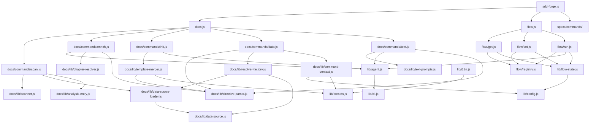

<!-- {{data("base.docs.langSwitcher", {labels: "relative"})}} -->
**English** | [日本語](ja/internal_design.md)
<!-- {{/data}} -->

# Internal Design

## Description

<!-- {{text({prompt: "Write a 1-2 sentence overview of this chapter. Include the project structure, module dependency direction, and key processing flows."})}} -->

This chapter describes the internal structure of sdd-forge, a CLI tool built around a three-level dispatch architecture (`sdd-forge.js` → subsystem dispatchers → `commands/*.js`) with a docs build pipeline (`scan → enrich → init → data → text → readme`) and a flow subsystem for Spec-Driven Development. Dependencies flow strictly from entry points through dispatcher layers into shared `lib/` utilities, with DataSource classes and template resolution forming the core data pipeline.
<!-- {{/text}} -->

## Content

### Project Structure

<!-- {{text({prompt: "Describe the project's directory structure as a tree-format code block. Include role comments for key directories and files. Generate from the actual source code structure.", mode: "deep"})}} -->

```
src/
├── sdd-forge.js              # Top-level CLI entry point and command dispatcher
├── docs.js                   # Docs subsystem dispatcher
├── flow.js                   # Flow subsystem dispatcher (top-level await import)
├── docs/
│   ├── commands/             # Docs pipeline steps
│   │   ├── scan.js           # Source file parsing → analysis.json
│   │   ├── enrich.js         # AI batch annotation of analysis entries
│   │   ├── init.js           # Template initialization of docs/ directory
│   │   ├── data.js           # {{data}} directive resolution
│   │   ├── text.js           # {{text}} directive AI generation
│   │   ├── forge.js          # Iterative AI doc generation loop
│   │   ├── readme.js         # README assembly
│   │   ├── review.js         # Doc quality review
│   │   └── changelog.js      # Changelog generation
│   ├── data/                 # Built-in DataSource classes
│   │   ├── agents.js         # AGENTS.md content source
│   │   ├── docs.js           # Chapter listing, lang switcher, nav
│   │   ├── lang.js           # Language switcher links
│   │   ├── project.js        # package.json metadata source
│   │   └── text.js           # {{text}} delegation stub
│   └── lib/                  # Shared docs utilities
│       ├── directive-parser.js   # {{data}}/{{text}}/ parser
│       ├── resolver-factory.js   # DataSource chain loader and router
│       ├── template-merger.js    # Preset template inheritance engine
│       ├── scanner.js            # File discovery and glob utilities
│       ├── text-prompts.js       # AI prompt builders for text step
│       ├── analysis-entry.js     # Base entry class and aggregation helpers
│       ├── analysis-filter.js    # docs.exclude filtering
│       ├── chapter-resolver.js   # Category-to-chapter mapping
│       ├── command-context.js    # Shared CLI context resolver
│       ├── data-source.js        # DataSource base class
│       ├── data-source-loader.js # Dynamic DataSource importer
│       ├── scan-source.js        # Scannable mixin
│       ├── lang-factory.js       # File-extension to language handler map
│       ├── lang/                 # Language-specific parsers (js, php, py, yaml)
│       └── minify.js             # Source code minifier for prompts
├── flow/
│   ├── registry.js           # Single source of truth for all flow subcommands
│   ├── get.js / set.js / run.js  # Second-level dispatchers
│   ├── get/                  # Read-only flow state queries
│   ├── set/                  # Flow state mutations
│   └── run/                  # Flow action executors
├── specs/
│   └── commands/             # spec init and gate check
├── lib/                      # Shared utilities
│   ├── agent.js              # AI agent invocation (sync + async)
│   ├── cli.js                # repoRoot, parseArgs, PKG_DIR
│   ├── config.js             # Config loading and path helpers
│   ├── flow-state.js         # Flow state persistence layer
│   ├── flow-envelope.js      # JSON response envelope (ok/fail/warn)
│   ├── guardrail.js          # Guardrail article parsing and filtering
│   ├── i18n.js               # 3-layer locale merge system
│   ├── presets.js            # Preset chain resolution
│   ├── process.js            # spawnSync wrapper
│   ├── skills.js             # Skill deployment logic
│   └── entrypoint.js         # runIfDirect ES module guard
├── presets/                  # Preset inheritance chains
│   ├── base/                 # Root preset (templates, data, locale)
│   ├── node/, php/, cli/     # Language/framework presets
│   └── webapp/, library/     # Purpose presets
├── templates/
│   └── skills/               # SKILL.md templates deployed to .claude/skills/
└── locale/                   # i18n message files (en/, ja/, ...)
```
<!-- {{/text}} -->

### Module Composition

<!-- {{text({prompt: "List the major modules in table format. Include module name, file path, and responsibility. Extract from import/require relationships and exports in each file.", mode: "deep"})}} -->

| Module | File Path | Responsibility |
| --- | --- | --- |
| CLI entry | `sdd-forge.js` | Top-level command dispatcher; resolves project context via env vars |
| Docs dispatcher | `docs.js` | Routes `scan`, `enrich`, `init`, `data`, `text`, `build`, and other docs subcommands |
| Flow dispatcher | `flow.js` | Routes `flow get/set/run` via top-level await import |
| scan | `docs/commands/scan.js` | Collects source files, runs DataSource parsers, writes `analysis.json` with hash caching |
| enrich | `docs/commands/enrich.js` | Annotates analysis entries (summary, detail, chapter, role, keywords) via AI batch calls |
| init | `docs/commands/init.js` | Initializes `docs/` by merging preset template inheritance chains; optionally AI-filters chapters |
| data | `docs/commands/data.js` | Resolves `{{data(...)}}` directives in chapter files using DataSource resolvers |
| text | `docs/commands/text.js` | Fills `{{text(...)}}` directives with AI-generated content in batch or per-directive mode |
| directive-parser | `docs/lib/directive-parser.js` | Parses `{{data}}`, `{{text}}`, and `` directives from Markdown template files |
| resolver-factory | `docs/lib/resolver-factory.js` | Loads DataSource chains from preset inheritance and routes `preset.source.method` calls |
| DataSource base | `docs/lib/data-source.js` | Base class providing `desc()`, `toMarkdownTable()`, and override helpers |
| data-source-loader | `docs/lib/data-source-loader.js` | Dynamically imports DataSource `.js` files and maintains an inherited Map |
| template-merger | `docs/lib/template-merger.js` | Bottom-up preset template resolution with block-level override and additive multi-chain merge |
| scanner | `docs/lib/scanner.js` | File discovery via glob patterns, MD5 hashing, and language-agnostic file parsing |
| text-prompts | `docs/lib/text-prompts.js` | Builds system prompts, per-directive prompts, and batch prompts for the text pipeline step |
| flow registry | `flow/registry.js` | Single source of truth mapping all `flow get/set/run` subcommand names to script paths |
| flow-state | `lib/flow-state.js` | Two-file persistence scheme for SDD flow state across worktrees and branches |
| agent | `lib/agent.js` | Synchronous and asynchronous AI agent invocation with stdin fallback and retry support |
| i18n | `lib/i18n.js` | 3-layer locale merge (built-in → preset → project) with domain-namespaced key lookup |
| guardrail | `lib/guardrail.js` | Parses, filters, and loads guardrail articles from preset and project-local `guardrail.md` files |
| skills | `lib/skills.js` | Deploys `SKILL.md` templates from `src/templates/skills/` to `.agents/skills/` and `.claude/skills/` |
<!-- {{/text}} -->

### Module Dependencies

<!-- {{text({prompt: "Generate a mermaid graph showing inter-module dependencies. Analyze import/require statements in the source code and show the layer structure and dependency direction. Output only the mermaid code block.", mode: "deep"})}} -->


<!-- {{/text}} -->

### Key Processing Flows

<!-- {{text({prompt: "Describe the inter-module data and control flow when running a representative command in numbered steps. Include the flow from entry point to final output.", mode: "deep"})}} -->

The following steps describe the data and control flow for `sdd-forge docs build`, the primary documentation generation command.

1. **Entry** — `sdd-forge.js` receives the `docs build` subcommand and resolves the project root via `SDD_WORK_ROOT` or `git rev-parse --show-toplevel`, then spawns `docs.js build`.
2. **Dispatch** — `docs.js` reads `config.json` via `resolveCommandContext()`, constructs the pipeline step list, and runs each step in sequence: `scan → enrich → data → text → readme`.
3. **scan** — `scan.js` calls `collectFiles()` with include/exclude globs from the preset chain, loads DataSource classes via `loadDataSources()`, computes MD5 hashes per file, skips unchanged entries by hash comparison, and writes the result to `.sdd-forge/output/analysis.json`.
4. **enrich** — `enrich.js` reads `analysis.json`, calls `collectEntries()` to gather unenriched items, splits them into line-count-based batches via `splitIntoBatches()`, builds an AI prompt per batch using `buildEnrichPrompt()` listing available chapters, calls the AI agent asynchronously via `callAgentAsync()`, and merges the JSON response back into `analysis.json` via `mergeEnrichment()`, saving incrementally after each batch.
5. **data** — `data.js` iterates chapter files returned by `getChapterFiles()`, calls `resolveDataDirectives()` for each file's content, which invokes a `resolveFn` built by `createResolver()`. The resolver loads the DataSource chain for the project's preset type and routes each `{{data("preset.source.method")}}` directive to the corresponding DataSource method, injecting file-relative path context for nav and language-switcher methods via `FILE_CONTEXT_RULES`. Populated files are written back to disk.
6. **text** — `text.js` processes remaining `{{text(...)}}` directives. In batch mode, `processTemplateFileBatch()` strips existing fill content, builds a JSON-returning prompt via `buildBatchPrompt()` prepended with enriched context from `getEnrichedContext()`, calls the AI agent, parses the JSON response, and applies fills to the chapter file via `applyBatchJsonToFile()`.
7. **readme** — `readme.js` assembles the top-level `README.md` from generated chapter content and writes the final output.
<!-- {{/text}} -->

### Extension Points

<!-- {{text({prompt: "Describe the locations that need changes and extension patterns when adding new commands or features. Derive from plugin points and dispatch registration patterns in the source code.", mode: "deep"})}} -->

**Adding a new docs pipeline command**
Create a script in `docs/commands/` exporting a `main(ctx)` function and guarded by `runIfDirect`. Register the command name in the dispatch table in `docs.js`. Use `resolveCommandContext(cli)` to obtain the standard context object.

**Adding a new DataSource**
Create a class extending `DataSource` in `docs/data/` (available to all presets) or in `src/presets/<name>/data/` (scoped to a preset chain). Implement named methods with signature `(analysis, labels)`. The method name becomes the last segment of the `{{data("preset.source.method")}}` directive. No registration is required — `data-source-loader.js` discovers `.js` files in the `data/` directory automatically at runtime.

**Adding a new preset**
Create a directory under `src/presets/<name>/` containing:
- `preset.json` with `parent`, `scan` globs, and `chapters` array
- `templates/<lang>/` with Markdown chapter templates
- Optional `data/` directory with preset-specific DataSource classes
- Optional `locale/<lang>/` for i18n overrides

The preset is resolved via `resolveChainSafe()` which walks the `parent` chain from leaf to `base`.

**Adding a new flow subcommand**
Create a script in `flow/get/`, `flow/set/`, or `flow/run/`. Register it in `flow/registry.js` under the corresponding `get.keys`, `set.keys`, or `run.keys` map, providing `script` (relative to `PKG_DIR`) and bilingual `desc`. The dispatcher (`flow/get.js`, `flow/set.js`, or `flow/run.js`) routes to it automatically by key name.

**Adding a new skill**
Add a subdirectory with a `SKILL.md` file under `src/templates/skills/`. The `deploySkills()` function in `lib/skills.js` scans this directory and deploys updated content to both `.agents/skills/` and `.claude/skills/` during `sdd-forge setup` and `sdd-forge upgrade`.
<!-- {{/text}} -->

---

<!-- {{data("base.docs.nav")}} -->
[← Configuration and Customization](configuration.md) | [Development, Testing, and Distribution →](development_testing.md)
<!-- {{/data}} -->
