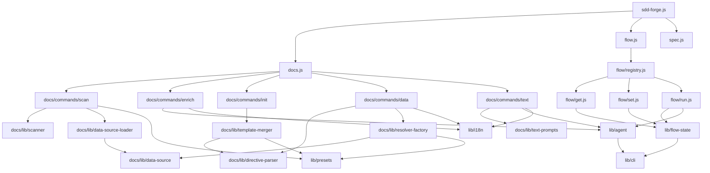

<!-- {{data("base.docs.langSwitcher", {labels: "relative"})}} -->
**English** | [日本語](ja/internal_design.md)
<!-- {{/data}} -->

# Internal Design

## Description

<!-- {{text({prompt: "Write a 1-2 sentence overview of this chapter. Include the project structure, module dependency direction, and key processing flows."})}} -->

This chapter describes the internal architecture of `sdd-forge`, a Node.js CLI tool organized into three top-level subsystems — `docs` (documentation generation pipeline), `flow` (Spec-Driven Development workflow management), and shared `lib` utilities. Dependencies flow inward from command dispatchers through pipeline commands to shared library modules, with a preset chain system providing pluggable DataSource implementations for project-type-specific behavior.
<!-- {{/text}} -->

## Content

### Project Structure

<!-- {{text({prompt: "Describe the project's directory structure as a tree-format code block. Include role comments for key directories and files. Generate from the actual source code structure.", mode: "deep"})}} -->

```
src/
├── sdd-forge.js           # Top-level CLI entry point and subcommand dispatcher
├── docs.js                # docs subcommand dispatcher
├── flow.js                # flow subcommand dispatcher (routes via flow/registry.js)
├── spec.js                # spec subcommand dispatcher
├── help.js                # help output
├── docs/
│   ├── commands/          # Pipeline step commands: scan, enrich, init, data, text,
│   │                      #   forge, readme, review, changelog, agents
│   ├── data/              # Common DataSource implementations:
│   │                      #   agents, docs, lang, project, text
│   └── lib/               # Docs library: directive-parser, scanner, template-merger,
│                          #   resolver-factory, lang handlers, text-prompts, concurrency
├── flow/
│   ├── registry.js        # Single source of truth for all flow command metadata
│   ├── get.js             # `flow get` sub-dispatcher
│   ├── set.js             # `flow set` sub-dispatcher
│   ├── run.js             # `flow run` sub-dispatcher
│   ├── get/               # Read-only state queries (status, check, context, prompt,
│   │                      #   guardrail, resolve-context, qa-count, issue)
│   ├── set/               # State mutation commands (step, request, issue, note,
│   │                      #   req, metric, redo, auto)
│   └── run/               # Side-effectful actions (prepare-spec, gate, review,
│                          #   finalize, sync, lint, retro)
├── specs/
│   └── commands/          # spec init and gate implementations
├── lib/                   # Shared utilities: agent, cli, config, i18n, flow-state,
│                          #   presets, progress, guardrail, lint, flow-envelope,
│                          #   git-state, json-parse, include, skills, process
├── presets/               # Preset definitions by key (base, node, php, cli, webapp, ...)
│   └── <preset>/
│       ├── preset.json    # Metadata: key, parent, scan globs, chapters order
│       ├── data/          # Preset-specific DataSource classes
│       ├── templates/     # Chapter Markdown templates per language
│       └── locale/        # Preset-level i18n overrides
├── templates/
│   └── skills/            # SKILL.md templates deployed to .agents/skills/ and .claude/skills/
└── locale/                # Base i18n message files per language (ui.json, messages.json, prompts.json)
```
<!-- {{/text}} -->

### Module Composition

<!-- {{text({prompt: "List the major modules in table format. Include module name, file path, and responsibility. Extract from import/require relationships and exports in each file.", mode: "deep"})}} -->

| Module | File | Responsibility |
| --- | --- | --- |
| CLI entry point | `src/sdd-forge.js` | Parses top-level subcommand and delegates to docs/flow/spec dispatchers |
| docs dispatcher | `src/docs.js` | Routes docs pipeline subcommands (scan, enrich, init, data, text, forge, ...) |
| flow dispatcher | `src/flow.js` | Routes flow subcommands via registry.js using top-level await dynamic import |
| flow registry | `src/flow/registry.js` | Declares all flow get/set/run command metadata (script path, bilingual desc) |
| scan | `src/docs/commands/scan.js` | Collects source files, runs DataSource parsers, writes analysis.json with MD5-based caching |
| enrich | `src/docs/commands/enrich.js` | Batch AI enrichment adding summary, detail, chapter, role, and keywords to analysis entries |
| init | `src/docs/commands/init.js` | Initializes docs/ from template inheritance chains with optional AI chapter filtering |
| data | `src/docs/commands/data.js` | Resolves `{{data}}` directives in docs chapter files using DataSources and analysis.json |
| text | `src/docs/commands/text.js` | Fills `{{text}}` directives via AI agents in batch (one call per file) or per-directive mode |
| DataSource base | `src/docs/lib/data-source.js` | Base class providing `toMarkdownTable()`, `desc()`, and `mergeDesc()` for all data resolvers |
| directive-parser | `src/docs/lib/directive-parser.js` | Parses and resolves `{{data}}`, `{{text}}`, and `/` directives |
| template-merger | `src/docs/lib/template-merger.js` | Template inheritance resolution with block override and additive multi-chain merging |
| resolver-factory | `src/docs/lib/resolver-factory.js` | Builds typed DataSource resolver maps from preset chains for the data pipeline |
| scanner | `src/docs/lib/scanner.js` | File discovery via glob patterns, language handler dispatch, and file stat utilities |
| flow-state | `src/lib/flow-state.js` | Persistent SDD flow state using `.active-flow` pointer and per-spec `specs/<id>/flow.json` files |
| agent | `src/lib/agent.js` | Sync and async AI agent invocation with stdin fallback, system prompt support, and retry |
| i18n | `src/lib/i18n.js` | Three-layer message merge (src locale → preset locale → project locale) with interpolation |
| presets | `src/lib/presets.js` | Preset chain resolution and parent hierarchy traversal for multi-type projects |
| progress | `src/lib/progress.js` | ANSI progress bar pinned to a fixed screen row with spinner, step tracking, and elapsed time |
| flow-envelope | `src/lib/flow-envelope.js` | Standardized `{ ok, type, key, data, errors }` JSON response format for all flow commands |
<!-- {{/text}} -->

### Module Dependencies

<!-- {{text({prompt: "Generate a mermaid graph showing inter-module dependencies. Analyze import/require statements in the source code and show the layer structure and dependency direction. Output only the mermaid code block.", mode: "deep"})}} -->


<!-- {{/text}} -->

### Key Processing Flows

<!-- {{text({prompt: "Describe the inter-module data and control flow when running a representative command in numbered steps. Include the flow from entry point to final output.", mode: "deep"})}} -->

The following steps trace the execution of `sdd-forge docs build`, the primary documentation generation pipeline.

1. `sdd-forge.js` parses the `docs build` invocation and delegates to `docs.js`, which runs the `scan → enrich → data → text` steps in sequence.
2. **scan** (`docs/commands/scan.js`): Resolves the preset chain via `lib/presets.js` and merges include/exclude glob patterns. Calls `collectFiles()` from `docs/lib/scanner.js` to gather matching source files. Loads `Scannable` DataSource instances from each preset's `data/` directory. For each file, computes an MD5 hash; a hash match restores the cached entry from `analysis.json` (preserving enrichment). On a miss, each matching DataSource's `parse()` method is invoked to produce a new entry. Results are written to `.sdd-forge/output/analysis.json`.
3. **enrich** (`docs/commands/enrich.js`): Reads `analysis.json` and batches unenriched entries by total line count (default 3000 lines per batch). For each batch, `buildEnrichPrompt()` constructs a structured prompt listing target files and available chapter names, then `callAgentAsync()` from `lib/agent.js` invokes the configured AI agent. The response is repaired via `lib/json-parse.js` and merged back into analysis entries by `mergeEnrichment()`. Progress is saved to disk after each batch to support resumption.
4. **data** (`docs/commands/data.js`): Creates a typed DataSource resolver via `resolver-factory.js`, which loads DataSource classes from the full preset chain. Iterates chapter files returned by `getChapterFiles()`. For each file, `resolveDataDirectives()` in `directive-parser.js` locates every `{{data(...)}}` block, routes the call to the matching DataSource method with the analysis object, and replaces the block content in-place. Files containing at least one resolved directive are written back to disk.
5. **text** (`docs/commands/text.js`): Loads the enriched analysis and iterates chapter files. `getEnrichedContext()` filters analysis entries matching the current chapter name. `stripFillContent()` clears existing fill text, then `buildBatchPrompt()` constructs a single JSON-mode prompt listing all `{{text}}` directives with unique IDs. The AI responds with a JSON object keyed by directive ID; `applyBatchJsonToFile()` inserts each generated block in reverse line-order. Files with filled directives are written back to `docs/`.
<!-- {{/text}} -->

### Extension Points

<!-- {{text({prompt: "Describe the locations that need changes and extension patterns when adding new commands or features. Derive from plugin points and dispatch registration patterns in the source code.", mode: "deep"})}} -->

**Adding a new docs pipeline command**
- Add a routing case in `src/docs.js` pointing to a new file under `src/docs/commands/`.
- The command file should follow the `runIfDirect(import.meta.url, main)` pattern, export `main`, and accept a `ctx` object from `resolveCommandContext()` for consistent config/root/agent resolution.

**Adding a new `{{data}}` source or method**
- Create a `.js` file under `src/docs/data/` (available to all presets) or a preset's `data/` directory with a default-exported class extending `DataSource`. Any public method named `foo` is automatically callable as `{{data("preset.source.foo")}}` once `resolver-factory.js` loads the class.
- For scan-time parsing, mix in `Scannable` from `docs/lib/scan-source.js` and implement `match(relPath)` returning `true` for handled extensions, and `parse(absPath)` returning a populated `AnalysisEntry` subclass instance.

**Adding a new flow command**
- Register the command in `src/flow/registry.js` under the appropriate group (`get`, `set`, or `run`) with a `script` path and a bilingual `desc` object. The sub-dispatcher (`get.js`, `set.js`, or `run.js`) automatically picks it up.
- Create the script under the corresponding sub-directory. Use `ok()` / `fail()` from `lib/flow-envelope.js` to emit machine-readable JSON envelopes and call `runIfDirect(import.meta.url, main)` at the bottom.

**Adding support for a new project type**
- Create a directory under `src/presets/` containing a `preset.json` that declares `key`, `label`, `parent` (for chain inheritance), `scan` include/exclude globs, and a `chapters` array defining the doc chapter order.
- Add preset-specific DataSources under `<preset>/data/` and Markdown chapter templates under `<preset>/templates/<lang>/`. The preset chain system in `lib/presets.js` automatically composes DataSources and template blocks from ancestor presets, so only overrides and additions are needed.
<!-- {{/text}} -->

---

<!-- {{data("base.docs.nav")}} -->
[← Configuration and Customization](configuration.md) | [Development, Testing, and Distribution →](development_testing.md)
<!-- {{/data}} -->
