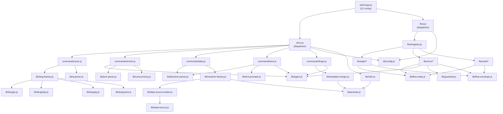

<!-- {{data("base.docs.langSwitcher", {labels: "relative"})}} -->
**English** | [日本語](ja/internal_design.md)
<!-- {{/data}} -->

# Internal Design

## Description

<!-- {{text({prompt: "Write a 1-2 sentence overview of this chapter. Include the project structure, module dependency direction, and key processing flows."})}} -->

This chapter describes the internal module structure of sdd-forge, covering how the CLI entry point dispatches to docs and flow subsystems, how DataSources are auto-discovered and chained through preset inheritance, and how the scan→enrich→data→text pipeline transforms source code into generated documentation.
<!-- {{/text}} -->

## Content

### Project Structure

<!-- {{text({prompt: "Describe the project's directory structure as a tree-format code block. Include role comments for key directories and files. Generate from the actual source code structure.", mode: "deep"})}} -->

```
src/
├── sdd-forge.js          # CLI entry point; dispatches to docs.js / flow.js
├── docs.js               # docs subcommand dispatcher
├── flow.js               # flow subcommand dispatcher (FLOW_COMMANDS registry)
├── docs/
│   ├── commands/         # Executable docs subcommands (scan, enrich, data, text, forge, readme, agents, ...)
│   ├── data/             # Built-in DataSource implementations (agents, docs, lang, project, text)
│   └── lib/              # Core libraries
│       ├── directive-parser.js     # Parses {{data}}/{{text}} directives in markdown
│       ├── scanner.js              # Source file scanner
│       ├── resolver-factory.js     # Chains DataSources across preset hierarchy
│       ├── data-source.js          # DataSource base class
│       ├── data-source-loader.js   # Auto-discovers and loads .js files from data/ directories
│       ├── template-merger.js      # Merges templates via preset chain
│       ├── text-prompts.js         # Prompt builders for text generation
│       ├── chapter-resolver.js     # Resolves chapter file paths from config
│       ├── lang-factory.js         # Selects language-specific scanner (lang/)
│       ├── lang/                   # Language parsers: js.js, php.js, py.js, yaml.js
│       ├── analysis-entry.js       # Analysis entry data model
│       ├── analysis-filter.js      # Filters analysis entries by category/pattern
│       ├── concurrency.js          # Concurrency limiter for async operations
│       ├── forge-prompts.js        # Prompt builders for forge/review
│       ├── review-parser.js        # Parses AI review output
│       ├── scan-source.js          # Source reading helpers
│       └── minify.js               # Source minification for prompt context
├── flow/
│   ├── registry.js       # FLOW_COMMANDS map; pre/post hooks for step status
│   ├── get/              # Read-only flow queries (check, context, guardrail, prompt, status, issue, ...)
│   ├── run/              # Stateful flow executors (gate, retro, impl-confirm, finalize, review, sync, lint, ...)
│   └── set/              # Flow state writers (step, req, note, metric, redo, request, summary, auto, issue)
├── lib/                  # Shared utilities
│   ├── agent.js          # callAgent / callAgentAsync — AI invocation
│   ├── flow-state.js     # flow.json read/write
│   ├── flow-envelope.js  # Structured JSON output envelopes
│   ├── guardrail.js      # Pre-flight checks
│   ├── i18n.js           # Locale loader (package / preset / project three-tier merge)
│   ├── config.js         # Project config loader
│   ├── presets.js        # Preset chain resolution (resolveChainSafe, buildLayers)
│   ├── skills.js         # Skill file management
│   ├── process.js        # Child process helpers
│   ├── progress.js       # Progress display
│   ├── include.js        # File include resolution
│   ├── json-parse.js     # JSON parser with repairJson fallback
│   ├── lint.js           # Lint runner
│   ├── git-state.js      # Git status/diff helpers
│   └── multi-select.js   # Interactive multi-select prompt
└── presets/              # Preset definitions (base, php, node, cli, webapp, library, ...)
    └── <name>/
        ├── preset.json   # parent, scan patterns, chapters order
        ├── data/         # Preset-specific DataSource .js files (auto-discovered)
        └── templates/    # Prompt templates per language
```
<!-- {{/text}} -->

### Module Composition

<!-- {{text({prompt: "List the major modules in table format. Include module name, file path, and responsibility. Extract from import/require relationships and exports in each file.", mode: "deep"})}} -->

| Module | File Path | Responsibility |
|---|---|---|
| CLI entry | `src/sdd-forge.js` | Parses top-level subcommand; dispatches to `docs.js` or `flow.js` |
| Docs dispatcher | `src/docs.js` | Maps docs subcommand names to `docs/commands/*.js` modules |
| Flow dispatcher | `src/flow.js` | Dispatches flow subcommands via `flow/registry.js` FLOW_COMMANDS map |
| scan | `src/docs/commands/scan.js` | Runs language-specific scanner; writes `analysis.json` |
| enrich | `src/docs/commands/enrich.js` | Sends analysis to AI via `agent.js`; annotates entries with role/summary/chapter using `concurrency.js` and `json-parse.js` |
| data | `src/docs/commands/data.js` | Resolves `{{data}}` directives in chapter files using a chained DataSource resolver |
| text | `src/docs/commands/text.js` | Resolves `{{text}}` directives; builds prompts via `text-prompts.js`; calls AI via `agent.js` |
| directive-parser | `src/docs/lib/directive-parser.js` | Parses `{{data:*}}` and `{{text:*}}` directive blocks in markdown files |
| scanner | `src/docs/lib/scanner.js` | Traverses source tree; computes MD5 hashes; delegates to lang-specific parsers |
| resolver-factory | `src/docs/lib/resolver-factory.js` | Builds chained DataSource resolver from preset inheritance hierarchy |
| data-source | `src/docs/lib/data-source.js` | Base class for all DataSource implementations; provides `toMarkdownTable` helper |
| data-source-loader | `src/docs/lib/data-source-loader.js` | Auto-discovers `.js` files in any `data/` directory and instantiates DataSources |
| template-merger | `src/docs/lib/template-merger.js` | Merges prompt templates through the preset parent chain via `presets.js` |
| text-prompts | `src/docs/lib/text-prompts.js` | Builds AI prompt strings for `{{text}}` directive generation |
| chapter-resolver | `src/docs/lib/chapter-resolver.js` | Maps analysis categories to chapter files from `{{data}}` directive scanning |
| lang-factory | `src/docs/lib/lang-factory.js` | Selects the correct language parser (js/php/py/yaml) by file extension |
| analysis-entry | `src/docs/lib/analysis-entry.js` | Data model and utilities for a single scanned source entry |
| concurrency | `src/docs/lib/concurrency.js` | Limits concurrent async AI calls with a bounded worker pool |
| flow registry | `src/flow/registry.js` | FLOW_COMMANDS map; associates subcommand paths with execute/pre/post hooks |
| agent | `src/lib/agent.js` | `callAgent` (sync, execFileSync) and `callAgentAsync` (spawn-based with retry) |
| flow-state | `src/lib/flow-state.js` | Reads and writes `specs/<id>/flow.json`; tracks steps, requirements, and metrics |
| flow-envelope | `src/lib/flow-envelope.js` | `ok`/`fail`/`warn` envelope constructors for structured CLI output |
| guardrail | `src/lib/guardrail.js` | Loads and evaluates guardrail articles; phase-based filtering |
| i18n | `src/lib/i18n.js` | Three-tier locale merge (package / preset / project) with namespaced key lookup |
| presets | `src/lib/presets.js` | Resolves preset parent chain; `resolveChainSafe`, `resolveMultiChains` |
<!-- {{/text}} -->

### Module Dependencies

<!-- {{text({prompt: "Generate a mermaid graph showing inter-module dependencies. Analyze import/require statements in the source code and show the layer structure and dependency direction. Output only the mermaid code block.", mode: "deep"})}} -->


<!-- {{/text}} -->

### Key Processing Flows

<!-- {{text({prompt: "Describe the inter-module data and control flow when running a representative command in numbered steps. Include the flow from entry point to final output.", mode: "deep"})}} -->

1. **Entry** — The user runs `sdd-forge build`. `src/sdd-forge.js` receives the `build` subcommand and delegates to `src/docs.js`, which dispatches pipeline stages in sequence.
2. **scan** — `src/docs/commands/scan.js` invokes `lib/scanner.js` to traverse configured source directories. For each file, `lib/lang-factory.js` selects the language parser (js, php, py, yaml). Parsed entries carry class names, methods, MD5 hash, and line count. Results are merged with any existing `.sdd-forge/output/analysis.json` to preserve previously enriched fields, and the file is written to disk.
3. **enrich** — `src/docs/commands/enrich.js` reads `analysis.json`. It batches unenriched entries and calls the AI agent via `lib/agent.js` (`callAgentAsync`), limiting concurrency through `lib/concurrency.js`. The AI annotates each entry with role, summary, detail, chapter, and keywords. `lib/json-parse.js` (`repairJson`) tolerates malformed AI responses. Enriched fields are merged back into each entry and saved incrementally, so partial runs are safe.
4. **data** — `src/docs/commands/data.js` iterates chapter files and parses `{{data:*}}` directives via `lib/directive-parser.js`. For each directive, `lib/resolver-factory.js` provides a chained DataSource resolver: `lib/data-source-loader.js` auto-discovers DataSource modules from `docs/data/`, each preset's `data/` directory in parent-chain order (resolved by `lib/presets.js`), and the project's own `data/` directory. The matching DataSource method is called with the analysis object, and its markdown output is spliced into the chapter file in place of the directive block.
5. **text** — `src/docs/commands/text.js` reads chapter files and parses `{{text:*}}` directives via `lib/directive-parser.js`. For each directive, `lib/text-prompts.js` builds a prompt using the surrounding markdown context and relevant enriched analysis entries from `getEnrichedContext()`. In batch mode, all directives in a file are sent in a single AI call; the JSON response is applied back to the file via `applyBatchJsonToFile()`. Shrinkage detection rejects responses that are suspiciously shorter than the original.
6. **Final output** — All chapter files in `docs/` contain fully populated `{{data}}` and `{{text}}` directive bodies. The build may also invoke the `agents` command as a final step to regenerate `AGENTS.md` from the updated analysis.
<!-- {{/text}} -->

### Extension Points

<!-- {{text({prompt: "Describe the locations that need changes and extension patterns when adding new commands or features. Derive from plugin points and dispatch registration patterns in the source code.", mode: "deep"})}} -->

**Adding a new docs subcommand**
Create a module at `src/docs/commands/<name>.js` and implement a `main(ctx)` function using the command context pattern from `lib/command-context.js`. Register it in `src/docs.js` by adding an entry to the dispatch map.

**Adding a new DataSource**
Create a `.js` file that exports a default class extending `src/docs/lib/data-source.js`. Place it in any `data/` directory — the built-in `src/docs/data/`, a preset's `src/presets/<name>/data/`, or the project's `.sdd-forge/data/`. `src/docs/lib/data-source-loader.js` discovers all `.js` files in `data/` directories at runtime and instantiates them automatically. The filename (without extension) becomes the DataSource key used in `{{data:<preset>.<key>.<method>}}` template blocks. No registration step is needed.

**Adding a new flow subcommand**
Create a module under `src/flow/get/`, `src/flow/run/`, or `src/flow/set/` depending on whether the command reads state, performs stateful execution, or mutates state. Export an `execute(ctx)` function that outputs results via `src/lib/flow-envelope.js`. Register it in `src/flow/registry.js` by adding an entry to FLOW_COMMANDS with `{ execute, pre, post, requiresFlow }`. The `pre` hook conventionally calls `updateStepStatus("in_progress")` and `post` calls `updateStepStatus("done")` from `lib/flow-state.js`. `src/flow.js` dispatches all commands via the registry without per-command conditionals.

**Adding a new preset**
Create `src/presets/<name>/` with a `preset.json` declaring `parent`, `scan` patterns, and `chapters` order. Add DataSource modules to `data/` (auto-discovered) and template markdown files to `templates/<lang>/`. Set `parent` to inherit from an existing preset. `src/lib/presets.js` builds the full inheritance chain at runtime, and `src/docs/lib/template-merger.js` merges templates through the chain.

**Adding a new source language**
Create a parser module at `src/docs/lib/lang/<ext>.js` implementing the `minify`, `parse`, `extractImports`, `extractExports`, and `extractEssential` interface. Register the file extension in the `EXT_MAP` of `src/docs/lib/lang-factory.js` so the scanner automatically selects the new handler for matching source files.
<!-- {{/text}} -->

---

<!-- {{data("base.docs.nav")}} -->
[← Configuration and Customization](configuration.md)
<!-- {{/data}} -->
