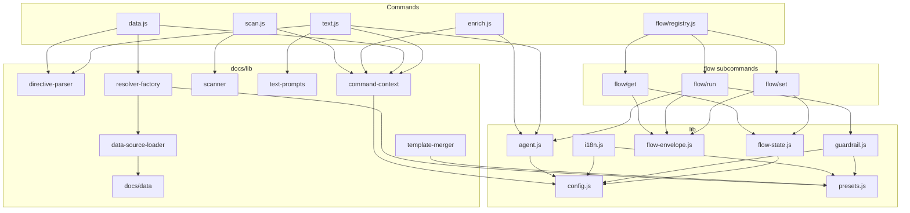

<!-- {{data("base.docs.langSwitcher", {labels: "relative"})}} -->
**English** | [日本語](ja/internal_design.md)
<!-- {{/data}} -->

# Internal Design

## Description

<!-- {{text({prompt: "Write a 1-2 sentence overview of this chapter. Include the project structure, module dependency direction, and key processing flows."})}} -->

sdd-forge's source is organized into three layers under `src/`: CLI entry points in `docs/commands/` and `flow/`, a documentation processing library in `docs/lib/`, and cross-cutting core infrastructure in `lib/`. Dependencies flow strictly downward — commands consume library utilities, library utilities consume core infrastructure, and all AI agent invocations are centralized through `lib/agent.js` — with persistent SDD flow state managed exclusively through `lib/flow-state.js`.
<!-- {{/text}} -->

## Content

### Project Structure

<!-- {{text({prompt: "Describe the project's directory structure as a tree-format code block. Include role comments for key directories and files. Generate from the actual source code structure.", mode: "deep"})}} -->

```
src/
├── sdd-forge.js                  # Top-level CLI dispatcher (entry point)
├── docs/
│   ├── commands/                 # Documentation pipeline CLI entry points
│   │   ├── scan.js               # Scans source files → analysis.json
│   │   ├── enrich.js             # AI batch annotation of analysis entries
│   │   ├── data.js               # Resolves {{data}} directives in chapter files
│   │   └── text.js               # Fills {{text}} directives via AI agent
│   ├── data/                     # DataSource model classes (one per data domain)
│   │   ├── agents.js             # Agent config and SDD template metadata
│   │   ├── docs.js               # Chapter list, navigation, language switcher
│   │   ├── lang.js               # Language link generation
│   │   └── project.js            # package.json name, version, and scripts
│   └── lib/                      # Shared docs processing utilities
│       ├── directive-parser.js   # Parses {{data}}, {{text}},  directives
│       ├── resolver-factory.js   # Assembles DataSource resolver from preset chain
│       ├── scanner.js            # File traversal, glob matching, hash computation
│       ├── template-merger.js    # Preset-chain template resolution with block inheritance
│       ├── text-prompts.js       # AI prompt builders for the text command
│       ├── command-context.js    # Shared command context resolution
│       ├── data-source-loader.js # Dynamic DataSource module discovery
│       ├── data-source.js        # DataSource base class
│       ├── concurrency.js        # Bounded async concurrency pool
│       └── lang/                 # Language-specific parsers
│           ├── js.js             # JS/TS: parse, minify, extractEssential
│           ├── php.js            # PHP: parse, minify, extractEssential
│           ├── py.js             # Python: minify, extractEssential
│           └── yaml.js           # YAML: minify
├── flow/
│   ├── registry.js               # FLOW_COMMANDS dispatch table with lifecycle hooks
│   ├── get/                      # Read-only flow state queries
│   │   ├── check.js              # Prerequisite and worktree state checks
│   │   ├── context.js            # Analysis entry search (ngram / AI / keyword)
│   │   ├── guardrail.js          # Guardrail article retrieval by phase
│   │   ├── qa-count.js           # QA question counter read
│   │   └── resolve-context.js    # Full flow context for skill scripts
│   ├── run/                      # Executable flow step implementations
│   │   ├── prepare-spec.js       # Flow initialization; branch and spec creation
│   │   ├── gate.js               # Spec quality gate with guardrail compliance
│   │   ├── review.js             # AI code review delegation
│   │   └── retro.js              # Post-implementation retrospective
│   └── set/                      # Flow state mutation commands
│       ├── step.js               # Update step status
│       ├── req.js                # Update requirement status
│       ├── metric.js             # Increment phase counters
│       ├── note.js               # Append timestamped note
│       ├── redo.js               # Record redo log entry
│       ├── request.js            # Persist feature request text
│       └── summary.js            # Parse and store requirements array
└── lib/                          # Cross-cutting core infrastructure
    ├── agent.js                  # Claude CLI invocation (sync/async, stdin fallback, retry)
    ├── flow-state.js             # flow.json CRUD; active-flow and worktree tracking
    ├── flow-envelope.js          # Structured JSON output (ok / fail / warn)
    ├── guardrail.js              # Guardrail article loading, parsing, phase filtering
    ├── i18n.js                   # Multi-tier locale loading with namespace key resolution
    ├── config.js                 # Config loading and .sdd-forge/ path helpers
    ├── presets.js                # Preset chain resolution and directory lookup
    ├── git-state.js              # Git worktree status, branch, ahead count helpers
    ├── skills.js                 # Skill file deployment to .agents/ and .claude/
    ├── progress.js               # ANSI progress bar and prefixed logger
    └── process.js                # Thin spawnSync wrapper
```
<!-- {{/text}} -->

### Module Composition

<!-- {{text({prompt: "List the major modules in table format. Include module name, file path, and responsibility. Extract from import/require relationships and exports in each file.", mode: "deep"})}} -->

| Module | Path | Responsibility |
|--------|------|----------------|
| scan | `src/docs/commands/scan.js` | Traverses source files using preset DataSources, computes MD5 hashes, and writes structured `analysis.json` with stable entry IDs |
| enrich | `src/docs/commands/enrich.js` | Splits analysis entries into token-limited batches and calls the AI agent to annotate each with `summary`, `detail`, `chapter`, `role`, and `keywords` |
| data | `src/docs/commands/data.js` | Iterates chapter Markdown files, resolves `{{data}}` directives by invoking DataSource methods, and writes updated files back to disk |
| text | `src/docs/commands/text.js` | Parses `{{text}}` directives, builds batch AI prompts from enriched analysis context, calls the agent, and splices generated text into chapter files |
| directive-parser | `src/docs/lib/directive-parser.js` | Parses `{{data(...)}}`, `{{text(...)}}`, and `` directives from Markdown; resolves data directive content in-place via a caller-supplied resolver function |
| resolver-factory | `src/docs/lib/resolver-factory.js` | Instantiates the DataSource chain for a given preset type and returns a `resolve(preset, source, method, analysis, labels)` interface |
| scanner | `src/docs/lib/scanner.js` | Collects files by glob pattern, computes hashes, dispatches to language handlers, and exports glob-to-regex conversion used by analysis filtering |
| template-merger | `src/docs/lib/template-merger.js` | Resolves per-chapter templates across the preset inheritance chain using `` merging, additive mode, and language fallback |
| text-prompts | `src/docs/lib/text-prompts.js` | Builds system prompts, per-directive prompts, and batch JSON prompts; reads enriched analysis entries filtered by chapter name |
| DataSource (base) | `src/docs/lib/data-source.js` | Base class for all DataSources; provides `toMarkdownTable()`, `desc()`, and `mergeDesc()` override helpers |
| flow/registry | `src/flow/registry.js` | Defines `FLOW_COMMANDS` dispatch table mapping subcommand paths to dynamically imported execute modules with `pre`/`post` lifecycle hooks |
| agent | `src/lib/agent.js` | Wraps Claude CLI invocation synchronously and asynchronously; selects stdin delivery over CLI args when prompt size exceeds `ARGV_SIZE_THRESHOLD`; supports configurable retry |
| flow-state | `src/lib/flow-state.js` | Reads and writes `specs/<id>/flow.json`; provides `mutateFlowState` for atomic changes; tracks concurrent flows via `.active-flow`; resolves worktree paths |
| flow-envelope | `src/lib/flow-envelope.js` | Provides `ok()`, `fail()`, and `warn()` constructors and `output()` which serializes envelopes as pretty-printed JSON and sets `process.exitCode` |
| guardrail | `src/lib/guardrail.js` | Loads and parses guardrail articles from preset template chains and project overrides; filters by phase and file scope; supports lint pattern matching |
<!-- {{/text}} -->

### Module Dependencies

<!-- {{text({prompt: "Generate a mermaid graph showing inter-module dependencies. Analyze import/require statements in the source code and show the layer structure and dependency direction. Output only the mermaid code block.", mode: "deep"})}} -->


<!-- {{/text}} -->

### Key Processing Flows

<!-- {{text({prompt: "Describe the inter-module data and control flow when running a representative command in numbered steps. Include the flow from entry point to final output.", mode: "deep"})}} -->

The following describes the end-to-end flow for `sdd-forge text`, the command that fills `{{text}}` directives in documentation chapter files.

1. `sdd-forge text` invokes `main()` in `src/docs/commands/text.js`.
2. `resolveCommandContext()` (`command-context.js`) reads `.sdd-forge/config.json`, calls `resolveAgent()` (`agent.js`) to assemble the Claude CLI invocation config, and determines `docsDir`, preset `type`, and output language.
3. `loadFullAnalysis()` reads `analysis.json` from `.sdd-forge/output/`; if `sdd-forge enrich` has been run, entries carry `summary`, `detail`, `chapter`, `role`, and `keywords` fields.
4. `getChapterFiles()` returns the ordered list of Markdown chapter files from `docs/`, using the preset chapter order resolved via `template-merger.js`.
5. For each chapter file, `parseDirectives()` (`directive-parser.js`) scans lines for `{{text(...)}}` open tags and their matching `{{/text}}` close tags, building directive objects with `prompt`, `params`, line range, and assigned `id`.
6. `getEnrichedContext()` (`text-prompts.js`) filters `analysis.json` entries whose `chapter` field matches the current file's base name and assembles them as structured AI context; in `deep` mode it also reads the raw source files through `minify()`.
7. `buildBatchPrompt()` combines the stripped chapter template (existing generated content removed by `stripFillContent()`) with all directive metadata into a single JSON-keyed prompt.
8. `callAgentAsync()` (`agent.js`) compares total prompt size against `ARGV_SIZE_THRESHOLD`; if exceeded, the prompt is delivered via stdin rather than CLI args to avoid OS ARG_MAX limits.
9. The Claude subprocess writes its response to stdout; `parseBatchJsonResponse()` uses `repairJson()` (`json-parse.js`) to recover from minor JSON formatting irregularities.
10. `applyBatchJsonToFile()` iterates directives in reverse line order and splices each generated text block between its `{{text}}` open and `{{/text}}` close markers.
11. A shrinkage validation check compares original and new line counts; if the result is below 50% of the original length, the file is left unchanged and an error is logged.
12. The validated result is written back to the chapter Markdown file on disk.
<!-- {{/text}} -->

### Extension Points

<!-- {{text({prompt: "Describe the locations that need changes and extension patterns when adding new commands or features. Derive from plugin points and dispatch registration patterns in the source code.", mode: "deep"})}} -->

**Adding a new `{{data}}` DataSource method**
Create or extend a class under `src/docs/data/` (for built-in sources) or a preset's `data/` subdirectory (for preset-specific sources). The class must extend `DataSource` from `docs/lib/data-source.js` and implement `init(ctx)` to receive root, type, and override helpers. Each public method is callable as `preset.source.method` in `{{data}}` directives. `data-source-loader.js` discovers and instantiates classes automatically at runtime; `resolver-factory.js` assembles the full chain per preset type using `resolveMultiChains()`.

**Adding a new preset**
Create a directory under `src/presets/<name>/` containing `preset.json` with `parent`, `scan`, and `chapters` fields. Optionally add `data/` for DataSources, `templates/<lang>/` for Markdown chapter templates, `locale/<lang>/` for i18n overrides, and `templates/<lang>/guardrail.md` for phase-scoped guardrail articles. The chain is resolved through the `parent` field by `presets.js` and consumed throughout the library via `resolveChainSafe()` and `resolveMultiChains()`.

**Adding a new flow subcommand**
Create a module under `src/flow/get/`, `src/flow/run/`, or `src/flow/set/` exporting `async execute(ctx)`. Register it in `FLOW_COMMANDS` in `src/flow/registry.js` under the appropriate group, pointing `execute` to a dynamic `import()` of the new module. Add `pre` and `post` hook functions using `updateStepStatus` or `incrementMetric` if step-status or metric tracking is required.

**Adding a new top-level doc pipeline command**
Implement a `main(ctx)` function in `src/docs/commands/<name>.js`, guard top-level execution with `runIfDirect()` from `lib/entrypoint.js`, and register the subcommand in the CLI dispatcher `src/sdd-forge.js`. Follow the `resolveCommandContext()` pattern to receive a consistent context object including root, config, agent, type, and translation function.
<!-- {{/text}} -->

---

<!-- {{data("base.docs.nav")}} -->
[← Configuration and Customization](configuration.md)
<!-- {{/data}} -->
