# 04. Internal Design

## Description

<!-- {{text: Write a 1-2 sentence overview of this chapter. Include the project structure, module dependency direction, and key processing flows.}} -->

This chapter describes the internal architecture of sdd-forge, covering its three-layer dispatch structure (`sdd-forge.js` → dispatchers → command implementations), the directive-based template engine that resolves `{{data}}` and `{{text}}` placeholders, and the preset inheritance system that enables framework-specific analysis through parent-chain composition. Dependencies flow inward from CLI entry points and command implementations toward shared libraries (`src/lib/`) and the documentation engine (`src/docs/lib/`), with DataSource classes bridging the scan and resolve layers through a mixin-based class hierarchy.

<!-- {{/text}} -->

## Content

### Project Structure

<!-- {{text[mode=deep]: Describe the project's directory structure as a tree-format code block. Include role comments for key directories and files. Generate from the actual source code structure.}} -->

```
src/
├── sdd-forge.js              # CLI entry point & top-level router
├── docs.js                    # docs subcommand dispatcher
├── spec.js                    # spec subcommand dispatcher
├── flow.js                    # flow subcommand dispatcher
├── setup.js                   # Interactive project setup
├── upgrade.js                 # Config migration utility
├── presets-cmd.js             # Preset listing command
├── help.js                    # Help text output
│
├── docs/
│   ├── commands/              # docs subcommand implementations
│   │   ├── scan.js            #   Source code scanning → analysis.json
│   │   ├── enrich.js          #   AI-powered enrichment of analysis entries
│   │   ├── init.js            #   Template initialization from presets
│   │   ├── data.js            #   {{data}} directive resolution
│   │   ├── text.js            #   {{text}} directive resolution via LLM
│   │   ├── readme.js          #   README.md generation
│   │   ├── forge.js           #   Full iterative doc generation pipeline
│   │   ├── review.js          #   Generated docs quality review
│   │   ├── changelog.js       #   Changelog generation
│   │   ├── agents.js          #   AGENTS.md generation
│   │   └── translate.js       #   Multi-language translation
│   ├── data/                  # Common DataSource implementations
│   │   ├── agents.js          #   AGENTS.md SDD/PROJECT sections
│   │   ├── docs.js            #   Chapter listing & language switcher
│   │   ├── lang.js            #   Language navigation links
│   │   └── project.js         #   package.json metadata
│   └── lib/                   # Documentation engine core
│       ├── scanner.js         #   File discovery & language-specific parsers
│       ├── directive-parser.js#   {{data}}/{{text}} directive extraction
│       ├── template-merger.js #   Block inheritance & template resolution
│       ├── data-source.js     #   DataSource base class
│       ├── data-source-loader.js # Dynamic DataSource class loader
│       ├── scan-source.js     #   ScanSource base & Scannable mixin
│       ├── resolver-factory.js#   Resolver creation with preset chain
│       ├── command-context.js #   Shared CLI context resolution
│       ├── concurrency.js     #   Parallel execution queue
│       ├── forge-prompts.js   #   Forge command prompt construction
│       ├── text-prompts.js    #   Text directive prompt construction
│       ├── review-parser.js   #   Review output parsing
│       ├── php-array-parser.js#   CakePHP array syntax parser
│       └── test-env-detection.js # Test environment detection
│
├── flow/
│   └── commands/              # SDD workflow commands
│       ├── start.js           #   Flow initialization
│       ├── status.js          #   Flow status display
│       ├── review.js          #   Implementation review
│       ├── merge.js           #   Branch merge & cleanup
│       ├── resume.js          #   Context-compacted flow resume
│       └── cleanup.js         #   Worktree & branch cleanup
│
├── spec/
│   └── commands/              # Spec management commands
│       ├── init.js            #   Spec scaffold creation
│       ├── gate.js            #   Spec quality gate check
│       └── guardrail.js       #   Implementation guardrail validation
│
├── lib/                       # Cross-layer shared utilities
│   ├── agent.js               #   AI agent invocation (sync & async)
│   ├── cli.js                 #   repoRoot, sourceRoot, parseArgs, PKG_DIR
│   ├── config.js              #   .sdd-forge/config.json loader
│   ├── presets.js             #   Preset discovery & parent-chain resolution
│   ├── flow-state.js          #   .sdd-forge/flow.json persistence
│   ├── i18n.js                #   3-layer i18n with domain namespaces
│   ├── types.js               #   Type alias resolution & config validation
│   ├── entrypoint.js          #   ES Modules direct-run detection
│   ├── agents-md.js           #   AGENTS.md SDD template loader
│   ├── process.js             #   spawnSync wrapper
│   └── progress.js            #   Progress bar & logging
│
├── presets/                   # Framework-specific preset packages
│   ├── base/                  #   Universal base (inherited by all)
│   ├── cli/                   #   CLI application preset
│   ├── node-cli/              #   Node.js CLI (extends cli)
│   ├── node/                  #   Node.js language layer
│   ├── php/                   #   PHP language layer
│   ├── webapp/                #   Web application base
│   ├── cakephp2/              #   CakePHP 2.x (extends webapp)
│   ├── laravel/               #   Laravel (extends webapp)
│   ├── symfony/               #   Symfony (extends webapp)
│   ├── library/               #   Library preset
│   └── lib/                   #   Shared library preset
│
├── locale/                    # i18n message files
│   ├── en/                    #   English (ui.json, messages.json, prompts.json)
│   └── ja/                    #   Japanese
│
└── templates/                 # Scaffolding templates
    ├── config.example.json
    ├── review-checklist.md
    └── skills/                #   Claude Code skill definitions
```

<!-- {{/text}} -->

### Module Composition

<!-- {{text[mode=deep]: List the major modules in table format. Include module name, file path, and responsibility. Extract from import/require relationships and exports in each file.}} -->

| Module | Path | Responsibility |
| --- | --- | --- |
| CLI Router | `src/sdd-forge.js` | Top-level argument parsing and dispatch to `docs.js`, `spec.js`, `flow.js`, or standalone commands |
| Docs Dispatcher | `src/docs.js` | Routes `docs <cmd>` to the corresponding command in `src/docs/commands/` |
| Directive Parser | `src/docs/lib/directive-parser.js` | Extracts `{{data}}` and `{{text}}` directives from templates; handles inline/block variants and `@block`/`@extends` inheritance syntax |
| Template Merger | `src/docs/lib/template-merger.js` | Resolves template files bottom-up through preset layers; merges `@block` overrides and handles cross-language fallback with translation |
| Resolver Factory | `src/docs/lib/resolver-factory.js` | Builds a resolver by loading DataSource classes along the preset parent chain; provides the `resolve(source, method, analysis, labels)` interface |
| DataSource Base | `src/docs/lib/data-source.js` | Abstract base for all `{{data}}` resolvers; provides `toMarkdownTable()`, `mergeDesc()`, and `desc()` utilities |
| Scannable Mixin | `src/docs/lib/scan-source.js` | Adds `match(file)` and `scan(files)` capabilities to any DataSource via mixin composition |
| DataSource Loader | `src/docs/lib/data-source-loader.js` | Dynamically imports and instantiates DataSource classes from a directory with optional filtering |
| Scanner | `src/docs/lib/scanner.js` | File discovery (`findFiles`, `collectFiles`), language-specific parsing (`parsePHPFile`, `parseJSFile`), and glob-to-regex conversion |
| Command Context | `src/docs/lib/command-context.js` | Resolves shared parameters (root, config, type, agent, i18n) into a unified `CommandContext` object for all docs commands |
| Text Prompts | `src/docs/lib/text-prompts.js` | Builds system and user prompts for `{{text}}` directive processing; collects enriched analysis context per chapter |
| Forge Prompts | `src/docs/lib/forge-prompts.js` | Builds system and file-level prompts for the `forge` command; converts analysis summaries to human-readable text |
| Concurrency | `src/docs/lib/concurrency.js` | `mapWithConcurrency()` — bounded-parallel execution queue with error isolation and input-order results |
| Agent | `src/lib/agent.js` | Synchronous (`callAgent`) and asynchronous (`callAgentAsync`) AI agent invocation; handles prompt-size overflow via stdin fallback and per-command agent resolution |
| Presets | `src/lib/presets.js` | Discovers presets from `src/presets/*/preset.json`; resolves parent chains, lang layers, type aliases, and chapter ordering |
| Config | `src/lib/config.js` | Loads and validates `.sdd-forge/config.json`; provides path helpers (`sddDir`, `sddOutputDir`, `sddDataDir`) |
| Types | `src/lib/types.js` | JSDoc type definitions, `validateConfig()` for config schema enforcement, and `resolveType()` for type alias mapping |
| i18n | `src/lib/i18n.js` | Three-layer internationalization: default locale → preset locale → project locale, with domain-namespaced keys (`ui:`, `messages:`, `prompts:`) |
| Flow State | `src/lib/flow-state.js` | Persists SDD workflow state to `.sdd-forge/flow.json`; tracks 17 steps across plan/impl/merge phases with requirements |
| Progress | `src/lib/progress.js` | TTY-aware progress bar with pinned header, weighted step tracking, and spinner animation; provides `createLogger()` for scoped logging |
| Entrypoint | `src/lib/entrypoint.js` | `isDirectRun()` for ES Modules direct-execution detection; `runIfDirect()` for safe main() invocation with error handling |
| PHP Array Parser | `src/docs/lib/php-array-parser.js` | CakePHP 2.x-specific utilities: bracket-balanced array body extraction, `camelToSnake`, and CakePHP-convention `pluralize` |

<!-- {{/text}} -->

### Module Dependencies

```mermaid
graph TD
    subgraph "CLI Entry Layer"
        CLI["sdd-forge.js"]
        DOCS_D["docs.js"]
        SPEC_D["spec.js"]
        FLOW_D["flow.js"]
        SETUP["setup.js"]
    end

    subgraph "docs/commands"
        SCAN["scan.js"]
        ENRICH["enrich.js"]
        INIT["init.js"]
        DATA["data.js"]
        TEXT["text.js"]
        README["readme.js"]
        FORGE["forge.js"]
        REVIEW_CMD["review.js"]
        AGENTS_CMD["agents.js"]
        TRANSLATE["translate.js"]
    end

    subgraph "docs/lib — Template Engine"
        DP["directive-parser.js"]
        TM["template-merger.js"]
        RF["resolver-factory.js"]
        DS["data-source.js"]
        DSL["data-source-loader.js"]
        SS["scan-source.js"]
        SC["scanner.js"]
        CC["command-context.js"]
        TP["text-prompts.js"]
        FP["forge-prompts.js"]
        RP["review-parser.js"]
        CONC["concurrency.js"]
    end

    subgraph "docs/data — Common DataSources"
        DS_AGENTS["agents.js"]
        DS_DOCS["docs.js"]
        DS_LANG["lang.js"]
        DS_PROJECT["project.js"]
    end

    subgraph "lib — Shared Utilities"
        AGENT["agent.js"]
        CLIU["cli.js"]
        CONFIG["config.js"]
        PRESETS["presets.js"]
        FLOW_STATE["flow-state.js"]
        I18N["i18n.js"]
        TYPES["types.js"]
        ENTRY["entrypoint.js"]
        PROGRESS["progress.js"]
    end

    subgraph "presets — Framework DataSources"
        BASE_PKG["base/data/package.js"]
        WEBAPP_CTRL["webapp/data/controllers.js"]
        WEBAPP_SHELL["webapp/data/shells.js"]
        WEBAPP_TBL["webapp/data/tables.js"]
        WEBAPP_DS["webapp/data/webapp-data-source.js"]
        CAKE["cakephp2/data/*"]
        LARAVEL["laravel/data/*"]
        SYMFONY["symfony/data/*"]
        CLI_MOD["cli/data/modules.js"]
    end

    CLI --> DOCS_D & SPEC_D & FLOW_D & SETUP
    DOCS_D --> SCAN & ENRICH & INIT & DATA & TEXT & README & FORGE & REVIEW_CMD & AGENTS_CMD & TRANSLATE

    DATA --> DP & RF & CC
    TEXT --> DP & TP & CONC & AGENT
    INIT --> TM & CC
    FORGE --> DATA & TEXT & REVIEW_CMD & FP & CONC
    SCAN --> SC & DSL & CC
    README --> DP & CC

    RF --> DSL & PRESETS
    DSL --> DS
    TM --> DP & PRESETS
    CC --> CLIU & CONFIG & TYPES & I18N & AGENT

    DS_AGENTS & DS_DOCS & DS_LANG & DS_PROJECT --> DS
    WEBAPP_DS --> DS & SS
    WEBAPP_CTRL & WEBAPP_SHELL & WEBAPP_TBL --> WEBAPP_DS
    CAKE & LARAVEL & SYMFONY --> WEBAPP_CTRL & WEBAPP_TBL
    CLI_MOD --> DS & SS & SC
    BASE_PKG --> DS & SS

    AGENT --> CLIU
    I18N --> CONFIG & PRESETS
    TYPES --> PRESETS
    FLOW_STATE --> CONFIG
```

<!-- {{text[mode=deep]: Generate a mermaid graph showing inter-module dependencies. Analyze import/require statements in the source code and show the layer structure and dependency direction. Output only the mermaid code block.}} -->



<!-- {{/text}} -->

### Key Processing Flows

<!-- {{text[mode=deep]: Describe the inter-module data and control flow when running a representative command in numbered steps. Include the flow from entry point to final output.}} -->

The `sdd-forge docs build` pipeline executes the following sequence of commands in order: `scan → enrich → init → data → text → readme → agents → [translate]`. Below is the data flow for the core `scan → data → text` path:

**1. Scan Phase (`scan.js`)**

1. `sdd-forge.js` receives `docs build` and dispatches to `docs.js`, which orchestrates the pipeline.
2. `scan.js` calls `resolveCommandContext()` to obtain root, config, and type.
3. `collectFiles()` in `scanner.js` walks the source tree using include/exclude glob patterns from `preset.json` and `config.json`.
4. `loadDataSources()` dynamically imports all DataSource classes along the preset parent chain (e.g., `base → webapp → cakephp2`).
5. Each file is tested against every DataSource's `match()` method to assign it to a category.
6. Each DataSource's `scan()` method receives its matched files and returns structured analysis data.
7. All results are merged into a single `analysis.json` written to `.sdd-forge/output/`.

**2. Init Phase (`init.js`)**

8. `resolveTemplates()` in `template-merger.js` builds layers from project-local → leaf → arch → base directories for the target language.
9. For each template file, `resolveOneFile()` walks layers top-down; files with `@extends` trigger parent lookup and `mergeTexts()` applies block-level overrides.
10. Resolved templates are written to the `docs/` directory, producing chapter files with `{{data}}` and `{{text}}` directive placeholders.

**3. Data Phase (`data.js`)**

11. `createResolver()` in `resolver-factory.js` loads DataSource instances along the full preset chain, including common sources (`project`, `docs`, `lang`), lang-layer sources, and project-local sources from `.sdd-forge/data/`.
12. Each DataSource is initialized with `init(ctx)` receiving `desc()` and `loadOverrides()` helpers.
13. For each chapter file, `resolveDataDirectives()` in `directive-parser.js` parses all `{{data}}` directives, calls the resolver's `resolve(source, method, analysis, labels)`, and splices the rendered Markdown into the template.
14. `{{text}}` directives are skipped and logged for the next phase.

**4. Text Phase (`text.js`)**

15. `parseDirectives()` identifies all `{{text}}` directives in each chapter file.
16. `getEnrichedContext()` collects enriched analysis entries matching the current chapter name, optionally reading source files (deep mode, up to 8000 chars).
17. In batch mode, `stripFillContent()` clears previous generated content, `buildBatchPrompt()` constructs a single prompt containing the full file and all directives, and `callAgentAsync()` sends it to the configured AI agent.
18. `validateBatchResult()` checks for content shrinkage and fill rate before writing the result back to the chapter file.

<!-- {{/text}} -->

### Extension Points

<!-- {{text[mode=deep]: Describe the locations that need changes and extension patterns when adding new commands or features. Derive from plugin points and dispatch registration patterns in the source code.}} -->

**Adding a New Framework Preset**

Create a new directory under `src/presets/<name>/` with a `preset.json` declaring `parent` (e.g., `"webapp"`) and optional `lang`, `chapters`, `scan`, and `aliases` fields. Place framework-specific DataSource classes in `<name>/data/` — they are auto-discovered by `data-source-loader.js` and override parent DataSources with the same filename. Scanner modules go in `<name>/scan/` and are called from the DataSource's `scan()` method. Templates in `<name>/templates/{lang}/` use `@extends`/`@block` directives to selectively override parent template sections.

**Adding a New DataSource Category**

Create a class extending `Scannable(DataSource)` (or `WebappDataSource` for webapp presets) in the appropriate `data/` directory. Implement `match(file)` to filter target files and `scan(files)` to produce structured analysis data. Add resolve methods (e.g., `list(analysis, labels)`) that return Markdown strings — these become callable via `{{data: <source>.<method>("Header1|Header2")}}` directives in templates. The `resolver-factory.js` automatically picks up new DataSources through `loadDataSources()`.

**Adding a New docs Subcommand**

Create a new file in `src/docs/commands/<cmd>.js` exporting a `main(ctx)` function. Register the command name in `src/docs.js` dispatcher's command routing table. Use `resolveCommandContext()` to obtain the standard `CommandContext` with root, config, type, agent, and i18n. Use `runIfDirect(import.meta.url, main)` at the bottom to support both dispatched and standalone execution.

**Adding a New Top-Level Command**

For commands outside the docs/spec/flow hierarchy, create a standalone file (e.g., `src/<cmd>.js`) and add a routing case in `sdd-forge.js`. Standalone commands do not use a dispatcher and handle their own argument parsing via `parseArgs()`.

**Extending the i18n System**

Add message keys to the appropriate domain file (`ui.json`, `messages.json`, or `prompts.json`) under `src/locale/{lang}/`. Preset-specific overrides go in `src/presets/<name>/locale/{lang}/`. Project-specific overrides go in `.sdd-forge/locale/{lang}/`. The three-layer merge in `i18n.js` ensures later layers take precedence.

**Adding Project-Specific DataSources**

Place custom DataSource files in the project's `.sdd-forge/data/` directory. These are loaded with highest priority by `resolver-factory.js` and can override any preset DataSource. This mechanism allows per-project extensions without modifying the sdd-forge package.

<!-- {{/text}} -->
